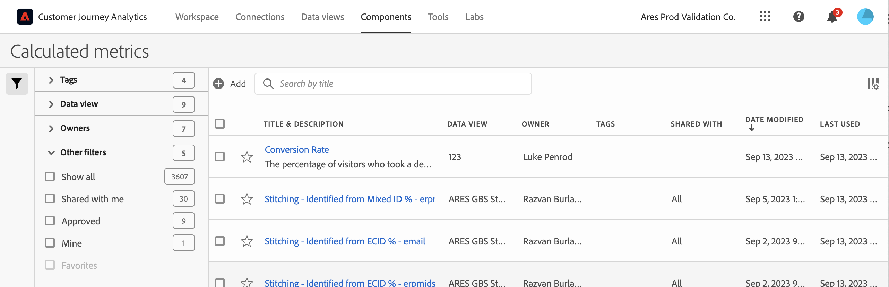

# 계산된 지표 관리자

계산된 지표 페이지는 공유, 필터링, 태깅, 승인, 복사, 삭제 및 즐겨찾기로 표시 등 다양한 지표 처리 방법을 제공합니다.

계산된 지표 관리자는 사용자가 소유하고 있고 사용자와 공유된 모든 필터를 표시합니다. 관리자 수준의 사용자는 조직의 모든 사용자 정의 지표를 볼 수 있습니다. 이 개요에서는 계산된 지표 관리자의 사용자 인터페이스와 기능을 설명합니다.

## 계산된 지표 관리자에 액세스

1. Customer Journey Analytics에서 [!UICONTROL **구성 요소**] > [!UICONTROL **계산된 지표**].

## 계산된 지표 관리자에서 사용 가능한 작업

계산된 지표 관리자에서 다음 작업을 수행할 수 있습니다.

* [계산된 지표 필터링](/help/components/calc-metrics/cm-workflow/cm-filter.md)

* [계산된 지표를 즐겨찾기로 표시](/help/components/calc-metrics/cm-workflow/cm-favorite.md)

* [계산된 지표 승인](/help/components/calc-metrics/cm-workflow/cm-approving.md)

* [계산된 지표 태그 지정](/help/components/calc-metrics/cm-workflow/cm-tagging.md)

* [계산된 지표 공유](/help/components/calc-metrics/cm-workflow/cm-sharing.md)

* 계산된 지표를 CSV 파일로 내보냅니다.

* [계산된 지표 복사](/help/components/calc-metrics/cm-workflow/cm-copy.md)

* 계산된 지표 삭제

## 열 구성

표시되는 열을 구성하여 계산된 지표 관리자에서 각 계산된 지표에 대해 표시되는 정보를 구성할 수 있습니다.

계산된 지표 관리자에서 표시되는 열을 구성하려면 다음을 수행합니다.

1. Customer Journey Analytics에서 **[!UICONTROL 구성 요소]** 탭을 선택한 다음 를 선택합니다 **[!UICONTROL 계산된 지표]**.

1. 계산된 지표 관리자에서 **열 사용자 지정** 아이콘 를 클릭한 다음 계산된 지표 관리자에 표시할 열을 선택합니다.

   다음 열을 사용할 수 있습니다.

   | 열 제목 | 설명 |
   |---|---|
   | 즐겨찾기 | 계산된 각 지표 옆에 별 아이콘을 표시하여 계산된 지표를 즐겨찾기로 표시할 수 있습니다. 자세한 내용은 [계산된 지표를 즐겨찾기로 표시](/help/components/calc-metrics/cm-workflow/cm-favorite.md). |
   | 제목 및 설명 | 이러한 값은 계산된 지표 빌더에 제공됩니다. 제목과 설명을 편집하려면 제목 링크를 선택하여 계산된 지표 빌더를 엽니다. |
   | 보고서 세트 | 지표를 마지막으로 저장한 보고서 세트를 나타냅니다. |
   | 소유자 | 사용자 정의 지표를 소유하는 사람을 나타냅니다. 관리자가 아닌 경우 사용자가 소유하거나 사용자와 공유된 지표만 볼 수 있습니다. |
   | 태그 | 사용자 또는 사용자와 계산된 지표를 공유한 사람이 지표에 적용한 태그를 표시합니다. |
   | 다음 사용자와 공유 | 계산된 지표를 공유한 개인 또는 그룹 (관리자만) 또는 모두 (관리자만)를 표시합니다. 
계산된 지표가 공유되면 계산된 지표 이름 옆에 공유 아이콘이 표시됩니다.
 |
   | 수정한 날짜 | 사용자 지정 지표를 마지막으로 수정한 날짜를 나타냅니다. |
   | 다음에서 사용 | 계산된 지표가에서 현재 사용 중인 구성 요소의 수를 표시합니다. 
예를 들어 계산된 지표가 40개의 프로젝트 및 2개의 경고에서 사용 중인 경우 이 열의 값은 로 표시됩니다. [!UICONTROL **42개 구성 요소**].
 
이 열의 값을 선택하여 계산된 지표가 사용되는 곳의 분류를 확인합니다(예: [!UICONTROL **프로젝트 (40)**], [!UICONTROL **경고 (2)**]).

계산된 지표는 다음 구성 요소 유형 중 하나에서 사용할 수 있습니다.
 <ul><li>프로젝트</li><li>예약된 프로젝트</li></ul>
이 정보는 구성 요소가 조직의 사용자에게 가치가 있는지, 사용 위치 및 삭제하거나 수정해야 하는지 여부를 확인하는 데 도움이 됩니다.

이 열을 볼 때는 다음 사항을 고려하십시오.
<ul><li>이 정보에는 API, Report Builder 또는 Data Warehouse의 사용이 포함되지 않습니다.</li><li>다음 [!UICONTROL **다음에서 사용됨**] 열은 기본적으로 표시되지 않습니다. [열 구성](#configure-columns) 표시합니다.</li><li>지정된 구성 요소에 대해 이 열에 데이터가 없지만 [!UICONTROL **마지막으로 사용한 날짜**] 날짜: 구성 요소가 저장되지 않고 분석에 사용되었을 수 있습니다.</li><li>이 정보는 시스템 관리자만 사용할 수 있습니다.</li></ul>
다음을 사용할 수 있습니다. [데이터 사전](/help/components/data-dictionary/data-dictionary-overview.md) 이 정보와 함께 구성 요소가 조직에서 어떻게 사용되는지 추적하고 더 잘 이해하는 데 도움이 됩니다.
 |
   | 마지막 사용 | 다음 구성 요소 유형에서 계산된 지표가 마지막으로 사용된 날짜를 표시합니다. <ul><li>계산된 지표</li><li>프로젝트</li><li>예약된 프로젝트</li></ul> 
이 정보는 구성 요소가 조직의 사용자에게 중요한지 또는 삭제해야 하는지 여부를 결정하는 데 도움이 될 수 있습니다.

이 열을 볼 때는 다음 사항을 고려하십시오.
<ul><li>이 정보에는 API, Report Builder 또는 Data Warehouse의 사용이 포함되지 않습니다.</li><li>일부 구성 요소의 경우 구성 요소가 2023년 9월 이전에 마지막으로 사용된 경우 이 열에 데이터가 포함되지 않을 수 있습니다.</li><li>이 정보는 시스템 관리자만 사용할 수 있습니다.</li></ul>
다음을 사용할 수 있습니다. [데이터 사전](/help/components/data-dictionary/data-dictionary-overview.md) 이 정보와 함께 구성 요소가 조직에서 어떻게 사용되는지 추적하고 더 잘 이해하는 데 도움이 됩니다. |

   {style="table-layout:auto"}
