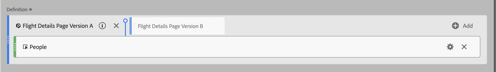
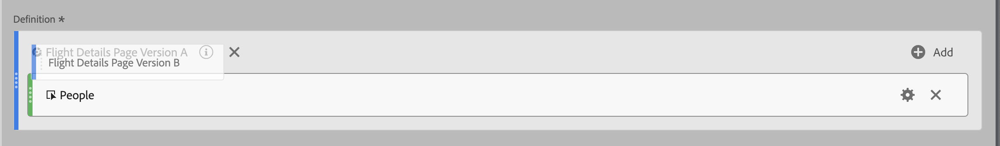

# 세그먼트 스택 및 바꾸기

계산된 지표 빌더 내에서 세그먼트를 스택하고 바꿀 수 있습니다.

## 세그먼트 스택 {#stack-segment}

1. [계산된 지표 작성](/help/components/calc-metrics/cm-workflow/cm-build-metrics.md)에 설명된 대로 지표 작성을 시작합니다.

1. 정의 캔버스에서 기존 세그먼트 옆에 새 세그먼트를 놓습니다.

   

## 한 세그먼트를 다른 세그먼트로 바꾸기 {#replace-segment}

1. [지표 작성](/help/components/calc-metrics/cm-workflow/cm-build-metrics.md)에 설명된 대로 지표 작성을 시작합니다.

1. 정의 캔버스에서 기존 세그먼트 위에 새 세그먼트를 놓습니다.

   
