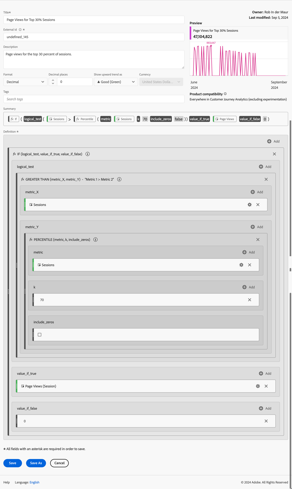

# 계산된 지표 예

이 문서에서는 고급 계산된 지표를 정의하는 방법의 예를 보여줍니다.

## 바운스 비율

바운스 비율을 계산하려는 경우

+++ 세부 사항

바운스의 정의는 다른 논의에 기반하지만, 이 예에서는 세션 시작이 1이고 세션 종료가 1인 바운스 이벤트 세그먼트를 정의합니다. 이 세그먼트를 사용하면 세션 대비 바운스된 세션의 비율을 정의합니다.

### 세그먼트

### 계산된 지표

### 파생 필드

또는 파생 필드를 사용하여 [바운스 비율](/help/data-views/derived-fields/derived-fields.md#bounces)을 정의할 수 있습니다.

파생 필드는 모든 사용자가 바운스 비율 지표의 정의를 재정의하거나 수정할 수 없다는 이점이 있는 데이터 보기의 일부입니다. 이 장점에는 한계점도 있습니다. 데이터 보기에 대한 액세스 권한이 없는 사용자는 파생 필드를 사용할 수 없으며 세그먼트 및 계산된 지표에 의존하여 바운스 비율을 정의해야 합니다.

Customer Journey Analytics에서 바운스 수 및 바운스 비율을 계산하는 방법에 대한 자세한 배경 정보는 이 [블로그 게시물](https://experienceleaguecommunities.adobe.com/t5/adobe-analytics-blogs/calculating-bounces-amp-bounce-rate-in-adobe-customer-journey/ba-p/706446)을 참조하세요.

+++

## 조건부 페이지 보기 수

100개가 넘는 세션에서 방문한 페이지에 대한 페이지 보기 수만 계산하는 계산된 지표를 정의하려고 합니다.

+++ 세부 사항 

+++

## 상위 30% 세션에 대한 페이지 보기 수

상위 30% 세션에 대한 페이지 보기만 계산하는 계산된 지표를 정의하려는 경우

+++ 세부 사항

+++
