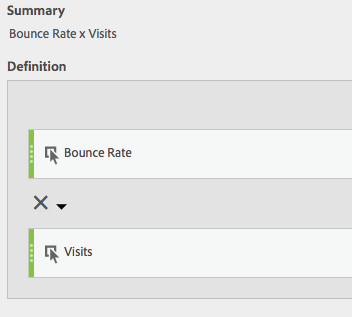

# 필터 및 가중치가 적용된 지표

필터 및 가중치가 적용된 지표의 예를 보여 줍니다.

## 필터링된 바운스 비율 {#section_D42F2452E4464948934063EB6F2DAAB4}

이 간단한 필터링된 지표는 방문이 100개가 넘는 페이지에 대해서만 바운스 비율을 표시합니다.

이 공식은 일관된 시간 범위에 따라 달라진다는 것을 잊지 마십시오. 하루에 대해 보고서를 실행하는 경우 방문이 20개가 넘는 모든 페이지는 확인할 가치가 있습니다. 한 달에 대해 실행하는 경우에는 더 많은 방문을 포함하도록 필터링해야 할 수도 있습니다.

## 백분위수가 있는 필터링된 바운스 비율 {#section_4F3E6D33A1FD438A932FA662B3510552}

이 필터를 사용하면 방문 수로 정렬할 때 상위 30퍼센트의 페이지에 대한 바운스 비율이 표시됩니다.

## 가중 지표 {#section_F2D16B14569948289CF1310F9E6E3FC2}

일반적으로 바운스 비율로 정렬하려 하지만 방문 수가 많은 페이지가 목록의 상단에 있어야 합니다. 다음과 같은 모습의 가중치가 적용된 바운스 비율을 만들 수 있습니다.

