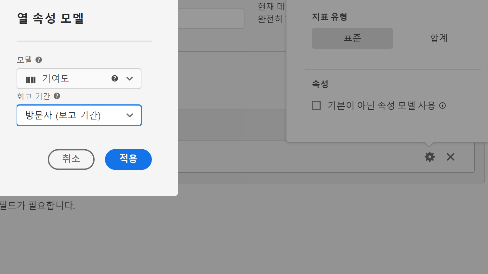

# 지표 유형 및 기여도 분석

지표 옆에 있는 톱니바퀴 아이콘을 선택하여 지표 유형 및 속성 모델을 지정할 수 있습니다.

## 지표 유형

계산된 지표를 작성할 때 지표 유형을 지정하려면 다음을 수행하십시오.

1. 유형을 선택하려는 지표 옆에 있는 톱니바퀴 아이콘을 선택합니다.

   

1. 다음 선택 사항 중 하나를 선택합니다.

   | 지표 유형 | 정의 |
   |---|---|
   | 표준 | 이 지표들은 표준 [!DNL Analytics] 보고에서 사용된 것과 동일한 지표입니다. 공식이 하나의 표준 지표로 구성된 경우 계산되지 않은 지표에 해당하는 대응값과 동일한 데이터가 표시됩니다. 표준 지표는 각 개별 라인 항목별로 계산된 지표를 만드는 데 유용합니다. 예를 들어 [주문] / [세션]은(는) 특정 라인 항목에 대한 주문 수를 특정 라인 항목에 대한 세션 수로 나눕니다. |
   | 총계 | 모든 라인 항목에서 보고 기간에 대한 총계를 사용합니다. 공식이 단일 총계 지표로 구성된 경우 모든 라인 항목에 동일한 총계 수를 표시합니다. 총계 지표는 총 데이터와 비교하는 계산된 지표를 만드는 데 유용합니다. 예를 들어 [주문] / [총 세션]은 특정 라인 항목에 대한 세션뿐만 아니라 채널의 모든 세션에 대한 주문 비율을 표시합니다. |

## 속성

Customer Journey Analytics의 속성에 대한 자세한 내용은 [속성 구성 요소 설정](/help/data-views/component-settings/attribution.md)을 참조하십시오.
