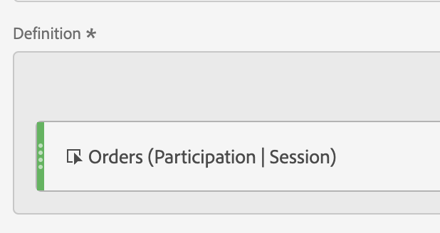

# &quot;기여도&quot; 지표 작성

다음 정보는 주문이 포함된 세션에 기여한(또는 참여한) 페이지를 표시하는 지표를 만드는 방법을 설명합니다.

이 유형의 정보는 모든 콘텐츠 소유자에게 유용할 수 있습니다.

>[!NOTE]
>
>관리 도구에서 기여도 지표를 활성화할 수 있지만, 사용자 지정 이벤트 1 - 100에 대해서만 가능합니다.

1. 에 설명된 대로 지표 작성을 시작합니다. [지표 작성](/help/components/calc-metrics/cm-workflow/cm-build-metrics.md).
1. 계산된 지표 빌더에서 지표의 이름을 &quot;기여도&quot; 또는 이와 유사하게 지정합니다
1. 성공 이벤트 &quot;주문&quot;을 정의 캔버스로 드래그합니다.
1. 해당 이벤트의 [기여도 분석 모델](/help/components/calc-metrics/cm-workflow/m-metric-type-alloc.md)을 **[!UICONTROL 설정]** 톱니바퀴 아래에 있는 **[!UICONTROL 기여도]**&#x200B;로 변경합니다. 선택 **[!UICONTROL 세션]** 되돌아보기. 정의 모양은 다음과 같아야 합니다.

   

1. 선택 [!UICONTROL **저장**] 지표를 저장합니다.
1. **[!UICONTROL 페이지]** 보고서에서 계산된 지표를 사용합니다.

   

1. (선택 사항) 의 설명에 따라 조직의 다른 사용자와 지표를 공유합니다 [계산된 지표 공유](/help/components/calc-metrics/cm-workflow/cm-sharing.md).
