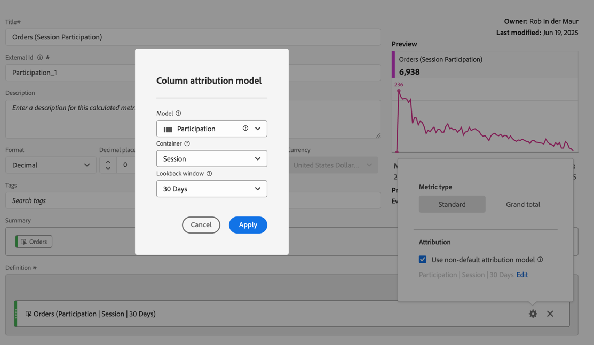

# 기여도 지표

기여도 지표는 차원(예: 페이지 보기 수)에 대한 개별 값이 기여하는 정도를 수량화하거나 특정 지표(예: 주문)가 포함된 세션에 참여하는 데 사용됩니다.

>[!NOTE]
>
>관리자는 [데이터 보기](https://experienceleague.adobe.com/ko/docs/analytics-platform/using/cja-dataviews/data-views)의 일부로 기여도와 같이 기본값이 아닌 속성 모델을 사용하여 지표를 만들 수 있습니다. 자세한 내용은 [속성 구성 요소 설정](../../../data-views/component-settings/attribution.md)을 참조하십시오.

아래 단계는 [계산된 지표 만들기 권한](/help/technotes//access-control.md#user-level-access)을 가진 모든 사용자가 기여도 지표를 만드는 방법을 보여 줍니다.

1. [계산된 지표를 만듭니다](cm-workflow.md). [계산된 지표 빌더](cm-build-metrics.md)에서 지표 이름을 `Participation` 또는 이와 유사하게 지정합니다.
1. 성공 이벤트(예: [!DNL Orders])가 포함된 지표를 [!UICONTROL **[!UICONTROL 정의]**] 영역으로 끌어서 놓습니다.
1. 지표에 대해 를 선택합니다.
1. 표시되는 팝업에서 **[!UICONTROL 기본값이 아닌 속성 모델 사용]**&#x200B;을 선택하여 해당 이벤트의 [속성 모델](/help/components/calc-metrics/cm-workflow/m-metric-type-alloc.md)을(를) **[!UICONTROL 참여]**&#x200B;에 정의하고 [!UICONTROL 컨테이너]에 대해 **[!UICONTROL 세션]**&#x200B;을(를) 선택합니다. **[!UICONTROL 적용]**&#x200B;을 선택하여 확인하십시오.

   

   **(파티션|세션)**&#x200B;이(가) 지표 구성 요소 이름에 추가되었습니다.

1. 지표를 저장하려면 [!UICONTROL **저장**]&#x200B;을 선택하십시오.
1. 보고서에서 계산된 지표를 사용합니다. 예를 들어 보고서에 계산된 [!DNL Orders (Session Participation)] 지표를 사용하여 주문이 포함된 세션에 기여한(또는 참여한) 고객 계층을 표시합니다.

   
