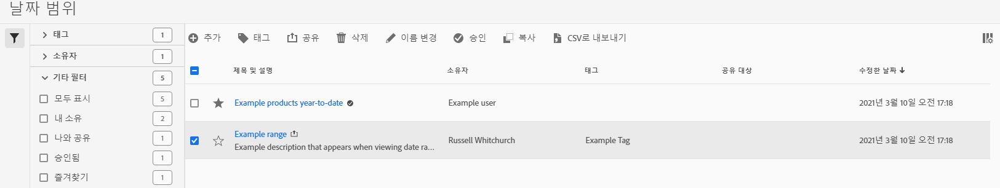

# 날짜 범위 관리

날짜 범위 관리자를 사용하여 날짜 범위를 공유, 이름 변경 또는 삭제합니다. 날짜 관리자에 연결하려면:

1. AdobeID 자격 증명을 사용하여 [analytics.adobe.com](https://analytics.adobe.com)에 로그인합니다.
1. [!UICONTROL 구성 요소] > [!UICONTROL 날짜 범위]로 이동합니다.

## 인터페이스

날짜 범위 관리자에는 다음과 같은 옵션이 포함됩니다.

* **추가**: 새 날짜 범위를 만듭니다. 자세한 내용은 [날짜 범위 만들기](create.md)를 참조하십시오.
* **제목별 검색**: 제목별로 날짜 범위를 검색합니다. 결과는 여기에 입력된 텍스트를 기준으로 필터링됩니다.
* **필터**: 왼쪽 열을 사용하여 날짜 범위를 필터링합니다. 사용자 정의 태그, 소유자, 내가 생성, 즐겨찾기, 승인 또는 공유별로 필터링할 수 있습니다. 원하는 필터를 검색할 수도 있습니다.
* **즐겨찾기**: 날짜 범위 옆에 있는  아이콘을 클릭하여 즐겨찾기에 추가합니다.
* **열 사용자 정의**: 날짜 범위 관리자에서 열을 표시하거나 숨기려면  아이콘을 클릭합니다.

더 많은 옵션을 보려면 하나 이상의 날짜 범위 옆에 있는 확인란을 클릭합니다.

* **태그**: 선택한 모든 날짜 범위에 태그를 적용합니다. 태그를 사용하면 날짜 범위를 구성하고 왼쪽 열을 사용하여 필터링할 수 있습니다.
* **공유**: 다른 Experience Cloud 사용자와 날짜 범위를 공유합니다. 제품 관리자인 경우 전체 조직 또는 그룹과 공유할 수도 있습니다. 조직의 다른 사용자와 공유되는 날짜 범위에는 제목 옆에  아이콘이 있습니다.
* **삭제**: 선택한 날짜 범위를 영구적으로 삭제합니다.
* **이름 바꾸기**: 단일 날짜 범위를 선택한 경우 제목을 변경할 수 있습니다.
* **승인**: 제품 관리자인 경우 날짜 범위에 승인 스탬프를 추가할 수 있습니다. 승인된 날짜 범위는 조직의 사용자에게 &#39;공식&#39;임을 알리고 조직의 다른 사용자가 만든 날짜 범위와 구분합니다. 승인된 날짜 범위에는 제목 옆에  아이콘이 있습니다.
* **비승인**: 제품 관리자이고 이미 승인된 날짜 범위를 선택한 경우 승인을 취소할 수 있습니다.
* **복사**: 선택한 날짜 범위의 복사본을 만듭니다. 날짜 범위를 복사하면 새로 복사된 날짜 범위 제목 끝에 `(Copy)`가 추가됩니다.
* **CSV로 내보내기**: 선택한 날짜 범위를 모두 CSV 파일로 내보냅니다. 결과 CSV 파일의 열에는 날짜 범위 관리자에 표시되는 모든 열이 포함됩니다.
