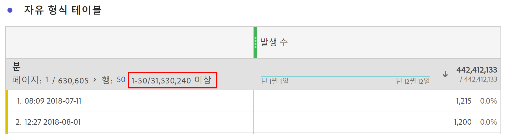

# 높은 카디널리티 차원

고유 값이 많은 차원을 사용하는 경우 결과 보고서에 표시하거나 계산할 고유 차원 항목이 너무 많이 포함될 수 있습니다. 가장 중요하지 않은 것으로 간주되는 차원 항목을 제거하여 결과가 잘립니다. 이러한 최적화는 프로젝트 및 제품 성능을 유지하기 위해 수행됩니다.

고유 값이 너무 많은 보고서를 요청하면 Analysis Workspace에는 일부 차원 항목이 포함되지 않았다는 표시기가 차원 헤더에 표시됩니다. 예를 들어 &quot;행: 22,343,156개 이상의 1-50&quot; &quot;보다 큼&quot; 키워드는 가장 중요한 차원 항목을 반환하기 위해 일부 최적화가 보고서에 적용되었음을 나타냅니다.

## 표시할 차원 항목 결정

Customer Journey Analytics은 보고서가 실행될 때 보고서를 처리하여 결합된 데이터 세트를 여러 서버에 배포합니다. 처리 서버당 데이터는 개인 ID별로 그룹화됩니다. 즉, 단일 처리 서버에 지정된 사용자에 대한 모든 데이터가 포함됩니다. 서버가 처리를 완료하면 처리된 데이터의 하위 집합을 애그리게이터 서버에 전달합니다. 처리된 데이터의 모든 하위 집합이 결합되어 작업 영역 보고서 형식으로 반환됩니다.

개별 서버가 고유한 임계값을 초과하는 데이터를 처리하는 경우 처리된 데이터 하위 집합을 반환하기 전에 결과를 자릅니다. 정렬에 사용되는 지표를 기반으로 잘린 차원 항목이 결정됩니다.

정렬 지표가 계산된 지표인 경우 서버는 계산된 지표 내의 지표를 사용하여 자를 차원 항목을 결정합니다. 계산된 지표는 다양한 중요도의 여러 지표를 포함할 수 있으므로 결과의 정확도가 떨어질 수 있습니다. 예를 들어 &quot;1인당 수익&quot;을 계산할 때 총 수익 금액과 총 인원수는 분할을 수행하기 전에 반환되고 집계됩니다. 그 결과, 각 개별 처리 서버는 결과가 전체 정렬에 어떤 영향을 미치는지 모른 채 제거할 항목을 선택합니다.

높은 카디널리티 보고서에서 일부 개별 차원 항목이 누락될 수 있지만 열 합계는 정확하며 잘린 데이터를 기반으로 하지 않습니다. 계산된 지표의 &#39;고유 개수&#39; 함수도 잘린 차원 항목의 영향을 받지 않습니다.

## 높은 카디널리티 차원에 대한 우수 사례

높은 카디널리티 차원을 수용하는 가장 좋은 방법은 보고서가 처리하는 차원 항목의 수를 제한하는 것입니다. 모든 보고서는 요청된 시간에 처리되므로 즉각적인 결과를 위해 보고서 매개 변수를 조정할 수 있습니다. Adobe은 높은 카디널리티 차원에 대해 다음 최적화 중 하나를 권장합니다.

* 사용 [필터](/help/components/filters/create-filters.md). 필터는 각 서버가 데이터의 하위 집합을 처리할 때 적용됩니다.
* 검색을 사용합니다. 검색어에서 제외된 Dimension 항목은 보고서 결과에서 제거되므로 원하는 차원 항목을 볼 가능성이 높아집니다.
* 조회 데이터 세트 차원을 사용합니다. 조회 데이터 세트 차원은 이벤트 데이터 세트 차원 항목을 결합하여 반환되는 고유 값의 수를 제한합니다.
* 사용 [포함/제외](/help/data-views/component-settings/include-exclude-values.md) 데이터 보기 관리자의 구성 요소 설정.
* 요청의 날짜 범위를 줄입니다. 시간이 지남에 따라 많은 고유 값이 누적되는 경우 작업 영역 보고서의 날짜 범위를 단축하면 처리할 서버의 고유 값 수가 제한될 수 있습니다.
