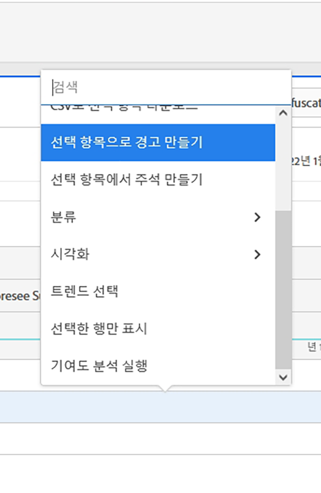

# 차원 분류

>[!NOTE]
>
>Customer Journey Analytics의 Analysis Workspace 설명서를 보고 계십니다. 이 기능은 [기존 Adobe Analytics의 Analysis Workspace](https://docs.adobe.com/content/help/ko-KR/analytics/analyze/analysis-workspace/home.html)와 약간 다릅니다. [추가 정보...](/help/getting-started/cja-aa.md)

Analysis Workspace에서 차원 및 차원 항목을 분류합니다.

특정 요구 사항에 맞게 데이터를 제한 없이 분류할 수 있습니다.관련 지표, 차원, 필터, 타임라인 및 기타 분석 분류 값을 사용하여 쿼리를 작성합니다.

1. 데이터 테이블로 [프로젝트를 만듭니다](/help/analysis-workspace/home.md).
1. 데이터 테이블에서 라인 항목을 마우스 오른쪽 단추로 클릭하고 **[!UICONTROL 분류]** > *`<item>`*.

   

   선택한 기간에 대해 차원 항목 또는 대상 필터별로 지표를 분류할 수 있습니다. 더 세부적인 수준으로 드릴다운할 수도 있습니다.

   >[!NOTE]
   >
   >테이블에 표시되는 분류의 수는 200개로 제한됩니다. 이 제한은 분류 내보내기에 대해서는 증가합니다.

**비디오:Analysis Workspace의 Dimension**

>[!VIDEO](https://video.tv.adobe.com/v/23971)

**비디오:Dimension 분류**

>[!VIDEO](https://video.tv.adobe.com/v/23969)

## 분류에 속성 모델 적용

테이블 내의 모든 분류에는 모든 속성 모델이 적용될 수 있습니다. 이 속성 모델은 상위 열과 동일하거나 다를 수 있습니다. 예를 들어, 마케팅 채널 차원에서 선형 주문을 분석하고 채널 내 특정 추적 코드에 U자형 주문을 적용할 수 있습니다. 분류에 적용되는 속성 모델을 편집하려면 다음과 같이 분류 모델 위로 마우스를 이동하고&#x200B;**[!UICONTROL 편집]**&#x200B;을 클릭합니다.

