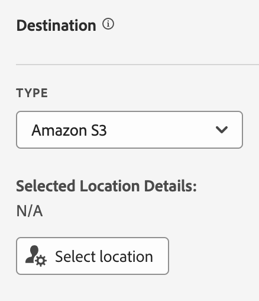
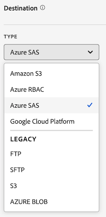

# 데이터 피드 만들기

데이터 피드를 만들 때 Adobe에 다음 기능을 제공합니다.

* 원시 데이터 파일을 전송할 대상에 대한 정보

* 각 파일에 포함할 데이터

* 데이터 피드를 전송해야 하는 빈도(늦게 도착하는 히트를 캡처하는 처리 지연 포함)

데이터 피드를 만들기 전에 데이터 피드에 대해 기본적으로 이해하고 모든 전제 조건을 충족하는지 확인하는 것이 중요합니다. 자세한 내용은 [데이터 피드 개요](data-feed-overview.md)를 참조하십시오.

## 데이터 피드 만들기 및 구성 {#create-and-configure-data-feed}

<!-- markdownlint-disable MD034 -->

>[!CONTEXTUALHELP]
>id="cja_datafeed_export_file"
>title="매니페스트"
>abstract="각 데이터 피드 게재에 매니페스트 파일을 포함할지 여부를 선택합니다. 매니페스트 파일에는 데이터 피드에 포함된 각 파일에 대한 정보가 있습니다. 데이터 피드 데이터를 하나의 패키지로 보낼 때, 완료한 파일을 포함하도록 선택할 수도 있지만, 매니페스트 파일이 권장됩니다. "

<!-- markdownlint-enable MD034 -->

<!-- markdownlint-disable MD034 -->

>[!CONTEXTUALHELP]
>id="cja_datafeed_notify"
>title="완료되면 알림"
>abstract="데이터 피드가 전송된 후 알림을 게재해야 하는 이메일 주소를 하나 이상 지정합니다. 여러 이메일 주소는 쉼표로 구분해야 합니다."

<!-- markdownlint-enable MD034 -->

<!-- markdownlint-disable MD034 -->

>[!CONTEXTUALHELP]
>id="cja_datafeed_lookback_date_range"
>title="전환 확인 날짜 범위"
>abstract="데이터 피드 게재를 처리할 때 Customer Journey Analytics에서 얼마나 지난 날짜까지 조회할지를 제어합니다. 이 설정은 빈도 기간(시간 또는 날)을 변경하지 않습니다. 그러나 전환 확인 날짜 범위는 게재되는 데이터에 영향을 줄 수 있습니다. 세그먼트 자격, 세션 계산, 일부 파생된 필드 변환 및 차원 지속성은 모두 전환 확인 날짜 범위의 영향을 받습니다."

<!-- markdownlint-enable MD034 -->

1. Adobe ID 자격 증명을 사용하여 [experiencecloud.adobe.com](https://experiencecloud.adobe.com)에 로그인합니다.

1. 인터페이스 오른쪽 상단에 있는 앱 전환기 에서 [!UICONTROL **Customer Journey Analytics**]&#x200B;를 선택합니다.

1. 맨 위 탐색 막대에서 [!UICONTROL **관리자**] > [!UICONTROL **데이터 피드**]&#x200B;로 이동합니다.

1. [!UICONTROL **데이터 피드 만들기**]&#x200B;를 선택합니다.

   [!UICONTROL **세부 정보**], [!UICONTROL **데이터 구조**] 및 [!UICONTROL **게재**] 탭으로 페이지가 표시됩니다.

   

1. [!UICONTROL **세부 정보**] 섹션에서 다음 필드를 작성합니다.

   | 필드 | 함수 |
   |---------|----------|
   | [!UICONTROL **이름**] | 데이터 피드의 이름. 이름은 선택한 데이터 보기 내에서 고유해야 하며 최대 255자까지 사용할 수 있습니다. <!--[Learn more](/help/export/analytics-data-feed/df-faq.md#must-feed-names-be-unique)--> |
   | [!UICONTROL **태그**] | 쉽게 분류할 수 있도록 데이터 피드에 태그를 적용합니다. <!--You can filter on tags as described in [Filter and search the list of data feeds](/help/export/analytics-data-feed/df-manage-feeds.md#filter-and-search-the-list-of-data-feeds) in [Manage data feeds](/help/export/analytics-data-feed/df-manage-feeds.md).--> |
   | [!UICONTROL **설명**] | 데이터 피드에 대한 설명을 지정합니다. 추가한 설명은 데이터 피드를 편집할 때 표시됩니다. |
   | [!UICONTROL **데이터 보기**] | 내보낼 데이터가 포함된 데이터 보기를 선택합니다. |

1. [!UICONTROL **데이터 구조**] 섹션에서 **[!UICONTROL 데이터 보기]** 필드에 올바른 데이터 보기가 선택되어 있는지 확인하십시오. 
데이터 보기를 선택할 때는 다음 사항을 고려하십시오.
 <ul><li>동일한 데이터 보기에 대해 여러 데이터 피드가 만들어지는 경우 각 데이터 피드의 열 정의는 서로 달라야 합니다.</li><li>사용 가능한 열 목록은 선택한 데이터 보기가 속한 로그인 회사에 따라 다릅니다. 데이터 보기를 변경하면 사용 가능한 열 목록이 변경될 수 있습니다. </li></ul>

1. 데이터 피드 구성에 열을 추가합니다. 왼쪽의 구성 요소 레일 섹션에서 포함할 열을 찾은 다음 캔버스로 드래그하여 데이터 구조를 작성합니다. **[!UICONTROL Shift]**&#x200B;을 누르거나 **[!UICONTROL Command]**(macOS) 또는 **[!UICONTROL Ctrl]**(Windows)을 눌러 여러 열을 선택할 수 있습니다.

   다음 정보를 사용하여 항상 포함되는 차원, 포함할 수 없는 차원 및 대체해야 하는 지표를 이해합니다.

   +++ 데이터 피드에 항상 포함되는 차원

   다음 차원은 기본적으로 모든 데이터 피드에 포함되며 제거할 수 없습니다.

   | 차원 이름 | 참고 | 데이터 피드 | 기타 보고 |
   |---|---|---|---|
   | 타임스탬프 | 이벤트 기간의 타임스탬프. 마이크로초 세부 기간. UTC로 표시됩니다. | 필수 | 사용할 수 없음 |
   | 행 ID | 고유 행 식별자 | 필수 | 사용할 수 없음 |
   | 세션 ID | 각 세션에 대한 고유 식별자 | 필수 | 사용할 수 없음 |
   | 개인 ID | 데이터 보기 및 연결에 대한 개인 식별자 | 필수 | 선택 사항 표준 |
   | 계정 ID [!BADGE B2B edition]{type=Informative url="https://experienceleague.adobe.com/ko/docs/analytics-platform/using/cja-overview/cja-b2b/cja-b2b-edition" newtab=true tooltip="Customer Journey Analytics B2B Edition"} | 계정 컨테이너를 사용할 때의 계정 ID | 필수 | 선택 사항 표준 |

   +++

   +++ 데이터 피드에 포함할 수 없는 차원

   Customer Journey Analytics 표준 차원은 데이터 피드에 포함할 수 없습니다. 다음 표에는 이러한 차원이 나열되어 있습니다.

   | 차원 이름 | 참고 | 데이터 피드 |
   |---|---|---|
   | 5분 | 이벤트가 발생한 5분 간격(내림) | 사용할 수 없음 |
   | 15분 | 이벤트 발생 시 15분 간격(내림) | 사용할 수 없음 |
   | 30분 | 이벤트 발생 시 30분 간격(내림) | 사용할 수 없음 |
   | 일 | 이벤트 발생 일 | 사용할 수 없음 |
   | 요일 | 이벤트가 발생한 요일 | 사용할 수 없음 |
   | 날짜 (월 기준) | 이벤트가 발생한 날짜 | 사용할 수 없음 |
   | 이벤트 심도 | 순차적 숫자 값(1, 2, 3 등) 세션 내의 각 이벤트 상호 작용에 할당됨 | 사용할 수 없음 |
   | 시간 | 이벤트 발생 시간(내림) | 사용할 수 없음 |
   | 시간 | 이벤트가 발생한 시간(내림) | 사용할 수 없음 |
   | 분 | 이벤트 발생 시간(분)(내림) | 사용할 수 없음 |
   | 분/시간 | 이벤트가 발생한 시간(분)(내림) | 사용할 수 없음 |
   | 월 | 이벤트 발생 월 | 사용할 수 없음 |
   | 월(연 기준) | 이벤트가 발생한 월의 월 | 사용할 수 없음 |
   | 분기 | 이벤트 발생 분기 | 사용할 수 없음 |
   | 사분기 | 이벤트가 발생한 사분기 | 사용할 수 없음 |
   | Second | 이벤트가 발생한 두 번째 시간(내림) | 사용할 수 없음 |
   | 주 | 이벤트 발생 주 | 사용할 수 없음 |
   | 주(한 해 기준) | 이벤트가 발생한 주 | 사용할 수 없음 |
   | 년 | 이벤트 발생 연도 | 사용할 수 없음 |

   +++

   +++ 데이터 피드에서 대체해야 하는 지표

   다음 Customer Journey Analytics 지표를 대체해야 합니다.

   | 지표 이름 | 참고 | 데이터 피드 |
   |---|---|---|
   | 계정 ([!BADGE B2B Edition]{type=Informative url="https://experienceleague.adobe.com/ko/docs/analytics-platform/using/cja-overview/cja-b2b/cja-b2b-edition" newtab=true tooltip="Customer Journey Analytics B2B Edition"}) | 연결에 지정된 계정 ID를 기반으로 함 | 사용할 수 없음. 계정 ID 고유 개수 사용. |
   | 구매 그룹 [!BADGE B2B edition]{type=Informative url="https://experienceleague.adobe.com/ko/docs/analytics-platform/using/cja-overview/cja-b2b/cja-b2b-edition" newtab=true tooltip="Customer Journey Analytics B2B Edition"} | 연결의 구매 그룹 ID를 기반으로 하는 구매 그룹 | 사용할 수 없음. 구매 그룹 ID의 고유 개수를 사용합니다. |
   | 이벤트 | 연결의 모든 이벤트 데이터 세트의 행 수 | 사용할 수 없음. 행 ID의 고유 개수 사용. |
   | 글로벌 계정 ([!BADGE B2B Edition]{type=Informative url="https://experienceleague.adobe.com/ko/docs/analytics-platform/using/cja-overview/cja-b2b/cja-b2b-edition" newtab=true tooltip="Customer Journey Analytics B2B Edition"}) | 연결의 글로벌 계정 ID 기반 | 사용할 수 없음. 글로벌 계정 ID의 고유 개수를 사용합니다. |
   | 기회 ([!BADGE B2B Edition]{type=Informative url="https://experienceleague.adobe.com/ko/docs/analytics-platform/using/cja-overview/cja-b2b/cja-b2b-edition" newtab=true tooltip="Customer Journey Analytics B2B Edition"}) | 연결의 영업 기회 ID를 기반으로 하는 영업 기회 | 사용할 수 없음. 영업 기회 ID 고유 개수 사용. |
   | 사람 | 연결에 지정된 개인 ID 기반 | 사용할 수 없음. 개인 ID 고유 개수 사용. |
   | 대화 | 대화 수 | 사용할 수 없음. 대화 ID 고유 개수 사용. |
   | 세션 종료 | 세션의 마지막 이벤트였던 이벤트 수 | 사용할 수 없음 |
   | 세션 시작 | 세션의 첫 번째 이벤트였던 이벤트 수 | 사용할 수 없음 |
   | 세션 | 데이터 보기의 세션 설정을 기반으로 합니다. | 사용할 수 없음. 세션 ID의 고유 개수 사용. |
   | 체류 시간 (초) | 서로 다른 두 차원 값 사이의 시간을 합합니다. | 사용할 수 없음 |

   +++

   +++ 선택 사항 표준 구성 요소

   | 구성 요소 이름 | 유형 | 참고 | 데이터 피드 |
   |---|---|---|---|
   | 오전/오후 | 차원 시간 분할 | 오전 또는 오후 | 사용할 수 없음 |
   | 배치 ID | 차원 | Experience Platform 배치용 식별자 | 사용 가능 |
   | 데이터 세트 ID | 차원 | Experience Platform 데이터 세트에 대한 식별자 | 사용 가능 |
   | 날짜 (월 기준) | 차원 시간 분할 | 1-31 | 사용할 수 없음 |
   | 요일 | 차원 시간 분할 | 월요일부터 일요일까지 | 사용할 수 없음 |
   | 일(한 해 기준) | 차원 시간 분할 | 1-366 | 사용할 수 없음 |
   | 시간 | 차원 시간 분할 | 0-23 | 사용할 수 없음 |
   | 월(연 기준) | 차원 시간 분할 | 1월-12월 | 사용할 수 없음 |
   | 최초 세션 | 지표 | 보고 기간 내에 개인의 첫 번째 정의된 세션 | 사용할 수 없음 |
   | 재방문 세션 | 지표 | 개인의 첫 번째 세션이 아닌 세션 | 사용할 수 없음 |
   | 개인 ID 네임스페이스 | 차원 | 개인 ID가 구성하는 ID 유형(예: 이메일 또는 쿠키 ID) | 사용 가능 |
   | 글로벌 계정 ID [!BADGE B2B edition]{type=Informative url="https://experienceleague.adobe.com/ko/docs/analytics-platform/using/cja-overview/cja-b2b/cja-b2b-edition" newtab=true tooltip="Customer Journey Analytics B2B Edition"} | 차원 | 글로벌 계정 컨테이너를 사용할 때의 글로벌 계정 ID | 사용 가능 |
   | 영업 기회 ID [!BADGE B2B edition]{type=Informative url="https://experienceleague.adobe.com/ko/docs/analytics-platform/using/cja-overview/cja-b2b/cja-b2b-edition" newtab=true tooltip="Customer Journey Analytics B2B Edition"} | 차원 | 영업 기회 컨테이너를 사용할 때의 영업 기회 ID | 사용 가능 |
   | 구매 그룹 ID [!BADGE B2B edition]{type=Informative url="https://experienceleague.adobe.com/ko/docs/analytics-platform/using/cja-overview/cja-b2b/cja-b2b-edition" newtab=true tooltip="Customer Journey Analytics B2B Edition"} | 차원 | 구매 그룹 컨테이너를 사용할 때 구매 그룹 ID | 사용 가능 |
   | 사분기 | 차원 시간 분할 | Q1, Q2, Q3, Q4 | 사용할 수 없음 |
   | 세션 반복 | 지표 | 개인의 첫 번째 세션이 아닌 세션 | 사용할 수 없음 |
   | 세션 유형 | 차원 | 두 가지 값: 최초 또는 재방문 | 사용할 수 없음 |
   | 이벤트당 소비한 시간 | 차원 | 소비한 시간 지표를 이벤트 버킷에 버킷팅합니다 | 사용할 수 없음 |
   | 세션당 소비한 시간 | 차원 | 소비한 시간 지표를 세션 버킷에 버킷팅합니다 | 사용할 수 없음 |
   | 사용자당 소비한 시간 | 차원 | 소비한 시간 지표를 사용자 버킷에 버킷팅합니다 | 사용할 수 없음 |
   | 주말/평일 | 차원 시간 분할 | 주말 또는 평일 | 사용할 수 없음 |

   +++

1. [!UICONTROL **게재**] 섹션에서 다음 정보를 지정하십시오.

   | 필드 | 함수 |
   |---------|----------|
   | [!UICONTROL **피드 유형**] | 만들려는 피드 유형을 선택합니다.<ul><li>[!UICONTROL **라이브 피드**]: 현재 및 향후 데이터를 내보냅니다.</li><li>[!UICONTROL **피드 채우기**]: 두 개의 지난 날짜 사이의 이전 데이터를 내보냅니다.</li></ul> |
   | [!UICONTROL **시작 날짜**] | 데이터 피드를 시작할 날짜를 지정합니다. 내역 데이터에 대한 데이터 피드 처리를 즉시 시작하려면 [!UICONTROL **피드 채우기**]&#x200B;가 선택되어 있는지 확인한 다음 이 날짜를 데이터가 수집되는 과거의 날짜로 설정하십시오. 시작 날짜는 데이터 보기의 시간대를 기반으로 합니다. |
   | [!UICONTROL **종료 날짜**] | 데이터 피드를 종료할 날짜를 지정합니다. 종료 날짜는 데이터 보기의 시간대를 기반으로 합니다. |
   | [!UICONTROL **빈도**] | 데이터 피드를 전송해야 하는 빈도를 선택합니다. 빈도 창에 속하는 타임스탬프가 있는 이벤트는 데이터 피드 배달에 포함됩니다. [!UICONTROL **전환 확인 날짜 범위**] 및 [!UICONTROL **처리 지연**] 필드는 선택한 게재 빈도의 데이터에 포함된 이벤트에도 영향을 줄 수 있습니다.
라이브 피드의 경우 1시간의 데이터 또는 1일의 데이터를 포함하도록 선택합니다. 채우기 피드는 일별이어야 합니다.
<ul><li>**일별**: 피드에 데이터 보기의 시간대에 자정부터 자정까지 하루 분량의 데이터가 포함됩니다. 피드 채우기 또는 라이브 피드에 이 옵션을 사용합니다.</li><li>**시간별**: 피드에는 1시간 동안의 데이터가 포함됩니다. 라이브 피드에 이 옵션을 사용합니다.</li></ul> |
   | [!UICONTROL **전환 확인 날짜 범위**] | 데이터 피드 게재를 처리할 때 Customer Journey Analytics에서 얼마나 지난 날짜까지 조회할지를 제어합니다. 
이 설정은 데이터 피드 출력에 포함할 이벤트의 시간 프레임을 정의하는 빈도 창(시간 또는 일)을 변경하지 않습니다. 그러나 전환 확인 날짜 범위는 다음과 같은 방법으로 전달되는 데이터에 영향을 줄 수 있습니다. 
<ul><li>**세그먼트 자격**: 세그먼트가 데이터 피드 정의에 적용되면 전환 확인 날짜 범위 내의 모든 이벤트에 따라 개인의 자격 여부가 결정됩니다. 세그먼트의 컨테이너 설정에 따라 범위가 결정됩니다. (가능한 컨테이너는 개인, 세션 또는 이벤트입니다.) B2B에는 다음과 같은 추가 컨테이너가 있습니다. Global 계정, 계정, 기회, 구매 그룹.)  
예를 들어 개인 컨테이너가 사용되고 개인이 전환 확인 날짜 범위 동안 자격을 얻으면 빈도 창 동안 해당 개인의 모든 이벤트도 자격을 얻습니다.
</li><li>**세션 계산**: 세션 경계는 전환 확인 날짜 범위 내의 데이터를 사용하여 계산됩니다.</li><li>**파생 필드 변환**: 컨테이너를 참조하는 파생 필드 함수(예: Summarize, Deduplicate 및 Depth 함수)는 데이터 피드 내보내기에서 전환 확인 날짜 범위를 사용합니다.</li><li>**Dimension 지속성**: 개별 차원에 대한 지속성 설정을 선택하는 경우 만료를 선택하여 설정된 이벤트에서 벗어난 차원 항목의 지속 기간도 결정합니다. 
데이터 보기에서 다음 옵션 중 하나로 만료를 설정하면 전환 확인 날짜 범위가 차원 지속성에 영향을 줍니다.
<ul><li>[!UICONTROL **보고 기간**]&#x200B;을 만료로 사용하는 데이터 피드 정의의 각 차원에 대해 전환 확인 날짜 범위가 새 보고 기간이 됩니다.</li><li>[!UICONTROL **사용자 지정 시간**]&#x200B;을(를) 만료로 사용하는 데이터 피드 정의의 각 차원에 대해, 선택한 사용자 지정 시간이 전환 확인 날짜 범위를 벗어나는 경우 사용자 지정 시간은 무시되며 전환 확인 날짜 범위는 차원 만료에 사용됩니다.
데이터 보기 내의 차원에 대한 지속성 설정에 대한 자세한 내용은 [지속성 구성 요소 설정](/help/data-views/component-settings/persistence.md)을 참조하십시오.
</li></ul> |
   | [!UICONTROL **처리 지연**] | 데이터 피드 파일을 처리하기 전에 대기할 시간을 선택합니다. 처리 지연 중에 들어오는 모든 늦게 도착하는 히트는 데이터 피드에 포함됩니다. 
지연은 오프라인 디바이스를 온라인 상태로 전환하여 데이터를 전송할 수 있는 기회를 모바일 구현에 제공하는 데 유용합니다. 또한 이전에 처리된 파일을 관리할 때 조직의 서버측 프로세스를 수용하는 데 사용할 수도 있습니다. 

피드를 2, 3, 4 또는 8시간 지연시킬 수 있습니다.
세션이 포함되려면 처리 지연 컷오프 이후에 시작해야 합니다. 컷오프 전에 시작되고 처리 지연 내에 끝나는 세션은 포함되지 않습니다.
 |

1. [!UICONTROL **대상**] 섹션에서 데이터를 전송할 대상을 구성합니다.

   >[!NOTE]
   >
   >보고서 대상 구성 시 다음과 같은 사항을 고려하십시오.
   >
   ><!--* Adobe recommends using a cloud account for your report destination. [Legacy FTP and SFTP accounts](/help/components/locations/configure-import-accounts.md) are available, but are not recommended.-->
   >* 이전에 구성한 모든 클라우드 계정은 데이터 피드에 사용할 수 있습니다. [구성 요소 > 내보내기 > 위치 계정](/help/components/exports/cloud-export-accounts.md)의 위치 관리자에서 클라우드 계정을 구성할 수 있습니다.
   >
   >* 클라우드 계정은 Customer Journey Analytics 사용자 계정과 연결되어 있습니다. 조직의 모든 사용자가 클라우드 계정을 사용할 수 있도록 설정하지 않는 한 사용자가 구성한 클라우드 계정을 다른 사용자가 사용하거나 볼 수 없습니다.
   >
   >* [구성 요소 > 내보내기 > 위치](/help/components/exports/cloud-export-locations.md)의 위치 관리자에서 만드는 모든 위치를 편집할 수 있습니다.

   다음 필드를 완료합니다.

   | 필드 | 함수 |
   |---------|----------|
   | [!UICONTROL **계정**] | 다음 중 하나를 수행합니다.<ul><li>**기존 계정 사용:** **[!UICONTROL 계정]** 필드 옆에 있는 드롭다운 메뉴를 선택합니다. 또는 계정 이름을 입력한 다음 드롭다운 메뉴에서 선택합니다. 
계정을 구성했거나 속해 있는 조직과 공유하는 경우에만 계정을 사용할 수 있습니다.
</li><li>**새 계정 만들기:** **[!UICONTROL 계정]** 필드 아래에서 **[!UICONTROL 새로 추가]**&#x200B;를 선택합니다. 계정 구성 방법에 대한 자세한 내용은 [클라우드 내보내기 계정 구성](/help/components/exports/cloud-export-accounts.md)을 참조하십시오.</li></ul> |
   | [!UICONTROL **위치**] | 다음 중 하나를 수행합니다.<ul><li>**기존 위치 사용:** **[!UICONTROL 위치]** 필드 옆에 있는 드롭다운 메뉴를 선택합니다. 또는 위치 이름을 입력한 다음 드롭다운 메뉴에서 선택합니다.</li><li>**새 위치 만들기:** **[!UICONTROL 위치]** 필드 아래에서 **[!UICONTROL 새로 추가]**&#x200B;를 선택합니다. 위치를 구성하는 방법에 대한 자세한 내용은 [클라우드 내보내기 위치 구성](/help/components/exports/cloud-export-locations.md)을 참조하십시오.</li></ul> |
   | [!UICONTROL **완료 시 알림**] | 데이터 피드가 성공적으로 전송되거나 전송이 실패한 후 알림을 배달해야 하는 이메일 주소를 하나 이상 지정합니다. 여러 이메일 주소는 쉼표로 구분해야 합니다. |
   | [!UICONTROL **매니페스트 사용**] | 각 데이터 피드 게재에 매니페스트 파일을 포함할지 여부를 선택합니다. 매니페스트 파일에는 데이터 피드에 포함된 각 파일에 대한 정보가 있습니다. |

1. **[!UICONTROL 저장]**&#x200B;을 선택합니다.

<!-- why would you want to do this? -->

<!--
I don't think we need anything after this, but saving here just in case:

1. In the [!UICONTROL **Feed Information**] section, complete the following fields:
   
   | Field | Function |
   |---------|----------|
   | [!UICONTROL **Name**] | The name of the data feed. Must be unique within the selected report suite, and can be up to 255 characters in length. [Learn more](/help/export/analytics-data-feed/df-faq.md#must-feed-names-be-unique) |
   | [!UICONTROL **Report suite**] | The report suite that the data feed is based on. If multiple data feeds are created for the same report suite, they must have different column definitions. Only source report suites support data feeds; virtual report suites are not supported. |
   | [!UICONTROL **Email when complete**] | The email address to be notified when a feed finishes processing. The email address must be properly formatted. |
   | [!UICONTROL **Feed interval**] | Select **Daily** for backfill or historical data. Daily feeds contain a full day's worth of data, from midnight to midnight in the report suite's time zone. Select **Hourly** for continuing data (Daily is also available for continuing feeds if you prefer). Hourly feeds contain a single hour's worth of data. |
   | [!UICONTROL **Delay processing**] | Wait a given amount of time before processing a data feed file. A delay can be useful to give mobile implementations an opportunity for offline devices to come online and send data. It can also be used to accommodate your organization's server-side processes in managing previously processed files. In most cases, no delay is needed. A feed can be delayed by up to 120 minutes. |
   | [!UICONTROL **Start & end dates**] | The start date indicates the date when you want the data feed to begin. To immediately begin processing data feeds for historical data, set this date to any date in the past when data is being collected. The start and end dates are based on the report suite's time zone. |
   | [!UICONTROL **Continuous feed**] | This checkbox removes the end date, allowing a feed to run indefinitely. When a feed finishes processing historical data, a feed waits for data to finish collecting for a given hour or day. Once the current hour or day concludes, processing begins after the specified delay. |
   
1. In the [!UICONTROL **Destination**] section, in the [!UICONTROL **Type**] drop-down menu, select the destination where you want the data to be sent. 

   >[!NOTE]
   >
   >Consider the following when configuring a report destination:
   >
   >* We recommend using a cloud account for your report destination. [Legacy FTP and SFTP accounts](#legacy-destinations) are available, but are not recommended.
   >* Any cloud accounts that you previously configured are available to use for Data Feeds. You can configure cloud accounts in any of the following ways:
   >
   >   * When configuring cloud accounts for [Data Warehouse](/help/export/data-warehouse/create-request/dw-request-report-destinations.md) 
   >   
   >   * When [importing Adobe Analytics classification data](/help/components/locations/locations-manager.md) (Any locations that are configured for importing classification data cannot be used.)
   >   
   >   * From the Locations manager, in [Components > Locations](/help/components/locations/configure-import-accounts.md) 
   >
   >* Cloud accounts are associated with your Adobe Analytics user account. Other users cannot use or view cloud accounts that you configure.
   >
   >* You can edit any locations that you create from the Locations manager in [Components > Locations](/help/components/locations/configure-import-accounts.md)

   

   Use any of the following destination types when creating a data feed. For configuration instructions, expand the destination type. (Additional [legacy destinations](#legacy-destinations) are also available, but are not recommended.)

   +++Amazon S3

   You can send feeds directly to Amazon S3 buckets. This destination type requires only your Amazon S3 account and the location (bucket). 

   Adobe Analytics uses cross-account authentication to upload files from Adobe Analytics to the specified location in your Amazon S3 instance.

   When using Amazon S3 with Data Feeds, only SSE-S3 encryption is supported.

   To configure an Amazon S3 bucket as the destination for a data feed:

   1. Begin creating a data feed as described in [Create and configure a data feed](#create-and-configure-a-data-feed).
   
   1. In the [!UICONTROL **Destination**] section, in the [!UICONTROL **Type**] drop-down menu, select [!UICONTROL **Amazon S3**].

      

   1. Select [!UICONTROL **Select location**].

      The Amazon S3 Export Locations page is displayed.

   1. (Conditional) If an Amazon S3 account (and a location on that account) has already been configured in Adobe Analytics, you can use it as your data feed destination: 

      >[!NOTE]
      >
      >Accounts are available to you only if you configured them or if they were shared with an organization you are a part of.
   
      1. Select the account from the [!UICONTROL **Select account**] drop-down menu.

         Any cloud accounts that were configured in any of the following areas of Adobe Analytics are available to use:
      
         * When importing Adobe Analytics classification data, as described in [Schema](/help/components/classifications/sets/manage/schema.md).
      
           However, any locations that are configured for importing classification data cannot be used. Instead, add a new destination as described below.

         * When configuring accounts and locations in the Locations area, as described in [Configure cloud import and export accounts](/help/components/locations/configure-import-accounts.md) and [Configure cloud import and export locations](/help/components/locations/configure-import-locations.md).
   
      1. Select the location from the [!UICONTROL **Select location**] drop-down menu.

      1. Select [!UICONTROL **Save**] > [!UICONTROL **Save**].

      The destination is now configured to send data to the Amazon S3 location that you specified.
   
   1. (Conditional) If you have not previously added an Amazon S3 account:

      1. Select [!UICONTROL **Add account**], then specify the following information:
   
         |Field | Function |
         |---------|----------|
         | [!UICONTROL **Account name**] | A name for the account. This can be any name you choose. |
         | [!UICONTROL **Account description**] | A description for the account. |
         | [!UICONTROL **Role ARN**] | You must provide a Role ARN (Amazon Resource Name) that Adobe can use to gain access to the Amazon S3 account. To do this, you create an IAM permission policy for the source account, attach the policy to a user, and then create a role for the destination account. For specific information, see [this AWS documentation](https://aws.amazon.com/premiumsupport/knowledge-center/cross-account-access-iam/). |
         | [!UICONTROL **User ARN**] | The User ARN (Amazon Resource Name) is provided by Adobe. You must attach this user to the policy you created. |

         {style="table-layout:auto"}

      1. Select [!UICONTROL **Add location**], then specify the following information:
   
         |Field | Function |
         |---------|----------|
         | [!UICONTROL **Name**] | A name for the account.  |
         | [!UICONTROL **Description**] | A description for the account. |
         | [!UICONTROL **Bucket**] | The bucket within your Amazon S3 account where you want Adobe Analytics data to be sent. 
Ensure that the User ARN that was provided by Adobe has the `S3:PutObject` permission in order to upload files to this bucket. This permission allows the User ARN to upload initial files and overwrite files for subsequent uploads.

Bucket names must meet specific naming rules. For example, they must be between 3 to 63 characters long, can consist only of lowercase letters, numbers, dots (.), and hyphens (-), and must begin and end with a letter or number. [A complete list of naming rules are available in the AWS documentation](https://docs.aws.amazon.com/AmazonS3/latest/userguide/bucketnamingrules.html). 
 |
         | [!UICONTROL **Prefix**] | The folder within the bucket where you want to put the data. Specify a folder name, then add a backslash after the name to create the folder. For example, `folder_name/` |

         {style="table-layout:auto"}

      1. Select [!UICONTROL **Create**] > [!UICONTROL **Save**].

         The destination is now configured to send data to the Amazon S3 location that you specified.

      1. (Conditional) If you need to manage the destination (account and location) that you just created, it is available in the [Locations manager](/help/components/locations/locations-manager.md).
   
   +++

   +++Azure RBAC

   You can send feeds directly to an Azure container by using RBAC authentication. This destination type requires an Application ID, Tenant ID, and Secret. 

   To configure an Azure RBAC account as the destination for a data feed:

   1. If you haven't already, create an Azure application that Adobe Analytics can use for authentication, then grant access permissions in access control (IAM). 
   
      For information, refer to the [Microsoft Azure documentation about how to create an Azure Active Directory application](https://learn.microsoft.com/en-us/azure/active-directory/develop/howto-create-service-principal-portal). 
   
   1. In the Adobe Analytics admin console, in the [!UICONTROL **Destination**] section, in the [!UICONTROL **Type**] drop-down menu, select [!UICONTROL **Azure RBAC**].

      

   1. Select [!UICONTROL **Select location**].

      The Azure RBAC Export Locations page is displayed.

   1. (Conditional) If an Azure RBAC account (and a location on that account) has already been configured in Adobe Analytics, you can use it as your data feed destination: 

      >[!NOTE]
      >
      >Accounts are available to you only if you configured them or if they were shared with an organization you are a part of.
   
      1. Select the account from the [!UICONTROL **Select account**] drop-down menu.

      Any cloud accounts that you configured in any of the following areas of Adobe Analytics are available to use:
      
         * When importing Adobe Analytics classification data, as described in [Schema](/help/components/classifications/sets/manage/schema.md).
      
           However, any locations that are configured for importing classification data cannot be used. Instead, add a new destination as described below.

         * When configuring accounts and locations in the Locations area, as described in [Configure cloud import and export accounts](/help/components/locations/configure-import-accounts.md) and [Configure cloud import and export locations](/help/components/locations/configure-import-locations.md).

      1. Select the location from the [!UICONTROL **Select location**] drop-down menu.

      1. Select [!UICONTROL **Save**] > [!UICONTROL **Save**].

         The destination is now configured to send data to the Azure RBAC location that you specified.

   1. (Conditional) If you have not previously added an Azure RBAC account:

      1. Select [!UICONTROL **Add account**], then specify the following information:
   
         |Field | Function |
         |---------|----------|
         | [!UICONTROL **Account name**] | A name for the Azure RBAC account. This name displays in the [!UICONTROL **Select account**] drop-down field and can be any name you choose. |
         | [!UICONTROL **Account description**] | A description for the Azure RBAC account. This description displays in the [!UICONTROL **Select account**] drop-down field and can be any name you choose.  |
         | [!UICONTROL **Application ID**] | Copy this ID from the Azure application that you created. In Microsoft Azure, this information is located on the **Overview** tab within your application. For more information, see the [Microsoft Azure documentation about how to register an application with the Microsoft identity platform](https://learn.microsoft.com/en-us/azure/active-directory/develop/quickstart-register-app). |
         | [!UICONTROL **Tenant ID**] | Copy this ID from the Azure application that you created. In Microsoft Azure, this information is located on the **Overview** tab within your application. For more information, see the [Microsoft Azure documentation about how to register an application with the Microsoft identity platform](https://learn.microsoft.com/en-us/azure/active-directory/develop/quickstart-register-app). |
         | [!UICONTROL **Secret**] | Copy the secret from the Azure application that you created. In Microsoft Azure, this information is located on the **Certificates & secrets** tab within your application. For more information, see the [Microsoft Azure documentation about how to register an application with the Microsoft identity platform](https://learn.microsoft.com/en-us/azure/active-directory/develop/quickstart-register-app). |

         {style="table-layout:auto"}

      1. Select [!UICONTROL **Add location**], then specify the following information: 
   
         |Field | Function |
         |---------|----------|
         | [!UICONTROL **Name**] | A name for the location. This name displays in the [!UICONTROL **Select location**] drop-down field and can be any name you choose. |
         | [!UICONTROL **Description**] | A description for the location. This description displays in the [!UICONTROL **Select location**] drop-down field and can be any name you choose. |
         | [!UICONTROL **Account**] | The Azure storage account. |
         | [!UICONTROL **Container**] | The container within the account you specified where you want Adobe Analytics data to be sent. Ensure that you grant permissions to upload files to the Azure application that you created earlier. |
         | [!UICONTROL **Prefix**] | The folder within the container where you want to put the data. Specify a folder name, then add a backslash after the name to create the folder. For example, `folder_name/`
Make sure the Application ID that you specified when configuring the Azure RBAC account has been granted the `Storage Blob Data Contributor` role in order to access the container (folder).
 
For more information, see [Azure built-in roles](https://learn.microsoft.com/en-us/azure/role-based-access-control/built-in-roles).
 |

         {style="table-layout:auto"}

      1. Select [!UICONTROL **Create**] > [!UICONTROL **Save**].

         The destination is now configured to send data to the Azure RBAC location that you specified.

      1. (Conditional) If you need to manage the destination (account and location) that you just created, it is available in the [Locations manager](/help/components/locations/locations-manager.md).
   
   +++

   +++Azure SAS

   You can send feeds directly to an Azure container by using SAS authentication. This destination type requires an Application ID, Tenant ID, Key vault URI, Key vault secret name, and secret. 

   To configure Azure SAS as the destination for a data feed:

   1. If you haven't already, create an Azure application that Adobe Analytics can use for authentication. 
   
      For information, refer to the [Microsoft Azure documentation about how to create an Azure Active Directory application](https://learn.microsoft.com/en-us/azure/active-directory/develop/howto-create-service-principal-portal). 
   
   1. In the Adobe Analytics admin console, in the [!UICONTROL **Destination**] section, select [!UICONTROL **Azure SAS**].

      

   1. Select [!UICONTROL **Select location**].

      The Azure SAS Export Locations page is displayed.

   1. (Conditional) If an Azure SAS account (and a location on that account) has already been configured in Adobe Analytics, you can use it as your data feed destination: 

      >[!NOTE]
      >
      >Accounts are available to you only if you configured them or if they were shared with an organization you are a part of.
   
      1. Select the account from the [!UICONTROL **Select account**] drop-down menu.

         Any cloud accounts that you configured in any of the following areas of Adobe Analytics are available to use:
      
         * When importing Adobe Analytics classification data, as described in [Schema](/help/components/classifications/sets/manage/schema.md).
      
           However, any locations that are configured for importing classification data cannot be used. Instead, add a new destination as described below.

         * When configuring accounts and locations in the Locations area, as described in [Configure cloud import and export accounts](/help/components/locations/configure-import-accounts.md) and [Configure cloud import and export locations](/help/components/locations/configure-import-locations.md).

      1. Select the location from the [!UICONTROL **Select location**] drop-down menu.

      1. Select [!UICONTROL **Save**] > [!UICONTROL **Save**].

         The destination is now configured to send data to the Azure SAS location that you specified.
   
   1. (Conditional) If you have not previously added an Azure SAS account:

      1. Select [!UICONTROL **Add account**], then specify the following information:
   
         |Field | Function |
         |---------|----------|
         | [!UICONTROL **Account name**] | A name for the Azure SAS account. This name displays in the [!UICONTROL **Select account**] drop-down field and can be any name you choose. |
         | [!UICONTROL **Account description**] | A description for the Azure SAS account. This description displays in the [!UICONTROL **Select account**] drop-down field and can be any name you choose. |
         | [!UICONTROL **Application ID**] | Copy this ID from the Azure application that you created. In Microsoft Azure, this information is located on the **Overview** tab within your application. For more information, see the [Microsoft Azure documentation about how to register an application with the Microsoft identity platform](https://learn.microsoft.com/en-us/azure/active-directory/develop/quickstart-register-app). |
         | [!UICONTROL **Tenant ID**] | Copy this ID from the Azure application that you created. In Microsoft Azure, this information is located on the **Overview** tab within your application. For more information, see the [Microsoft Azure documentation about how to register an application with the Microsoft identity platform](https://learn.microsoft.com/en-us/azure/active-directory/develop/quickstart-register-app). |
         | [!UICONTROL **Key vault URI**] | 
The path to the SAS URI in Azure Key Vault. To configure Azure SAS, you need to store an SAS URI as a secret using Azure Key Vault. For information, see the [Microsoft Azure documentation about how to set and retrieve a secret from Azure Key Vault](https://learn.microsoft.com/en-us/azure/key-vault/secrets/quick-create-portal?source=recommendations).

After the key vault URI is created:<ul><li>Add an access policy on the Key Vault in order to grant permission to the Azure application that you created.
For information, see the [Microsoft Azure documentation about how to assign a Key Vault access policy](https://learn.microsoft.com/en-us/azure/key-vault/general/assign-access-policy?tabs=azure-portal).

Or

If you want to grant an access role directly without creating an access policy, see the [Microsoft Azure documentation about how to assign Azure roles using Azure portal](https://learn.microsoft.com/en-us/azure/role-based-access-control/role-assignments-portal). This adds the role assignment for the application ID to access the key vault URI. 
</li><li>Make sure the Application ID has been granted the `Key Vault Certificate User` built-in role in order to access the key vault URI. 
For more information, see [Azure built-in roles](https://learn.microsoft.com/en-us/azure/role-based-access-control/built-in-roles).
</li></ul> |
         | [!UICONTROL **Key vault secret name**] | The secret name you created when adding the secret to Azure Key Vault. In Microsoft Azure, this information is located in the Key Vault you created, on the **Key Vault** settings pages. For information, see the [Microsoft Azure documentation about how to set and retrieve a secret from Azure Key Vault](https://learn.microsoft.com/en-us/azure/key-vault/secrets/quick-create-portal?source=recommendations). |
         | [!UICONTROL **Secret**] | Copy the secret from the Azure application that you created. In Microsoft Azure, this information is located on the **Certificates & secrets** tab within your application. For more information, see the [Microsoft Azure documentation about how to register an application with the Microsoft identity platform](https://learn.microsoft.com/en-us/azure/active-directory/develop/quickstart-register-app). |

         {style="table-layout:auto"}

      1. Select [!UICONTROL **Add location**], then specify the following information: 
   
         |Field | Function |
         |---------|----------|
         | [!UICONTROL **Name**] | A name for the location. This name displays in the [!UICONTROL **Select location**] drop-down field and can be any name you choose. |
         | [!UICONTROL **Description**] | A description for the location. This description displays in the [!UICONTROL **Select location**] drop-down field and can be any name you choose. |
         | [!UICONTROL **Container**] | The container within the account you specified where you want Adobe Analytics data to be sent. |
         | [!UICONTROL **Prefix**] | The folder within the container where you want to put the data. Specify a folder name, then add a backslash after the name to create the folder. For example, `folder_name/`
Make sure that the SAS URI store that you specified in the Key Vault secret name field when configuring the Azure SAS account has the `Write` permission. This allows the SAS URI to create files in your Azure container. 
If you want the SAS URI to also overwrite files, make sure that the SAS URI store has the `Delete` permission.

For more information, see [Blob storage resources](https://learn.microsoft.com/en-us/azure/storage/blobs/storage-blobs-introduction#blob-storage-resources) in the Azure Blob Storage documentation.
 |

         {style="table-layout:auto"}

      1. Select [!UICONTROL **Create**] > [!UICONTROL **Save**].

         The destination is now configured to send data to the Azure SAS location that you specified.

      1. (Conditional) If you need to manage the destination (account and location) that you just created, it is available in the [Locations manager](/help/components/locations/locations-manager.md).
   
   +++

   +++Google Cloud Platform

   You can send feeds directly to Google Cloud Platform (GCP) buckets. This destination type requires only your GCP account name and the location (bucket) name. 
   
   Adobe Analytics uses cross-account authentication to upload files from Adobe Analytics to the specified location in your GCP instance.

   To configure a GCP bucket as the destination for a data feed:

   1. In the Adobe Analytics admin console, in the [!UICONTROL **Destination**] section, select [!UICONTROL **Google Cloud Platform**].

      

   1. Select [!UICONTROL **Select location**].

      The GCP Export Locations page is displayed.

   1. (Conditional) If a Google Cloud Platform account (and a location on that account) has already been configured in Adobe Analytics, you can use it as your data feed destination: 

      >[!NOTE]
      >
      >Accounts are available to you only if you configured them or if they were shared with an organization you are a part of.
   
      1. Select the account from the [!UICONTROL **Select account**] drop-down menu.

         Any cloud accounts that you configured in any of the following areas of Adobe Analytics are available to use:
      
         * When importing Adobe Analytics classification data, as described in [Schema](/help/components/classifications/sets/manage/schema.md).
      
           However, any locations that are configured for importing classification data cannot be used. Instead, add a new destination as described below.

         * When configuring accounts and locations in the Locations area, as described in [Configure cloud import and export accounts](/help/components/locations/configure-import-accounts.md) and [Configure cloud import and export locations](/help/components/locations/configure-import-locations.md).

      1. Select the location from the [!UICONTROL **Select location**] drop-down menu.

      1. Select [!UICONTROL **Save**] > [!UICONTROL **Save**].

         The destination is now configured to send data to the Google Cloud Platform location that you specified.
   
   1. (Conditional) If you have not previously added a GCP account:

      1. Select [!UICONTROL **Add account**], then specify the following information:
   
         |Field | Function |
         |---------|----------|
         | [!UICONTROL **Account name**] | A name for the account. This can be any name you choose. |
         | [!UICONTROL **Account description**] | A description for the account. |
         | [!UICONTROL **Project ID**] | Your Google Cloud project ID. See the [Google Cloud documentation about getting a project ID](https://cloud.google.com/resource-manager/docs/creating-managing-projects#identifying_projects). |

         {style="table-layout:auto"}

      1. Select [!UICONTROL **Add location**], then specify the following information:
   
         |Field | Function |
         |---------|----------|
         | [!UICONTROL **Principal**] | The Principal is provided by Adobe. You must grant permission to receive feeds to this principal. |
         | [!UICONTROL **Name**] | A name for the account.  |
         | [!UICONTROL **Description**] | A description for the account. |
         | [!UICONTROL **Bucket**] | The bucket within your GCP account where you want Adobe Analytics data to be sent. 
Ensure that you have granted either of the following permissions to the Principal provided by Adobe: (For information about granting permissions, see [Add a principal to a bucket-level policy](https://cloud.google.com/storage/docs/access-control/using-iam-permissions#bucket-add) in the Google Cloud documentation.)<ul><li>`roles/storage.objectCreator`: Use this permission if you  want to limit the Principal to only create files in your GCP account.  **Important:** If you use this permission with scheduled reporting, you must use a unique file name for each new scheduled export. Otherwise, the report generation will fail because the Principal does not have access to overwrite existing files.</li><li>(Recommended) `roles/storage.objectUser`: Use this permission if you want the Principal to have access to view, list, update, and delete files in your GCP account. This permission allows the Principal to overwrite existing files for subsequent uploads, without the need to auto-generate unique file names for each new scheduled export.</li></ul>
If your organization is using [Organization policy constraints](https://cloud.google.com/storage/docs/org-policy-constraints) to allow only the Google Cloud Platform account in your allow list, you need the following Adobe-owned Google Cloud Platform organization ID: <ul><li>`DISPLAY_NAME`: `adobe.com`</li><li>`ID`: `178012854243`</li><li>`DIRECTORY_CUSTOMER_ID`: `C02jo8puj`</li></ul> 
 |
         | [!UICONTROL **Prefix**] | The folder within the bucket where you want to put the data. Specify a folder name, then add a backslash after the name to create the folder. For example, `folder_name/` |

         {style="table-layout:auto"}

      1. Select [!UICONTROL **Create**] > [!UICONTROL **Save**].

         The destination is now configured to send data to the GCP location that you specified.

      1. (Conditional) If you need to manage the destination (account and location) that you just created, it is available in the [Locations manager](/help/components/locations/locations-manager.md).
   
   +++

1. In the  [!UICONTROL **Data Column Definitions**] section, select the latest [!UICONTROL **All Adobe Columns**] template in the drop-down menu, then complete the following fields:
   
   |Field | Function |
   |---------|----------|
   | [!UICONTROL **Remove escaped characters**] | When collecting data, some characters (such as newlines) can cause issues. Check this box if you would like these characters removed from feed files. |
   | [!UICONTROL **Compression format**] | The type of compression used. **Gzip** outputs files in `.tar.gz` format. **Zip** outputs files in `.zip` format. |
   | [!UICONTROL **Packaging type**] | Select [!UICONTROL **Multiple files**] for most data feeds. This option paginates your data into uncompressed 2GB chunks. (If the [!UICONTROL **Multiple files**] option is selected and uncompressed data for the reporting window is less than 2GB, one file is sent.) Selecting **Single file** outputs the `hit_data.tsv` file in a single, potentially massive file. |
   | [!UICONTROL **Manifest**] | Determines whether Adobe should deliver a [manifest file](c-df-contents/datafeeds-contents.md#feed-manifest) to the destination when no data is collected for a feed interval. If you select **Manifest File**, you receive a manifest file similar to the following when no data is collected:
`text`

`Datafeed-Manifest-Version: 1.0`

`Lookup-Files: 0`

`Data-Files: 0`

 `Total-Records: 0`
 |
   | [!UICONTROL **Column templates**] | When creating many data feeds, Adobe recommends creating a column template. Selecting a column template automatically includes the specified columns in the template. Adobe also provides several templates by default. |
   | [!UICONTROL **Available columns**] | All available data columns in Adobe Analytics. Click [!UICONTROL Add all] to include all columns in a data feed. |
   | [!UICONTROL **Included columns**] | The columns to include in a data feed. Click [!UICONTROL Remove all] to remove all columns from a data feed. |
   | [!UICONTROL **Download CSV**] | Downloads a CSV file containing all included columns. |

1. Select [!UICONTROL **Save**] in the top-right.

    Historical data processing begins immediately. When data finishes processing for a day, the file is sent to the destination that you configured.

    For information about how to access the data feed and to get a better understanding of its contents, see [Data feed contents - overview](/help/export/analytics-data-feed/c-df-contents/datafeeds-contents.md).

## Legacy destinations

>[!IMPORTANT]
>
>The destinations described in this section are legacy, and are not recommended. Instead, use one of the following destinations when creating a data feed: Amazon S3, Google Cloud Platform, Azure RBAC, or Azure SAS. See [Create and configure a data feed](#create-and-configure-a-data-feed) for detailed information about each of these recommended destinations. 

The following information provides configuration information for each of the legacy destinations:

### FTP

Data feed data can be delivered to an Adobe or customer-hosted FTP location. Requires an FTP host, username, and password. Use the path field to place feed files in a folder. Folders must already exist; feeds throw an error if the specified path does not exist.

Use the following information when completing the available fields:

* [!UICONTROL **Host**]: Enter the desired FTP destination URL. For example, `ftp://ftp.omniture.com`.
* [!UICONTROL **Path**]: Can be left blank
* [!UICONTROL **Username**]: Enter the username to log in to the FTP site.
* [!UICONTROL **Password and confirm password**]: Enter the password to log in to the FTP site.

### SFTP

SFTP support for data feeds is available. Requires an SFTP host, username, and the destination site to contain a valid RSA or DSA public key. You can download the appropriate public key when creating the feed.

### S3

You can send feeds directly to Amazon S3 buckets. This destination type requires a Bucket name, an Access Key ID, and a Secret Key. See [Amazon S3 bucket naming requirements](https://docs.aws.amazon.com/awscloudtrail/latest/userguide/cloudtrail-s3-bucket-naming-requirements.html) within the Amazon S3 docs for more information.

The user you provide for uploading data feeds must have the following [permissions](https://docs.aws.amazon.com/AmazonS3/latest/API/API_Operations_Amazon_Simple_Storage_Service.html):

* s3:GetObject
* s3:PutObject
* s3:PutObjectAcl

  >[!NOTE]
  >
  >For each upload to an Amazon S3 bucket, [!DNL Analytics] adds the bucket owner to the BucketOwnerFullControl ACL, regardless of whether the bucket has a policy that requires it. For more information, see "[What is the BucketOwnerFullControl setting for Amazon S3 data feeds?](df-faq.md#BucketOwnerFullControl)"

The following 16 standard AWS regions are supported (using the appropriate signature algorithm where necessary):

* us-east-2
* us-east-1
* us-west-1
* us-west-2
* ap-south-1
* ap-northeast-2
* ap-southeast-1
* ap-southeast-2
* ap-northeast-1
* ca-central-1
* eu-central-1
* eu-west-1
* eu-west-2
* eu-west-3
* eu-north-1
* sa-east-1

>[!NOTE]
>
>The cn-north-1 region is not supported.

### Azure Blob

Data feeds support Azure Blob destinations. Requires a container, account, and a key. Amazon automatically encrypts the data at rest. When you download the data, it gets decrypted automatically. See [Create a storage account](https://docs.microsoft.com/en-us/azure/storage/common/storage-quickstart-create-account?tabs=azure-portal#view-and-copy-storage-access-keys) within the Microsoft Azure docs for more information.

>[!NOTE]
>
>You must implement your own process to manage disk space on the feed destination. Adobe does not delete any data from the server.

-->
