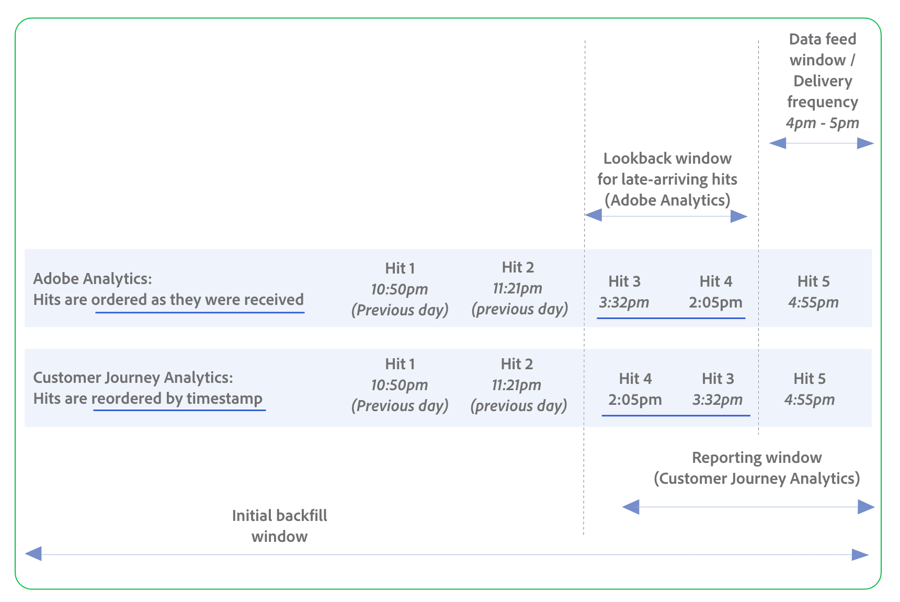

# Customer Journey Analytics 및 Adobe Analytics에서 데이터 피드 비교

Customer Journey Analytics 및 Adobe Analytics의 데이터 피드를 사용하면 원시 데이터를 서드파티 플랫폼으로 내보낼 수 있습니다. 이전에 Adobe Analytics에서 데이터 피드를 사용한 경우 다음 정보를 사용하여 사용 가능한 기능, 데이터 처리 동작 등의 차이점을 이해합니다.

## 데이터 피드 기능 비교

| **구성 옵션 및 개념** | **설명** | **Customer Journey Analytics** | **Adobe Analytics** |
|---------|----------|---------|---------|
| 데이터 입력 | 데이터 피드에 수집 및 포함될 수 있는 데이터 유형입니다. | 웹 데이터, 콜 센터 데이터, 판매 시점 데이터 등을 포함한 크로스 채널 데이터 입력을 지원합니다. | 웹 및 모바일 데이터 입력만 지원합니다. |
| 데이터 처리 | 종종 데이터가 보고에 유용하기 전에 처리되어야 하며, 이 처리는 데이터 피드 기능에 영향을 줍니다. 데이터는 Customer Journey Analytics 또는 Adobe Analytics 사용 여부에 따라 다른 단계에서 처리됩니다. | 데이터는 보고서 시간에 처리되므로 Customer Journey Analytics의 많은 보고 기능을 사용하여 결합, 파생 필드, 데이터 준비, 세그먼테이션 및 보고 기간과 같은 기록 데이터를 변경할 수 있습니다. | 데이터는 수집 시에 처리되므로 처리 규칙, VISTA 규칙, 결합 및 세그먼테이션과 같은 보고 기능은 내역 데이터에 영향을 주지 않습니다. |
| 데이터 피드 창/배달 빈도 | 다음을 결정합니다.<ul><li>데이터 피드가 전송되는 빈도</li><li>데이터 피드에 포함된 시간
즉, 데이터 피드 창이 끝나고 데이터 피드가 전송되면 새 데이터 피드 창이 시작됩니다.
</li></ul>
다음 옵션을 사용할 수 있습니다.
<ul><li>**일별**: 피드에 보고서 세트의 시간대의 자정부터 자정까지 하루 분량의 데이터가 포함됩니다. 채우기 또는 내역 데이터 또는 피드 계속에 대해 이 옵션을 사용합니다.</li><li>**시간별**: 피드에는 1시간 동안의 데이터가 포함됩니다. 피드를 계속하려면 이 옵션을 사용하십시오.</li></ul> | 시간별 및 일별 피드.
데이터 피드 기간은 **[!UICONTROL 보고 기간]**&#x200B;에 포함되어 있습니다.
  
예: 1시간
 | 시간별 및 일별 피드. 또한 15분 피드가 가능하지만 기본적으로 사용할 수 없습니다. 

늦게 도착하는 히트는 **[!UICONTROL 전환 확인 기간]**&#x200B;을 기반으로 구성할 수 있습니다.

예: 1시간
 |
| 늦게 도착하는 히트 포함 | 늦게 도착하는 히트는 현재 데이터 피드 창 동안 도달하지만 이전 데이터 피드 창에 해당하는 타임스탬프가 있는 히트입니다(예: 타임스탬프가 지정된 히트 또는 데이터 소스를 통해). 히트가 늦게 도착하면 타임스탬프가 이전 창에 속하더라도 전송된 다음 데이터 피드 파일로 일괄 처리됩니다. | **[!UICONTROL 보고 기간]** 내에 발생하는 늦게 도착하는 히트는 항상 포함됩니다. 
히트는 출력의 타임스탬프별로 자동으로 재배열됩니다(예: 타임스탬프가 더 이전인 경우 지연 히트가 정시 히트 전에 나타날 수 있음). 변경 피드가 없으므로 원래 값은 유지됩니다. | 늦게 도착하는 히트는 포함하거나 제외할 수 있으며 **[!UICONTROL 늦게 도착하는 히트]** 구성 옵션으로 구성할 수 있습니다.
이러한 히트에 대한 전환 확인 기간은 특정 용도로 사용할 수 있는 **[!UICONTROL 전환 확인 기간]** 구성 옵션을 통해 구성됩니다.

히트는 수신되는 순서대로 표시되며, 타임스탬프에 따라 재정렬되지 않습니다.
 |
| 잘못된 히트 수 | H | 순서가 잘못된 것은 사람당 평가됩니다. CJA은 스트리밍 + 배치 도착 패턴을 수락하고 데이터가 적절한 시간 순서에 도달하면 재주문할 수 있습니다. CJA은 전송하기 전에 보고 기간에 대한 모든 데이터가 있는지 확인하기를 기다리지 않고 시간/일 동안 도착한 것을 전송합니다. 보고 기간에는 타임스탬프가 더 일찍 떨어지는 지연 히트가 포함될 수 있습니다. 
**중요**: 데이터 피드 데이터에 데이터 피드 창 이전의 타임스탬프가 있는 지연 히트가 포함될 수 있으므로 데이터 피드 데이터의 최종 소비자는 순서가 잘못된 타임스탬프를 처리할 수 있어야 합니다.
 | |
| 전환 확인 기간(Adobe Analytics 전용) | 선택한 **[!UICONTROL 배달 빈도]**(예: **[!UICONTROL 시간]** 또는 **[!UICONTROL 일]**) 외부에서 배달되는 지연 또는 순서가 잘못된 히트에 대한 차단입니다. 방문이 포함되려면 이 마감 이후에 시작해야 합니다. 마감 전에 시작되고 전환 확인 기간 내에 끝나는 방문은 포함되지 않습니다.
지속성, 세션 또는 차원에 사용되지 않습니다(수집된 원시 데이터에 포함됨).
 | **[!UICONTROL 보고 기간]**&#x200B;에 포함됩니다. | 지원됨
예: 23시간
 |
| 보고 기간(Customer Journey Analytics 전용) | 다음을 포함하는 시간 창:<ul><li>현재 데이터 피드 창(**[!UICONTROL 배달 빈도]** 필드에서 선택한 가장 최근 시간 또는 일)입니다.</li><li>지연 또는 순서가 잘못된 히트를 허용하는 현재 데이터 피드 창 이전에 지정된 시간입니다.</li></ul> 
세션, 지속성 및 세그먼트에 필요합니다.

차원에 사용되지 않습니다. 차원은 차원의 할당 및 만료에 따라 차원별로 제어됩니다. Dimension 전환 확인은 보고 기간을 초과할 수 없습니다.
 | 지원됨
예: 24시간
 | 해당 사항 없음
&quot;전환 확인 기간&quot; 참조
 |
| 초기 채우기 창 |  | 예: 7일 | 예: 7일 |
| 히트 수 |  | 히트 5만 데이터 피드 창에 있습니다. 하지만 보고 기간에는 히트 4 및 히트 3(이전 데이터 피드 기간의 타임스탬프와 함께 늦게 도착하는 히트)도 포함되므로, 이 보고서 기간도 현재 데이터 피드 기간에 포함됩니다.
히트는 타임스탬프에 따라 데이터 피드에서 재배열됩니다(히트 3, 히트 4, 히트 5).
 | 히트 5만 데이터 피드 창에 있습니다. 그러나 전환 확인이 구성되어 있고 여기에는 히트 4 및 히트 3(이전 데이터 피드 창의 타임스탬프가 있는 늦게 도착하는 히트)이 포함되므로, 이 역시 현재 데이터 피드 창에 포함됩니다. (전환 확인이 구성되지 않은 경우 히트 5만 데이터 피드에 포함됩니다.) 
히트는 다음과 같이 수신된 순서로 데이터 피드에 표시됩니다. 히트 4, 히트 3, 히트 5.
 |
| 늦게 도착하는 히트/순서가 잘못된 히트 | (AA에서: 데이터 순서가 잘못되었다는 것은 방문자당 순서가 잘못되었음을 의미합니다. CJA에서: 1인당 순서가 잘못되었음을 의미합니다. 개인당 순서가 잘못된 데이터를 보내는 경우 타임스탬프를 설정하는 경우 가 됩니다. 타임스탬프는 두 가지 방법으로 설정할 수 있습니다. Adobe에서 데이터를 받은 시점을 기준으로 타임스탬프를 설정하도록 할 수 있습니다. 아니면 직접 설정할 수도 있습니다. 타임스탬프를 설정하고 잘못된 데이터를 보내면 AA에서 문제가 발생합니다. AA에서는 방문자별로 데이터가 순서대로 와야 합니다. 우리는 올바른 사건 순서가 필요하다. 하지만 CJA에서는 데이터에 대한 타임스탬프가 무엇이든 상관없습니다. CJA은 히트에 타임스탬프를 할당하지 않습니다. 그것은 업스트림에서 행해진다. CJA은 데이터가 도착하면 데이터 순서를 재지정하므로 모든 데이터가 적절한 시간 순서에 놓이게 됩니다. 그러면 보고서 처리 시간을 맞출 수 있습니다. 즉, 스트리밍 데이터와 배치 데이터를 모두 가질 수 있습니다. 상관없어요. 그것이 도착할 때 우리는 그것을 재정렬하고 그 결과 그것은 한 사람당 질서가 됩니다. CJA에서는 지난 하루 또는 시간 동안 받은 모든 데이터를 제공하지만, 보고 기간이 시작되는 것으로 제한됩니다. 대개 하루 또는 한 시간 내에 얻은 엄청난 양의 데이터가 해당 날짜 또는 시간에 속합니다. 콜센터에서 가져온 일괄 데이터만 사용했다면 그렇게 됩니다. CJA에서는 데이터가 유입될 수 있으며 언제 유입되었는지는 중요하지 않습니다. 따라서 데이터 피드 고객은 측면에서 이를 처리할 수 있어야 합니다. 따라서 데이터를 어디에 두든, 타임스탬프가 모든 곳에 있을 수 있다는 사실을 처리해야 합니다. 일부 고객은 이 문제를 해결해야 할 수도 있습니다. 그들은 이것을 알아야 합니다. 개인당 잘못된 데이터를 처리할 수 있어야 합니다. 사람들 사이에서는 상관없어요. ) 이전 데이터 피드에 포함되어야 하지만 어떤 이유로든 늦게 도착한 히트(예: 타임스탬프가 지정된 히트 또는 데이터 소스)입니다. 
타임스탬프가 이전 데이터 피드 창 내에 있더라도 이러한 늦게 도착하는 히트는 도착하는 시점의 현재 데이터 피드에 포함됩니다. 데이터 피드는 데이터를 처리할 때마다 도착한 모든 히트를 조회하고 전송된 다음 데이터 피드 파일에 데이터를 배치합니다.
 | **[!UICONTROL 보고 기간]** 내에 발생하는 늦게 도착하는 히트는 항상 포함됩니다. 
이러한 늦게 도착하는 히트에 대한 전환 확인 기간은 **[!UICONTROL 보고 기간]** 구성 옵션을 통해 제어됩니다.

히트는 타임스탬프를 기반으로 자동으로 재정렬되며 원래 값은 유지됩니다(변경 피드 없음).
 | 포함하거나 제외할 수 있습니다. **[!UICONTROL 늦게 도착하는 히트]** 구성 옵션을 사용하여 구성할 수 있습니다.
이러한 히트에 대한 전환 확인 기간은 특정 용도로 사용할 수 있는 **[!UICONTROL 전환 확인 기간]** 구성 옵션을 통해 구성됩니다.

히트는 수신되는 순서대로 표시되며, 타임스탬프에 따라 재정렬되지 않습니다.
 |
| 세그먼테이션 |   | Customer Journey Analytics에서 구성하는 세그먼트는 데이터 피드 또는 데이터 보기에 적용할 수 있습니다.
(개인, 세션, 이벤트) 개인 컨테이너는 전체 보고 기간을 사용하며, 세그먼트 논리에 따라 DF 히트 출력을 확장할 수 있습니다.
 | 세그먼트를 적용할 수 없습니다. |
| 결합 | (대신 데이터 처리 섹션에 포함될 수 있음) | 결합은 여러 데이터 세트를 결합 (크로스 채널 분석을 지원)하는 데 사용할 수 있습니다. | 결합은 지원되지 않습니다. |
| 스키마 | (대신 데이터 처리 섹션에 포함될 수 있음) | 단일 열(배열, 배열 내 배열) 내에 여러 차원 및 지표를 포함할 수 있는 구조화된 계층형 필드를 사용합니다. | 전용, 세미콜론으로 구분된 긴 필드가 포함된 제품 목록을 사용합니다. |
| 조회 | (대신 데이터 처리 섹션에 포함될 수 있음)동적 조회를 사용하면 데이터 피드에서 추가 조회 파일을 받을 수 있습니다. 그렇지 않으면 사용할 수 없습니다. | 브라우저 차원은 데이터 보기에 포함되므로 필요하지 않습니다. AA와 동일한 항목을 포함하지만 분류, 조회 데이터 세트를 포함하는 더 광범위한 용어입니다. 원하는 조회 데이터 세트를 만들어 CJA에 적용할 수 있습니다. 그리고 별도의 파일은 얻지 않습니다. 치수로 노출됩니다. 조회 파일은 추가하지 않고 사용할 차원만 선택할 수 있습니다. | 데이터 피드 열의 숫자를 실제 값과 일치시키는 데 사용됩니다. 특정 항목 집합(브라우저, OS, 모바일 장치)에만 해당되며, 데이터 피드와 함께 제공되는 별도의 파일로 적용됩니다. |
| 세션 정의 | (대신 데이터 처리 섹션에 포함될 수 있음) 데이터 피드의 구성 옵션이 아닙니다. 하지만 데이터 보기에서 정의합니다. | 데이터 보기에 정의됨 | 컬렉션 시간에 정의됩니다. |
| 계산된 지표 |   | 사용할 수 없음 | 사용할 수 없음 |
| DF 출력의 보고 기간 범위 - 늦게 도착하는 히트 섹션과 병합 | CJA에서는 데이터 피드를 보내기 전에 보고 기간 동안 모든 데이터를 받았는지 추적하지 않습니다. 데이터를 기다리지 않고 시간/일이 끝날 때까지 기다린 다음 해당 기간 동안 전송된 모든 데이터(늦게 도착하는 조회수 포함)를 가져옵니다.  AA에서는 들어오는 모든 데이터를 추적한 다음 데이터가 모두 있다는 것을 알게 되면 전송합니다. 계속 추적하기 때문에 늦게 도착하는 히트를 포함하거나 제외할 수 있는 옵션을 고객에게 제공할 수 있습니다. | 세션/세그먼트 로직이 더 넓은 기간을 검사할 수 있더라도 DF는 보고 기간의 일부(현재 기간만)만 출력합니다. | 전체 DF 출력은 고정된 창(시간/일/15분)으로 제한됩니다. |
| 지속성 모델 | (대신 데이터 처리 섹션에 포함될 수 있음) | 데이터 보기(차원 할당에 대해 설명하는 페이지에 연결된 링크)에서 사용할 수 있는 모든 차원 할당 설정을 지원합니다. 원본, 가장 최근, 모두, 처음 알려짐, 마지막 알려짐, b2b). 유연성, 보고 기간 평가를 기반으로 함. | 마지막 터치(가장 최근)와 첫 번째 터치(원본)만 사용할 수 있습니다. |
| 출력 파일 형식 | 데이터 피드 데이터가 전송되는 형식입니다. | Parquet(구조화된 필드를 지원하며 최신 데이터 웨어하우스에서 사용) | C3 |
| 게재 대상 | 데이터 피드 데이터를 전송할 수 있는 대상입니다. | Amazon S3, Azure RBAC, Azure SAS 및 Google Cloud Platform을 비롯한 클라우드 대상. | Amazon S3, Azure RBAC, Azure SAS 및 Google Cloud Platform을 비롯한 클라우드 대상.
SFTP도 지원합니다.
 |

AA 측의 다이어그램은 방문자별로 순서대로 수신되어야 함을 보여 주어야 합니다.

