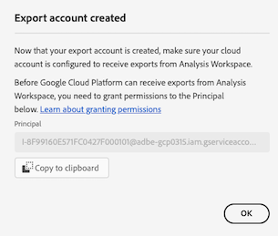

# 클라우드 내보내기 계정 구성

Customer Journey Analytics 보고서를 클라우드 대상으로 내보내기([Customer Journey Analytics 보고서를 클라우드로 내보내기](/help/analysis-workspace/export/export-cloud.md)에 설명된 대로 Analysis Workspace에서 또는 [Report Builder에서 보고서 내보내기](/help/report-builder/report-builder-export.md)에 설명된 대로 Report Builder에서)하려면 데이터를 보낼 대상을 추가하고 구성해야 합니다.

이 프로세스는 이 문서에 설명된 대로 계정을 추가 및 구성(예: Amazon S3, Google Cloud Platform 등)한 다음 [클라우드 내보내기 위치 구성](/help/components/exports/cloud-export-locations.md)에 설명된 대로 해당 계정 내에서 위치(예: 계정 내 폴더)를 추가 및 구성하는 과정으로 구성됩니다.

계정 보기, 편집 및 삭제를 포함하여 기존 계정을 관리하는 방법에 대한 자세한 내용은 [클라우드 내보내기 위치 및 계정 관리](/help/components/exports/manage-export-locations.md)를 참조하십시오.

## 클라우드 내보내기 계정 만들기 시작

1. 클라우드로 보고서를 내보내려면 [최소 요구 사항](/help/analysis-workspace/export/export-cloud.md#minimum-requirements)을(를) 충족해야 합니다.
1. Customer Journey Analytics에서 [!UICONTROL **구성 요소**] > [!UICONTROL **내보내기**]&#x200B;를 선택합니다.
1. [!UICONTROL 내보내기] 페이지에서 [!UICONTROL **위치 계정**] 탭을 선택합니다.

   

1. [!UICONTROL **계정 추가**]&#x200B;를 선택합니다.

   계정 추가 대화 상자가 표시됩니다.

1. [!UICONTROL **위치 계정 이름**] 필드에 위치 계정의 이름을 지정하십시오. 이 이름은 위치를 만들 때 나타납니다.

1. [!UICONTROL **위치 계정 설명**] 필드에 같은 계정 유형의 다른 계정과 구별할 수 있도록 계정에 대한 간단한 설명을 입력합니다.

1. 조직의 다른 사용자가 계정을 사용할 수 있도록 하려면 [!UICONTROL **조직의 모든 사용자가 사용할 수 있는 계정을 만듭니다**] 옵션을 사용하도록 설정합니다.

   계정을 공유할 때는 다음 사항을 고려하십시오.

   * 공유하는 계정은 공유 해제할 수 없습니다.

   * 공유 계정은 계정 소유자만 편집할 수 있습니다.

   * 누구나 공유 계정의 위치를 만들 수 있습니다.

1. [!UICONTROL **계정 유형**] 필드에서 내보내는 클라우드 계정 유형을 선택합니다. 사용 가능한 계정 유형은 Amazon S3 Role ARN, Google Cloud Platform, Azure SAS, Azure RBAC, Snowflake, AEP 데이터 랜딩 존입니다.

1. 선택한 [!UICONTROL **계정 유형**]&#x200B;에 해당하는 아래 섹션을 계속 진행합니다.

   * [AEP 데이터 랜딩 구역](#aep-data-landing-zone)

   * [Amazon S3 Role ARN](#amazon-s3-role-arn)

   * [Google Cloud 플랫폼](#google-cloud-platform)

   * [Azure SAS](#azure-sas)

   * [Azure RBAC](#azure-rbac)

   * [Snowflake](#snowflake)

### AEP 데이터 랜딩 구역

>[!IMPORTANT]
>
>내보내기 계정에 AEP 데이터 랜딩 영역 을 사용할 때 다음 사항을 고려하십시오.
>
> * Customer Journey Analytics 보고서를 Adobe Experience Platform 데이터 랜딩 구역으로 내보낼 때 7일 이내에 데이터를 다운로드해야 하고 AEP 데이터 랜딩 구역에서 삭제해야 합니다. 7일 후에는 AEP 데이터 랜딩 영역에서 데이터가 자동으로 삭제됩니다.
> * AEP 데이터 랜딩 구역은 Azure 또는 AWS 스토리지를 사용합니다. 조직에서 Azure를 사용하도록 구성된 로그인 회사를 사용하는 경우 AEP 데이터 랜딩 구역은 Azure를 사용합니다. 로그인 회사가 AWS을 사용하도록 구성된 경우 AEP 데이터 랜딩 구역은 AWS을 사용합니다.
>

1. 다음 방법 중 하나로 클라우드 내보내기 계정을 만들기 시작합니다.

   * 위에서 설명한 대로 내보내기 페이지에서 [클라우드 내보내기 계정 만들기를 시작합니다](#begin-creating-a-cloud-export-account)

   * [Analysis Workspace에서 전체 테이블을 내보낼 때](/help/analysis-workspace/export/export-cloud.md#export-full-tables-from-analysis-workspace)

1. **[!UICONTROL 계정 유형]** 필드에서 **[!UICONTROL AEP 데이터 랜딩 영역]**&#x200B;을 선택한 후 [!UICONTROL **저장**]&#x200B;을 선택합니다.

   AEP 데이터 랜딩 영역 이 Azure 또는 AWS 스토리지를 사용하도록 구성되어 있는지 여부에 따라 다음 대화 상자 중 하나가 표시됩니다.

   * **Azure 저장소:**

     [!UICONTROL **만들어진 계정 내보내기**] 대화 상자가 표시됩니다.

     

   * **AWS 저장소:**

     >[!AVAILABILITY]
     >
     >이 섹션은 Amazon Web Services(AWS)에서 실행되는 Experience Platform 구현에 적용됩니다. AWS에서 실행되는 Experience Platform은 현재 제한된 수의 고객에게만 제공됩니다. 지원되는 Experience Platform 인프라에 대해 자세히 알아보려면 [Experience Platform 멀티 클라우드 개요](https://experienceleague.adobe.com/ko/docs/experience-platform/landing/multi-cloud)를 참조하십시오.

     [!UICONTROL **계정 만들기**] 대화 상자가 표시됩니다.

     

1. (조건부) Azure 스토리지를 사용하는 경우:

   1. [!UICONTROL **SAS URI**] 필드의 내용을 클립보드에 복사합니다. 이 SAS URI를 사용하여 AEP 데이터 랜딩 영역에서 Analysis Workspace에서 내보낸 데이터에 액세스합니다.

      이 필드가 비어 있는 경우 Adobe Experience Platform에 액세스할 수 있는 권한이 부여되어야 합니다.

   1. Adobe Experience Platform에서 복사한 SAS URI를 사용하도록 데이터 랜딩 영역 컨테이너를 구성합니다.

      >[!NOTE]
      >
      >Azure를 기반으로 하는 AEP 데이터 랜딩 영역 계정을 사용하는 경우, AEP 데이터 랜딩 영역으로 내보내는 보고서에 액세스하는 가장 쉬운 방법은 Azure Storage Explorer를 사용하는 것입니다. 다음 단계에서는 이 메서드를 사용합니다.

      1. 아직 다운로드하지 않았다면 [Microsoft Azure 저장소 탐색기](https://azure.microsoft.com/en-us/products/storage/storage-explorer/)를 다운로드하십시오.

      1. Adobe Experience Platform 설명서에서 [데이터 랜딩 영역 컨테이너를 Azure Storage Explorer에 연결](https://experienceleague.adobe.com/docs/experience-platform/destinations/catalog/cloud-storage/data-landing-zone.html?lang=ko#connect-your-data-landing-zone-container-to-azure-storage-explorer)에 설명된 단계를 수행합니다.

         복사한 URI에 이러한 자격 증명이 포함되어 있으므로 [데이터 랜딩 영역에 대한 자격 증명 검색](https://experienceleague.adobe.com/docs/experience-platform/destinations/catalog/cloud-storage/data-landing-zone.html?lang=ko#retrieve-dlz-credentials) 및 [데이터 랜딩 영역 자격 증명 업데이트](https://experienceleague.adobe.com/docs/experience-platform/destinations/catalog/cloud-storage/data-landing-zone.html?lang=ko#update-dlz-credentials) 섹션에 설명된 작업을 건너뛸 수 있습니다.

      1. Adobe Experience Platform 설명서를 따라 [!UICONTROL **Blob 컨테이너 SAS URL**] 필드가 나타나면 3단계에서 복사한 SAS URI를 붙여넣습니다.

         >[!NOTE]
         >
         >SAS URI가 생성된 후 7일 후에 만료되므로 이 작업은 7일마다 수행해야 합니다. 이 프로세스를 자동화하는 스크립트를 만들 수 있습니다.

         

   1. [!UICONTROL **다음**] > [!UICONTROL **연결**]&#x200B;을 선택합니다.

   1. Customer Journey Analytics의 [!UICONTROL **만들어진 계정 내보내기**] 대화 상자에서 [!UICONTROL **확인**]&#x200B;을 선택합니다.

      

1. (조건부) AWS 저장소를 사용하는 경우:

   1. 다음 필드의 내용을 클립보드에 복사합니다(이 정보를 사용하여 AEP 데이터 랜딩 구역에서 Analysis Workspace에서 내보낸 데이터에 액세스).

      * [!UICONTROL **액세스 키 ID**]

      * **[!UICONTROL 비밀 액세스 키]**

      * **[!UICONTROL 세션 토큰]**

      * **[!UICONTROL 버킷 이름]**

      * **[!UICONTROL DLZ 폴더]**

      

   1. [!UICONTROL **확인**]&#x200B;을 선택합니다.

1. [클라우드 내보내기 위치 구성](/help/components/exports/cloud-export-locations.md)을 계속합니다.

### Amazon S3 Role ARN

1. 다음 방법 중 하나로 클라우드 내보내기 계정을 만들기 시작합니다.

   * 위에서 설명한 대로 내보내기 페이지에서 [클라우드 내보내기 계정 만들기를 시작합니다](#begin-creating-a-cloud-export-account)

   * [Analysis Workspace에서 전체 테이블을 내보낼 때](/help/analysis-workspace/export/export-cloud.md#export-full-tables-from-analysis-workspace)

1. [!UICONTROL **계정 추가**] 대화 상자의 [!UICONTROL **계정 속성**] 섹션에서 다음 정보를 지정하십시오.

   | 필드 | 함수 |
   |---------|----------|
   | [!UICONTROL **Role ARN**] | Adobe가 Amazon S3 계정에 액세스하는 데 사용할 수 있는 Role ARN(Amazon 리소스 이름)을 제공해야 합니다. 이렇게 하려면 소스 계정에 대한 권한 정책을 만들고 해당 정책을 사용자에게 첨부한 다음 대상 계정에 대한 역할을 생성합니다. 자세한 내용은 [이 AWS 설명서](https://aws.amazon.com/premiumsupport/knowledge-center/cross-account-access-iam/)를 참조하십시오. |

   {style="table-layout:auto"}

1. [!UICONTROL **저장**]&#x200B;을 선택합니다.

   [!UICONTROL **만들어진 계정 내보내기**] 대화 상자가 표시됩니다.

   

1. [!UICONTROL **사용자 ARN**] 필드의 내용을 클립보드에 복사합니다. 사용자 ARN(Amazon 리소스 이름)은 Adobe에서 제공합니다. Amazon S3 역할 ARN에서 생성한 정책에 이 사용자를 연결해야 합니다.

1. [!UICONTROL **확인**]&#x200B;을 선택합니다.

1. [클라우드 내보내기 위치 구성](/help/components/exports/cloud-export-locations.md)을 계속합니다.

### Google Cloud Platform

1. 다음 방법 중 하나로 클라우드 내보내기 계정을 만들기 시작합니다.

   * 위에서 설명한 대로 내보내기 페이지에서 [클라우드 내보내기 계정 만들기를 시작합니다](#begin-creating-a-cloud-export-account)

   * [Analysis Workspace에서 전체 테이블을 내보낼 때](/help/analysis-workspace/export/export-cloud.md#export-full-tables-from-analysis-workspace)

1. [!UICONTROL **계정 추가**] 대화 상자의 [!UICONTROL **계정 속성**] 섹션에서 다음 정보를 지정하십시오.

   | 필드 | 함수 |
   |---------|----------|
   | [!UICONTROL **프로젝트 ID**] | Google Cloud 계정에서 복사하는 Google Cloud 프로젝트 ID입니다. [프로젝트 ID 가져오기에 대한 Google Cloud 설명서](https://cloud.google.com/resource-manager/docs/creating-managing-projects#identifying_projects)를 참조하십시오. |

   {style="table-layout:auto"}

1. [!UICONTROL **저장**]&#x200B;을 선택합니다.

   [!UICONTROL **만들어진 계정 내보내기**] 대화 상자가 표시됩니다.

   

1. [!UICONTROL **Principal**] 필드의 내용을 클립보드에 복사한 다음 Google Cloud Platform의 이 버킷에 파일을 업로드할 수 있는 권한을 Principal에게 부여하는지 확인하십시오. <!-- add link to Google Cloud docs on how to do this -->

1. [!UICONTROL **확인**]&#x200B;을 선택합니다.

1. [클라우드 내보내기 위치 구성](/help/components/exports/cloud-export-locations.md)을 계속합니다.

### Azure SAS

1. 다음 방법 중 하나로 클라우드 내보내기 계정을 만들기 시작합니다.

   * 위에서 설명한 대로 내보내기 페이지에서 [클라우드 내보내기 계정 만들기를 시작합니다](#begin-creating-a-cloud-export-account)

   * [Analysis Workspace에서 전체 테이블을 내보낼 때](/help/analysis-workspace/export/export-cloud.md#export-full-tables-from-analysis-workspace)

1. [!UICONTROL **계정 추가**] 대화 상자의 [!UICONTROL **계정 속성**] 섹션에서 다음 정보를 지정하십시오.

   | 필드 | 함수 |
   |---------|----------|
   | [!UICONTROL **애플리케이션 ID**] | 만든 Azure 애플리케이션에서 이 ID를 복사합니다. 이 정보는 Microsoft Azure의 애플리케이션 내부 **개요** 탭에 있습니다. 자세한 내용은 [Microsoft ID 플랫폼으로 애플리케이션을 등록하는 방법에 대한 Microsoft Azure 설명서](https://learn.microsoft.com/en-us/azure/active-directory/develop/quickstart-register-app)를 참조하십시오. |
   | [!UICONTROL **테넌트 ID**] | 만든 Azure 애플리케이션에서 이 ID를 복사합니다. 이 정보는 Microsoft Azure의 애플리케이션 내부 **개요** 탭에 있습니다. 자세한 내용은 [Microsoft ID 플랫폼으로 애플리케이션을 등록하는 방법에 대한 Microsoft Azure 설명서](https://learn.microsoft.com/en-us/azure/active-directory/develop/quickstart-register-app)를 참조하십시오. |
   | [!UICONTROL **키 자격 증명 모음 URI**] | <p>Azure Key Vault의 SAS URI에 대한 경로입니다.  Azure SAS를 구성하려면 Azure Key Vault를 사용하여 SAS URI를 암호로 저장해야 합니다. 자세한 내용은 [Azure Key Vault에서 암호를 설정 및 검색하는 방법에 대한 Microsoft Azure 설명서](https://learn.microsoft.com/en-us/azure/key-vault/secrets/quick-create-portal?source=recommendations)를 참조하십시오.</p><p>키 자격 증명 모음 URI이 생성되면<ul><li>만든 Azure 애플리케이션에 대한 권한을 부여하려면 Key Vault에서 액세스 정책을 추가합니다.<p><p>자세한 내용은 [Azure 키 액세스 정책을 할당하는 방법에 대한 Microsoft Azure 설명서](https://learn.microsoft.com/en-us/azure/key-vault/general/assign-access-policy?tabs=azure-portal)를 참조하십시오.</p>또는</p><p>액세스 정책을 만들지 않고 직접 액세스 역할을 부여하려면 Azure 포털을 사용하여 Azure 역할을 할당하는 방법에 대한 [Microsoft Azure 설명서](https://learn.microsoft.com/en-us/azure/role-based-access-control/role-assignments-portal)를 참조하세요. 애플리케이션 ID에 대한 역할 할당이 추가되어 주요 자격 증명 모음 URI에 액세스합니다. </p></li><li>키 자격 증명 모음 UR에 액세스하려면 `Key Vault Certificate User` 기본 제공 역할에 애플리케이션 ID가 부여되었는지 확인합니다.</br><p>자세한 내용은 [Azure 기본 제공 역할](https://learn.microsoft.com/en-us/azure/role-based-access-control/built-in-roles)을 참조하십시오.</p></li></ul> |
   | [!UICONTROL **키 자격 증명 모음 암호 이름**] | Azure Key Vault에 암호를 추가할 때 만든 암호 이름입니다. 이 정보는 Microsoft Azure의 **Key Vault** 설정 페이지에서 만든 Key Vault에 있습니다. 자세한 내용은 [Azure Key Vault에서 암호를 설정 및 검색하는 방법에 대한 Microsoft Azure 설명서](https://learn.microsoft.com/en-us/azure/key-vault/secrets/quick-create-portal?source=recommendations)를 참조하십시오. |
   | [!UICONTROL **위치 계정 암호**] | 만든 Azure 애플리케이션에서 암호를 복사합니다. 이 정보는 Microsoft Azure의 애플리케이션 내부 **인증서 및 암호** 애플리케이션 탭에 있습니다. 자세한 내용은 [Microsoft ID 플랫폼을 사용하여 응용 프로그램을 등록하는 방법에 대한 Microsoft Azure 설명서](https://learn.microsoft.com/en-us/azure/active-directory/develop/quickstart-register-app)를 참조하세요. <!-- need to grant permission to the bucket. Jun will send info on where that is documented) --> |

   {style="table-layout:auto"}

1. [!UICONTROL **저장**]&#x200B;을 선택합니다.

   [!UICONTROL **만들어진 계정 내보내기**] 대화 상자가 표시됩니다.

   

1. 아직 권한이 없는 경우 Azure SAS의 버킷에 권한을 부여했는지 확인하십시오. <!-- add link to Google Cloud docs on how to do this -->

1. [!UICONTROL **확인**]&#x200B;을 선택합니다.

1. [클라우드 내보내기 위치 구성](/help/components/exports/cloud-export-locations.md)을 계속합니다.

### Azure RBAC

1. 다음 방법 중 하나로 클라우드 내보내기 계정을 만들기 시작합니다.

   * 위에서 설명한 대로 내보내기 페이지에서 [클라우드 내보내기 계정 만들기를 시작합니다](#begin-creating-a-cloud-export-account)

   * [Analysis Workspace에서 전체 테이블을 내보낼 때](/help/analysis-workspace/export/export-cloud.md#export-full-tables-from-analysis-workspace)

1. [!UICONTROL **계정 추가**] 대화 상자의 [!UICONTROL **계정 속성**] 섹션에서 다음 정보를 지정하십시오.

   | 필드 | 함수 |
   |---------|----------|
   | [!UICONTROL **애플리케이션 ID**] | 만든 Azure 애플리케이션에서 이 ID를 복사합니다. 이 정보는 Microsoft Azure의 애플리케이션 내부 **개요** 탭에 있습니다. 자세한 내용은 [Microsoft ID 플랫폼으로 애플리케이션을 등록하는 방법에 대한 Microsoft Azure 설명서](https://learn.microsoft.com/en-us/azure/active-directory/develop/quickstart-register-app)를 참조하십시오. |
   | [!UICONTROL **테넌트 ID**] | 만든 Azure 애플리케이션에서 이 ID를 복사합니다. 이 정보는 Microsoft Azure의 애플리케이션 내부 **개요** 탭에 있습니다. 자세한 내용은 [Microsoft ID 플랫폼으로 애플리케이션을 등록하는 방법에 대한 Microsoft Azure 설명서](https://learn.microsoft.com/en-us/azure/active-directory/develop/quickstart-register-app)를 참조하십시오. |
   | [!UICONTROL **위치 계정 암호**] | 만든 Azure 애플리케이션에서 암호를 복사합니다. 이 정보는 Microsoft Azure의 애플리케이션 내부 **인증서 및 암호** 애플리케이션 탭에 있습니다. 자세한 내용은 [Microsoft ID 플랫폼으로 애플리케이션을 등록하는 방법에 대한 Microsoft Azure 설명서](https://learn.microsoft.com/en-us/azure/active-directory/develop/quickstart-register-app)를 참조하십시오. |

   {style="table-layout:auto"}

1. [!UICONTROL **저장**]&#x200B;을 선택합니다.

   [!UICONTROL **만들어진 계정 내보내기**] 대화 상자가 표시됩니다.

   

1. 아직 권한이 없는 경우 Azure RBAC의 버킷에 권한을 부여했는지 확인하십시오. <!-- add link to Google Cloud docs on how to do this -->

1. [!UICONTROL **확인**]&#x200B;을 선택합니다.

1. [클라우드 내보내기 위치 구성](/help/components/exports/cloud-export-locations.md)을 계속합니다.

### Snowflake

1. 다음 방법 중 하나로 클라우드 내보내기 계정을 만들기 시작합니다.

   * 위에서 설명한 대로 내보내기 페이지에서 [클라우드 내보내기 계정 만들기를 시작합니다](#begin-creating-a-cloud-export-account)

   * [Analysis Workspace에서 전체 테이블을 내보낼 때](/help/analysis-workspace/export/export-cloud.md#export-full-tables-from-analysis-workspace)

1. [!UICONTROL **계정 추가**] 대화 상자의 [!UICONTROL **계정 속성**] 섹션에서 다음 정보를 지정하십시오.

   | 필드 | 함수 |
   |---------|----------|
   | [!UICONTROL **계정 식별자**] | 조직 내뿐만 아니라 Snowflake에서 지원하는 클라우드 플랫폼 및 클라우드 지역의 글로벌 네트워크 전체에서 Snowflake 계정을 고유하게 식별합니다. <p>Snowflake 계정에서 계정 식별자를 가져온 다음 여기에 정보를 붙여넣어야 합니다.</p><p>이 정보를 얻을 수 있는 위치를 알아보려면 Snowflake 설명서의 [계정 식별자 페이지](https://docs.snowflake.com/en/user-guide/admin-account-identifier)를 참조하세요.</p> |
   | [!UICONTROL **사용자**] | 연결에 사용할 사용자의 로그인 이름입니다. Adobe에 특별히 사용할 새 사용자를 만드는 것이 좋습니다. 여기에서 이름을 지정한 다음 동일한 이름으로 Snowflake에서 사용자를 만듭니다. `CREATE USER` 명령을 사용하여 Snowflake에서 사용자를 만들 수 있습니다.  <p>자세한 내용은 [사용자, 역할 및 권한 명령](https://docs.snowflake.com/en/sql-reference/commands-user-role)을 참조하세요.</p> |
   | [!UICONTROL **역할**] | 사용자에게 할당될 역할입니다. Adobe에 특별히 사용할 새 역할을 만드는 것이 좋습니다. 여기에서 역할을 지정한 다음, Snowflake에서 동일한 이름으로 역할을 만들고 사용자에게 역할을 부여합니다. `CREATE ROLE` 명령을 사용하여 Snowflake에서 역할을 만들 수 있습니다. <p>자세한 내용은 [사용자, 역할 및 권한 명령](https://docs.snowflake.com/en/sql-reference/commands-user-role)을 참조하세요.</p> |

   {style="table-layout:auto"}

1. [!UICONTROL **저장**]&#x200B;을 선택합니다.

   [!UICONTROL **만들어진 계정 내보내기**] 대화 상자가 표시됩니다.

   

1. [!UICONTROL **공개 키**] 필드의 내용을 클립보드에 복사합니다. 공개 키는 Adobe에서 제공합니다.

   Snowflake의 공개 키를 사용하여 Snowflake 계정에 연결합니다. 만든 사용자를 이 공개 키와 연결해야 합니다.

   예를 들어 Snowflake에서 다음 명령을 지정합니다.

   ```
   CREATE USER <your_adobe_user> RSA_PUBLIC_KEY = '<your_public_key>';
   ```

   자세한 내용은 Snowflake 설명서의 [키 쌍 인증 및 키 쌍 회전 페이지](https://docs.snowflake.com/en/user-guide/key-pair-auth)를 참조하십시오.

1. [!UICONTROL **확인**]&#x200B;을 선택합니다.

1. [클라우드 내보내기 위치 구성](/help/components/exports/cloud-export-locations.md)을 계속합니다.
