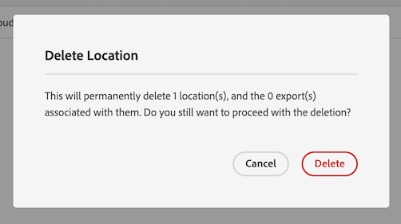
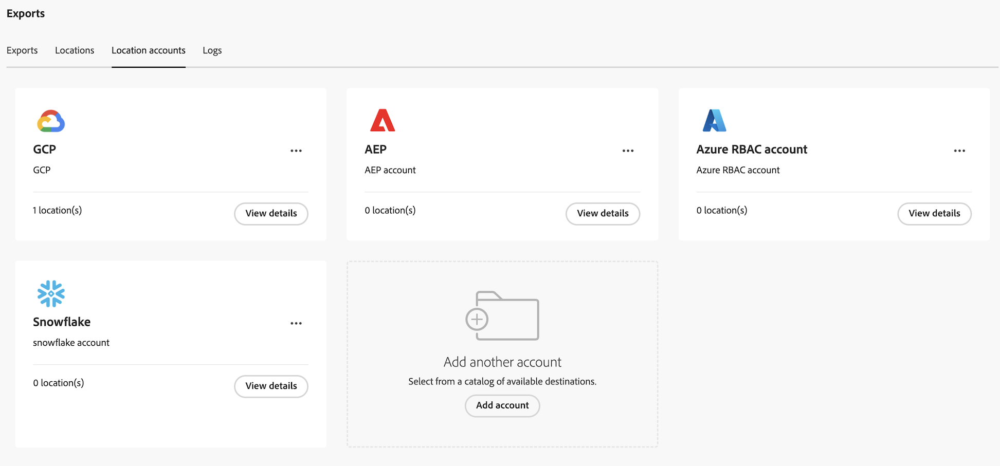

# 클라우드 내보내기 위치 및 계정 관리

클라우드 내보내기 위치를 보고, 편집하고, 삭제할 수 있습니다.

새 위치를 만드는 방법에 대한 자세한 내용은 [클라우드 내보내기 위치 구성](/help/components/exports/cloud-export-locations.md).

## 위치 필터링 및 검색

필요한 정보를 찾으려면 위치 목록을 필터링하거나 위치를 검색할 수 있습니다.

### 위치 목록 필터링

1. Customer Journey Analytics에서 [!UICONTROL **구성 요소**] > [!UICONTROL **내보내기**].

1. 다음 항목 선택 [!UICONTROL **위치**] 탭.

1. 다음 항목 선택 **필터** 아이콘.

   <!-- add screenshot -->

   다음 기준으로 필터링할 수 있습니다.

   | 필터 | 설명 |
   |---------|----------|
   | [!UICONTROL **위치 유형**]<!--should this be changed to Account type?--> | 위치가 연결된 계정 유형입니다. 다음 계정 유형을 사용할 수 있습니다. <ul><li>[!UICONTROL **AEP 데이터 랜딩 영역**]</li><li>[!UICONTROL **Amazon S3 역할 ARN**]</li><li>[!UICONTROL **Azure SAS**]</li><li>[!UICONTROL **Azure RBAC**]</li><li>[!UICONTROL **Google 클라우드 플랫폼**]</li><li>[!UICONTROL **Snowflake**]</li></ul> |
   | [!UICONTROL **계정**] | 위치가 연결된 계정의 이름입니다. |
   | [!UICONTROL **작성자**] | 위치를 만든 사용자의 이메일 주소입니다. |

   {style="table-layout:auto"}

### 위치 검색

1. Customer Journey Analytics에서 [!UICONTROL **구성 요소**] > [!UICONTROL **내보내기**].

1. 다음 항목 선택 [!UICONTROL **위치**] 탭.

1. (조건부) 시스템 관리자인 경우 [!UICONTROL **모든 사용자의 위치 보기**] 조직의 모든 사용자가 만든 위치를 보는 옵션입니다.

1. 검색 필드에 검색 중인 위치와 관련된 정보를 입력합니다. 테이블에서 사용할 수 있는 열에서 데이터를 검색할 수 있습니다.

## 위치 편집

1. Customer Journey Analytics에서 [!UICONTROL **구성 요소**] > [!UICONTROL **내보내기**].

1. 다음 항목 선택 [!UICONTROL **위치**] 탭.

1. (조건부) 시스템 관리자인 경우 [!UICONTROL **모든 사용자의 위치 보기**] 조직의 모든 사용자가 만든 위치를 보는 옵션입니다.

1. 편집할 위치를 선택합니다.

   

1. 선택 [!UICONTROL **편집**].

1. 원하는 대로 변경한 다음, [!UICONTROL **저장**].

## 위치 삭제

위치를 삭제하면 해당 위치를 사용하는 내보내기도 모두 삭제됩니다. 삭제할 때 확인 대화 상자를 선택하여 위치와 연결된 내보내기가 없는지 확인합니다.

위치를 삭제하려면:

1. Customer Journey Analytics에서 [!UICONTROL **구성 요소**] > [!UICONTROL **내보내기**].

1. 다음 항목 선택 [!UICONTROL **위치**] 탭.

1. (조건부) 시스템 관리자인 경우 [!UICONTROL **모든 사용자의 위치 보기**] 조직의 모든 사용자가 만든 위치를 보는 옵션입니다.

1. 삭제할 위치를 하나 이상 선택합니다.

   

1. [!UICONTROL **삭제**]&#x200B;를 선택합니다.

   위치 삭제 대화 상자가 표시됩니다.

1. 위치 삭제 대화 상자에서 삭제를 확인하기 전에 위치가 내보내기와 연결되어 있지 않은지 확인합니다.

   

1. 선택 [!UICONTROL **삭제**] 다시 한 번 확인해 보십시오.

## 계정 편집

1. Customer Journey Analytics에서 [!UICONTROL **구성 요소**] > [!UICONTROL **내보내기**].

1. 다음 항목 선택 [!UICONTROL **위치 계정**] 탭.

   

1. (조건부) 시스템 관리자인 경우 [!UICONTROL **모든 사용자의 계정 보기**] 조직의 모든 사용자가 만든 위치를 보는 옵션입니다.

1. 선택 [!UICONTROL **세부 정보 보기**] 편집할 계정에 대해 설명합니다.

1. 원하는 대로 변경한 다음, [!UICONTROL **저장**].

## 계정 키 보기

계정을 만든 후 해당 계정에 대해 연결된 계정 키를 볼 수 있습니다. 클라우드 공급자와의 계정 구성을 완료하지 않은 경우 이 정보를 확인해야 할 수 있습니다 [처음에 계정을 구성했을 때](/help/components/exports/cloud-export-accounts.md).

내보내기 계정과 연결된 키를 보려면 다음과 같이 하십시오.

1. Customer Journey Analytics에서 [!UICONTROL **구성 요소**] > [!UICONTROL **내보내기**].

1. 다음 항목 선택 [!UICONTROL **위치 계정**] 탭.

   

1. (조건부) 시스템 관리자인 경우 [!UICONTROL **모든 사용자의 계정 보기**] 조직의 모든 사용자가 만든 위치를 보는 옵션입니다.

1. 편집할 계정의 3점 아이콘을 선택한 다음 을 선택합니다 [!UICONTROL **계정 키**].

## 계정 삭제

1. Customer Journey Analytics에서 [!UICONTROL **구성 요소**] > [!UICONTROL **내보내기**].

1. 다음 항목 선택 [!UICONTROL **위치 계정**] 탭.

   

1. (조건부) 시스템 관리자인 경우 [!UICONTROL **모든 사용자의 계정 보기**] 조직의 모든 사용자가 만든 위치를 보는 옵션입니다.

1. 편집할 계정의 3점 아이콘을 선택한 다음 을 선택합니다 [!UICONTROL **계정 삭제**].

1. 선택 [!UICONTROL **삭제**] 확인 대화 상자에서 다시 확인합니다.
