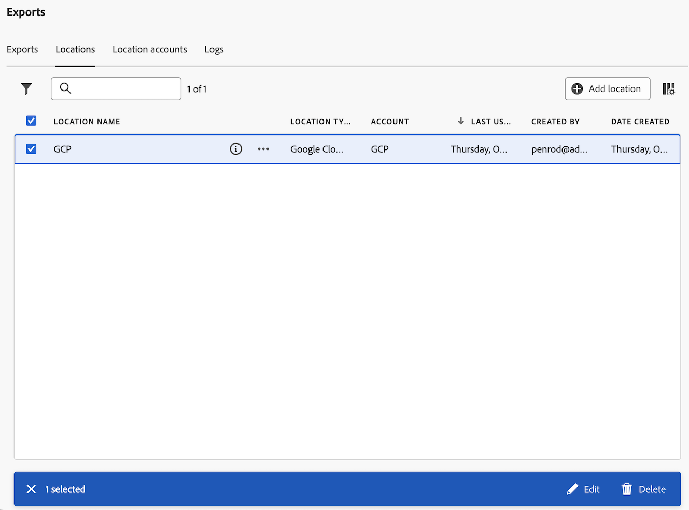

# 클라우드 내보내기 위치 및 계정 관리

클라우드 내보내기 위치를 보고, 편집하고, 삭제할 수 있습니다.

새 위치를 만드는 방법에 대한 자세한 내용은 [클라우드 내보내기 위치 구성](/help/components/exports/cloud-export-locations.md)을 참조하십시오.

## 위치 필터링 및 검색

필요한 정보를 찾으려면 위치 목록을 필터링하거나 위치를 검색할 수 있습니다.

### 위치 목록 필터링

1. Customer Journey Analytics에서 [!UICONTROL **구성 요소**] > [!UICONTROL **내보내기**]&#x200B;를 선택합니다.

1. [!UICONTROL **위치**] 탭을 선택합니다.

1. **필터** 아이콘을 선택하십시오.

   <!-- add screenshot -->

   다음 기준으로 필터링할 수 있습니다.

   | 필터 | 설명 |
   |---------|----------|
   | [!UICONTROL **위치 유형**]<!--should this be changed to Account type?--> | 위치가 연결된 계정 유형입니다. 다음 계정 유형을 사용할 수 있습니다. <ul><li>[!UICONTROL **AEP 데이터 랜딩 영역**]</li><li>[!UICONTROL **Amazon S3 Role ARN**]</li><li>[!UICONTROL **Azure SAS**]</li><li>[!UICONTROL **Azure RBAC**]</li><li>[!UICONTROL **Google Cloud Platform**]</li><li>[!UICONTROL **Snowflake**]</li></ul> |
   | [!UICONTROL **계정**] | 위치가 연결된 계정의 이름입니다. |
   | [!UICONTROL **작성자**] | 위치를 만든 사용자의 이메일 주소입니다. |

   {style="table-layout:auto"}

### 위치 검색

1. Customer Journey Analytics에서 [!UICONTROL **구성 요소**] > [!UICONTROL **내보내기**]&#x200B;를 선택합니다.

1. [!UICONTROL **위치**] 탭을 선택합니다.

1. (조건부) 시스템 관리자인 경우 [!UICONTROL **모든 사용자의 위치 보기**] 옵션을 활성화하여 조직의 모든 사용자가 만든 위치를 볼 수 있습니다.

1. 검색 필드에 검색 중인 위치와 관련된 정보를 입력합니다. 테이블에서 사용할 수 있는 열에서 데이터를 검색할 수 있습니다.

## 위치 편집

위치를 만든 사용자나 시스템 관리자만 위치를 편집할 수 있습니다.

위치를 편집하려면:

1. Customer Journey Analytics에서 [!UICONTROL **구성 요소**] > [!UICONTROL **내보내기**]&#x200B;를 선택합니다.

1. [!UICONTROL **위치**] 탭을 선택합니다.

1. (조건부) 시스템 관리자인 경우 [!UICONTROL **모든 사용자의 위치 보기**] 옵션을 활성화하여 조직의 모든 사용자가 만든 위치를 볼 수 있습니다.

1. 편집할 위치를 선택합니다.

   

1. [!UICONTROL **편집**]&#x200B;을 선택합니다.

1. 원하는 대로 변경한 다음 [!UICONTROL **저장**]&#x200B;을 선택합니다.

## 위치 삭제

위치를 삭제하면 해당 위치를 사용하는 내보내기도 모두 삭제됩니다. 삭제할 때 확인 대화 상자를 선택하여 위치와 연결된 내보내기가 없는지 확인합니다.

위치를 삭제하려면:

1. Customer Journey Analytics에서 [!UICONTROL **구성 요소**] > [!UICONTROL **내보내기**]&#x200B;를 선택합니다.

1. [!UICONTROL **위치**] 탭을 선택합니다.

1. (조건부) 시스템 관리자인 경우 [!UICONTROL **모든 사용자의 위치 보기**] 옵션을 활성화하여 조직의 모든 사용자가 만든 위치를 볼 수 있습니다.

1. 삭제할 위치를 하나 이상 선택합니다.

   

1. [!UICONTROL **삭제**]&#x200B;를 선택합니다.

   위치 삭제 대화 상자가 표시됩니다.

1. 위치 삭제 대화 상자에서 삭제를 확인하기 전에 위치가 내보내기와 연결되어 있지 않은지 확인합니다.

   

1. 확인하려면 [!UICONTROL **삭제**]&#x200B;를 다시 선택하십시오.

## 계정 편집

계정은 계정을 만든 사용자 또는 시스템 관리자만 편집할 수 있습니다.

계정을 편집하려면:

1. Customer Journey Analytics에서 [!UICONTROL **구성 요소**] > [!UICONTROL **내보내기**]&#x200B;를 선택합니다.

1. [!UICONTROL **위치 계정**] 탭을 선택합니다.

   

1. (조건부) 시스템 관리자인 경우 [!UICONTROL **모든 사용자의 계정 보기**] 옵션을 활성화하여 조직의 모든 사용자가 만든 위치를 볼 수 있습니다.

1. 편집할 계정에 대해 [!UICONTROL **세부 정보 보기**]&#x200B;를 선택합니다.

1. 원하는 대로 변경한 다음 [!UICONTROL **저장**]&#x200B;을 선택합니다.

## 계정 키 보기

계정을 만든 후 해당 계정에 대해 연결된 계정 키를 볼 수 있습니다. 처음에 [ 계정을 구성했을 때 클라우드 공급자 ](/help/components/exports/cloud-export-accounts.md)로 계정 구성을 완료하지 않은 경우 이 정보를 확인해야 합니다.

내보내기 계정과 연결된 키를 보려면 다음과 같이 하십시오.

1. Customer Journey Analytics에서 [!UICONTROL **구성 요소**] > [!UICONTROL **내보내기**]&#x200B;를 선택합니다.

1. [!UICONTROL **위치 계정**] 탭을 선택합니다.

   

1. (조건부) 시스템 관리자인 경우 [!UICONTROL **모든 사용자의 계정 보기**] 옵션을 활성화하여 조직의 모든 사용자가 만든 위치를 볼 수 있습니다.

1. 편집할 계정의 3점 아이콘을 선택한 다음 [!UICONTROL **계정 키**]&#x200B;를 선택합니다.

## 계정 삭제

1. Customer Journey Analytics에서 [!UICONTROL **구성 요소**] > [!UICONTROL **내보내기**]&#x200B;를 선택합니다.

1. [!UICONTROL **위치 계정**] 탭을 선택합니다.

   

1. (조건부) 시스템 관리자인 경우 [!UICONTROL **모든 사용자의 계정 보기**] 옵션을 활성화하여 조직의 모든 사용자가 만든 위치를 볼 수 있습니다.

1. 편집할 계정의 3점 아이콘을 선택한 다음 [!UICONTROL **계정 삭제**]&#x200B;를 선택합니다.

1. 확인 대화 상자에서 [!UICONTROL **삭제**]&#x200B;를 다시 선택합니다.

## 회사 전체 설정 구성(관리자만)

시스템 관리자는 사용자가 계정 및 위치를 만들지 못하도록 제한하거나 사용자가 만들고 사용할 수 있는 계정 유형을 제한할 수 있습니다.

### 사용자가 계정을 만들고 편집할 수 있는지 여부 구성

기본적으로 [클라우드 내보내기 계정 구성](/help/components/exports/cloud-export-accounts.md)에 설명된 대로 조직의 모든 사용자는 계정을 만들고 Customer Journey Analytics 환경에서 만드는 계정을 편집할 수 있습니다.

사용자가 계정을 생성하지 못하도록 제한할 수 있습니다. 이 경우 사용자는 이미 만든 계정을 계속 사용할 수 있지만 더 이상 편집할 수는 없습니다. [계정 삭제](#delete-an-account)에 설명된 대로 사용자가 만든 계정을 삭제할 수 있습니다.

모든 사용자가 계정을 만들고 편집하지 못하도록 제한하려면 다음을 수행합니다.

1. Customer Journey Analytics에서 **[!UICONTROL 구성 요소]** > **[!UICONTROL 내보내기]**&#x200B;를 선택한 다음 [!UICONTROL **관리 설정**] 탭을 선택합니다.

1. [!UICONTROL **위치 계정**] 섹션에서 [!UICONTROL **사용자가 위치 계정을 만들고 관리할 수 있도록 허용**] 옵션을 선택 취소합니다.

1. [!UICONTROL **저장**]&#x200B;을 선택합니다.

1. (선택 사항) [계정 삭제](#delete-an-account)에 설명된 대로 사용자가 만든 계정 중 더 이상 사용하지 않을 계정을 삭제합니다.

### 사용자가 위치를 만들고 편집할 수 있는지 여부 구성

기본적으로 [클라우드 내보내기 위치 구성](/help/components/exports/cloud-export-locations.md)에 설명된 대로 조직의 모든 사용자는 Customer Journey Analytics 환경에서 위치를 만들고 위치를 편집할 수 있습니다.

사용자가 위치를 만들지 못하도록 제한할 수 있습니다. 이 경우 사용자는 이미 만든 위치를 계속 사용할 수 있지만 더 이상 편집할 수는 없습니다. [위치 삭제](#delete-a-location)에 설명된 대로 사용자가 만든 위치를 삭제할 수 있습니다.

모든 사용자가 위치를 만들고 편집하지 못하도록 제한하려면 다음을 수행합니다.

1. Customer Journey Analytics에서 **[!UICONTROL 구성 요소]** > **[!UICONTROL 보고서]**&#x200B;를 선택한 다음 [!UICONTROL **관리자 설정**] 탭을 선택합니다.

1. [!UICONTROL **위치**] 섹션에서 [!UICONTROL **사용자가 위치를 만들고 관리할 수 있도록 허용**] 옵션을 선택 취소합니다.

1. [!UICONTROL **저장**]&#x200B;을 선택합니다.

1. (선택 사항) [위치 삭제](#delete-a-location)에 설명된 대로 사용자가 만든 위치 중 더 이상 사용하지 않을 위치를 삭제합니다.

### 사용자가 만들고 사용할 수 있는 계정 유형 제한

다음과 같은 경우 사용자에게 표시되는 계정 유형을 제한할 수 있습니다.

* [새 계정을 만드는 중](/help/components/exports/cloud-export-accounts.md).
* [전체 테이블 내보내기](/help/analysis-workspace/export/export-cloud.md)를 사용하여 파일을 내보낼 때 사용할 계정을 선택할 때

이 섹션에 설명된 대로 계정 유형을 제한하면 제한하는 유형의 모든 계정이 더 이상 사용자에게 표시되지 않습니다. 즉, 전체 테이블 내보내기를 사용하여 파일을 내보낼 때 해당 유형의 새 계정을 만들 수 없고 해당 유형의 기존 계정을 사용할 수 없습니다.

그러나 예약된 내보내기에 대해 구성된 기존 계정은 사용을 제한하려면 삭제해야 합니다.

#### 예약된 내보내기에 계정이 사용되지 않는지 확인합니다.

계정 유형을 제한하면 기존 계정이 삭제되지 않고 숨겨집니다.

제한 유형의 계정에 데이터를 전송하도록 일정이 이미 구성되어 있는 경우 계정 유형을 제한한 후에도 일정이 계속 실행되고 데이터가 계정에 계속 전송됩니다. 예를 들어, 전체 테이블 내보내기가 사용자가 제한하는 계정 유형으로 데이터를 전송하도록 예약되면 일정이 계속 실행됩니다.

예약된 내보내기에 특정 유형의 계정이 사용되지 않도록 해야 하는 경우 [계정 유형을 제한](#limit-the-account-types-that-are-available-to-users)하기 전에 계정을 삭제할 수 있습니다.

계정을 삭제하려면

1. 제한하려는 계정 유형의 계정을 찾습니다. 이 계정은 예약된 내보내기에 사용됩니다.

1. [계정 삭제](#delete-an-account)에 설명된 대로 계정을 삭제합니다.

1. 다음 섹션을 계속합니다. [사용자가 사용할 수 있는 계정 유형을 제한합니다](#limit-the-account-types-that-are-available-to-users).

#### 사용자가 사용할 수 있는 계정 유형 제한

계정을 만들고 사용할 때 사용자가 사용할 수 있는 계정 유형을 제한하려면 다음을 수행합니다.

1. Customer Journey Analytics에서 **[!UICONTROL 구성 요소]** > **[!UICONTROL 내보내기]**&#x200B;를 선택한 다음 [!UICONTROL **관리 설정**] 탭을 선택합니다.

1. [!UICONTROL **허용된 계정 유형**] 섹션을 찾습니다.

   사용자는 기본적으로 다음 계정 유형을 사용할 수 있습니다. 사용자의 사용을 제한하려는 이러한 계정 유형을 선택 취소합니다.

   * [!UICONTROL **AEP 데이터 랜딩 영역**]

   * [!UICONTROL **Amazon S3 Role ARN**]

   * [!UICONTROL **Google Cloud Platform**]

   * [!UICONTROL **Azure SAS**]

   * [!UICONTROL **Azure RBAC**]

   * [!UICONTROL **Snowflake**]

1. [!UICONTROL **저장**]&#x200B;을 선택합니다.
