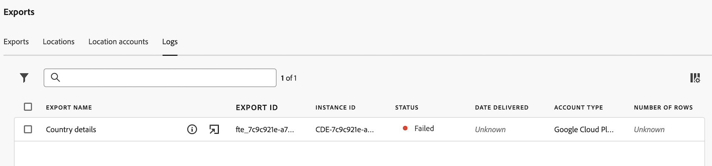

# 내보내기 로그 관리

내보내기 로그는 각 내보내기에 대한 세부 정보를 제공하며 Analysis Workspace 데이터를 클라우드로 내보낼 때마다 생성됩니다. 클라우드로 데이터를 내보내는 방법에 대한 자세한 내용은 [클라우드로 Customer Journey Analytics 보고서 내보내기](/help/analysis-workspace/export/export-cloud.md)를 참조하십시오.

예약된 내보내기의 경우 로그는 로그를 전송할 때의 내보내기 설정을 그대로 반영합니다. 로그를 삭제할 수 없습니다.

## 내보내기 로그 보기

1. Customer Journey Analytics에서 [!UICONTROL **구성 요소**] > [!UICONTROL **내보내기**]&#x200B;를 선택합니다.

1. [!UICONTROL **로그**] 탭을 선택합니다.

   

   각 로그에 대한 세부 정보가 사용 가능한 열에 표시됩니다.

1. 다음 중 하나를 수행합니다.

   * 표시되는 열을 [사용자 지정](#configure-columns)합니다.

   * 로그와 연결된 내보내기를 보려면 로그 이름 옆에 있는 **정보 아이콘** 을 선택하십시오.

   * 로그와 연결된 내보내기를 편집하려면 로그 이름 옆에 있는 **내보내기 편집 아이콘** 을 선택하십시오.

     내보내기 편집에 대한 자세한 내용은 [클라우드로 Customer Journey Analytics 보고서 내보내기](/help/analysis-workspace/export/export-cloud.md)를 참조하십시오.

## 로그 필터링 및 검색

필요한 정보를 찾으려면 로그 목록을 필터링하거나 로그를 검색할 수 있습니다.

### 로그 목록 필터링

1. Customer Journey Analytics에서 [!UICONTROL **구성 요소**] > [!UICONTROL **내보내기**]&#x200B;를 선택합니다.

1. [!UICONTROL **로그**] 탭을 선택합니다.

1. **필터** 아이콘을 선택하십시오.

   

   다음 기준으로 필터링할 수 있습니다.

   | 필터 | 설명 |
   |---------|----------|
   | [!UICONTROL **ID 내보내기**] | 보려는 내보내기 로그의 내보내기 ID를 지정합니다. |
   | [!UICONTROL **계정 유형**] | 로그와 연결된 계정 유형입니다. 다음 계정 유형을 사용할 수 있습니다. <ul><li>[!UICONTROL **AEP 데이터 랜딩 영역**]</li><li>[!UICONTROL **Amazon S3 Role ARN**]</li><li>[!UICONTROL **Azure SAS**]</li><li>[!UICONTROL **Azure RBAC**]</li><li>[!UICONTROL **Google Cloud Platform**]</li><li>[!UICONTROL **Snowflake**]</li></ul>. |
   | [!UICONTROL **상태**] | 내보내기의 상태입니다. 다음 상태를 사용할 수 있습니다. <ul><li>[!UICONTROL **보류 중**]: 내보내기의 특정 인스턴스가 시작되었지만 아직 완료되지 않았습니다.
보류 중 상태의 내보내기를 다시 실행하면 내보내기 프로세스가 지연됩니다.
</li><li>[!UICONTROL **완료**]: 내보내기의 특정 인스턴스가 처리를 완료했으며 내보내기 계정에서 사용할 수 있습니다.</li><li>[!UICONTROL **실패**]
다양한 상황으로 인해 내보내기에 실패할 수 있습니다. 실패 상태 위로 마우스를 가져가면 실패에 대한 세부 정보를 볼 수 있습니다.
가능한 실패 원인에 대한 자세한 내용은 [실패한 내보내기 문제 해결](/help/components/exports/troubleshoot-exports.md)을 참조하세요.
 |

   {style="table-layout:auto"}

### 로그 검색

1. Customer Journey Analytics에서 [!UICONTROL **구성 요소**] > [!UICONTROL **내보내기**]&#x200B;를 선택합니다.

1. [!UICONTROL **로그**] 탭을 선택합니다.

1. 검색 필드에 검색 중인 로그와 관련된 정보를 입력합니다. 테이블에서 사용할 수 있는 열에서 데이터를 검색할 수 있습니다.

<!-- removed for MVP: Retry an export You can re-run the export associated with the selected log, using the data as it was on the day the log was originally exported. This is useful when selecting a log that show a failed export or when selecting a log that was accidentally deleted. 

Retrying an export that has a status of Pending will delay the export process.

This option is not available when selecting multiple logs. -->

<!-- 1. In Customer Journey Analytics, select [!UICONTROL **Components**] > [!UICONTROL **Exports**].

1. Select the [!UICONTROL **Logs**] tab, then select a log.

1. Select [!UICONTROL **Retry**]. -->

## 내보내기 편집

특정 로그와 연결된 내보내기를 편집할 수 있습니다.

여러 로그를 선택할 때는 이 옵션을 사용할 수 없습니다.

1. Customer Journey Analytics에서 [!UICONTROL **구성 요소**] > [!UICONTROL **내보내기**]&#x200B;를 선택합니다.

1. [!UICONTROL **로그**] 탭을 선택합니다.

1. 편집할 내보내기와 관련된 로그를 찾습니다.

1. 로그 이름 옆에 있는 **내보내기 편집** 아이콘 을 선택합니다.

   또는

   로그 옆의 확인란을 선택한 다음 [!UICONTROL **내보내기 편집**]&#x200B;을 선택합니다.

## 열 구성

[!UICONTROL 로그] 탭에서 열을 추가하거나 제거하여 표시되는 정보를 구성할 수 있습니다.

해당 열을 기준으로 로그를 정렬하려면 열 헤더를 선택하십시오. 기본적으로 로그는 내보내기가 시작된 날짜 및 시간별로 정렬됩니다.

[!UICONTROL 로그] 탭에서 열을 구성하려면:

1. Customer Journey Analytics에서 [!UICONTROL **구성 요소**] > [!UICONTROL **내보내기**]&#x200B;를 선택합니다.

1. [!UICONTROL **로그**] 탭을 선택합니다.

1. **로그** 페이지의 오른쪽 상단에서  아이콘 [!UICONTROL 테이블 사용자 지정]을 선택합니다.

   다음 열을 사용할 수 있습니다.

   | 사용 가능한 열 | 설명 |
   |---------|----------|
   | 내보내기 이름 | 내보내기의 이름입니다. 사용자는 [클라우드로 Customer Journey Analytics 보고서 내보내기](/help/analysis-workspace/export/export-cloud.md)에 설명된 대로 내보낼 때 이름을 지정합니다. |
   | 내보내기 ID | 내보낼 때 자동으로 할당되는 ID입니다. <!-- True? --> |
   | 인스턴스 ID | Customer Journey Analytics 인스턴스의 ID입니다. <!-- True? --> |
   | 데이터 보기 이름 | 내보내기와 연결된 데이터 보기의 이름입니다. 사용자는 [클라우드로 Customer Journey Analytics 보고서 내보내기](/help/analysis-workspace/export/export-cloud.md)에 설명된 대로 내보내기를 만들 때 데이터 보기를 선택할 수 있습니다. |
   | 파일 수 | 내보내기에 포함된 파일 수입니다. |
   | 크기 | 내보내기 크기.
파일 크기는 때때로 KIB 및 MIB로 표현되는 1024의 기준으로 계산됩니다. 클라우드 공급자가 크기를 1000으로 계산하는 경우 클라우드 공급자에 표시되는 크기가 여기에 표시되는 크기와 약간 다를 수 있습니다.
 |
   | 위치 | 데이터를 내보낸 계정의 위치입니다. |
   | 계정 | 데이터를 내보낸 계정입니다. |
   | 상태 | 내보내기의 상태입니다. 사용 가능한 상태는 [!UICONTROL 보류 중], [!UICONTROL 배달됨] 및 [!UICONTROL 실패]입니다. |
   | 게재 일자 | 내보내기가 발생한 날짜입니다. |
   | 계정 유형 | 데이터를 내보낸 클라우드 계정 유형입니다. 사용 가능한 계정 유형은 [!UICONTROL Amazon S3 역할 ARN], [!UICONTROL Google 클라우드 플랫폼], [!UICONTROL Azure SAS], [!UICONTROL Azure RBAC], [!UICONTROL Snowflake] 및 [!UICONTROL Adobe Experience Platform]입니다. |
   | 행 수 | 내보낸 테이블에 포함된 행 수입니다. |

   {style="table-layout:auto"}

1. 표시할 열이 선택되어 있는지 확인합니다. 선택한 열이 [!UICONTROL 로그] 페이지에 나타나고 관련 정보를 표시합니다.

## 감사 로그 보기

전체 테이블 내보내기는 [Customer Journey Analytics 감사 로그](/help/privacy/audit-log.md)에서도 추적됩니다. <!-- Need to see what the Component Type for full-table export will be and add it here. Also, under "Event type captured by audit logs" there would be a new event type called "Full-table export". 4 actions would be "Create, Delete, Edit, Export" and "API_Request"? Also information about the locations. Probably have a different component for the location credentials.-->
