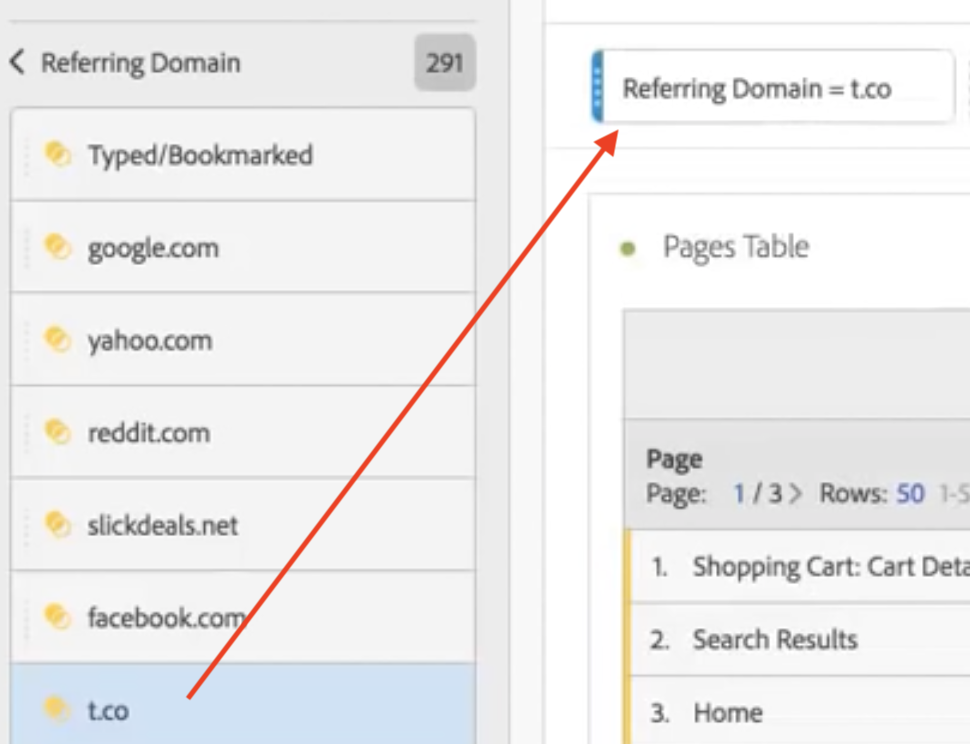

# 임시 프로젝트 필터

임시 프로젝트 필터를 사용하면 구성 요소를 드래그하여 패널 드롭 영역에 바로 놓아 필터를 작성할 수 있습니다. 작성된 필터는 현재 프로젝트에만 적용되는 [프로젝트 수준의 필터](https://experienceleague.adobe.com/docs/analytics-platform/using/cja-components/cja-filters/quick-filters.html)가 됩니다.

다음은 임시 프로젝트 필터 만들기에 대한 비디오입니다.

>[!VIDEO](https://video.tv.adobe.com/v/23978/?quality=12)

1. 
   1. 구성 요소 유형(차원, 차원 항목, 이벤트, 지표, 세그먼트, 세그먼트 템플릿, 날짜 범위)을 패널 상단의 필터 드롭 영역으로 드래그합니다. 구성 요소 유형은 호환 가능한 경우 자동으로 임시 필터 또는 [빠른 필터](/help/components/filters/quick-filters.md)로 변환됩니다.

   다음은 Twitter 참조 도메인을 위한 필터를 만드는 방법의 예입니다.

   

   패널에 이 필터를 자동으로 적용하여 결과를 즉시 조회할 수 있습니다.

1. 패널에 필터를 무제한으로 추가할 수 있습니다.
1. 이 필터를 저장하기로 결정되면 아래의 다음 섹션을 참조하십시오.

다음 사항에 주의하십시오.

* 다음 구성 요소 유형을 필터 영역으로 끌어 놓을 수 **없음**: 필터를 빌드할 수 없는 계산된 지표 및 차원/지표.
* 전체 차원 및 이벤트에 대해 Analysis Workspace는 &quot;존재함&quot; 히트 필터를 만듭니다. 예: `Hit where eVar1 exists` 또는 `Hit where event1 exists`.
* 필터를 놓는 영역에 &quot;지정되지 않음&quot; 또는 &quot;없음&quot;을 놓으면 필터링 시 올바로 처리되도록 자동으로 &quot;존재하지 않음&quot; 필터로 변환됩니다.

## 임시 프로젝트 필터 저장 {#ad-hoc-save}

다음 단계를 수행하여 이러한 필터를 저장하도록 선택할 수 있습니다.

1. 드롭 영역의 필터 위에 커서를 놓고 &quot;i&quot; 아이콘을 클릭합니다.
1. 연필 모양의 편집 아이콘을 클릭하여 필터 세그먼트로 이동합니다.
1. **[!UICONTROL 모든 프로젝트에 사용할 수 있도록 설정 및 구성 요소 목록 추가]**&#x200B;를 선택합니다.
1. **[!UICONTROL 저장]**&#x200B;을 클릭합니다.

저장하면 필터를 왼쪽 레일 구성 요소 목록에서 사용할 수 있으며 필터 관리자의 다른 사용자와 공유할 수 있게 됩니다.

