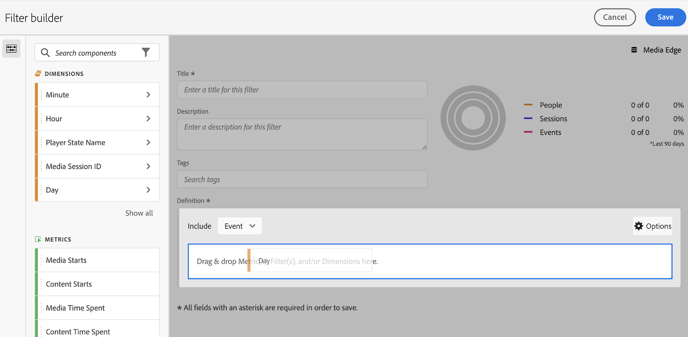

# 필터 빌더

[!UICONTROL 필터 빌더]를 사용하면 방문과 이벤트 간에 개인 특성 및 작업을 식별하는 간단하거나 복잡한 필터를 만들 수 있습니다. 여기서는 계층 논리, 규칙 및 연산자에 따라 개인을 필터링하기 위해 지표 차원, 이벤트 또는 기타 필터를 드래그 앤 드롭할 수 있는 캔버스를 제공합니다.

빠른 필터를 만든 프로젝트에만 적용되는 빠른 필터를 만드는 방법에 대한 자세한 내용은 [빠른 필터](/help/components/filters/quick-filters.md)를 참조하십시오.

## 필터 빌더 액세스

다음 방법 중 하나로 필터 빌더에 액세스할 수 있습니다.

* **위쪽 탐색**: **[!UICONTROL Customer Journey Analytics]** > **[!UICONTROL 구성 요소]** > **[!UICONTROL 필터]**&#x200B;를 클릭합니다.
* **[!UICONTROL Analysis Workspace]**: Analysis Workspace에서 프로젝트를 연 상태에서 **[!UICONTROL + 구성 요소]** > **[!UICONTROL 필터 만들기]**&#x200B;를 선택하십시오.
* **[!UICONTROL Report Builder]**: [Report Builder에서 필터 작업](/help/report-builder/work-with-filters.md).

## 빌더 기준 개요 {#section_F61C4268A5974C788629399ADE1E6E7C}

규칙 정의 및 컨테이너를 추가하여 필터를 정의할 수 있습니다. 필터 빌더 액세스에 대한 자세한 내용은 [필터 빌더 액세스](#access-the-filter-builder)를 참조하십시오.

| UI 요소 | 설명 |
| --- | --- |
| **[!UICONTROL 제목]** | 필터 이름 지정 |
| **[!UICONTROL 설명]** | 필터에 대한 자세한 설명을 입력합니다. |
| **[!UICONTROL 태그]** | [기존 태그 목록에서 선택하거나 새 태그를 만들어 만들고 있는 필터에 태깅](/help/components/filters/manage-filters.md)합니다. |
| **[!UICONTROL 정의]** | 여기에서 [필터를 빌드하고 구성](/help/components/filters/filters-overview.md)하고, 규칙을 추가하고, 컨테이너를 중첩하고 순서를 지정합니다. |
| **[!UICONTROL 포함]** | (위쪽 컨테이너 선택기) 최상위 [컨테이너](/help/components/filters/filters-overview.md)([!UICONTROL 개인], [!UICONTROL 세션], [!UICONTROL 이벤트])를 선택할 수 있습니다. 기본 최상위 수준 컨테이너는 이벤트 컨테이너입니다. |
| **[!UICONTROL 옵션]** | (톱니바퀴) 아이콘 | <ul><li>**[!UICONTROL + 컨테이너 추가]**: 필터 정의에 새 컨테이너(최상위 컨테이너 아래)를 추가할 수 있습니다.</li><li>**[!UICONTROL 제외]**: 하나 이상의 차원, 필터 또는 지표를 제외하여 필터를 정의할 수 있습니다.</li></ul> |
| **[!UICONTROL 차원]** | 구성 요소는 Dimension 목록(주황색 사이드바)에서 드래그하여 놓습니다. |
| **[!UICONTROL 연산자]** | 선택한 연산자를 사용하여 값을 비교하고 제한할 수 있습니다. (같음, 같지 않음, 포함, 모두 포함 등) |
| **[!UICONTROL 값]** | 입력했거나 선택한 차원, 필터 또는 지표 값입니다. |
| **[!UICONTROL 속성 모델]** | 차원에만 사용할 수 있는 이 모델은 차원에서 필터링할 값을 결정합니다. Dimension 모델은 순차적 필터에서 특히 유용합니다.<ul><li>**[!UICONTROL 반복]**  (기본값): 차원의 인스턴스와 지속적인 값을 포함합니다.</li><li>**[!UICONTROL 인스턴스]**: 차원의 인스턴스를 포함합니다.</li><li>**[!UICONTROL 비반복 인스턴스]**: 차원에 대한 고유한 인스턴스(비반복)를 포함합니다. 반복 인스턴스가 제외될 때 플로우에 적용되는 모델입니다.</li></ul>예를 들어 아래의 &quot;기여도 분석 모델&quot; 섹션을 참조하십시오. |
| **[!UICONTROL 및/또는/및]** | 컨테이너 또는 규칙 사이에 [!UICONTROL AND/OR/THEN] 연산자를 할당합니다. THEN 연산자를 사용하여 [순차적 필터를 정의](/help/components/filters/filters-overview.md)할 수 있습니다. |
| **[!UICONTROL 지표]** | (녹색 사이드바) 지표 목록에서 드래그 앤 드롭한 지표입니다. |
| **[!UICONTROL X]** | (삭제) 이 필터 정의 부분을 삭제할 수 있습니다. |
| **[!UICONTROL 필터에서 대상 만들기]** | 필터에서 대상을 만들면 Adobe Experience Platform과 필터를 공유하여 활성화할 수 있습니다. [자세히 알아보기...](/help/components/audiences/audiences-overview.md) |
| **[!UICONTROL 구성 요소 검색]** | 차원, 필터 또는 지표 목록을 검색합니다. |
| **[!UICONTROL 차원]** | (목록) 필터에 포함할 수 있는 차원 목록입니다. 확장할 헤더를 클릭합니다. |
| **[!UICONTROL 지표]** | 필터에 포함할 수 있는 지표 목록입니다. 확장할 헤더를 클릭합니다. |
| **[!UICONTROL 필터]** | 필터에 포함할 수 있는 기존 필터 목록. 확장할 헤더를 클릭합니다. |
| **[!UICONTROL 데이터 보기 선택기]** | 이 필터가 저장될 보고서 세트를 선택할 수 있습니다. 모든 데이터 보기에서 필터를 계속 활용할 수 있습니다. |
| **[!UICONTROL 필터 미리 보기]** | 주요 지표를 미리 보기하여 유효한 필터가 있는지 여부와 필터의 폭이 얼마나 넓은지 확인할 수 있습니다. 이 필터를 적용할 경우 표시될 것으로 예상되는 데이터 세트 분류를 표시합니다. 데이터 집합에 대해 실행된 필터에 대해 [!UICONTROL 사람], [!UICONTROL 세션] 및 [!UICONTROL 보고서 실행]에 대한 일치 횟수와 비율을 표시하는 목록과 3개의 동심원을 표시합니다.
이 차트는 필터 정의를 만들거나 변경한 직후에 업데이트됩니다. |
| **[!UICONTROL 저장]** 또는 **[!UICONTROL 취소]** | 필터를 저장하거나 취소합니다. **[!UICONTROL 저장]**&#x200B;을 클릭하면 필터를 관리할 수 있는 필터 관리자로 이동됩니다. |

## 필터 빌드 {#build-filters}

1. 왼쪽 창에서 Dimension, 필터 또는 지표 이벤트를 [!UICONTROL 정의] 필드로 드래그하기만 하면 됩니다.

   

1. 드롭다운 메뉴에서 [연산자](https://experienceleague.adobe.com/docs/analytics/components/segmentation/segment-reference/seg-operators.html)를 설정합니다.
1. 선택한 항목에 대한 값을 입력하거나 선택합니다.
1. 필요한 경우 **[!UICONTROL And]**, **[!UICONTROL Or]** 또는 **[!UICONTROL Then]** 규칙을 사용하여 컨테이너를 더 추가합니다.
1. 컨테이너를 배치하고 규칙을 설정한 후에는 오른쪽 상단의 유효성 검사 차트에서 필터 결과를 확인합니다. 유효성 검사기는 사용자가 만든 필터와 일치하는 페이지 보기, 방문 및 고유 사용자의 비율 및 절대 수를 나타냅니다.
1. **[!UICONTROL 태그]**&#x200B;에서 기존 태그를 선택하거나 새 태그를 만들어 컨테이너를 [태그](/help/components/filters/filters-tag.md)합니다.
1. 필터를 저장하려면 **[!UICONTROL 저장]**&#x200B;을 클릭하세요.

   다양한 방법으로 필터에 태그를 지정하고, 공유하고, 관리할 수 있는 [필터 관리자](/help/components/filters/manage-filters.md)(으)로 이동합니다.

## 컨테이너 추가 {#containers}

[컨테이너 프레임워크를 작성한 다음](/help/components/filters/filters-overview.md) 사이에 논리 규칙 및 연산자를 배치할 수 있습니다.

1. **[!UICONTROL 옵션 > 컨테이너 추가]**&#x200B;를 클릭합니다.

   새 [!UICONTROL **Event**] 컨테이너가 식별된 [!UICONTROL **Event**](페이지 보기) 없이 열립니다.

   

1. 필요에 따라 컨테이너 유형을 변경합니다.
1. 왼쪽 창에서 컨테이너로 Dimension, 필터 또는 이벤트를 드래그합니다.
1. 정의 상단에 있는 최상위 수준 **[!UICONTROL 옵션]** > **[!UICONTROL 컨테이너 추가]** 버튼에서 계속해서 새 컨테이너를 추가하거나 컨테이너 내에 컨테이너를 추가하여 논리를 중첩합니다.

   **또는**

   하나 이상의 규칙을 선택하고 **[!UICONTROL 옵션]** > **[!UICONTROL 선택에서 컨테이너 추가]**&#x200B;를 클릭합니다. 이렇게 하면 선택 영역이 별도의 컨테이너로 바뀝니다.

## 날짜 범위 사용 {#date-ranges}

진행 중인 캠페인 또는 이벤트에 대한 질문에 답변하는 순서로 롤링 날짜 범위를 포함하는 필터를 빌드할 수 있습니다.

예를 들어 &quot;지난 60일 동안 구매한 모든 사람&quot;을 포함하는 필터를 쉽게 작성할 수 있습니다.

세션 컨테이너를 만들고 그 안에 AND 연산자와 함께 [!UICONTROL 최근 60일] 시간 범위와 [!UICONTROL 주문이 1]보다 크거나 같은 지표를 추가합니다.

다음은 필터에서 롤링 기간 사용하기에 대한 비디오입니다.

>[!VIDEO](https://video.tv.adobe.com/v/25403/?quality=12)

## 스택 필터 {#stack}

스택 필터는 &#39;and&#39; 연산자를 사용하여 각 필터에서 기준을 조합한 다음 조합된 기준을 적용하는 방식으로 작동합니다. 이 작업은 Workspace 프로젝트에서 직접 또는 필터 빌더에서 수행할 수 있습니다.

예를 들어 &quot;휴대폰 사용자&quot; 필터와 &quot;미국 지리&quot; 필터를 스택하면 미국의 휴대폰 사용자에 대한 데이터만 반환됩니다.

이러한 필터를 필터 라이브러리에 포함할 수 있는 기본 구성 요소 또는 모듈로 간주하여 사용자가 필요할 때 사용할 수 있습니다. 이를 통해 필요한 필터의 수를 획기적으로 줄일 수 있습니다. 예를 들어 40개의 필터가 있다고 가정해 보겠습니다.

* 다른 국가의 휴대폰 사용자를 위한 20개 세그먼트 (US_mobile, Germany_mobile, France_mobile, Brazil_mobile 등)
* 다른 국가의 태블릿 사용자를 위한 20개 세그먼트 (US_tablet, Germany_tablet, France_tablet, Brazil_tablet 등)

필터 스택을 사용하여 필터 수를 22개로 줄이고 필요에 따라 스택할 수 있습니다. 다음 필터를 만들어야 합니다.

* 모바일 사용자를 위한 하나의 필터
* 태블릿 사용자를 위한 필터 1개
* 다른 지역을 위한 20개 필터

>[!NOTE]
>
>2개의 필터를 스택할 때 기본적으로 AND 문으로 연결됩니다. 이를 OR 문으로 변경할 수 없습니다.

1. 필터 빌더로 이동합니다.

1. 필터의 제목과 설명을 입력합니다.

1. 왼쪽 탐색 영역에 필터 목록을 표시하려면 **[!UICONTROL 필터 표시]**&#x200B;를 클릭하십시오.

1. 스택할 필터를 필터 정의 캔버스로 드래그합니다.

1. [!UICONTROL **저장**]&#x200B;을 선택합니다.

## 속성 모델 {#attribution}

**예: eVar1 = A**&#x200B;인 이벤트 필터

| 예 | A | A | A (지속됨) | B | A | C |
|---|---|---|---|---|---|---|
| 반복 | X | X | X | - | X | - |
| 인스턴스 | X | X | - | - | X | - |
| 비반복 인스턴스 | X | - | - | - | X | - |
