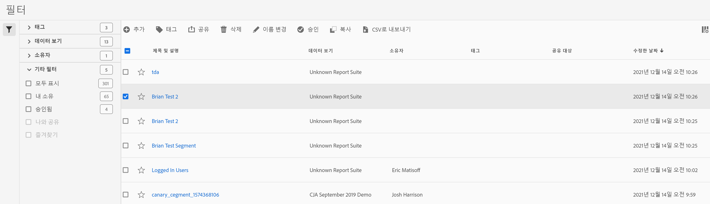

# 필터 관리

필터 관리자는 공유, 필터링, 태깅, 승인, 복사, 삭제 및 즐겨찾기로 표시 등 다양한 세그먼트 처리 방법을 제공합니다.

필터 관리자는 사용자가 보유하는 모든 필터 및 사용자와 공유되는 모든 필터를 표시합니다. 관리자 수준의 사용자는 조직의 모든 필터를 볼 수 있습니다. 이 개요에서는 필터 관리자의 사용자 인터페이스와 기능을 설명합니다.

위쪽 탐색의 **[!UICONTROL 고객 경로 분석]** > **[!UICONTROL 구성 요소]** > **[!UICONTROL 필터]**&#x200B;로 이동하여 필터 관리자에 액세스합니다.

## 필터 관리자 UI

| # | UI 기능 | 설명 |
|---|---|---|
| 1 | 필터 관리 도구 모음 | 필터를 선택하면 이 도구 모음이 나타납니다. 대부분의 관리 작업은 이 도구 모음에서 완료할 수 있습니다. |
| 2 | 확인란 | 필터를 관리하려면 선택합니다. |
| 4 | 즐겨찾기 | 필터 옆에 있는 별 모양을 클릭하면 별이 노란색으로 바뀌고 필터가 즐겨찾기로 표시됩니다. |
| 5 | 제목 및 설명 | 필터 빌더에 제공됩니다. 제목 및 설명을 편집하려면 제목 링크를 클릭합니다. 이렇게 하면 필터 빌더로 돌아갑니다. |
| 6 | 보고서 세트 | 이 열은 필터를 마지막으로 저장한 보고서 세트를 나타냅니다. |
| 7 | 소유자 | 필터를 소유한 사람을 나타냅니다. 관리자가 아닌 경우 사용자가 소유하거나 사용자와 공유된 필터만 표시할 수 있습니다. |
| 8 | 태그(열 선택기에서 선택되지 않았으므로 열이 나타나지 않음) | 사용자 또는 사용자와 세그먼트를 공유한 다른 사람이 필터에 적용한 태그입니다. |
| 9 | 다음 사용자와 공유 | 필터를 공유한 개인 또는 그룹(관리자만) 또는 모든 사용자(관리자만)를 표시합니다. |
| 10 | 수정한 날짜 | 필터를 마지막으로 수정한 날짜를 표시합니다. |
| 11 | 열 선택기 | (오른쪽 상단) 필터 관리자에서 표시할 열을 선택할 수 있습니다. |
| 12 | 공유됨 아이콘 | 이 필터를 사용자가 공유했거나 이 필터가 사용자와 공유되고 있음을 나타냅니다. |
| 13 | 승인됨 아이콘 | 관리자가 이 필터를 승인했음을 나타냅니다. |
| 14 | 기타 필터 | 태그, 보고서 세트, 소유자 및 기타(모두 표시, 내 소유, 나와 공유, 승인됨, 즐겨찾기)를 기준으로 필터를 볼 수 있습니다. |

## 플랜 필터

세그먼트를 계획하는 데 시간을 투자하면 조직에 유용한 세그먼트를 작성하는 데 도움이 되며 해당 수치를 점검할 수 있습니다.

* 대상을 고려합니다. 이를테면 누가 소비하며 누구와 공유하며 어떤 사용자 그룹이 이 필터를 사용하며 그에 따라 태깅하려면 어떻게 합니까? 이는 곧 필터에 대한 적절한 설명 제공을 의미합니다. 설명에는 최소한 다음에 대한 답변이 포함되어야 합니다.

   * 이 필터는 어떤 작업에 유용합니까?

   * 이 필터를 언제 사용해야 합니까?

* 필터 범위를 결정합니다. 어느 [필터 컨테이너](/help/components/filters/filters-overview.md)가 범위를 가장 잘 나타냅니까? 가능한 가장 작은 컨테이너를 사용합니다.

* 필터 정의에 포함할 요소와 값을 결정합니다.

* 승인 프로세스를 제시할 방법을 고려합니다. 단일 사용자가 필터를 검토하고 승인합니까? 아니면 위원회에서 결정을 내립니까?

* 비즈니스 사용자에게 모듈 방식으로 필터 부분 또는 구성 요소를 스택하고 재사용할 수 있도록 하는 세그먼트 라이브러리에 대한 보기를 사용하여 세그먼트를 정의합니다. 이 라이브러리를 실현하기 위해 정의해야 하는 &quot;모듈&quot;은 무엇입니까?

### 태그 필터

필터 관리자에서 필터에 태깅하여 필터를 구성할 수 있습니다. 모든 사용자는 필터에 대해 태그를 만든 후 세그먼트에 하나 이상의 태그를 적용할 수 있습니다. 그렇지만 본인이 소유하거나 본인과 공유된 필터에 대한 태그만 볼 수 있습니다.

어떤 종류의 태그를 만들어야 합니까? 다음은 제안되는 유용한 태그입니다.

* 팀 이름을 기반으로 하는 태그(예: 소셜 마케팅, 모바일 마케팅)

* 프로젝트 태그(분석 태그)(예: 시작 페이지 분석)

* 카테고리 태그: 남성용, 지역

* 워크플로우 태그: 승인용, 처리됨(특정 비즈니스 단위)

필터에 태깅하려면 다음을 수행하십시오.

1. 필터 관리자에서 태깅할 필터 옆의 확인란을 선택합니다. 필터 관리 도구 모음이 표시됩니다.

1. **[!UICONTROL 태그]**&#x200B;를 클릭하고

   * 기존 태그에서 선택하거나

   * 새 태그 이름을 입력하고 **[!UICONTROL Enter]**&#x200B;를 누릅니다.

1. **[!UICONTROL 태그]**&#x200B;를 다시 클릭하여 세그먼트에 태깅합니다.

이제 태그가 태그 열에 나타납니다. (열을 관리하려면 오른쪽 위에 있는 톱니바퀴 아이콘 클릭)
**[!UICONTROL 필터 > 태그]**&#x200B;로 이동하여 태그를 필터링할 수도 있습니다.

### 승인 필터

필터 관리자 내에서 다양한 애플리케이션 수준이나 특정 부서 또는 그룹에 대한 필터 승인이 포함된 워크플로우를 설정하고 보고 정책과 일관되게 설정할 수 있습니다.

필터를 승인됨으로 플래그를 지정하는 방법은 다음과 같습니다.

1. 필터 관리자에서 필터 제목 왼쪽의 확인란을 선택합니다.

1. 필터 관리 작업 표시줄에서 **[!UICONTROL 승인]**&#x200B;을 클릭합니다.

1. 승인된 세그먼트를 조직과 공유할 수 있습니다.

1. **[!UICONTROL 확인을 클릭합니다]**.

   목록의 필터 옆에 승인 아이콘이 표시됩니다.

   

1. **[!UICONTROL 비승인]**&#x200B;을 클릭하여 승인된 세그먼트의 승인을 취소할 수도 있습니다.

### 공유 필터

사용 권한에 따라, 전체 조직, 그룹 또는 개별 사용자와 필터를 공유할 수 있습니다.

| 관리자 | 비관리자 |
|---|---|
| 모든 사람, 그룹 및 사용자와 필터를 공유할 수 있습니다. 자세한 내용은 [Admin Console 설명서](https://helpx.adobe.com/kr/enterprise/using/manage-products-and-profiles.html)를 참조하십시오. | 개별 사용자와만 필터를 공유할 수 있습니다. |

필터를 언제 전체 회사와 공유하는 것이 좋고, 언제 사용자 그룹이나 개인과 공유해야 좋을까요? 다음은 따라야 할 몇 가지 모범 사례입니다.

* 관리자는 해당 필터가 회사 전체에 유용하고 모든 사람이 편리하게 사용할 수 있는 경우 모든 사람과 공유합니다. 이 경우 필터를 승인된 지표로 만드는 것도 고려해야 합니다.

* 관리자는 필터가 해당 팀에게 유용한 비즈니스 가치를 제공하는 경우 특정 제품 프로필과 공유할 수 있습니다. 이 유형의 필터는 공식적으로 승인하지 마십시오.

* 관리자 또는 개인 사용자는 다른 사용자와 필터를 공유하여 필터를 수정하고 유효성을 검증합니다. 유용하지 않다고 확인되면 삭제할 수 있습니다. 이 유형의 필터는 공식적으로 승인하지 마십시오.

필터를 공유하려면 다음을 수행하십시오.

1. 필터 관리자에서 공유할 필터 옆의 확인란을 선택합니다.

1. 필터 관리 도구 모음에서 **[!UICONTROL 공유]**&#x200B;를 클릭합니다.

1. 관리자는 모두를 선택하거나 조직의 그룹 및 사용자를 선택할 수 있습니다. 관리자가 아닌 사용자는 개별 사용자만 볼 수 있습니다. 검색 필드를 사용하여 그룹 또는 사용자를 검색합니다. **[!UICONTROL 공유]**&#x200B;를 클릭합니다. 공유 아이콘이 필터  옆에 표시됩니다.

1. 필터 > 기타 필터 > 나와 공유로 이동하여 공유된 필터를 필터링할 수 있습니다.

### 필터를 즐겨찾기로 표시

세그먼트를 즐겨찾기로 표시하는 것은 쉽게 사용할 수 있게 구성하는 또 다른 방법입니다.

1. 필터 관리자에서 즐겨찾기로 표시할 필터 옆의 별모양을 클릭합니다. 별모양을 선택하면 별이 노란색으로 바뀝니다.

1. 필터 > 기타 필터 > 즐겨찾기 아래에서 즐겨찾기에 대해 필터링할 수도 있습니다.

