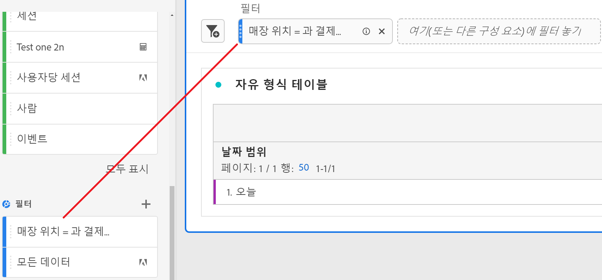
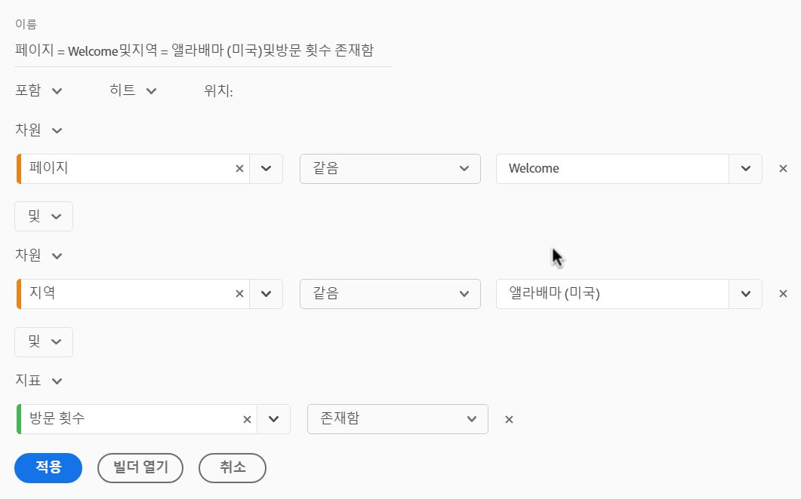

# 빠른 필터

빠른 필터를 사용하면 [필터 빌더](/help/components/filters/create-filters.md)에서 더 복잡한 구성 요소 목록 필터를 만들지 않고도 특정 프로젝트 내의 데이터를 쉽게 탐색할 수 있습니다.

빠른 필터를 만들 때 다음 사항을 고려하십시오.

* 빠른 필터는 해당 필터가 만들어진 프로젝트에만 적용됩니다. 다른 프로젝트에서 사용할 수 없으며, 다른 사용자와 공유할 수 없습니다.
* 최대 3개의 규칙이 허용됩니다.
* 중첩 컨테이너 또는 순차적 규칙은 지원되지 않습니다.
* 프로젝트를 다른 사용자와 공유하는 경우, 해당 사용자는 공유 프로젝트에 포함된 빠른 필터 및 기타 프로젝트 전용 구성 요소를 편집할 수 있습니다.

다음 비디오에서는 빠른 필터를 사용하는 방법을 보여 줍니다. (참고: 이 비디오에서는 &quot;빠른 필터&quot; 대신 &quot;빠른 세그먼트&quot;라는 용어를 사용합니다. 그러나 기능은 동일합니다.)

>[!VIDEO](https://video.tv.adobe.com/v/341466/?quality=12&learn=on)

## 빠른 필터 만들기 {#create}

Analysis Workspace의 모든 사용자는 빠른 필터를 만들 수 있습니다.

빠른 필터를 만들려면 다음 작업을 수행하십시오.

1. 다음 방법 중 하나를 선택하여 빠른 필터 만들기를 시작합니다.

   * **임시(드래그 앤 드롭):** 왼쪽 레일에서 구성 요소를 패널 헤더의 필터 드롭 영역으로 드래그합니다.

     

     [빠른 필터 편집](#edit-a-quick-filter)에 설명된 대로 빠른 필터를 편집할 수 있습니다.

     >[!NOTE]
     >
     > 빠른 필터를 임시로 만들 때(드래그 앤 드롭) 다음 사항을 고려하십시오.
     > * 계산된 지표 및 차원과 필터를 빌드할 수 없는 지표에는 구성 요소 유형이 지원되지 않습니다.
     > * 전체 차원 및 이벤트에 대해 Analysis Workspace은 &quot;존재함&quot; 이벤트 필터를 만듭니다. 예: `Hit where eVar1 exists` 또는 `Hit where event1 exists`.
     > * 필터를 놓는 영역에 &quot;지정되지 않음&quot; 또는 &quot;없음&quot;을 놓으면 필터링 시 올바로 처리되도록 자동으로 &quot;존재하지 않음&quot; 필터로 변환됩니다.

   * **필터 아이콘 사용:** 자유 형식 테이블에서 패널 헤더의 **필터** 아이콘을 선택합니다.

     

1. 다음 설정 중 하나를 조정합니다.

   | 설정 | 설명 |
   | --- | --- |
   | [!UICONTROL 이름] | 필터의 기본 이름은 필터에 있는 규칙 이름의 조합입니다. 필터 이름을 보다 친숙한 이름으로 바꿀 수 있습니다. |
   | [!UICONTROL 포함/제외] | 필터 정의에 구성 요소를 포함하거나 제외할 수 있지만 둘 다 할 수는 없습니다. |
   | [!UICONTROL 히트/방문/방문자] 컨테이너 | 빠른 필터에는 하나의 [필터 컨테이너](https://experienceleague.adobe.com/docs/analytics-platform/using/cja-components/cja-filters/filters-overview.html#filter-containers)만이 포함되어 필터에 차원/지표/날짜 범위를 포함하거나 필터에서 제외할 수 있습니다. [!UICONTROL 방문자]에는 여러 방문 및 페이지 보기에서 해당 사용자에 대한 중요 데이터가 포함되어 있습니다. [!UICONTROL 방문] 컨테이너를 사용하여 방문에 따라 개인의 데이터를 분석하는 규칙을 설정할 수 있고, [!UICONTROL 히트] 컨테이너를 사용하여 개별 페이지 보기에 따라 개인 정보를 분류할 수 있습니다. 기본 컨테이너는 [!UICONTROL 히트]입니다. |
   | [!UICONTROL 구성 요소] (차원/지표/날짜 범위) | 구성 요소(차원, 지표, 날짜 범위 또는 차원 값)를 추가하여 최대 3개의 규칙을 정의합니다. 적합한 구성 요소를 검색하는 3가지 방법이 있습니다.<ul><li>입력을 시작하면 빠른 필터 빌더가 적절한 구성 요소를 자동으로 검색합니다.</li><li>드롭다운 목록을 사용하여 구성 요소를 검색합니다.</li><li>왼쪽 레일에서 구성 요소를 드래그 앤 드롭합니다.</li></ul> |
   | [!UICONTROL 연산자] | 드롭다운 메뉴를 사용하여 표준 연산자 및 [!UICONTROL 고유 개수] 연산자를 검색합니다. [필터 연산자](operators.md)를 참조하십시오. |
   | 플러스(+) 기호 | 다른 규칙 추가 |
   | AND/OR 한정자 | 규칙에 “AND” 또는 “OR” 한정자를 추가할 수 있지만 단일 필터 정의에서는 “AND”와 “OR”를 혼합할 수 없습니다. |
   | [!UICONTROL 적용] | 이 필터를 패널에 적용합니다. 필터에 데이터가 포함되지 않은 경우 계속 진행하라는 메시지가 표시됩니다. |
   | [!UICONTROL 빌더 열기] | 필터 빌더를 엽니다. 필터 빌더에 필터를 저장하거나 적용하면 더 이상 &quot;빠른 필터&quot;로 간주되지 않습니다. 구성 요소 목록의 필터 라이브러리의 일부가 됩니다. 
모든 프로젝트와 왼쪽 레일에서 구성 요소를 사용할 수 있도록 하려면 [!UICONTROL **이 필터를 모든 프로젝트에 사용할 수 있도록 설정**] 옵션을 선택합니다.

자세한 내용은 이 문서에서 [빠른 필터를 구성 요소 목록 필터로 저장](#save-a-quick-filter-as-a-component-list-filter) 섹션을 참조하십시오.

**참고:** [Adobe Admin Console](https://experienceleague.adobe.com/docs/analytics/admin/admin-console/permissions/analytics-tools.html?lang=ko-KR)에서 세그먼트 만들기 권한이 있는 사용자만 필터 빌더를 열 수 있습니다.
 |
   | [!UICONTROL 취소] | 이 빠른 필터를 취소합니다(적용하지 않음). |
   | [!UICONTROL 날짜 범위] | 유효성 검사기는 패널 날짜 범위를 사용하여 데이터를 조회합니다. 하지만 빠른 필터에 적용되는 날짜 범위는 패널 상단의 패널 날짜 범위를 오버라이드합니다. |
   | 이전(오른쪽 상단) | 유효한 필터가 있는지, 필터의 폭이 얼마나 넓은지 볼 수 있습니다. 이 필터를 적용할 경우 표시될 것으로 예상되는 데이터 세트 분류를 표시합니다. 이 필터에 데이터가 없다는 것을 보여 주는 알림을 수신할 수 있습니다. 이 경우 계속 진행하거나 필터 정의를 변경할 수 있습니다. |

1. [!UICONTROL **적용**]&#x200B;을 선택하여 변경 내용을 저장합니다.

## 빠른 필터 편집 {#edit}

1. 편집할 빠른 필터 위로 마우스를 가져간 다음 **편집** 아이콘을 선택합니다.

   

1. 필터 정의 또는 필터 이름을 편집합니다.
1. [!UICONTROL **적용**]&#x200B;을 선택하여 변경 내용을 저장합니다.

## 빠른 필터를 구성 요소 목록 필터로 저장 {#save}

>[!IMPORTANT]
>
> 빠른 필터를 저장할 때 다음 사항을 고려하십시오.
> 
> * 빠른 필터를 저장하려면 [Adobe Admin Console](https://experienceleague.adobe.com/docs/analytics/admin/admin-console/permissions/analytics-tools.html?lang=ko-KR)에서 세그먼트 만들기 권한이 필요합니다.
> 
> * 필터를 저장하거나 적용하면 빠른 필터 빌더에서 더 이상 편집할 수 없습니다. 대신 일반 필터 빌더를 사용해야 합니다.

빠른 필터를 구성 요소 목록 필터로 저장하도록 선택할 수 있습니다. 구성 요소 목록 필터의 장점은 다음과 같습니다.

* 모든 Workspace 프로젝트에서의 가용성
* 순차적 필터뿐만 아니라 보다 복잡한 필터 지원

빠른 필터 빌더 또는 [!UICONTROL 필터 빌더]에서 필터를 저장할 수 있습니다.

### 빠른 필터 빌더에 저장 {#save2}

1. 빠른 필터를 적용하고 나서 커서를 올려놓은 다음 정보 아이콘(&quot;i&quot;)을 선택합니다.
1. **[!UICONTROL 모든 프로젝트에 사용할 수 있도록 설정하기 및 구성 요소 목록 추가하기]**&#x200B;를 선택합니다.
1. (선택 사항) 필터 이름을 변경합니다.
1. **[!UICONTROL 저장]**&#x200B;을 선택합니다.

   이제 필터가 왼쪽 레일의 구성 요소 목록에 표시됩니다. 또한 필터의 사이드바가 연한 파란색에서 어두운 파란색으로 변경되어 빠른 필터 빌더에서 더 이상 편집하거나 열 수 없음을 나타냅니다.

### 필터 빌더에 저장 {#save3}

1. 빠른 필터를 적용하고 나서 커서를 올려놓은 다음 정보 아이콘(&quot;i&quot;)을 선택합니다.
1. **[!UICONTROL 필터 저장]**&#x200B;을 선택합니다.
1. (선택 사항) 필터 이름을 변경한 다음 [!UICONTROL **적용**]&#x200B;을 선택합니다.

   Workspace으로 돌아가서 필터의 사이드바가 연한 파란색에서 어두운 파란색으로 변경되어 빠른 필터 빌더에서 더 이상 편집하거나 열 수 없음을 나타냅니다. 저장하면 구성 요소 목록의 일부가 됩니다.

   

필터를 적용한 후 필터 구성 요소 목록에 추가하도록 선택하고 모든 프로젝트에 사용할 수 있도록 설정할 수 있습니다.

1. 저장된 필터 위에 커서를 놓고 연필 모양의 아이콘을 선택합니다.

1. [!UICONTROL **빌더 열기**]&#x200B;를 선택합니다.

1. 필터 빌더 상단에 이 대화 상자가 표시됩니다.

   

1. **[!UICONTROL 모든 프로젝트에 사용할 수 있도록 설정하기 및 구성 요소 목록 추가하기]** 옆의 확인란을 선택합니다.

1. **[!UICONTROL 저장]**&#x200B;을 선택합니다.

   이제 필터가 모든 프로젝트의 필터 구성 요소에 표시됩니다.
조직의 다른 사용자와 [필터를 공유](/help/components/filters/filters-share.md)할 수도 있습니다 .

## 빠른 필터 예

다음 필터 예제에서는 차원과 지표를 결합합니다.

