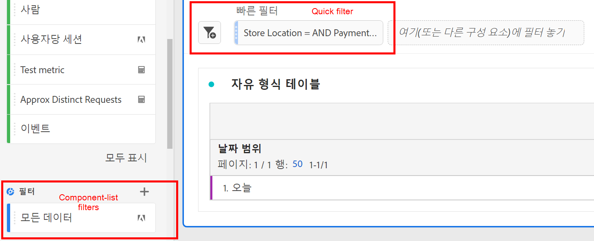
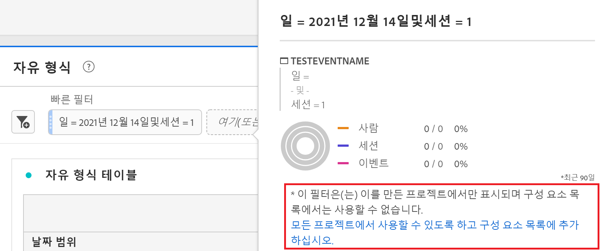

# 빠른 필터

프로젝트에서 빠른 필터를 만들어 복잡한 전체 [필터 빌더](/help/components/filters/create-filters.md)를 우회할 수 있습니다. 빠른 필터

* 적용 대상 [프로젝트 전용 필터](https://experienceleague.adobe.com/docs/analytics-platform/using/cja-components/cja-filters/quick-filters.html#project-only).
* 최대 3개의 규칙 허용
* 중첩 컨테이너이나 순차적 규칙을 수용하지 않습니다.

빠른 필터로 수행할 수 있는 작업과 완전한 구성 요소 목록의 필터로 수행할 수 있는 작업을 비교하려면 [여기](/help/components/filters/filters-overview.md)를 참조하십시오.

다음은 빠른 필터에 대한 비디오입니다(대신 &quot;빠른 세그먼트&quot;라는 용어를 사용함). 그러나 기능은 동일합니다.

>[!VIDEO](https://video.tv.adobe.com/v/341466/?quality=12&learn=on)

## 사전 요구 사항 {#prereqs}

누구나 빠른 필터를 만들 수 있습니다. 그러나 에서는 필터 만들기 권한이 필요합니다 [Adobe Admin Console](https://experienceleague.adobe.com/docs/analytics/admin/admin-console/permissions/summary-tables.html#analytics-tools) 빠른 필터를 저장하거나 필터 빌더에서 열 수 있습니다.

## 빠른 필터 만들기 {#create}

자유 형식 테이블에서 패널 헤드의 필터 + 아이콘을 클릭합니다.

| 설정 | 설명 |
| --- | --- |
| [!UICONTROL 이름] | 필터의 기본 이름은 필터에 있는 규칙 이름의 조합입니다. 필터 이름을 보다 친숙한 이름으로 바꿀 수 있습니다. |
| [!UICONTROL 포함/제외] | 필터 정의에 구성 요소를 포함 또는 제외할 수 있지만 둘 다 할 수는 없습니다. |
| [!UICONTROL 히트/방문/방문자 컨테이너] | 빠른 필터에는 하나의 [필터 컨테이너](https://experienceleague.adobe.com/docs/analytics-platform/using/cja-components/cja-filters/filters-overview.html#filter-containers)만이 포함되어 필터에 차원/지표/날짜 범위를 포함하거나 필터에서 제외할 수 있습니다. [!UICONTROL 방문자]에는 여러 방문 및 페이지 조회수에서 방문자와 관련된 데이터가 포함됩니다. [!UICONTROL 방문] 컨테이너를 사용하여 방문에 따라 방문자의 데이터를 분석하는 규칙을 설정할 수 있고, [!UICONTROL 히트] 컨테이너를 사용하여 개별 페이지 보기에 따라 방문자 정보를 분류할 수 있습니다. 기본 컨테이너는 [!UICONTROL 히트]입니다. |
| [!UICONTROL 구성 요소] (Dimension/지표/날짜 범위) | 구성 요소(차원, 지표, 날짜 범위 또는 차원 값)를 추가하여 최대 3개의 규칙을 정의합니다. 적합한 구성 요소를 검색하는 3가지 방법이 있습니다.<ul><li>입력을 시작하면 [!UICONTROL 빠른 필터] 빌더가 적절한 구성 요소를 자동으로 검색합니다.</li><li>드롭다운 목록을 사용하여 구성 요소를 검색합니다.</li><li>왼쪽 레일에서 구성 요소를 드래그 앤 드롭합니다.</li></ul> |
| [!UICONTROL 연산자] | 드롭다운 메뉴를 사용하여 표준 연산자 및 [!UICONTROL 고유 개수] 연산자를 검색합니다. [필터 연산자](operators.md)를 참조하십시오. |
| 더하기(+) 기호 | 다른 규칙 추가 |
| AND/OR 한정자 | 규칙에 “AND” 또는 “OR” 한정자를 추가할 수 있지만 단일 필터 정의에서는 “AND”와 “OR”를 혼합할 수 없습니다. |
| [!UICONTROL 적용] | 이 필터를 패널에 적용합니다. 필터에 데이터가 포함되지 않은 경우 계속 진행하라는 메시지가 표시됩니다. |
| [!UICONTROL 빌더 열기] | 필터 빌더를 엽니다. 필터 빌더에 필터를 저장하거나 적용하고 나면 더 이상 “빠른 필터”로 간주되지 않습니다. 구성 요소 목록의 필터 라이브러리의 일부가 됩니다. |
| [!UICONTROL 취소] | 이 빠른 필터를 취소합니다. 적용하지 않습니다. |
| [!UICONTROL 날짜 범위] | 유효성 검사기는 패널 날짜 범위를 사용하여 데이터를 조회합니다. 하지만 빠른 필터에 적용되는 날짜 범위는 패널 상단의 패널 날짜 범위를 오버라이드합니다. |
| 이전(오른쪽 상단) | 유효한 필터가 있는지, 필터의 폭이 얼마나 넓은지 볼 수 있습니다. 이 필터를 적용할 경우 표시될 것으로 예상되는 데이터 분류를 표시합니다. 이 필터에 데이터가 없다는 것을 보여 주는 알림을 수신할 수 있습니다. 이 경우 계속 진행하거나 필터 정의를 변경할 수 있습니다. |

다음은 차원과 지표를 결합하는 필터의 예입니다.

필터는 맨 위에 나타납니다. 왼쪽 필터 라이브러리에 있는 구성 요소 수준의 필터가 아니라 파란색 줄무늬 사이드바를 확인합니다.

## 빠른 필터 편집 {#edit}

1. 빠른 필터 위에 커서를 놓고 연필 모양의 아이콘을 선택합니다.
1. 필터 정의 또는 필터 이름을 편집합니다.
1. [!UICONTROL 적용]을 클릭합니다.

## 빠른 필터 저장 {#save}

[!UICONTROL 빠른 필터 빌더] 또는 [!UICONTROL 필터 빌더] 중 하나에서 빠른 필터를 저장하도록 선택할 수 있습니다.

>[!IMPORTANT]
>필터를 저장하거나 적용하면 빠른 필터 빌더에서는 더 이상 편집할 수 없고 정규 필터 빌더에서만 편집할 수 있습니다.

### 빠른 필터 빌더에 저장 {#save2}

1. 빠른 필터를 적용하고 나서 커서를 올려놓은 다음 정보 아이콘(“i“)을 선택합니다.
1. **[!UICONTROL 모든 프로젝트에 사용할 수 있도록 설정하기 및 구성 요소 목록 추가하기]**&#x200B;를 클릭합니다.
1. (선택 사항) 필터 이름을 변경합니다.
1. **[!UICONTROL 저장]**&#x200B;을 클릭합니다.

필터의 사이드바가 파란색 줄무늬에서 보다 연한 파란색으로 어떻게 바뀌는지 확인합니다. 이제 왼쪽 레일의 구성 요소 목록에 표시됩니다.

### 필터 빌더에 저장 {#save3}

1. 빠른 필터 위에 커서를 놓고 정보 아이콘(“i“)을 선택합니다.
1. **[!UICONTROL 필터 저장]**&#x200B;을 선택합니다.
1. 이름을 그대로 유지하거나 필터 이름을 변경합니다.

   작업 영역으로 돌아가 필터에 연한 파란색 사이드바가 어떻게 있는지 확인합니다. 이는 빠른 필터 빌더에서 더 이상 세그먼트를 편집하거나 열 수 없음을 나타냅니다. 저장하면 구성 요소 목록의 일부가 됩니다.

   

필터가 적용되면 필터 구성 요소 목록 추가를 선택하고 모든 프로젝트에 사용할 수 있도록 설정할 수 있습니다.

1. 저장된 필터 위에 커서를 놓고 연필 모양의 아이콘을 선택합니다.

1. 필터 빌더 상단에 이 대화 상자가 표시됩니다.

   

1. **[!UICONTROL 모든 프로젝트에 사용할 수 있도록 설정하고 구성 요소 목록 추가하기]** 옆의 확인란을 선택합니다.
1. **[!UICONTROL 저장]**&#x200B;을 클릭합니다.
1. 이제 필터가 모든 프로젝트의 필터 구성 요소에 표시됩니다.
1. 조직의 다른 사용자와 [필터를 공유](/help/components/filters/manage-filters.md)할 수도 있습니다 .

## 프로젝트 전용 필터는 무엇입니까? {#project-only}

프로젝트 전용 필터는 에서 만든 현재 프로젝트에만 적용되는 필터입니다. 다른 프로젝트에서 사용할 수 없으며 다른 사용자에게 공유할 수 없습니다. 왼쪽 레일에서 필터를 만들고 저장하지 않고 데이터를 빠르게 탐색하기 위한 것입니다. 프로젝트 전용 필터는 빠른 필터 또는 [애드혹 필터](/help/components/filters/ad-hoc-filters.md).

에서 프로젝트 전용 필터를 여는 경우 [!UICONTROL 필터 빌더]에 프로젝트 전용 알림이 표시됩니다. &quot;이 필터를 사용할 수 있도록 설정..&quot;을 선택하지 않으면 을(를) 클릭합니다. **[!UICONTROL 적용]**&#x200B;로 지정하는 경우 세그먼트는 프로젝트 전용 필터로 유지됩니다.

>[!NOTE]
>
>필터 빌더에서 빠른 필터를 적용하는 경우에는 더 이상 [!UICONTROL 빠른 필터 빌더].

&quot;이 필터를 사용할 수 있도록 설정..&quot;을 선택하는 경우 을(를) 클릭합니다. **[!UICONTROL 저장]**&#x200B;를 입력하면 왼쪽 레일 구성 요소 목록에서 필터를 사용하여 다른 프로젝트에서 사용할 수 있습니다. 필터 관리자의 다른 사용자와 공유할 수도 있습니다.

