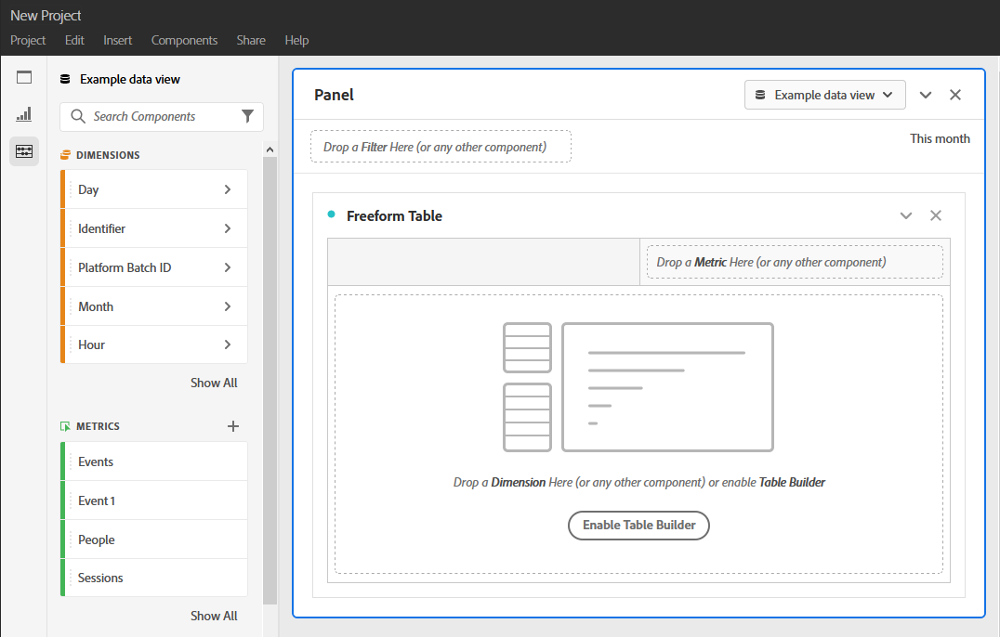

# 프로젝트를 만듭니다.

분석 작업 공간에서 프로젝트를 만드는 방법에는 두 가지가 있습니다.

* 헤더를 [!UICONTROL Projects] 클릭한 다음 을 클릭합니다 [!UICONTROL Create New Project].
* > [!UICONTROL Components] 를 [!UICONTROL Projects]클릭한 다음 추가를 [!UICONTROL Add].

프로젝트를 만들면 빈 작업 공간 프로젝트가 표시됩니다.

<!-- This page serves as a placeholder for the 'Create project' modal that is currently in the old world. -->
