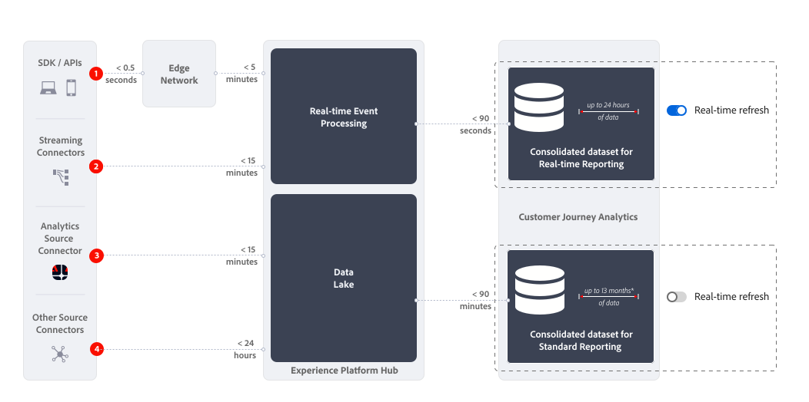

# 실시간 보고 개요

Customer Journey Analytics의 실시간 보고는 Analysis Workspace의 하나 이상의 패널 내에서 데이터와 시각화를 실시간으로 표시하고 업데이트합니다.

{{release-limited-testing}}

{{ultimate-package}}

## 사용 사례

이 섹션에서는 일반적인 가치 있는 사용 사례와 가치가 낮은 사용 사례를 개괄적으로 설명합니다. 또한 실시간 보고를 고려하지 않을 때의 정보입니다.

* 실시간 보고에 가장 중요한 사용 사례는 주요 판매, 프로모션 또는 제품 출시에 대한 것입니다.
론치의 일부로 다음을 알고 싶습니다.

   * 지난번 세일보다 매출이 어떻습니까?
   * 이 제품 출시는 마지막 제품 출시에 비해 어떻습니까?
   * 이 중요한 날이나 이벤트에 대한 프로모션이 실제로 작동합니까?

* 관련성이 있지만 실시간 보고에 대한 사용 사례는 유효성 검사 사용 사례입니다.
유효성을 검사하려는 예:

   * 최근에 시작한 캠페인 여정이 실제로 작동합니까?
   * 새 제품 페이지가 라이브로 전환되면 페이지에서 고객 데이터를 수집하고 있습니까?
   * 라이브 미디어 이벤트가 정상적으로 진행되고 있습니까?

작업 모니터링 사용 사례에 대한 실시간 보고를 고려하지 마십시오. 예를 들어, 사이트가 제대로 작동하는지 여부를 묻는 질문에 답변합니다. [실시간 새로 고침 토글](use-real-time.md)이 30분 후에 자동으로 비활성화되고 실시간 보고서의 새로 고침이 중지되므로, 이러한 사용 사례에 신뢰할 수 있는 소스로 실시간 보고서를 사용해서는 안 됩니다.

## 지연

데이터 수집 방법에 따라 Customer Journey Analytics에 대한 실시간 보고의 실시간 지연 시간이 결정됩니다. 아래 그림과 표는 실시간 및 표준 보고를 사용할 때 다양한 데이터 수집 시나리오에 대한 대략적인 대기 시간을 보여 줍니다.

또한 실시간 보고에서는 표준 보고에 사용된 [통합(결합된) 데이터 세트](/help/connections/combined-dataset.md)와 완전히 별개인 통합 데이터 세트를 사용한다는 점을 강조합니다. [실시간 새로 고침 토글](use-real-time.md)을 사용하여 다음 항목 간에 전환합니다.

* 최대 24시간 동안의 롤링 데이터를 포함하는 통합 데이터 세트에 대한 실시간 보고.
* 최대 13개월의 롤링 데이터를 포함하는 통합 데이터 세트에 대한 표준 보고(또는 확장 데이터 용량 추가 기능에 라이센스를 부여한 경우 더 오래).

{zoomable="yes"}

| | 데이터 수집 | 실시간 보고 지연 | 표준 보고 지연 |
|:---:|---|--:|--:|
| 1 | Edge Network에 Edge Network SDK / API | &amp;approx; &lt; 00h:06m:30 | &amp;approx; &lt; 01h:35m:0 |
| 2 | 스트리밍 커넥터 | &amp;approx; &lt; 00h:16m:30 | &amp;approx; &lt; 01h:45m:0 |
| 3 | Adobe Analytics 소스 커넥터 | &amp;approx; &lt; 00h:16m:30 | &amp;approx; &lt; 01h:45m:0 |
| 4 | 소스 커넥터에 연결된 기타 소스 커넥터(배치 데이터 포함) | &amp;approx; &lt; 24h:01m:30s | &amp;approx; &lt; 25h:30m:00s |

## 제한 사항

실시간 보고에 대한 다음 제한 사항에 유의하십시오.

* 실시간 보고는 24시간의 롤링 기간 동안 사용 가능한 데이터에 대한 보고서만 제공합니다. 다음보다 큰 데이터   24시간 경과는 실시간 보고에 사용할 수 없습니다. 보고서에 대한 [실시간 새로 고침](use-real-time.md)이 비활성화되거나 자동으로 꺼지면 Customer Journey Analytics에서 보고에 일반적으로 사용되는 [통합 데이터 세트](/help/connections/combined-dataset.md)에서 모든 관련 데이터를 한 번 더 사용할 수 있습니다.
* 속성, 세분화, 계산된 지표 등은 24시간의 롤링 기간 내에 사용 가능한 데이터에서만 작동합니다. 예를 들어, *재방문자* 세그먼트에는 지난 24시간 동안 여러 번 방문한 사람만 포함되므로 실시간 보고서에 극히 적은 수의 사람들이 포함됩니다. 더 이상 활성화되지 않은 캠페인을 이전에 클릭한 사람에 대한 실시간 보고서를 만들 때에도 유사한 제한이 적용됩니다.
* 실시간 보고는 이벤트 및 세션 수준 데이터에 가장 잘 작동하며 사용자 수준 데이터에 대한 실시간 보고를 사용하는 것은 주의해야 합니다. <!--Need to explain this a bit better --> 연속 24시간 기간의 이벤트만 실시간 보고서에 사용할 수 있으므로 개인의 이벤트 내역도 이 창으로 제한됩니다. 차원 및 (계산된) 지표를 선택할 때에는 이벤트 및 세션 수준 데이터의 환경 설정을 고려하십시오. 또한 실시간 새로 고침이 활성화된 패널에서 분류, 다음 또는 이전 등과 같은 기능을 사용할 수도 있습니다.
* 실시간 보고와 결합을 결합할 수 없습니다. <!-- Do we need to explain this in more detail, why? --> 실시간 보고는 이벤트 및 세션 수준 데이터에 대한 것으로 사용자 기반 데이터와는 관련성이 낮습니다.
* 미디어 시작 및 미디어 닫기 지표를 제외하고 하트비트 수집 미디어 지표를 사용할 수 없습니다. 따라서 여전히 실시간 보고를 사용하여 미디어 사용 사례를 활성화할 수 있습니다.
* [다운로드 또는 내보내기 옵션](/help/analysis-workspace/export/download-send.md)을 사용하여 프로젝트를 다운로드하거나 자유 형식 테이블에서 데이터를 내보낼 때 다음 사항을 고려하십시오.
   * 다운로드한 CSV 프로젝트 또는 내보낸 CSV 파일에는 다운로드 또는 내보내기 시점에 사용할 수 있는 실시간 데이터가 포함됩니다.
   * 다운로드한 PDF 프로젝트에는 실시간 새로 고침이 비활성화될 때 표시되는 데이터와 유사한 비실시간 데이터가 포함됩니다.
