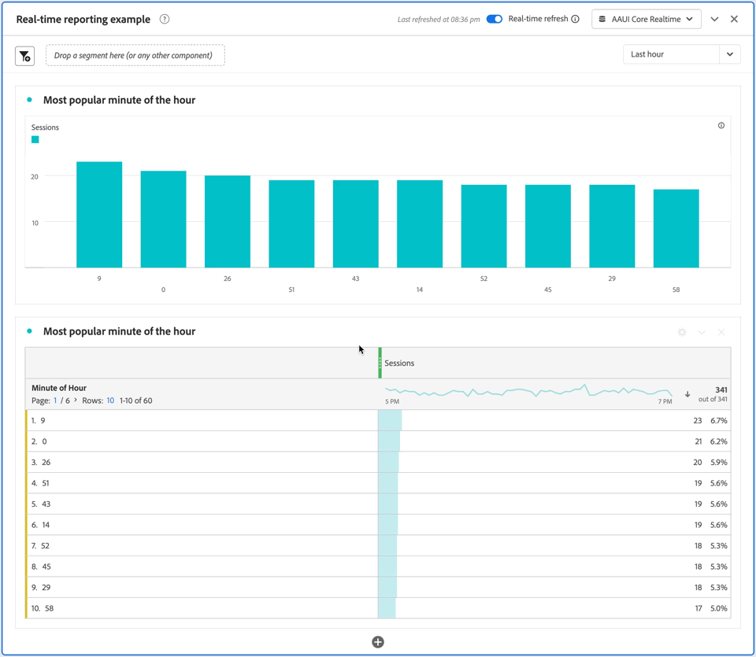

# 실시간 보고 사용 {#use-real-time-reporting}

>[!CONTEXTUALHELP]
>id="workspace_panel_realtime_refresh"
>title="실시간 새로 고침"
>abstract="이 패널에서 데이터와 시각화를 실시간으로 새로 고칠 수 있습니다."

실시간 보고를 사용하려면 Workspace 프로젝트에서 **[!UICONTROL 실시간 새로 고침]** 토글을 사용하도록 설정합니다.

* [빈 패널](/help/analysis-workspace/c-panels/blank-panel.md)
* [자유 형식](/help/analysis-workspace/c-panels/freeform-panel.md)
* [속성](/help/analysis-workspace/c-panels/attribution.md)
* [다음 또는 이전 항목](/help/analysis-workspace/c-panels/next-previous.md)

가장 최근 데이터 새로 고침의 타임스탬프가 포함된 메시지가 표시됩니다. 예: [!UICONTROL  *오후 7시:55에 마지막으로 새로 고침*].

드롭다운 메뉴에서 보고할 실시간 기간을 선택합니다. 사용 가능한 옵션은 다음과 같습니다.

* [!UICONTROL 최근 15분]
* [!UICONTROL 지난 30분]
* [!UICONTROL 지난 시간]
* [!UICONTROL 지난 8시간]
* [!UICONTROL 지난 24시간]

이제 실시간 새로 고침이 활성화된 패널이 있는 브라우저 탭이 활성화되는 동안 패널의 모든 시각화가 매 분마다 최대 30분 동안 업데이트됩니다.

예를 들어, 시간이 **[!UICONTROL 06]**&#x200B;에서 **[!UICONTROL 06]** pm **[!UICONTROL (으)로 이동할 때]**&#x200B;총 수익/시간&#x200B;**[!UICONTROL *막대 시각화 및:26pm*]**&#x200B;총 수익/시간&#x200B;**[!UICONTROL *자유 형식 테이블을 새로 고치는 :27실시간 보고 패널&#x200B;*]**의 스냅숏을 아래를 참조하십시오.

30분 후 또는 브라우저 탭이 비활성화되는 즉시 **[!UICONTROL 실시간 새로 고침]** 토글이 자동으로 비활성화되고 실시간 업데이트가 중지됩니다.

실시간 새로 고침 토글을 사용하지 않도록 설정하면 패널(및 그 안의 모든 시각화)이 [Customer Journey Analytics의 표준 보고 데이터 및 기능 사용](real-time.md#how-it-works)(으)로 돌아갑니다.
