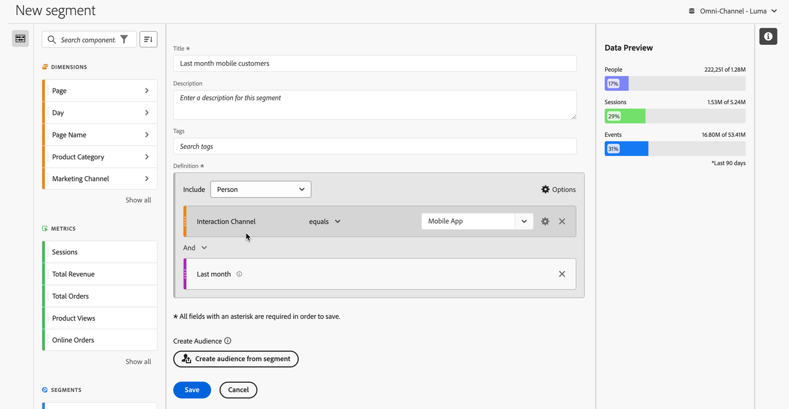
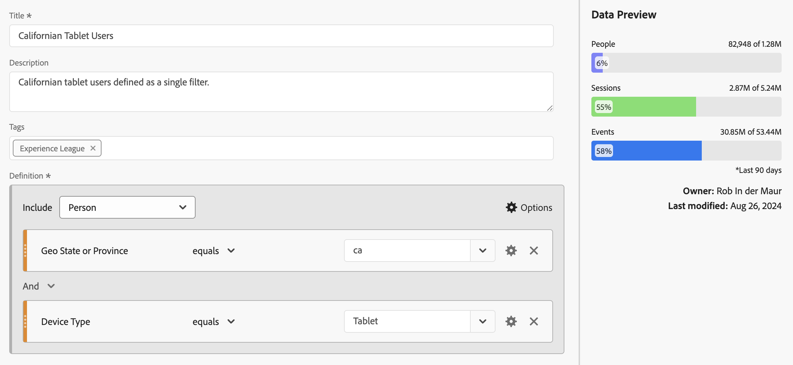

# 세그먼트 빌드 {#build-segments}

>[!CONTEXTUALHELP]
>id="components_filters_createaudience"
>title="대상자 만들기"
>abstract="세그먼트에서 대상자를 만들고 Adobe Experience Platform과 공유하여 활성화할 수 있습니다."

>[!CONTEXTUALHELP]
>id="components_filters_datapreview"
>title="데이터 미리보기"
>abstract="이 세그먼트의 데이터를 데이터 보기의 데이터와 비교합니다. 미리보기 비율은 **지난 90일** 동안의 데이터 보기 총 수를 기준으로 합니다.  미리보기가 로드되지 않는다면 연결이 아직 다시 채우는 중일 수 있습니다."

**[!UICONTROL 세그먼트 빌더]** 대화 상자를 사용하여 세그먼트를 새로 만들거나 기존 필터를 편집합니다. 대화 상자 제목은 [[!UICONTROL 세그먼트] 관리자](/help/components/segments/seg-manage.md)에서 만들거나 관리하는 세그먼트에 대한 **[!UICONTROL 새로운 세그먼트]** 또는 **[!UICONTROL 필터 세그먼트]**&#x200B;으로 지정됩니다.

>[!BEGINTABS]

>[!TAB 세그먼트 빌더]

>[!TAB 세그먼트 만들기 또는 편집]

>[!ENDTABS]

1. 다음 세부 정보를 지정합니다(는 필수 입력 항목).

   | 요소 | 설명 |
   | --- | --- |
   | **[!UICONTROL 데이터 보기]** | 세그먼트에 대한 데이터 보기를 선택할 수 있습니다.  정의한 세그먼트는 데이터 보기의 [설정](/help/data-views/create-dataview.md#settings-filters) 탭에서 세그먼트로 사용할 수 있습니다. |
   | **[!UICONTROL 프로젝트 전용 세그먼트]** | 세그먼트가 생성된 프로젝트에서만 표시되며 구성 요소 목록에 세그먼트가 추가되지 않았다는 것을 설명하는 정보 상자. **[!UICONTROL 이 세그먼트가 모든 프로젝트에 사용할 수 있도록 설정하기 및 구성 요소 목록 추가하기]**&#x200B;를 활성화하여 해당 설정을 변경합니다. 이 정보 상자는 [빠른 세그먼트](seg-quick.md)를 만들고 **[!UICONTROL 빠른 세그먼트]** 인터페이스의 [!UICONTROL 빌더 열기]를 사용하여 빠른 세그먼트 정보를 일반 세그먼트로 전환할 때만 표시됩니다. |
   | **[!UICONTROL 제목]**  | 세그먼트의 이름을 지정합니다(예: `Last month mobile customers`). |
   | **[!UICONTROL 설명]** | 세그먼트에 대한 설명을 입력합니다(예: `Segment to define the mobile customers for the last month`). |
   | **[!UICONTROL 태그]** | 하나 이상의 태그를 만들거나 적용하여 세그먼트를 구성합니다. 이름을 입력하여 선택할 수 있는 기존 태그를 찾습니다. 또는 **[!UICONTROL ENTER]** 키를 눌러 새 태그를 추가합니다. 를 선택하여 태그를 제거합니다. |
   | **[!UICONTROL 정의]**  | [정의 빌더](#definition-builder)를 사용하여 세그먼트를 정의합니다. |

   {style="table-layout:auto"}

1. 세그먼트 정의가 올바른지 확인하려면 오른쪽 상단에서 지속적으로 업데이트되는 세그먼트 결과의 미리보기를 사용합니다.
1. 세그먼트에서 대상자를 만들고 Experience Platform과 대상자를 공유하려면 **[!UICONTROL 세그먼트에서 대상자 만들기]**&#x200B;를 선택합니다. 자세한 내용은 [대상자 만들기 및 게시](/help/components/audiences/publish.md)를 참조하십시오.
1. 다음을 선택합니다.
   * **[!UICONTROL 저장]**: 세그먼트를 저장합니다.
   * **[!UICONTROL 다른 이름으로 저장]**: 세그먼트 사본을 저장합니다.
   * **[!UICONTROL 삭제]**: 세그먼트를 삭제합니다.
   * **[!UICONTROL 취소]**: 세그먼트에 적용된 변경 사항을 취소하거나 새 세그먼트 만들기를 취소합니다.

## 정의 빌더

정의 빌더를 사용하여 세그먼트 정의를 구성합니다. 해당 구성에서는 구성 요소, 컨테이너, 연산자, 논리를 사용합니다.

정의의 유형과 범위를 구성할 수 있습니다.

1. 정의 유형을 지정하려면 포함 정의를 작성할지, 제외 정의를 작성할지 지정합니다.  **[!UICONTROL 옵션]**&#x200B;을 선택하고 드롭다운 메뉴에서 **[!UICONTROL 포함]** 또는 **[!UICONTROL 제외]**&#x200B;를 선택합니다.
1. 정의 범위를 지정하려면 **[!UICONTROL 포함]** 또는 **[!UICONTROL 제외]** 드롭다운 메뉴에서 정의 범위를 **[!UICONTROL 이벤트]**, **[!UICONTROL 세션]**, **[!UICONTROL 개인]**, **[!UICONTROL 글로벌 계정]** [!BADGE B2B edition]{type=Informative url="https://experienceleague.adobe.com/ko/docs/analytics-platform/using/cja-overview/cja-b2b/cja-b2b-edition" newtab=true tooltip="Customer Journey Analytics B2B Edition"}, **[!UICONTROL 계정]** [!BADGE B2B edition]{type=Informative url="https://experienceleague.adobe.com/ko/docs/analytics-platform/using/cja-overview/cja-b2b/cja-b2b-edition" newtab=true tooltip="Customer Journey Analytics B2B Edition"}, **[!UICONTROL 기회]** [!BADGE B2B edition]{type=Informative url="https://experienceleague.adobe.com/ko/docs/analytics-platform/using/cja-overview/cja-b2b/cja-b2b-edition" newtab=true tooltip="Customer Journey Analytics B2B Edition"} 또는 **[!UICONTROL 구매 그룹]** [!BADGE B2B edition]{type=Informative url="https://experienceleague.adobe.com/ko/docs/analytics-platform/using/cja-overview/cja-b2b/cja-b2b-edition" newtab=true tooltip="Customer Journey Analytics B2B Edition"} 중 하나를 선택합니다.

나중에 언제든지 이러한 설정을 변경할 수 있습니다.

### 구성 요소

세그먼트 정의를 구성하는 데 있어 중요한 부분은 차원, 지표, 기존 세그먼트 및 날짜 범위를 사용하는 것입니다. 이러한 모든 구성 요소는 세그먼트 빌더의 구성 요소 패널에서 사용할 수 있습니다.

{width=100%}

구성 요소를 추가하는 방법은 다음과 같습니다.

1. 구성 요소 패널에서 구성 요소를 **[!UICONTROL 지표, 세그먼트 및/또는 차원을 여기에 드래그 앤 드롭]**&#x200B;으로 끌어다 놓습니다. 특정 구성 요소를 검색하려면 구성 요소 표시줄의 을 사용할 수 있습니다.
1. 구성 요소에 대한 세부 정보를 지정합니다. 예를 들어 **[!UICONTROL 값 선택]**&#x200B;에서 값을 선택합니다. 또는 값을 입력합니다. 하나 이상의 값을 지정하는 방법은 구성 요소와 연산자에 따라 다릅니다.
1. 필요한 경우 기본 연산자를 수정합니다. 예: **[!UICONTROL 다음과 같음]**&#x200B;에서 **[!UICONTROL 다음 중 하나 이상의 항목과 같음]**&#x200B;으로 수정. 사용 가능한 연산자에 대한 자세한 개요는 [연산자](seg-operators.md)를 참조하십시오.

구성 요소 편집 방법:

* 연산자 드롭다운 메뉴에서 구성 요소에 대한 새 연산자를 선택합니다.
* 적절한 경우 연산자에 대해 다른 값을 선택하거나 지정합니다.
* 구성 요소 유형이 차원인 경우, 속성 모델을 정의할 수 있습니다. 자세한 내용은 [속성 모델](#attribution)을 참조하십시오.

구성 요소 삭제 방법:

* 구성 요소에서 를 선택합니다.

### 컨테이너

여러 구성 요소를 하나 이상의 컨테이너로 그룹화하고 컨테이너 내부 및 컨테이너 간의 논리를 정의할 수 있습니다. 컨테이너를 사용하면 세그먼트에 대한 복잡한 정의를 만들 수 있습니다.

{Width=100%}

* 컨테이너를 추가하려면  **[!UICONTROL 옵션]**&#x200B;에서 **[!UICONTROL 컨테이너 추가]**&#x200B;를 선택합니다.
* 컨테이너에 기존 구성 요소를 추가하려면 구성 요소를 컨테이너로 끌어다 놓습니다.
* 컨테이너에 다른 구성 요소를 추가하려면 구성 요소 패널에서 컨테이너로 구성 요소를 끌어다 놓습니다. 파란색 삽입선을 가이드로 활용합니다.
* 컨테이너 외부에 다른 구성 요소를 추가하려면 구성 요소 패널에서 구성 요소를 컨테이너 외부가 아닌 기본 정의 컨테이너 내부로 끌어다 놓습니다. 파란색 삽입선을 가이드로 활용합니다.
* 컨테이너 내 구성 요소 간, 컨테이너 간 또는 컨테이너와 구성 요소 간의 논리를 수정하려면 적절한 **[!UICONTROL And]**, **[!UICONTROL Or]**, **[!UICONTROL Then]**&#x200B;을 선택합니다. Then을 선택하면 세그먼트가 순차적 세그먼트로 전환됩니다. 자세한 내용은 [순차적 세그먼트 만들기](seg-sequential-build.md)를 참조하십시오.
* 컨테이너 수준을 전환하려면  **[!UICONTROL 글로벌 계정]**([!BADGE B2B 에디션]{type=Informative url="https://experienceleague.adobe.com/ko/docs/analytics-platform/using/cja-overview/cja-b2b/cja-b2b-edition" newtab=true tooltip="Customer Journey Analytics B2B Edition"}),  **[!UICONTROL 계정]**([!BADGE B2B 에디션]{type=Informative url="https://experienceleague.adobe.com/ko/docs/analytics-platform/using/cja-overview/cja-b2b/cja-b2b-edition" newtab=true tooltip="Customer Journey Analytics B2B Edition"}),  **[!UICONTROL 기회]**([!BADGE B2B 에디션]{type=Informative url="https://experienceleague.adobe.com/ko/docs/analytics-platform/using/cja-overview/cja-b2b/cja-b2b-edition" newtab=true tooltip="Customer Journey Analytics B2B Edition"}),  **[!UICONTROL 구매 그룹]**([!BADGE B2B 에디션]{type=Informative url="https://experienceleague.adobe.com/ko/docs/analytics-platform/using/cja-overview/cja-b2b/cja-b2b-edition" newtab=true tooltip="Customer Journey Analytics B2B Edition"}),  **[!UICONTROL 이벤트]**,  **[!UICONTROL 세션]** 또는  **[!UICONTROL 개인]** 중 하나를 선택합니다.

다음 액션을 위해 컨테이너에서 을 사용할 수 있습니다.

| 컨테이너 액션 | 설명 |
|---|---|
| **[!UICONTROL 컨테이너 추가]** | 컨테이너에 중첩된 컨테이너를 추가합니다. |
| **[!UICONTROL 제외]** | 세그먼트 정의의 컨테이너에서 결과를 제외합니다. 가는 빨간색 왼쪽 막대가 제외 컨테이너를 식별합니다. |
| **[!UICONTROL 포함]** | 세그먼트 정의의 컨테이너에서 결과를 포함합니다. 포함이 기본값입니다. 가는 회색 왼쪽 막대는 포함 컨테이너를 식별합니다. |
| **[!UICONTROL 이름 컨테이너]** | 기본 설명에서 컨테이너의 이름을 바꿉니다. 텍스트 필드에 이름을 입력합니다. 아무런 입력도 하지 않으면 기본 설명이 사용됩니다. |
| **[!UICONTROL 컨테이너 삭제]** | 정의에서 컨테이너를 삭제합니다. |

## 날짜 범위

순환 날짜 범위를 포함하는 세그먼트를 만들 수 있습니다. 따라서 진행 중인 캠페인이나 이벤트에 대한 질문에 답변할 수 있습니다. 예를 들면 *지난 60일 동안 온라인으로 구매한 모든 사람*&#x200B;을 포함하는 세그먼트를 작성할 수 있습니다.

>[!BEGINSHADEBOX]

데모 비디오를 보려면  [세그먼트별 롤링 날짜 범위](https://video.tv.adobe.com/v/25403/?quality=12&learn=on){target="_blank"}를 확인하십시오.

>[!ENDSHADEBOX]

## 세그먼트 스택 {#stack}

세그먼트를 사용하여 세그먼트를 작성할 수 있습니다. 세그먼트에서 세그먼트를 사용하면 세그먼트를 최적화하고 복잡성을 줄일 수 있습니다.

디바이스 유형(2)과 미국 주(50)의 조합을 세분화하려고 한다고 가정해 보겠습니다. 각각 디바이스 유형(휴대전화와 태블릿)과 미국 주의 고유한 조합에 따라 100개의 세그먼트를 만들 수 있습니다. 캘리포니아의 태블릿 사용자를 얻으려면 100개 세그먼트 중 하나를 사용하면 됩니다.

또는 52개의 세그먼트를 정의할 수 있습니다. 미국 주에 대한 세그먼트 50개, 휴대전화에 대한 세그먼트 1개, 태블릿에 대한 세그먼트필터 1개입니다. 그런 다음 세그먼트를 누적하여 동일한 결과를 얻을 수 있습니다. 캘리포니아의 태블릿 사용자를 얻으려면 두 가지 세그먼트를 적용해야 합니다.

## 속성 {#attribution}

>[!CONTEXTUALHELP]
>id="components_filters_attribution_repeating"
>title="반복"
>abstract="차원에 대한 인스턴스 및 지속된 값 포함"

>[!CONTEXTUALHELP]
>id="components_filters_attribution_instance"
>title="인스턴스"
>abstract="차원에 대한 인스턴스를 포함합니다."

>[!CONTEXTUALHELP]
>id="components_filters_attribution_nonrepeatinginstance"
>title="비반복 인스턴스"
>abstract="차원에 대한 고유(비반복) 인스턴스를 포함합니다."

세그먼트 빌더에서 차원을 사용하면 해당 차원에 대한 속성 모델을 지정하는 옵션이 제공됩니다. 선택한 속성 모델은 차원 구성 요소에 대해 지정한 조건에 데이터가 적합한지 여부를 결정합니다.

차원 구성 요소 내에서 을 선택하고 팝업에서 속성 모델 중 하나를 선택합니다.

| 모델 | 설명 |
|---|---|
| **[!UICONTROL 반복 모델 (기본값)]** | 선별을 결정하기 위해 차원에 대한 인스턴스 값과 지속되는 값을 포함합니다. |
| **[!UICONTROL 인스턴스]** | 선별을 결정하기 위해 차원에 대한 인스턴스 값만 포함합니다. |
| **[!UICONTROL 비반복 인스턴스]** | 선별을 결정하기 위해 차원에 대한 고유한 인스턴스(비반복) 값을 포함합니다. |

### 예

세그먼트 정의의 일부로 다음 조건을 지정했습니다. 페이지 이름이 여성과 같다. 위의 예와 유사합니다. 나머지 두 가지 속성 모델을 사용하여 이 세그먼트 정의를 반복합니다. 따라서 각각 고유한 속성 모델이 있는 세 개의 세그먼트가 있습니다.

* 여성 페이지 - 속성 - 반복 (기본값)
* 여성 페이지 - 속성 - 인스턴스
* 여성 페이지 - 속성 - 비반복 인스턴스

아래 테이블은 각 속성 모델에 대해 해당 조건에 적합한 에 해당하는 수신 이벤트를 설명합니다.

| 여성 페이지 - 속성 -  *속성 모델* | 이벤트 1: 페이지 이름이 여성과 같음  | 이벤트 2: 페이지 이름이 남성과 같음  | 이벤트 3: 페이지 이름이 여성과 같음  | 이벤트 4: 페이지 이름이 여성과 같음 (지속) | 이벤트 5: 페이지 이름이 체크아웃과 같음  | 이벤트 6: 페이지 이름이 여성과 같음  | 이벤트 7: 페이지 이름이 홈과 같음  |
|---|:---:|:---:|:---:|:---:|:---:|:---:|:--:|
| 반복 (기본값) |  |  |  |  |  |  |  |
| 인스턴스 |  |  |  |  |  |  |  |
| 비반복 인스턴스 |  |  |  |  |  |  |  |

세 가지 세그먼트를 사용한 이벤트 보고서의 예는 다음과 같습니다.

