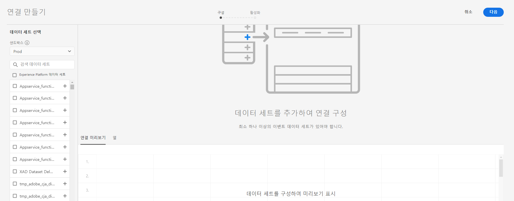

# 연결 만들기

연결을 통해 [!DNL Adobe Experience Platform]의 데이터 세트를 [!UICONTROL 작업 공간]에 통합할 수 있습니다. [!DNL Experience Platform] 데이터 세트에 대해 보고하려면 먼저 [!DNL Experience Platform]과 [!UICONTROL 작업 공간]의 데이터 세트 간에 연결을 설정해야 합니다.

비디오 개요를 보려면 [여기](https://docs.adobe.com/content/help/en/platform-learn/tutorials/cja/connecting-customer-journey-analytics-to-data-sources-in-platform.html)를 클릭하십시오.

>[!IMPORTANT]
>
>여러 [!DNL Experience Platform] 데이터 세트를 하나의 연결로 결합할 수 있습니다.

## 샌드박스 및 데이터 세트 선택

1. [https://analytics.adobe.com](https://analytics.adobe.com)으로 이동합니다.

1. **[!UICONTROL 연결]** 탭을 클릭합니다.

1. 오른쪽 상단에 있는 **[!UICONTROL 새 연결 만들기]**&#x200B;를 클릭합니다.

   

1. 연결을 만들 데이터 세트가 포함된 Experience Platform의 샌드박스를 선택합니다.

   Adobe Experience Platform은 디지털 경험 애플리케이션을 개발하고 발전시키는 데 도움이 되는 단일 플랫폼 인스턴스를 별도의 가상 환경으로 분할하는 [샌드박스](https://docs.adobe.com/content/help/ko-KR/experience-platform/sandbox/home.html)를 제공합니다. 샌드박스를 데이터 세트가 포함된 &quot;데이터 사일로&quot;로 간주할 수 있습니다. 샌드박스는 데이터 세트에 대한 액세스를 제어하는 데 사용됩니다.  샌드박스를 선택하면 왼쪽 레일에 해당 샌드박스에서 가져올 수 있는 모든 데이터 세트가 표시됩니다.

   >[!IMPORTANT]
   >
   >샌드박스 간에 데이터를 액세스할 수 없습니다. 즉, 하나의 샌드박스 내에서만 데이터 세트를 결합할 수 있습니다.

1. [!UICONTROL Customer Journey Analytics]로 가져올 데이터 세트를 한 개 이상 선택하고 **[!UICONTROL 추가]**&#x200B;를 클릭합니다.

   (선택할 데이터 세트가 많을 경우 데이터 세트 목록 위에 있는 **[!UICONTROL 데이터 세트 검색]** 검색 막대를 사용하여 올바른 데이터 세트를 검색할 수 있습니다.)

## 데이터 세트 구성

오른쪽에서는 추가한 데이터 세트를 구성할 수 있습니다.

1. **[!UICONTROL 데이터 세트 유형]**: 이 연결에 추가한 각 데이터 세트에 대해 가져오는 데이터를 기반으로 데이터 세트 유형을 [!UICONTROL Customer Journey Analytics]에서 자동으로 설정합니다.

   [!UICONTROL 이벤트] 데이터, [!UICONTROL 프로필] 데이터 및 [!UICONTROL 조회] 데이터의 세 가지 데이터 세트 유형이 있습니다.

   | 데이터 세트 유형 | 설명 | 타임스탬프 | 스키마 | 개인 ID |
   |---|---|---|---|---|
   | [!UICONTROL 이벤트] | 시간으로 이벤트를 나타내는 데이터(예: 웹 방문, 상호 작용, 거래, POS 데이터, 설문 조사 데이터, 광고 노출 데이터 등). 예를 들어 고객 ID 또는 쿠키 ID와 타임스탬프가 있는 일반적인 클릭스트림 데이터일 수 있습니다. 이벤트 데이터를 사용하면 개인 ID로 사용할 ID를 유연하게 선택할 수 있습니다. | [UICONTROL Experience Platform]의 이벤트 기반 스키마에서 기본 타임스탬프 필드로 자동 설정됩니다. | 시간 일련 동작 있는 XDM 클래스를 기반으로 하는 모든 내장 또는 스키마 또는 사용자 지정 스키마. 예를 들면 &quot;XDM 경험 이벤트&quot; 또는 &quot;XDM 결정 이벤트&quot;가 해당됩니다. | 포함할 개인 ID를 선택할 수 있습니다. Experience Platform에 정의된 각 데이터 세트 스키마에는 1개 이상의 ID가 ID 네임스페이스로 정의되고 연결된 고유한 ID 세트가 있을 수 있습니다. 이 중 원하는 ID를 개인 ID로 사용할 수 있습니다. 예를 들면 쿠키 ID, 결합된 ID, 사용자 ID, 추적 코드 등이 있습니다. |
   | [!UICONTROL 조회] | (기존 Adobe Analytics의 분류 파일과 유사) 이 데이터는 이벤트 또는 프로필 데이터에 있는 값이나 키를 찾는 데 사용됩니다. 예를 들어 이벤트 데이터의 숫자 ID를 제품 이름에 매핑하는 조회 데이터를 업로드할 수 있습니다. 자세한 내용은 [본 사용 사례](/help/use-cases/b2b.md) for an example. | 해당 없음 | XDM 개별 프로필 클래스를 제외하고, &quot;기록&quot; 동작이 있는 XDM 클래스를 기반으로 한 모든 내장 스키마 또는 사용자 지정 스키마. | 해당 없음 |
   | [!UICONTROL 프로필] | [!UICONTROL 고객 속성]의 비변경 및 비임시 속성과 유사합니다. [!UICONTROL 이벤트] 데이터에서 방문자, 사용자 또는 고객에 적용되는 데이터. 예를 들어 고객에 대한 CRM 데이터를 업로드할 수 있습니다. | 해당 없음 | XDM 개인 프로필 클래스를 기반으로 하는 모든 내장 또는 사용자 지정 스키마. | 포함할 개인 ID를 선택할 수 있습니다. [!DNL Experience Platform]에 정의된 각 데이터 세트에는 쿠키 ID, 결합된 ID, 사용자 ID, 추적 코드 등과 같은 개인 ID가 하나 이상 정의된 고유한 ID 세트가 있습니다. **참고**: ID가 다른 데이터 세트가 포함된 연결을 만들면 이러한 내용이 보고에 반영됩니다. 데이터 세트를 실제로 병합하려면 동일한 개인 ID를 사용해야 합니다. |

1. **[!UICONTROL 데이터 세트 ID]**: 이 ID는 자동으로 생성됩니다.

1. **[!UICONTROL 타임스탬프]**: 여기에 컨텐츠를 추가합니다.

1. **[!UICONTROL 스키마]**: Adobe Experience Platform에서 데이터 세트를 만드는 데 사용한 [스키마](https://docs.adobe.com/content/help/ko-KR/experience-platform/xdm/schema/composition.html)입니다.

1. **[!UICONTROL 개인 ID]**: 사용 가능한 ID의 드롭다운 목록에서 개인 ID를 선택합니다. 이러한 ID는 Experience Platform의 데이터 세트 스키마에 정의되어 있습니다. ID 맵을 개인 ID로 사용하는 방법에 대한 자세한 내용은 아래를 참조하십시오.

   >[!IMPORTANT]
   >
   >선택할 개인 ID가 없는 경우, 하나 이상의 개인 ID가 스키마에 정의되어 있지 않음을 의미합니다. [이 비디오](https://youtu.be/G_ttmGl_LRU)를 보고 Experience Platform에서 ID를 정의하는 방법을 확인하십시오.

1. **[!UICONTROL 다음]**&#x200B;을 클릭하여 [!UICONTROL 연결 활성화] 대화 상자로 이동합니다.

### ID 맵을 개인 ID로 사용

Customer Journey Analytics에서는 이제 개인 ID로 ID 맵을 사용하는 기능을 지원합니다. ID 맵은 사용자의 키 -> 값 쌍 업로드를 허용하는 맵 데이터 구조입니다. 키는 ID 네임스페이스이며, 값은 ID 값을 가지는 구조입니다. ID 맵은 업로드된 각 행/이벤트에 있으며 해당 행에 맞게 작성됩니다.

ID 맵은 [ExperienceEvent XDM](https://docs.adobe.com/content/help/ko-KR/experience-platform/xdm/home.html) 클래스 기반의 스키마를 사용하는 데이터 세트에 사용 가능합니다. CJA 연결에 이러한 데이터 세트를 포함하도록 선택하는 경우, 필드를 기본 ID나 ID 맵으로 선택하는 옵션이 제공됩니다.

ID 맵을 선택하면 두 가지 추가 구성 옵션이 제공됩니다.

| 옵션 | 설명 |
|---|---|
| [!UICONTROL 기본 ID 네임스페이스 사용] | CJA가 ID 맵에서 행마다 primary=true 속성으로 표시된 ID를 찾아 해당 행의 개인 ID로 사용합니다. 즉, Experience Platform에서 파티셔닝에 사용할 기본 키입니다. 또한 CJA의 방문자 ID로 사용하기에 가장 적합한 후보입니다(CJA 연결에 데이터 세트가 구성되는 방법에 따라 다름). |
| [!UICONTROL 네임스페이스] | (이 옵션은 기본 ID 네임스페이스를 사용하지 않는 경우에만 사용할 수 있습니다.) ID 네임스페이스는 [Adobe Experience Platform ID 서비스](https://docs.adobe.com/content/help/ko-KR/experience-platform/identity/namespaces.html)의 구성 요소이며 ID가 연관되는 컨텍스트의 지표 역할을 합니다. 네임스페이스를 지정하면 CJA에서 각 행의 ID 맵을 검색하여 이 네임스페이스 키를 찾고 해당 네임스페이스 아래의 ID를 해당 행의 개인 ID로 사용합니다. CJA에서는 실제로 사용 중인 네임스페이스가 무엇인지 확인하기 위해서 모든 행의 전체 데이터 세트를 스캔할 수 없으므로 가능한 모든 네임스페이스가 드롭다운에 나열됩니다. 데이터에 지정된 네임스페이스를 알아야 하지만 자동으로 검색되지 않습니다. |

### ID 맵의 극단적 사례

이 표에서는 극단적 사례가 있을 때 이 사례들이 처리되는 방식을 두 가지 구성 옵션으로 보여줍니다.

| 옵션 | ID가 ID 맵에 없음 | 기본 ID로 표시된 ID 없음 | 여러 ID가 기본 ID로 표시됨 | 단일 ID가 기본 ID로 표시됨 | 기본 ID로 표시된 ID의 네임스페이스가 잘못됨 |
|---|---|---|---|---|---|
| **&quot;기본 ID 네임스페이스 사용&quot;이 선택됨** | 행이 CJA에서 삭제됩니다. | 기본 ID가 지정되지 않아서 행이 CJA에서 삭제됩니다. | 모든 네임스페이스에서 기본 ID로 표시된 모든 ID가 목록으로 추출됩니다. 그런 다음 알파벳순으로 정렬됩니다. 이렇게 정렬되면 첫 번째 ID가 있는 첫 번째 네임스페이스가 개인 ID로 사용됩니다. | 기본 ID로 표시된 단일 ID가 개인 ID로 사용됩니다. | 네임스페이스가 유효하지 않을 수 있지만(AEP에 없음) CJA는 해당 네임스페이스 아래의 기본 ID를 개인 ID로 사용합니다. |
| **특정 ID 맵 네임스페이스가 선택됨** | 행이 CJA에서 삭제됩니다. | 선택한 네임스페이스 아래의 모든 ID가 목록으로 추출되며 첫 번째 ID를 개인 ID로 사용합니다. | 선택한 네임스페이스 아래의 모든 ID가 목록으로 추출되며 첫 번째 ID를 개인 ID로 사용합니다. | 선택한 네임스페이스 아래의 모든 ID가 목록으로 추출되며 첫 번째 ID를 개인 ID로 사용합니다. | 선택한 네임스페이스 아래의 모든 ID가 목록으로 추출되며 첫 번째 ID를 개인 ID로 사용합니다. (연결 생성 시 올바른 네임스페이스만 선택할 수 있으므로 잘못된 네임스페이스/ID를 개인 ID로 사용할 수 없습니다.) |

## 연결 활성화

1. 연결을 활성화하려면 다음 설정을 정의합니다.

   | 옵션 | 설명 |
   |---|---|
   | [!UICONTROL 이름 연결] | 연결을 설명하는 이름을 지정합니다. 연결을 저장할 때 반드시 이름을 지정해야 합니다. |
   | [!UICONTROL 설명] | 이 연결을 다른 연결과 구분하려면 세부 사항을 더 추가합니다. |
   | [!UICONTROL 데이터 세트] | 이 연결에 포함된 데이터 세트입니다. |
   | [!UICONTROL 오늘부터 이 연결에 있는 모든 새 데이터 세트를 자동으로 가져옵니다.] | 이 연결의 데이터 세트에 추가되는 모든 새 데이터 배치가 자동으로 [!UICONTROL 작업 공간]으로 연결되도록 지속적인 연결을 설정하려면 이 옵션을 선택합니다. |
   | [!UICONTROL 기존 데이터 모두 가져오기] | 이 옵션을 선택하고 연결을 저장하면 이 연결에 있는 모든 데이터 세트에 대한 기존(이전) 데이터를 모두 [!DNL Experience Platform]에서 가져옵니다. 이후에 여기에 저장된 연결에 추가된 새로운 데이터 세트에 대한 기존의 모든 이전 데이터도 자동으로 가져옵니다.  **이 연결이 저장되면 이 설정을 변경할 수 없습니다.** |

   **주의 사항:**

   * 연결하는 모든 데이터 세트에 대한 이전 데이터의 누적 크기가 15억 행을 초과하는 경우 이 크기의 이전 데이터를 가져올 수 없다는 오류 메시지가 표시됩니다. 하지만 10억 개의 이전 데이터 행이 포함된 데이터 세트를 추가하고 해당 데이터를 가져온 다음 1주일 후에 동일한 크기의 다른 데이터 세트를 추가하고 해당하는 이전 데이터를 가져오는 경우에는 문제 없이 수행됩니다.
   * 연결하는 데이터 세트에 추가된 새 데이터에 우선 순위를 두므로 이 데이터의 지연 시간이 가장 짧습니다.
   * 모든 채우기(이전) 데이터는 더 느린 속도로 가져옵니다.

1. **[!UICONTROL 저장]**&#x200B;을 클릭합니다.

워크플로우의 다음 단계는 [데이터 보기를 만드는](/help/data-views/create-dataview.md) 것입니다.
