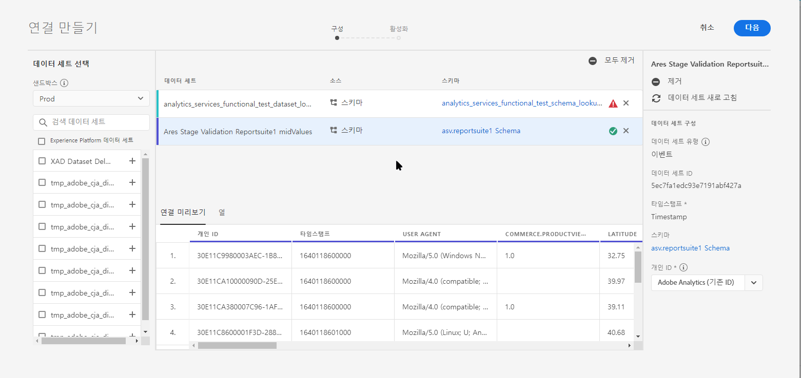

# 연결 만들기

연결을 사용하면 데이터 세트를 작업 공간 [!DNL Adobe Experience Platform] 에 [!UICONTROL 통합할 수 있습니다]. 데이터 세트에 대해 보고하려면 먼저 데이터 세트와 작업 공간 [!DNL Experience Platform] 의 데이터 세트 간 연결을 [!DNL Experience Platform] 설정해야 합니다 .

비디오 개요를 보려면 [여기를](https://docs.adobe.com/content/help/en/platform-learn/tutorials/cja/connecting-customer-journey-analytics-to-data-sources-in-platform.html) 클릭하십시오.

>[!IMPORTANT] 여러 데이터 [!DNL Experience Platform] 세트를 하나의 연결로 결합할 수 있습니다.

1. https://analytics.adobe.com으로 [이동합니다](https://analytics.adobe.com).

1. Click the **[!UICONTROL Connections]** tab.

1. 오른쪽 **[!UICONTROL 상단에 있는 새 연결]** 만들기를 클릭합니다.

   

1. 먼저 데이터 세트 **[!UICONTROL 선택]**&#x200B;아래에서 연결을 만들 데이터 세트를 포함하는 경험 플랫폼의 [!UICONTROL 샌드박스를] 선택합니다.
Adobe Experience Platform은 단일 [플랫폼 인스턴스를 별도의 가상 환경에 분할하는 샌드박스를](https://docs.adobe.com/content/help/en/experience-platform/sandbox/home.html) 제공합니다. 샌드박스를 [!UICONTROL 데이터] 세트를 포함하고 데이터 세트에 대한 액세스를 제어하는 데 사용되는 &quot;데이터 사일로&quot;로 간주할 수 있습니다. 샌드박스 간에 데이터에 액세스할 수 [!UICONTROL 없습니다].

1. 샌드박스를 선택하면 왼쪽 레일은 해당 샌드박스의 모든 데이터 세트를 표시합니다. 고객 여정 분석으로 가져올 데이터 세트를 하나 이상 선택하고 [!UICONTROL 추가를] 클릭합니다 ****. 선택할 데이터 세트가 많을 경우 데이터 집합 목록 위의 검색 막대를 사용하여 올바른 데이터 집합을 검색할 수 있습니다.

1. 다음으로 이 연결에 추가한 각 데이터 세트에 대해 [!UICONTROL 고객 경로] 분석 기능은 들어오는 데이터를 기반으로 데이터 세트 유형을 자동으로 설정합니다. 세 가지 데이터 세트 유형이 있습니다. [!UICONTROL 이벤트] 데이터, [!UICONTROL 프로필] 데이터 및 [!UICONTROL 조회] 데이터.

   | 데이터 세트 유형 | 설명 | 타임스탬프 | 스키마 | 개인 ID |
   |---|---|---|---|---|
   | [!UICONTROL 이벤트] | 시간에 따라 이벤트를 나타내는 데이터(예: 웹 방문, 상호 작용, 거래, POS 데이터, 설문 조사 데이터, 광고 노출 데이터 등) 예를 들어 고객 ID 또는 쿠키 ID와 타임스탬프가 있는 일반적인 클릭스트림 데이터일 수 있습니다. 이벤트 데이터를 사용하면 개인 ID로 사용되는 ID에 대해 유연하게 대처할 수 있습니다. | UICONTROL Experience Platform의 이벤트 기반 스키마에서 기본 [타임스탬프 필드로 자동 설정됩니다]. | &quot;시간 시리즈&quot; 비헤이비어가 있는 XDM 클래스를 기반으로 하는 내장 스키마 또는 사용자 정의 스키마 &quot;XDM 경험 이벤트&quot; 또는 &quot;XDM 결정 이벤트&quot;가 그 예입니다. | 포함할 사람 ID를 선택할 수 있습니다. 경험 플랫폼에서 정의된 각 데이터 세트 스키마는 ID 네임스페이스와 정의되고 연결된 하나 이상의 ID 집합을 가질 수 있습니다. 이 중 하나를 개인 ID로 사용할 수 있습니다. 쿠키 ID, 스티칭된 ID, 사용자 ID, 추적 코드 등이 있습니다. |
   | [!UICONTROL 조회] | 분류 파일과 유사합니다. 이 데이터는 이벤트 또는 프로필 데이터에 있는 값이나 키를 찾는 데 사용됩니다. 예를 들어 이벤트 데이터의 숫자 ID를 제품 이름으로 매핑하는 조회 데이터를 업로드할 수 있습니다. | 해당 없음 | &quot;XDM 개별 프로필&quot; 클래스를 제외한 &quot;기록&quot; 비헤이비어가 있는 XDM 클래스를 기반으로 하는 내장 스키마 또는 사용자 지정 스키마 | 해당 없음 |
   | [!UICONTROL 프로필] | 고객 [!UICONTROL 속성과] 유사하며, 변경되지 않고 비임시 속성에 해당됩니다. 방문자, 사용자 또는 [!UICONTROL 이벤트] 데이터에 있는 고객에게 적용되는 데이터입니다. 예를 들어 고객에 대한 CRM 데이터를 업로드할 수 있습니다. | 해당 없음 | &quot;XDM 개인 프로필&quot; 클래스를 기반으로 하는 모든 내장 또는 사용자 정의 스키마. | 포함할 사람 ID를 선택할 수 있습니다. 에 정의된 각 데이터 세트에 [!DNL Experience Platform] 는 쿠키 ID, 연결된 ID, 사용자 ID, 추적 코드 등과 같은 하나 이상의 개인 ID가 정의된 고유한 세트가 있습니다. **IDNote **: ID가 다른 데이터 세트를 포함하는 연결을 만들면 보고에 해당 ID가 반영됩니다. 데이터 집합을 실제로 병합하려면 동일한 개인 ID를 사용해야 합니다. |

1. 다음 **[!UICONTROL 을]** 클릭하면 연결 [!UICONTROL 만들기 대화 상자가] 표시됩니다.

   

1. 연결 [!UICONTROL 만들기] 대화 상자에서 다음 설정을 정의합니다.

   | 필드 | 설명 |
   |---|---|
   | [!UICONTROL 이름 연결] | 연결 상태를 설명하는 이름을 지정합니다. 이름 없이 연결을 저장할 수 없습니다. |
   | [!UICONTROL 설명] | 이 연결을 다른 연결과 구분하려면 세부 사항을 더 추가하십시오. |
   | [!UICONTROL 데이터 세트] | 이 연결에 포함된 데이터 집합. |
   | [!UICONTROL 이 연결에 있는 모든 새 데이터 세트를 자동으로 가져옵니다.] | 이 연결의 데이터 세트에 추가되는 모든 새 데이터 배치가 자동으로 Workspace로 [!UICONTROL 들어오도록 지속적인 연결을 설정하려면 이 옵션을 선택합니다]. |
   | [!UICONTROL 기존 데이터 모두 가져오기] | 이 옵션을 선택하고 연결을 저장하면 이 연결에 있는 모든 데이터 세트에 대한 기존(기록) 데이터 [!DNL Experience Platform] 를 모두 가져옵니다. 나중에 이 저장된 연결에 추가된 새로운 데이터 세트에 대한 기존 모든 내역 데이터도 자동으로 가져옵니다.  **이 연결이 저장되면 이 설정을 변경할 수 없습니다.** |

   **주의 사항:**

   * 연결에 있는 모든 데이터 세트에 대한 기록 데이터의 누적 크기가 15억 행을 초과하는 경우 이 양의 내역 데이터를 가져올 수 없다는 오류 메시지가 표시됩니다. 하지만 10억 개의 이전 데이터 행을 포함하는 데이터 세트를 추가하고 해당 데이터를 가져온 다음 1주일 후에 동일한 크기의 다른 데이터 세트를 추가하고 내역 데이터를 가져오는 경우 이렇게 됩니다.
   * 연결에서 데이터 세트에 추가된 새 데이터의 우선 순위를 지정하므로 이 데이터의 지연 시간이 가장 짧습니다.
   * 모든 채우기(기록) 데이터는 더 느린 속도로 가져옵니다.

1. **[!UICONTROL 저장을]** 클릭합니다.

워크플로우의 다음 단계는 데이터 보기를 [만드는 것입니다](/help/data-views/create-dataview.md).
