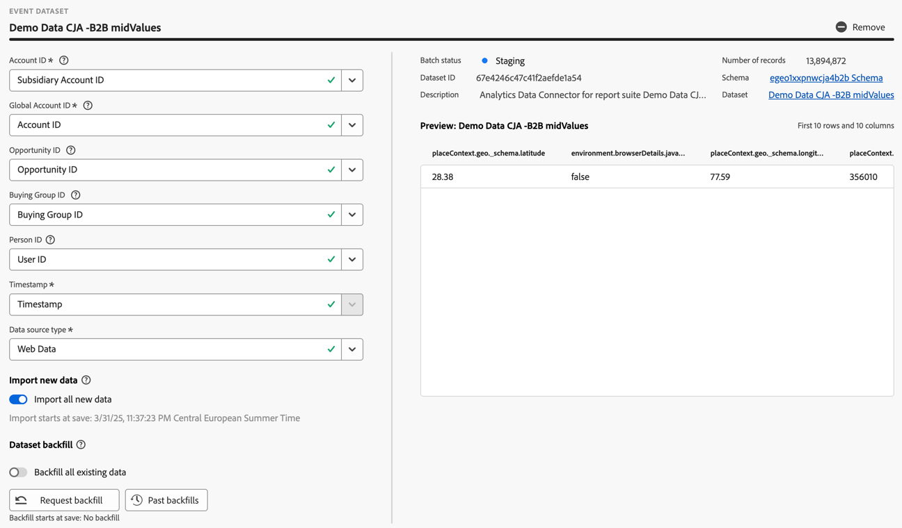

# 연결 만들기 또는 편집 {#create-or-edit-a-connection}

>[!CONTEXTUALHELP]
>id="cja_connections_recordsadded"
>title="추가된 레코드"
>abstract="선택한 데이터 세트에 대해 선택한 시간 간격 동안 연결에 추가된 레코드(행) 수입니다."

>[!CONTEXTUALHELP]
>id="cja_connections_recordsskipped"
>title="생략된 레코드"
>abstract="선택한 데이터 세트에 대해 선택한 시간 간격 동안 연결에 대한 데이터 전송 중에 생략된 레코드(행) 수입니다."

>[!CONTEXTUALHELP]
>id="cja_connections_recordsdeleted"
>title="삭제된 레코드"
>abstract="선택한 데이터 세트에 대해 선택한 시간 간격 동안 연결에서 제거된 레코드(행)의 수입니다."

>[!CONTEXTUALHELP]
>id="cja_connection_lastadded"
>title="마지막으로 추가됨"
>abstract="연결로 전송된 데이터 세트의 최신 배치 타임스탬프입니다."

>[!CONTEXTUALHELP]
>id="cja_connection_enablerollingdatawindow"
>title="롤링 데이터 창 활성화"
>abstract="데이터 보존을 연결 수준에서 몇 개월 단위의 롤링 창으로 정의합니다."

>[!CONTEXTUALHELP]
>id="cja_connection_averagenumberofdailyuses"
>title="일일 평균 사용 수"
>abstract="전체 연결에 대해 예상되는 일일 이벤트 수 범위를 선택합니다."

>[!CONTEXTUALHELP]
>id="connections_recordsadded"
>title="추가된 레코드"
>abstract="선택한 데이터 세트에 대해 선택한 시간 간격 동안 연결에 추가된 레코드(행) 수입니다."

>[!CONTEXTUALHELP]
>id="connections_recordsskipped"
>title="생략된 레코드"
>abstract="선택한 데이터 세트에 대해 선택한 시간 간격 동안 연결에 대한 데이터 전송 중에 생략된 레코드(행) 수입니다."

>[!CONTEXTUALHELP]
>id="connections_recordsdeleted"
>title="삭제된 레코드"
>abstract="선택한 데이터 세트에 대해 선택한 시간 간격 동안 연결에서 제거된 레코드(행) 수입니다."

>[!CONTEXTUALHELP]
>id="connection_lastadded"
>title="마지막으로 추가됨"
>abstract="연결로 전송된 데이터 세트의 최신 배치 타임스탬프입니다."

>[!CONTEXTUALHELP]
>id="connection_enablerollingdatawindow"
>title="롤링 데이터 창 활성화"
>abstract="데이터 보존을 연결 수준에서 몇 개월 단위의 롤링 창으로 정의합니다."

>[!CONTEXTUALHELP]
>id="connection_averagenumberofdailyuses"
>title="일일 평균 사용 수"
>abstract="전체 연결에 대해 예상되는 일일 이벤트 수 범위를 선택합니다."

>[!CONTEXTUALHELP]
>id="connection_change_accountid"
>title="계정 ID 변경"
>abstract="계정 ID를 변경하면 연결에서 모든 기존 데이터가 삭제되고 새 계정 ID를 기반으로 데이터 세트에서 모든 데이터를 다시 수집합니다. 이 작업은 비용에 영향을 줄 수 있습니다. <br/><br/>**[!UICONTROL 계속]**&#x200B;을 선택하면 프로세스가 완료될 때까지 보고가 지연될 수 있습니다."

>[!CONTEXTUALHELP]
>id="connection_change_globalaccountid"
>title="글로벌 계정 ID 변경"
>abstract="글로벌 계정 ID를 변경하면 연결에서 모든 기존 데이터가 삭제되고 새 글로벌 계정 ID를 기반으로 데이터 세트에서 모든 데이터를 다시 수집합니다. 이 작업은 비용에 영향을 줄 수 있습니다. <br/><br/>**[!UICONTROL 계속]**&#x200B;을 선택하면 프로세스가 완료될 때까지 보고가 지연될 수 있습니다."

>[!CONTEXTUALHELP]
>id="connection_change_opportunityid"
>title="영업 기회 ID 변경"
>abstract="Opportunity ID 를 변경하면 연결에 있는 기존 데이터가 모두 삭제되고 새로운 Opportunity ID 를 기준으로 데이터 세트에서 모든 데이터가 다시 수집됩니다. 이 작업은 비용에 영향을 줄 수 있습니다. <br/><br/>**[!UICONTROL 계속]**&#x200B;을 선택하면 프로세스가 완료될 때까지 보고가 지연될 수 있습니다."

>[!CONTEXTUALHELP]
>id="connection_change_buyinggroupid"
>title="구매 그룹 ID 변경"
>abstract="구매 그룹 ID를 변경하면 연결에서 기존 데이터가 모두 삭제되고 새로운 구매 그룹 ID를 기반으로 데이터 세트에서 모든 데이터를 다시 수집합니다. 이 작업은 비용에 영향을 줄 수 있습니다. <br/><br/>**[!UICONTROL 계속]**&#x200B;을 선택하면 프로세스가 완료될 때까지 보고가 지연될 수 있습니다."


연결 생성과 편집 워크플로 환경은 모든 데이터 세트 및 연결 구성 설정을 보조 워크플로와 함께 화면 중앙으로 가져옵니다. 상세한 데이터 세트 선택, 구성 및 검토 경험을 제공합니다. 또한 [데이터 세트 유형](#dataset-types), 크기, 스키마, 데이터 세트 ID, 일괄 처리 상태, 채우기 상태, ID 등과 같은 중요한 정보를 지정하여 잘못된 연결 구성의 위험을 줄일 수 있습니다. 다음은 기능에 대한 개요입니다.

* 연결을 생성할 때 롤링 데이터 보존 기간을 활성화할 수 있습니다.
* 연결에서 데이터 세트를 추가하거나 제거할 수 있습니다. (데이터 세트를 제거하면 연결에서 데이터 세트가 제거되고 연결된 모든 데이터 보기 및 기본 Analysis Workspace 프로젝트에 영향을 미칩니다.)
* 각 데이터 세트에 대해 데이터 채우기를 활성화하고 요청할 수 있습니다.
* 예를 들어 데이터 세트를 편집하여 다른 채우기를 요청할 수 있습니다.
* 각 데이터 세트에 대한 기존 데이터를 가져올 수 있습니다.


>[!BEGINSHADEBOX]

데모 비디오를 보려면  [연결 경험 만들기 및 편집](https://video.tv.adobe.com/v/343044/?quality=12&learn=on){target="_blank"}을 확인하십시오.

>[!ENDSHADEBOX]


## 사전 요구 사항

연결에 추가할 수 있는 데이터 세트의 최대 수는 100개로 제한됩니다. 혼합은 귀사에서 구매한 Customer Journey Analytics 패키지의 종류에 따라 다릅니다.

보유 중인 Customer Journey Analytics 패키지가 무엇인지 확실하지 않은 경우에는 귀사의 관리자에게 문의하십시오.

| **셀렉트** 패키지 | **파운데이션** 패키지 |
| --- | --- |
| 이벤트, 프로필, 조회 또는 요약 데이터 세트의 모든 조합(최대 100개 추가) | 연결당 하나의 이벤트 데이터 세트 |
|  | 연결당 최대 99개의 프로필, 조회 또는 요약 데이터 세트 |

{style="table-layout:auto"}

## 연결 만들기 {#create-connection}

연결을 만들려면 다음 작업을 수행하십시오.

1. Customer Journey Analytics에서 상단 메뉴의 **[!UICONTROL 데이터 관리]**&#x200B;에서(선택 사항) **[!UICONTROL 연결]**&#x200B;을 선택합니다.
1. **[!UICONTROL 새 연결 만들기]**&#x200B;를 선택합니다.

이제 [연결의 세부 정보를 편집](#edit-a-connection)할 수 있습니다.

## 연결 편집 {#edit-connection}

연결 편집 방법은 라이선스가 부여된 Customer Journey Analytics 패키지에 따라 다릅니다.

* [Customer Journey Analytics](#customer-journey-analytics)
* [Customer Journey Analytics B2B 에디션](#customer-journey-analytics-b2b-edition)

### Customer Journey Analytics

**[!UICONTROL 연결]** > **[!UICONTROL *연결 이름&#x200B;*]**&#x200B;화면에서 다음을 수행합니다.


1. 연결 설정을 구성합니다.

   | 설정 | 설명 |
   | --- | --- |
   | **[!UICONTROL 연결 이름]** | 연결의 고유한 이름을 입력합니다. |
   | **[!UICONTROL 연결 설명]** | 이 연결의 목적에 대해 설명합니다. |
   | **[!UICONTROL 태그]** | 태그를 지정하여 연결에 태그를 추가하면 이러한 태그를 사용하여 나중에 연결을 검색할 수 있습니다. |
   | **[!UICONTROL 롤링 데이터 기간 활성화]** | 이 확인란이 선택되어 있으면 Customer Journey Analytics 데이터 보존을 연결 수준에서 개월(1개월, 3개월, 6개월 등) 단위의 롤링 기간으로 정의할 수 있습니다.<p>데이터 보존은 이벤트 데이터 세트 타임스탬프를 기반으로 하며 이벤트 데이터 세트에만 적용됩니다. 적용 가능한 타임스탬프가 없기 때문에 프로필 또는 조회 데이터 세트에 대한 롤링 데이터 기간 설정이 없습니다. 그러나 연결에 프로필 또는 조회 데이터 세트(하나 이상의 이벤트 데이터 세트 제외)가 포함된 경우 해당 데이터는 동일한 기간 동안 유지됩니다.<p> 주요 이점은 적용 가능하고 유용한 데이터에 대해서만 저장하거나 보고하고 더 이상 유용하지 않은 오래된 데이터를 삭제한다는 것입니다. 계약 한도를 유지하고 초과 비용의 위험을 줄이는 데 도움이 됩니다.<p><ul><li>기본값(선택 해제)을 그대로 두면 보존 기간이 Adobe Experience Platform 데이터 보존 설정으로 대체됩니다. Experience Platform에 25개월 분량의 데이터가 있는 경우 Customer Journey Analytics는 채우기를 통해 25개월 분량의 데이터를 받습니다. Experience Platform에서 이러한 개월 중 10개월을 삭제하면 Customer Journey Analytics은 나머지 15개월을 유지합니다.</li><li>롤링 데이터 기간을 사용하는 경우 **[!UICONTROL 개월 수 선택]**&#x200B;에서 롤링 데이터 기간을 사용하는 개월 수를 지정합니다. |
   | **[!UICONTROL 샌드박스]** | 연결을 만들 데이터 세트가 포함된 Experience Platform의 샌드박스를 선택합니다.<p>Adobe Experience Platform은 디지털 경험 애플리케이션을 개발하고 발전시키는 데 도움이 되는 단일 Platform 인스턴스를 별도의 가상 환경으로 분할하는 [샌드박스](https://experienceleague.adobe.com/ko/docs/experience-platform/sandbox/home)를 제공합니다. 샌드박스를 데이터 세트가 포함된 “데이터 사일로”로 간주할 수 있습니다. 샌드박스는 데이터 세트에 대한 액세스를 제어하는 데 사용됩니다.<p>샌드박스를 선택하면 왼쪽 레일에 해당 샌드박스에서 가져올 수 있는 모든 데이터 세트가 표시됩니다. |
   | **[!UICONTROL 데이터 세트 추가]** | 데이터 집합을 추가하려면  **[!UICONTROL 데이터 집합 추가]**&#x200B;를 선택하십시오. 연결에 아직 데이터 세트가 없는 경우 데이터 세트 테이블에서 **[!UICONTROL 데이터 세트 추가]**&#x200B;를 선택할 수도 있습니다. |


   구성한 데이터 세트에 대해 데이터 세트 테이블에는 다음 열이 표시됩니다.

   | 열 | 설명 |
   |---|---|
   | **[!UICONTROL 데이터 세트 이름]** | Customer Journey Analytics으로 가져올 데이터 세트를 한 개 이상 선택하고 **[!UICONTROL 추가]**&#x200B;를 선택합니다.<p>(선택할 데이터 세트가 여러 개인 경우 데이터 세트 목록 위에 있는 데이터 세트 검색 막대를 사용하여 올바른 데이터 세트를 검색할 수 있습니다.) |
   |  | 선택한 데이터 집합에 대한 컨텍스트 메뉴를 열려면 를 선택하십시오. (유형) 데이터 세트에 따라 다음을 선택할 수 있습니다.<ul><li>  **[!UICONTROL 데이터 세트를 삭제]**&#x200B;하여 [데이터 세트를 삭제](#delete-a-dataset)합니다.</li><li> **[!UICONTROL 데이터 세트 편집]** - [데이터 세트 편집](#edit-a-dataset).</li><li> **[!UICONTROL 지난 다시 채우기]** - 데이터 집합에 대한 [지난 다시 채우기](#past-backfills)를 표시합니다. |
   | **[!UICONTROL 마지막으로 업데이트됨]** | 이벤트 데이터 세트의 경우에만 이 설정이 Experience Platform의 이벤트 기반 스키마에서 기본 타임스탬프 필드로 자동 설정됩니다. “N/A”는 이 데이터 세트에 데이터가 없음을 의미합니다. |
   | **[!UICONTROL 레코드 수]** | Experience Platform의 데이터 세트에 대한 지난달의 총 레코드입니다. |
   | **[!UICONTROL 스키마]** | Adobe Experience Platform에서 데이터 세트를 만드는 데 사용한 [스키마](https://experienceleague.adobe.com/ko/docs/experience-platform/xdm/schema/composition)입니다. |
   | **[!UICONTROL 데이터 세트 유형]** | 이 연결에 추가한 각 데이터 세트에 대해 가져오는 데이터를 기반으로 [데이터 세트 유형](#dataset-types)을(를) Customer Journey Analytics에서 자동으로 설정합니다. 이벤트 데이터, 프로필 데이터 및 조회 데이터의 3가지 데이터 세트 유형이 있습니다. 데이터 세트 유형에 대한 설명은 아래 테이블을 참조하십시오. |
   | **[!UICONTROL 세부 기간]** | 데이터 세트의 데이터 세부 기간입니다. 요약 데이터 세트에만 적용됩니다. |
   | **[!UICONTROL 데이터 소스 유형]** | 데이터 세트의 데이터 소스 유형입니다. 요약 데이터 세트에 해당되지 않습니다. |
   | **[!UICONTROL 개인 ID]** | 데이터 세트에 대한 개인 기반 보고를 지원하는 데 사용되는 개인 ID입니다. |
   | **[!UICONTROL 키]** | 조회 데이터 세트에 사용되는 키입니다. |
   | **[!UICONTROL 일치하는 키]** | 조회 데이터 세트에 사용되는 일치 키입니다. |
   | **[!UICONTROL 새 데이터 가져오기]** | 데이터 세트에 대한 새 데이터 가져오기 상태: <p>   **[!UICONTROL _x _켜짐]**&#x200B;새 데이터를 가져오도록 구성된 데이터 세트의 경우<p>   **[!UICONTROL _x 꺼짐_]** 새 데이터를 가져오지 않도록 구성된 데이터 세트의 경우. |
   | **[!UICONTROL 채우기 데이터]** | 데이터 세트의 채우기 데이터 상태.<p>   **[!UICONTROL _x _채우기 실패]**&#x200B;실패한 채우기의 수에 대해,<p>   **[!UICONTROL _x _채우기 처리]**&#x200B;처리 채우기 수에 대해,<p>   **[!UICONTROL _x _채우기 완료]**&#x200B;완료된 채우기 수에 대해<p>   **[!UICONTROL _꺼짐_]** 채우기가 구성되지 않은 경우. |

    필드를 사용하여 특정 데이터 세트를 검색할 수 있습니다.

### Customer Journey Analytics B2B 에디션

[!BADGE B2B 에디션]{type=Informative url="https://experienceleague.adobe.com/ko/docs/analytics-platform/using/cja-overview/cja-b2b/cja-b2b-edition" newtab=true tooltip="Customer Journey Analytics B2B 에디션"}

**[!UICONTROL 연결]** > **[!UICONTROL *연결 이름&#x200B;*]**&#x200B;화면에서 다음을 수행합니다.


1. 연결 설정을 구성합니다.

   | 설정 | 설명 |
   | --- | --- |
   | **[!UICONTROL 연결 이름]** | 연결의 고유한 이름을 입력합니다. |
   | **[!UICONTROL 연결 설명]** | 이 연결의 목적에 대해 설명합니다. |
   | **[!UICONTROL 태그]** | 태그를 지정하여 연결에 태그를 추가하면 이러한 태그를 사용하여 나중에 연결을 검색할 수 있습니다. |
   | **[!UICONTROL 기본 ID]** | 연결에 적합한 기본 ID를 선택합니다. <ul><li>B2C 시나리오에서 일반적으로 사용하는 사용자 기반 연결의 경우  **[!UICONTROL 개인]**.</li><li> B2B 시나리오에서 일반적으로 사용하는 계정 기반 연결을 위한  **[!UICONTROL 계정]**</li></ul>연결에 데이터 세트를 하나 이상 추가하는 즉시 기본 ID를 더 이상 변경할 수 없습니다. <br/>기본 ID를 선택하면 연결이 개인 기반인지 계정 기반인지 정의됩니다. 연결 기반은 특정 데이터 세트 유형에 사용할 수 있는 [설정](#dataset-settings)을 결정합니다. |
   | **[!UICONTROL 선택적 컨테이너]** | **[!UICONTROL 기본 ID]**(으)로  **[!UICONTROL 계정]**&#x200B;을(를) 선택한 경우 추가 컨테이너를 선택하십시오.<ul><li>**[!UICONTROL 글로벌 계정]**: 연결에서 글로벌 계정의 구성을 활성화합니다.</li><li>**[!UICONTROL 기회]**: 연결에서 기회의 구성을 활성화합니다.</li><li>**[!UICONTROL 구매 그룹]**: 연결에서 구매 그룹의 구성을 활성화합니다.</li><ul> |
   | **[!UICONTROL 샌드박스]** | 연결을 만들 데이터 세트가 포함된 Experience Platform의 샌드박스를 선택합니다.<p>Adobe Experience Platform은 디지털 경험 애플리케이션을 개발하고 발전시키는 데 도움이 되는 단일 Platform 인스턴스를 별도의 가상 환경으로 분할하는 [샌드박스](https://experienceleague.adobe.com/ko/docs/experience-platform/sandbox/home)를 제공합니다. 샌드박스를 데이터 세트가 포함된 “데이터 사일로”로 간주할 수 있습니다. 샌드박스는 데이터 세트에 대한 액세스를 제어하는 데 사용됩니다.<p>샌드박스를 선택하면 왼쪽 레일에 해당 샌드박스에서 가져올 수 있는 모든 데이터 세트가 표시됩니다. |
   | **[!UICONTROL 롤링 데이터 기간 활성화]** | 이 확인란이 선택되어 있으면 Customer Journey Analytics 데이터 보존을 연결 수준에서 개월(1개월, 3개월, 6개월 등) 단위의 롤링 기간으로 정의할 수 있습니다.<p>데이터 보존은 이벤트 데이터 세트 타임스탬프를 기반으로 하며 이벤트 데이터 세트에만 적용됩니다. 적용 가능한 타임스탬프가 없기 때문에 프로필 또는 조회 데이터 세트에 대한 롤링 데이터 기간 설정이 없습니다. 그러나 연결에 프로필 또는 조회 데이터 세트(하나 이상의 이벤트 데이터 세트 제외)가 포함된 경우 해당 데이터는 동일한 기간 동안 유지됩니다.<p> 주요 이점은 적용 가능하고 유용한 데이터에 대해서만 저장하거나 보고하고 더 이상 유용하지 않은 오래된 데이터를 삭제한다는 것입니다. 계약 한도를 유지하고 초과 비용의 위험을 줄이는 데 도움이 됩니다.<p><ul><li>기본값(선택 해제)을 그대로 두면 보존 기간이 Adobe Experience Platform 데이터 보존 설정으로 대체됩니다. Experience Platform에 25개월 분량의 데이터가 있는 경우 Customer Journey Analytics는 채우기를 통해 25개월 분량의 데이터를 받습니다. Platform에서 이러한 개월 중 10개월을 삭제하면 Customer Journey Analytics는 나머지 15개월을 유지합니다.</li><li>롤링 데이터 기간을 사용하는 경우 **[!UICONTROL 개월 수 선택]**&#x200B;에서 롤링 데이터 기간을 사용하는 개월 수를 지정합니다. |
   | **[!UICONTROL 데이터 세트 추가]** | [데이터 세트 추가](#add-datasets)에  **[!UICONTROL 데이터 세트 추가]**&#x200B;를 선택합니다. 연결에 아직 데이터 세트가 없는 경우 데이터 세트 테이블에서 **[!UICONTROL 데이터 세트 추가]**&#x200B;를 선택할 수도 있습니다. |


   구성한 데이터 세트에 대해 데이터 세트 테이블에는 다음 열이 표시됩니다.

   | 열 | 설명 |
   |---|---|
   | **[!UICONTROL 데이터 세트 이름]** | Customer Journey Analytics으로 가져올 데이터 세트를 한 개 이상 선택하고 **[!UICONTROL 추가]**&#x200B;를 선택합니다.<p>(선택할 데이터 세트가 여러 개인 경우 데이터 세트 목록 위에 있는 데이터 세트 검색 막대를 사용하여 올바른 데이터 세트를 검색할 수 있습니다.) |
   |  | 선택한 데이터 집합에 대한 컨텍스트 메뉴를 열려면 를 선택하십시오. (유형) 데이터 세트에 따라 다음을 선택할 수 있습니다.<ul><li>  **[!UICONTROL 데이터 세트를 삭제]**&#x200B;하여 [데이터 세트를 삭제](#delete-a-dataset)합니다.</li><li> **[!UICONTROL 데이터 세트 편집]** - [데이터 세트 편집](#edit-a-dataset).</li><li> **[!UICONTROL 지난 다시 채우기]** - 데이터 집합에 대한 [지난 다시 채우기](#past-backfills)를 표시합니다. |
   | **[!UICONTROL 마지막으로 업데이트됨]** | 이벤트 데이터 세트의 경우에만 이 설정이 Experience Platform의 이벤트 기반 스키마에서 기본 타임스탬프 필드로 자동 설정됩니다. “N/A”는 이 데이터 세트에 데이터가 없음을 의미합니다. |
   | **[!UICONTROL 레코드 수]** | Experience Platform의 데이터 세트에 대한 지난달의 총 레코드입니다. |
   | **[!UICONTROL 스키마]** | Adobe Experience Platform에서 데이터 세트를 만드는 데 사용한 [스키마](https://experienceleague.adobe.com/ko/docs/experience-platform/xdm/schema/composition)입니다. |
   | **[!UICONTROL 데이터 세트 유형]** | 이 연결에 추가한 각 데이터 세트에 대해 가져오는 데이터를 기반으로 [데이터 세트 유형](#dataset-types)을(를) Customer Journey Analytics에서 자동으로 설정합니다. 이벤트 데이터, 프로필 데이터 및 조회 데이터의 3가지 데이터 세트 유형이 있습니다. 데이터 세트 유형에 대한 설명은 아래 테이블을 참조하십시오. |
   | **[!UICONTROL 세부 기간]** | 데이터 세트의 데이터 세부 기간입니다. 요약 데이터 세트에만 적용됩니다. |
   | **[!UICONTROL 데이터 소스 유형]** | 데이터 세트의 데이터 소스 유형입니다. 요약 데이터 세트에 해당되지 않습니다. |
   | **[!UICONTROL 계정 ID]** | (계정 기반 연결에만 표시됨) 데이터 세트에 대한 계정 기반 보고를 지원하는 데 사용되는 계정 ID입니다. |
   | **[!UICONTROL 글로벌 계정 ID]** | (계정 기반 연결에만 표시됨) 데이터 세트에 대한 계정 기반 보고를 지원하는 데 사용되는 글로벌 계정 ID입니다. |
   | **[!UICONTROL 그룹 ID 구매]** | (계정 기반 연결에만 표시됨) 구매 그룹 데이터를 조회하는 데 사용되는 구매 그룹 ID입니다. |
   | **[!UICONTROL 영업 기회 ID]** | (계정 기반 연결에만 표시됨) 영업 기회 데이터를 조회하는 데 사용되는 영업 기회 ID입니다. |
   | **[!UICONTROL 개인 ID]** | 데이터 세트에 대한 개인 기반 보고를 지원하는 데 사용되는 개인 ID입니다. |
   | **[!UICONTROL 키]** | 조회 데이터 세트에 사용되는 키입니다. |
   | **[!UICONTROL 일치하는 키]** | 조회 데이터 세트에 사용되는 일치 키입니다. |
   | **[!UICONTROL 새 데이터 가져오기]** | 데이터 세트에 대한 새 데이터 가져오기 상태: <p>   **[!UICONTROL _x _켜짐]**&#x200B;새 데이터를 가져오도록 구성된 데이터 세트의 경우<p>   **[!UICONTROL _x 꺼짐_]** 새 데이터를 가져오지 않도록 구성된 데이터 세트의 경우. |
   | **[!UICONTROL 채우기 데이터]** | 데이터 세트의 채우기 데이터 상태.<p>   **[!UICONTROL _x _채우기 실패]**&#x200B;실패한 채우기의 수에 대해,<p>   **[!UICONTROL _x _채우기 처리]**&#x200B;처리 채우기 수에 대해,<p>   **[!UICONTROL _x _채우기 완료]**&#x200B;완료된 채우기 수에 대해<p>   **[!UICONTROL _꺼짐_]** 채우기가 구성되지 않은 경우. |

    필드를 사용하여 특정 데이터 세트를 검색할 수 있습니다.

## 데이터 세트 {#datasets}

연결 워크플로의 일부로 [하나 이상의 데이터 세트를 추가](#add-datasets)하거나 [기존 데이터 세트를 편집](#edit-a-dataset)합니다.

<!-- markdownlint-disable MD034 -->

>[!CONTEXTUALHELP]
>id="cja_connection_primaryid"
>title="기본 ID"
>abstract="연결에 적합한 기본 ID 선택: B2C 시나리오 사용자. B2B 시나리오에 대한 계정."

<!-- markdownlint-enable MD034 -->

<!-- markdownlint-disable MD034 -->

>[!CONTEXTUALHELP]
>id="cja_connection_optionalcontainers"
>title="선택 가능한 컨테이너"
>abstract="추가 컨테이너를 선택하십시오.<br/><br/>**[!UICONTROL 글로벌 계정&#x200B;]**: 연결에서 글로벌 계정의 구성을 활성화합니다.<br/>**[!UICONTROL 기회]**: 연결에서 기회의 구성을 활성화합니다.<br/>**[!UICONTROL 구매 그룹&#x200B;]**: 연결에서 구매 그룹의 구성을 활성화합니다."

<!-- markdownlint-enable MD034 -->

<!-- markdownlint-disable MD034 -->

>[!CONTEXTUALHELP]
>id="cja_connection_personid"
>title="개인 ID"
>abstract="Experience Platform의 데이터 세트 스키마에 정의된 사용 가능한 ID에서 개인 ID를 선택합니다."

<!-- markdownlint-enable MD034 -->

<!-- markdownlint-disable MD034 -->

>[!CONTEXTUALHELP]
>id="cja_connection_accountid"
>title="계정 ID"
>abstract="Experience Platform의 데이터 세트 스키마에 정의된 사용 가능한 ID에서 계정 ID(계정에 대한 고유 식별자)를 선택합니다."

<!-- markdownlint-enable MD034 -->

<!-- markdownlint-disable MD034 -->

>[!CONTEXTUALHELP]
>id="cja_connection_accountfield"
>title="계정 필드"
>abstract="계정 ID(계정의 고유 식별자)를 나타내는 필드를 선택합니다."

<!-- markdownlint-enable MD034 -->


<!-- markdownlint-disable MD034 -->

>[!CONTEXTUALHELP]
>id="cja_connection_globalaccountid"
>title="글로벌 계정 ID"
>abstract="Experience Platform의 데이터 세트 스키마에서 정의한 사용 가능한 ID에서 글로벌 계정 ID(글로벌 계정에 대한 고유 식별자)를 선택합니다."

<!-- markdownlint-enable MD034 -->

<!-- markdownlint-disable MD034 -->

>[!CONTEXTUALHELP]
>id="cja_connection_opportunityid"
>title="기회 ID"
>abstract="Experience Platform의 데이터 세트 스키마에서 정의한 사용 가능한 ID에서 Opportunity ID (Opportunity 의 고유 식별자) 를 선택합니다."

<!-- markdownlint-enable MD034 -->

<!-- markdownlint-disable MD034 -->

>[!CONTEXTUALHELP]
>id="cja_connection_buyinggroupid"
>title="구매 그룹 ID"
>abstract="Experience Platform의 데이터 세트 스키마에서 정의한 사용 가능한 ID에서 구매 그룹 ID(구매 그룹의 고유 식별자)를 선택합니다."

<!-- markdownlint-enable MD034 -->

<!-- markdownlint-disable MD034 -->

>[!CONTEXTUALHELP]
>id="cja_connection_matchingkey"
>title="키 유형 일치"
>abstract="조인 방법 선택: 필드별 일치 또는 컨테이너별 일치를 기반으로 합니다.<br/><br/>**[!UICONTROL 필드로 일치&#x200B;]**: 이벤트 데이터 세트 중 하나와 연결할 필드를 선택합니다. 이 목록이 비어 있다면 이벤트 데이터 세트를 추가하거나 구성하지 않았을 가능성이 높습니다.<br/>**[!UICONTROL 컨테이너별 일치]**: 이벤트 데이터 세트 중 하나와 연결하는 데 사용할 컨테이너를 선택하십시오."

<!-- markdownlint-enable MD034 -->

<!-- markdownlint-disable MD034 -->

>[!CONTEXTUALHELP]
>id="cja_connection_importnewdata"
>title="새 데이터 가져오기"
>abstract="Experience Platform 데이터 세트에 추가되는 모든 새 배치는 이 연결에 자동으로 추가되며 분석에 사용할 수 있습니다."

<!-- markdownlint-enable MD034 -->

<!-- markdownlint-disable MD034 -->

>[!CONTEXTUALHELP]
>id="cja_connection_datasetbackfill"
>title="데이터 세트 다시 채우기"
>abstract="이 옵션은 연결에서 이 데이터 세트에 대한 Experience Platform의 기존(내역) 데이터를 다시 채웁니다."

<!-- markdownlint-enable MD034 -->

<!-- markdownlint-disable MD034 -->

>[!CONTEXTUALHELP]
>id="cja_connection_transformdataset"
>title="데이터 세트 변환"
>abstract="이 옵션은 B2B 시나리오에서 사용자 기반 조회에 사용할 수 있도록 데이터 세트를 변환합니다. 활성화되고 나면 데이터 세트의 변환은 되돌릴 수 없습니다."

<!-- markdownlint-enable MD034 -->

<!-- markdownlint-disable MD034 -->

>[!CONTEXTUALHELP]
>id="cja_connection_connectionmap"
>title="연결 맵"
>abstract="연결 맵은 이벤트, 사용자, 계정 및 관련 조회 데이터 세트(기회, 캠페인 멤버 등) 간의 관계를 시각화합니다."

<!-- markdownlint-enable MD034 -->

<!-- markdownlint-disable MD034 -->

>[!CONTEXTUALHELP]
>id="connection_primaryid"
>title="기본 ID"
>abstract="연결에 적합한 기본 ID 선택: B2C 시나리오 사용자. B2B 시나리오에 대한 계정."

<!-- markdownlint-enable MD034 -->

<!-- markdownlint-disable MD034 -->

>[!CONTEXTUALHELP]
>id="connection_optionalcontainers"
>title="선택 가능한 컨테이너"
>abstract="추가 컨테이너를 선택하십시오.<br/><br/>**[!UICONTROL 글로벌 계정&#x200B;]**: 연결에서 글로벌 계정의 구성을 활성화합니다.<br/>**[!UICONTROL 기회]**: 연결에서 기회의 구성을 활성화합니다.<br/>**[!UICONTROL 구매 그룹&#x200B;]**: 연결에서 구매 그룹의 구성을 활성화합니다."

<!-- markdownlint-enable MD034 -->

<!-- markdownlint-disable MD034 -->

>[!CONTEXTUALHELP]
>id="connection_personid"
>title="개인 ID"
>abstract="Experience Platform의 데이터 세트 스키마에 정의된 사용 가능한 ID에서 개인 ID를 선택합니다."

<!-- markdownlint-enable MD034 -->

<!-- markdownlint-disable MD034 -->

>[!CONTEXTUALHELP]
>id="connection_accountid"
>title="계정 ID"
>abstract="Experience Platform의 데이터 세트 스키마에 정의된 사용 가능한 ID에서 계정 ID(계정에 대한 고유 식별자)를 선택합니다."

<!-- markdownlint-enable MD034 -->

>[!CONTEXTUALHELP]
>id="connection_accountfield"
>title="계정 필드"
>abstract="계정 ID(계정의 고유 식별자)를 나타내는 필드를 선택합니다."

<!-- markdownlint-enable MD034 -->

<!-- markdownlint-disable MD034 -->

>[!CONTEXTUALHELP]
>id="connection_globalaccountid"
>title="글로벌 계정 ID"
>abstract="Experience Platform의 데이터 세트 스키마에서 정의한 사용 가능한 ID에서 글로벌 계정 ID(글로벌 계정에 대한 고유 식별자)를 선택합니다."

<!-- markdownlint-enable MD034 -->

<!-- markdownlint-disable MD034 -->

>[!CONTEXTUALHELP]
>id="connection_opportunityid"
>title="기회 ID"
>abstract="Experience Platform의 데이터 세트 스키마에서 정의한 사용 가능한 ID에서 Opportunity ID (Opportunity 의 고유 식별자) 를 선택합니다."

<!-- markdownlint-enable MD034 -->

<!-- markdownlint-disable MD034 -->

>[!CONTEXTUALHELP]
>id="connection_buyinggroupid"
>title="구매 그룹 ID"
>abstract="Experience Platform의 데이터 세트 스키마에서 정의한 사용 가능한 ID에서 구매 그룹 ID(구매 그룹의 고유 식별자)를 선택합니다."

<!-- markdownlint-enable MD034 -->

<!-- markdownlint-disable MD034 -->

>[!CONTEXTUALHELP]
>id="connection_matchingkey"
>title="키 유형 일치"
>abstract="조인 방법 선택: 필드별 일치 또는 컨테이너별 일치를 기반으로 합니다.<br/><br/>**[!UICONTROL 필드로 일치&#x200B;]**: 이벤트 데이터 세트 중 하나와 연결할 필드를 선택합니다. 이 목록이 비어 있다면 이벤트 데이터 세트를 추가하거나 구성하지 않았을 가능성이 높습니다.<br/>**[!UICONTROL 컨테이너별 일치]**: 이벤트 데이터 세트 중 하나와 연결하는 데 사용할 컨테이너를 선택하십시오."

<!-- markdownlint-enable MD034 -->

<!-- markdownlint-disable MD034 -->

>[!CONTEXTUALHELP]
>id="connection_importnewdata"
>title="새 데이터 가져오기"
>abstract="Experience Platform 데이터 세트에 추가되는 모든 새 배치는 이 연결에 자동으로 추가되며 분석에 사용할 수 있습니다."

<!-- markdownlint-enable MD034 -->

<!-- markdownlint-disable MD034 -->

>[!CONTEXTUALHELP]
>id="connection_datasetbackfill"
>title="데이터 세트 다시 채우기"
>abstract="이 옵션은 연결에서 이 데이터 세트에 대한 Experience Platform의 기존(내역) 데이터를 다시 채웁니다."

<!-- markdownlint-enable MD034 -->

<!-- markdownlint-disable MD034 -->

>[!CONTEXTUALHELP]
>id="connection_transformdataset"
>title="데이터 세트 변환"
>abstract="이 옵션은 B2B 시나리오에서 사용자 기반 조회에 사용할 수 있도록 데이터 세트를 변환합니다. 활성화되고 나면 데이터 세트의 변환은 되돌릴 수 없습니다."

<!-- markdownlint-enable MD034 -->

<!-- markdownlint-disable MD034 -->

>[!CONTEXTUALHELP]
>id="connection_connectionmap"
>title="연결 맵"
>abstract="연결 맵은 이벤트, 사용자, 계정 및 관련 조회 데이터 세트(기회, 캠페인 멤버 등) 간의 관계를 시각화합니다."

### 데이터 세트 추가

연결을 만들거나 편집할 때 하나 이상의 Experience Platform 데이터 세트를 추가할 수 있습니다.


1. **[!UICONTROL 연결]** > **[!UICONTROL _연결 이름_]** 인터페이스에서  **[!UICONTROL 데이터 세트 추가]**&#x200B;를 선택합니다.

1. ➊ **[!UICONTROL 데이터 세트 선택]** 단계에서 Experience Platform 데이터 세트 목록이 표시됩니다.

   

   각 데이터 세트에 대해, 목록은 다음과 같이 나타납니다.

   | 열 | 설명 |
   |---|---|
   | **[!UICONTROL 데이터 세트]** | 데이터 세트의 이름입니다. Experience Platform의 데이터 세트로 사용자를 이동할 이름을 선택합니다. 데이터 세트에 대한 더 자세한 내용이 포함된 팝업이 표시되도록 하려면 를 선택합니다. **[!UICONTROL 플랫폼에서 편집]**&#x200B;을 선택하면 Experience Platform에서 바로 데이터 세트를 편집할 수 있습니다. |
   | **[!UICONTROL 데이터 세트 유형]** | 데이터 세트 유형: 이벤트, 프로필, 조회 또는 요약입니다. |
   | **[!UICONTROL 레코드 수]** | Experience Platform의 데이터 세트에 대한 지난달의 총 레코드입니다. |
   | **[!UICONTROL 스키마]** | 데이터 세트의 스키마입니다. Experience Platform의 스키마로 사용자를 이동할 이름을 선택합니다. |
   | **[!UICONTROL 마지막 배치]** | Experience Platform에서 수집된 마지막 배치의 상태입니다. 더 자세한 내용은 [배치 상태](https://experienceleague.adobe.com/ko/docs/experience-platform/ingestion/batch/troubleshooting#batch-states)를 참조하시기 바랍니다. |
   | **[!UICONTROL 데이터 세트 ID]** | 데이터 세트의 ID입니다. |
   | **[!UICONTROL 마지막으로 업데이트됨]** | 데이터 세트에서 마지막으로 업데이트된 타임스탬프입니다. |

   * 데이터 세트 목록에 표시되는 열을 변경하려면 을 선택한 다음 [!UICONTROL 테이블 맞춤화] 대화 상자에 표시할 열을 선택합니다.
   * 특정 데이터 세트를 검색하려면  검색 필드를 사용합니다.
   * 선택한 데이터 세트 표시 또는 숨기기 간 전환하려면  **[!UICONTROL 선택 항목 숨기기]** 또는 **[!UICONTROL 선택 항목 표시]**&#x200B;를 선택합니다.
   * 선택한 데이터 세트 목록에서 데이터 세트를 제거하려면 를 사용합니다. 선택한 데이터 세트를 모두 제거하려면 **[!UICONTROL 모두 지우기]**&#x200B;를 선택합니다.
   * 데이터 집합에 대한 세부 정보를 표시하려면 을(를) 선택하십시오.


1. 하나 이상의 데이터 세트를 선택하고 **[!UICONTROL 다음]**&#x200B;을 선택합니다. 하나 이상의 이벤트 또는 요약 데이터 세트가 연결의 일부여야 합니다.

1. **[!UICONTROL 데이터 세트 추가]** 대화 상자의 ➋ **[!UICONTROL 데이터 세트 설정]** 단계에서 선택한 각 데이터 세트에 대한 [설정](#dataset-settings)을 하나씩 구성합니다.

   

1. 구성된 데이터 세트를 연결에 추가하려면 **[!UICONTROL 데이터 세트 추가]**&#x200B;를 선택하십시오. 추가하려는 각 데이터 세트에 대한 모든 필수 설정을 제공하지 않은 경우 알림을 받습니다.

   또는 **[!UICONTROL 취소]**&#x200B;를 선택하여 연결에 데이터 세트 추가를 취소할 수 있습니다. 또는 **[!UICONTROL 뒤로]**&#x200B;를 선택하여 ➊ **[!UICONTROL 데이터 세트 선택]** 단계로 돌아갑니다.


### 데이터 세트 편집

연결에 대해 이미 구성된 데이터 집합을 편집하려면 **[!UICONTROL 연결]** > **[!UICONTROL _연결 이름_]** 인터페이스에서 다음을 수행합니다.

1. 편집할 데이터 세트 테이블에 나열된 데이터 세트에 대해 를 선택합니다.
1.  **[!UICONTROL 데이터 세트 편집]**&#x200B;을 선택합니다.

1. **[!UICONTROL 데이터 집합 편집: _데이터 집합 이름_]**&#x200B;대화 상자에서 [데이터 집합 설정](#dataset-settings)을 구성하십시오.

   

1. 데이터 집합 설정을 적용하려면 **[!UICONTROL 적용]**&#x200B;을 선택하세요. 취소하려면 **[!UICONTROL 취소]**&#x200B;를 선택합니다.


### 데이터 세트 설정

데이터 세트를 추가하거나 기존 데이터 세트를 편집할 때 각 데이터 세트에 대한 데이터 세트 설정을 구성합니다. 사용 가능한 설정은 [데이터 세트 유형](#dataset-types)에 따라 다르며, 일부 데이터 세트 유형의 경우 연결 유형(개인 기반 또는 [!BADGE B2B edition]{type=Informative url="https://experienceleague.adobe.com/ko/docs/analytics-platform/using/cja-overview/cja-b2b/cja-b2b-edition" newtab=true tooltip="Customer Journey Analytics B2B 에디션"} 계정 기반)에 따라 다릅니다.

모든 데이터 세트 및 데이터 세트 유형에는 새 데이터를 가져오고 다시 채우기를 요청할지 여부와 같은 [일반 설정 및 세부 정보](#general-dataset-settings-and-details)가 있습니다.

#### 이벤트 데이터 세트

이벤트 데이터 세트에 대한 특정 설정은 연결 유형에 따라 다릅니다.

##### 사용자 기반 연결


사용자 기반 연결의 이벤트 데이터 세트에 대해 다음을 지정할 수 있습니다.

| 설정 | 설명 |
| --- | --- |
| **[!UICONTROL 개인 ID]** | 사용 가능한 ID의 드롭다운 메뉴에서 개인 ID를 선택합니다. 이러한 ID는 Experience Platform의 데이터 세트 스키마에서 정의되었습니다. ID 맵을 개인 ID로 사용하는 방법에 대한 자세한 내용은 [ID 맵을 개인 ID로 사용](#id-map)을 참조하십시오.<p>선택할 개인 ID가 없다면 스키마에 개인 ID가 정의되지 않은 것입니다. 자세한 내용은 [UI에서 ID 필드 정의](https://experienceleague.adobe.com/ko/docs/experience-platform/xdm/ui/fields/identity)를 참조하십시오. <p>선택한 개인 ID의 값은 대소문자를 구분하는 것으로 간주됩니다. 예를 들어 `abc123` 및 `ABC123`은 서로 다른 두 값입니다.<p>레코드에 이벤트 데이터 세트의 개인 ID로 선택한 ID에 대한 값이 없는 경우 레코드를 건너뜁니다. |
| **[!UICONTROL 타임스탬프]** | 이 설정은 Experience Platform의 이벤트 기반 스키마에서 기본 타임스탬프 필드로 자동 설정됩니다. |
| **[!UICONTROL 데이터 소스 유형]** | 데이터 소스 유형을 선택합니다. 데이터 소스 유형은 다음과 같습니다. <ul><li>[!UICONTROL 웹 데이터]</li><li>[!UICONTROL 모바일 앱 데이터]</li><li>[!UICONTROL POS 데이터]</li><li>[!UICONTROL CRM 데이터]</li><li>[!UICONTROL 설문 조사 데이터]</li><li>[!UICONTROL 콜 센터 데이터]</li><li>[!UICONTROL 제품 데이터]</li><li> [!UICONTROL 계정 데이터]</li><li> [!UICONTROL 트랜잭션 데이터]</li><li>[!UICONTROL 고객 피드백 데이터]</li><li> [!UICONTROL 기타]</li></ul>이 필드를 사용하여 사용 중인 데이터 소스 유형을 조사합니다. |
| **[!UICONTROL 데이터 원본 설명]** | 데이터 소스 유형으로 기타 를 선택한 경우 데이터 소스에 대한 설명입니다. |


##### 계정 기반 연결

[!BADGE B2B 에디션]{type=Informative url="https://experienceleague.adobe.com/ko/docs/analytics-platform/using/cja-overview/cja-b2b/cja-b2b-edition" newtab=true tooltip="Customer Journey Analytics B2B 에디션"}

계정 기반 연결의 이벤트 데이터 세트에 대해 다음을 지정할 수 있습니다.



| 설정 | 설명 |
| --- | --- |
| **[!UICONTROL 계정 ID]** | Experience Platform의 데이터 세트 스키마에 정의된 사용 가능한 ID에서 글로벌 계정 ID(계정에 대한 고유 식별자)를 선택합니다. 글로벌 계정을 연결에 컨테이너로 추가한 경우 적용할 수 있습니다. <p>레코드에 이벤트 데이터 세트의 계정 ID로 선택한 ID에 대한 값이 없는 경우 레코드를 건너뜁니다. |
| **[!UICONTROL 글로벌 계정 ID]** | Experience Platform의 데이터 세트 스키마에 정의된 사용 가능한 ID에서 계정 ID(계정에 대한 고유 식별자)를 선택합니다. 글로벌 계정을 연결에 컨테이너로 추가하지 않은 경우에 적용할 수 있습니다. |
| **[!UICONTROL 영업 기회 ID]** | Experience Platform의 데이터 세트 스키마에 정의된 사용 가능한 ID에서 Opportunity ID(Opportunity에 대한 고유 식별자) 를 선택합니다. |
| **[!UICONTROL 그룹 ID 구매]** | Experience Platform의 데이터 세트 스키마에 정의된 사용 가능한 ID에서 구매 그룹 ID(구매 그룹의 고유 식별자)를 선택합니다. |
| **[!UICONTROL 개인 ID]** | 사용 가능한 ID의 드롭다운 메뉴에서 개인 ID를 선택합니다. 이러한 ID는 Experience Platform의 데이터 세트 스키마에 정의되어 있습니다. ID 맵을 개인 ID로 사용하는 방법에 대한 자세한 내용은 [ID 맵을 개인 ID로 사용](#id-map)을 참조하십시오.<p>선택할 개인 ID가 없는 경우 하나 이상의 개인 ID가 스키마에 정의되어 있지 않음을 의미합니다. 자세한 내용은 [UI에서 ID 필드 정의](https://experienceleague.adobe.com/ko/docs/experience-platform/xdm/ui/fields/identity)를 참조하십시오. <p>선택한 개인 ID의 값은 대소문자를 구분하는 것으로 간주됩니다. 예를 들어 `abc123` 및 `ABC123`은 서로 다른 두 값입니다. |
| **[!UICONTROL 타임스탬프]** | 이 설정은 Experience Platform의 이벤트 기반 스키마에서 기본 타임스탬프 필드로 자동 설정됩니다. |
| **[!UICONTROL 데이터 소스 유형]** | 데이터 소스 유형을 선택합니다. 데이터 소스 유형은 다음과 같습니다. <ul><li>[!UICONTROL 웹 데이터]</li><li>[!UICONTROL 모바일 앱 데이터]</li><li>[!UICONTROL POS 데이터]</li><li>[!UICONTROL CRM 데이터]</li><li>[!UICONTROL 설문 조사 데이터]</li><li>[!UICONTROL 콜 센터 데이터]</li><li>[!UICONTROL 제품 데이터]</li><li> [!UICONTROL 계정 데이터]</li><li> [!UICONTROL 트랜잭션 데이터]</li><li>[!UICONTROL 고객 피드백 데이터]</li><li> [!UICONTROL 기타]</li></ul>이 필드를 사용하여 사용 중인 데이터 소스 유형을 조사합니다. |
| **[!UICONTROL 데이터 원본 설명]** | 데이터 소스 유형으로 기타 를 선택한 경우 데이터 소스에 대한 설명입니다. |

#### 프로필 데이터 세트

프로필 데이터 세트에 대한 특정 설정은 연결 유형에 따라 다릅니다.

##### 사용자 기반 연결


사용자 기반 연결의 프로필 데이터 세트에 대해 다음을 지정합니다.

| 설정 | 설명 |
| --- | --- |
| **[!UICONTROL 개인 ID]** | 사용 가능한 ID의 드롭다운 메뉴에서 개인 ID를 선택합니다. 이러한 ID는 Experience Platform의 데이터 세트 스키마에서 정의되었습니다. ID 맵을 개인 ID로 사용하는 방법에 대한 자세한 내용은 [ID 맵을 개인 ID로 사용](#id-map)을 참조하십시오.<p>선택할 개인 ID가 없는 경우 스키마에 개인 ID가 정의되지 않습니다. 자세한 내용은 [UI에서 ID 필드 정의](https://experienceleague.adobe.com/ko/docs/experience-platform/xdm/ui/fields/identity)를 참조하십시오. <p>선택한 개인 ID의 값은 대소문자를 구분하는 것으로 간주됩니다. 예를 들어 `abc123` 및 `ABC123`은 서로 다른 두 값입니다. <p>레코드에 프로필 데이터 세트의 개인 ID로 선택한 ID에 대한 값이 없는 경우 레코드를 건너뜁니다. |
| **[!UICONTROL 데이터 소스 유형]** | 데이터 소스 유형을 선택합니다. 데이터 소스 유형은 다음과 같습니다. <ul><li>[!UICONTROL 웹 데이터]</li><li>[!UICONTROL 모바일 앱 데이터]</li><li>[!UICONTROL POS 데이터]</li><li>[!UICONTROL CRM 데이터]</li><li>[!UICONTROL 설문 조사 데이터]</li><li>[!UICONTROL 콜 센터 데이터]</li><li>[!UICONTROL 제품 데이터]</li><li> [!UICONTROL 계정 데이터]</li><li> [!UICONTROL 트랜잭션 데이터]</li><li>[!UICONTROL 고객 피드백 데이터]</li><li> [!UICONTROL 기타]</li></ul>이 필드를 사용하여 사용 중인 데이터 소스 유형을 조사합니다. |
| **[!UICONTROL 데이터 원본 설명]** | 데이터 소스 유형으로 기타 를 선택한 경우 데이터 소스에 대한 설명입니다. |

#### 계정 기반 연결


계정 기반 연결의 프로필 데이터 세트에 대해 다음을 지정합니다.

| 설정 | 설명 |
| --- | --- |
| **[!UICONTROL 개인 ID]** | 사용 가능한 ID의 드롭다운 메뉴에서 개인 ID를 선택합니다. 이러한 ID는 Experience Platform의 데이터 세트 스키마에서 정의되었습니다. ID 맵을 개인 ID로 사용하는 방법에 대한 자세한 내용은 [ID 맵을 개인 ID로 사용](#id-map)을 참조하십시오.<p>선택할 개인 ID가 없는 경우 스키마에 개인 ID가 정의되지 않습니다. 자세한 내용은 [UI에서 ID 필드 정의](https://experienceleague.adobe.com/ko/docs/experience-platform/xdm/ui/fields/identity)를 참조하십시오. <p>선택한 개인 ID의 값은 대소문자를 구분하는 것으로 간주됩니다. 예를 들어 `abc123` 및 `ABC123`은 서로 다른 두 값입니다. <p>레코드에 프로필 데이터 세트의 개인 ID로 선택한 ID에 대한 값이 없는 경우 레코드를 건너뜁니다. |
| **[!UICONTROL 전역 계정 필드]** | 사용 가능한 ID의 드롭다운 메뉴에서 데이터 세트에 대한 계정 기반 보고를 지원할 글로벌 계정 필드를 선택합니다. 글로벌 계정을 연결에 컨테이너로 추가한 경우 적용할 수 있습니다. |
| **[!UICONTROL 계정 필드]** | 사용 가능한 ID의 드롭다운 메뉴에서 데이터 세트에 대한 계정 기반 보고를 지원할 계정 필드를 선택합니다. 글로벌 계정을 연결에 컨테이너로 추가하지 않은 경우에 적용할 수 있습니다. |
| **[!UICONTROL 데이터 소스 유형]** | 데이터 소스 유형을 선택합니다. 데이터 소스 유형은 다음과 같습니다. <ul><li>[!UICONTROL 웹 데이터]</li><li>[!UICONTROL 모바일 앱 데이터]</li><li>[!UICONTROL POS 데이터]</li><li>[!UICONTROL CRM 데이터]</li><li>[!UICONTROL 설문 조사 데이터]</li><li>[!UICONTROL 콜 센터 데이터]</li><li>[!UICONTROL 제품 데이터]</li><li> [!UICONTROL 계정 데이터]</li><li> [!UICONTROL 트랜잭션 데이터]</li><li>[!UICONTROL 고객 피드백 데이터]</li><li> [!UICONTROL 기타]</li></ul>이 필드를 사용하여 사용 중인 데이터 소스 유형을 조사합니다. |
| **[!UICONTROL 데이터 원본 설명]** | 데이터 소스 유형으로 기타 를 선택한 경우 데이터 소스에 대한 설명입니다. |

#### 조회 데이터 세트

조회 데이터 세트에 대한 특정 설정은 연결 유형에 따라 다릅니다.

##### 사용자 기반 연결


사용자 기반 연결의 조회 데이터 세트에 대해 다음을 지정합니다.

| 설정 | 설명 |
|---|---|
| **[!UICONTROL 키]** | 조회 데이터 세트에 사용할 키입니다. <p>레코드에 조회 데이터 세트에 대해 선택한 키의 값이 없는 경우 레코드를 건너뜁니다. |
| **[!UICONTROL 일치하는 키]** | 이벤트 데이터 세트 중 하나에 연결할 일치하는 키입니다. 이 목록이 비어 있다면 이벤트 데이터 세트를 추가하거나 구성하지 않았을 가능성이 높습니다. |
| **[!UICONTROL 데이터 소스 유형]** | 데이터 소스 유형을 선택합니다. 데이터 소스 유형은 다음과 같습니다. <ul><li>[!UICONTROL 웹 데이터]</li><li>[!UICONTROL 모바일 앱 데이터]</li><li>[!UICONTROL POS 데이터]</li><li>[!UICONTROL CRM 데이터]</li><li>[!UICONTROL 설문 조사 데이터]</li><li>[!UICONTROL 콜 센터 데이터]</li><li>[!UICONTROL 제품 데이터]</li><li> [!UICONTROL 계정 데이터]</li><li> [!UICONTROL 트랜잭션 데이터]</li><li>[!UICONTROL 고객 피드백 데이터]</li><li> [!UICONTROL 기타]</li></ul>이 필드를 사용하여 사용 중인 데이터 소스 유형을 조사합니다. |
| **[!UICONTROL 데이터 원본 설명]** | 데이터 소스 유형으로 기타 를 선택한 경우 데이터 소스에 대한 설명입니다. |
| **[!UICONTROL 데이터 세트 변환]** | 특정 B2B 조회 데이터 세트의 경우 적절한 B2B 개인 기반 보고 시나리오에 맞게 데이터 세트 변환을 활성화할 수 있습니다. 자세한 내용은 [B2B 조회를 위해 데이터 세트 변환](transform-datasets-b2b-lookups.md)을 참조하십시오. |


##### 계정 기반 연결

[!BADGE B2B 에디션]{type=Informative url="https://experienceleague.adobe.com/ko/docs/analytics-platform/using/cja-overview/cja-b2b/cja-b2b-edition" newtab=true tooltip="Customer Journey Analytics B2B 에디션"}


계정 기반 연결의 조회 데이터 세트에 대해 다음을 지정할 수 있습니다.

| 설정 | 설명 |
|---|---|
| **[!UICONTROL 키]** | 조회 데이터 세트에 사용할 키입니다. <p>레코드에 조회 데이터 세트에 대해 선택한 키의 값이 없는 경우 레코드를 건너뜁니다. |
| **[!UICONTROL 일치하는 키 유형]** | 데이터 세트를 연결하는 방법을 선택합니다. **[!UICONTROL 필드로 일치]** 또는 **[!UICONTROL 컨테이너로 일치]** 중에서 선택할 수 있습니다. 자세한 내용은 [컨테이너 또는 필드로 일치](/help/getting-started/cja-b2b-concepts-features.md#match-by-container-or-field)를 참조하십시오. |
| **[!UICONTROL 일치하는 키]** | 이벤트 데이터 세트 중 하나에 연결할 일치하는 키입니다. 이 목록이 비어 있다면 이벤트 데이터 세트를 추가하거나 구성하지 않았을 가능성이 높습니다. <br/><br/>선택한 **[!UICONTROL 일치하는 키 형식]**&#x200B;을(를) 기준으로 적절한 값을 선택하십시오.<ul><li>**[!UICONTROL 필드별 일치]**: <br/>이벤트 데이터 세트 중 하나에 참여하려면 **[!UICONTROL 일치하는 키]** 드롭다운 메뉴에서 필드를 선택하십시오. 이 목록이 비어 있다면 이벤트 데이터 세트를 추가하거나 구성하지 않았을 가능성이 높습니다.</li><li>**[!UICONTROL 컨테이너별 일치]**: <br/>이벤트 데이터 세트 중 하나에 참여하는 데 사용할 **[!UICONTROL 일치하는 키]** 드롭다운 메뉴에서 컨테이너를 선택합니다. 연결 설정의 일부로 포함한 컨테이너는 선택할 수 있는 컨테이너를 결정합니다.</li></ul> |
| **[!UICONTROL 전역 계정 필드]** | 계정 기반 보고에 사용할 글로벌 계정 ID입니다. |


#### 요약 데이터 세트

요약 데이터 세트에 대한 특정 설정은 다음과 같습니다.

| 설정 | 설명 |
|---|---|
| **[!UICONTROL 타임스탬프]** | 이 설정은 Experience Platform의 이벤트 기반 스키마에서 기본 타임스탬프 필드로 자동 설정됩니다. |
| **[!UICONTROL 시간대]** | 시계열 요약 데이터에 적합한 시간대를 선택합니다. |
| **[!UICONTROL 세부 기간]** | 현재 시간 또는 일별로 요약 데이터를 집계하는 데 사용되는 시간대를 나타냅니다. 데이터 세트의 데이터에서 파생됩니다. |


#### 일반 데이터 세트 설정 및 세부 정보

각 데이터 세트 유형 에는 다음과 같은 공통 설정이 있습니다.

{{common-dataset-settings}}


### 데이터 다시 수집

경우에 따라 하나 이상의 데이터 세트의 데이터를 연결로 다시 수집해야 합니다. 이렇게 하려면 다음 작업을 수행하십시오.

1. 각 데이터 세트에 대해 다음 데이터를 다시 수집할 수 있습니다.

   1. 다음 중 하나를 변경합니다.

      * 이미 수집된 이벤트 데이터 세트에 대한 식별자(개인 ID, 계정 ID 또는 기타 ID).
      * 이미 수집된 프로필 또는 조회 데이터 세트에 대한 키, 일치하는 키 또는 일치하는 키 유형(필드 또는 컨테이너)입니다.

      또는 데이터 집합에서 **[!UICONTROL 기존 데이터 채우기 모두 채우기]**&#x200B;를 전환할 수 있습니다.

   1. 데이터 집합에 대한 변경 내용을 **[!UICONTROL 적용]**&#x200B;합니다.

1. 연결을 **[!UICONTROL 저장]**&#x200B;합니다. 특정 데이터 세트에 대한 데이터가 다시 수집됩니다.


### 데이터 세트 삭제

데이터 세트를 삭제하면 삭제의 의미에 대한 알림이 표시됩니다. 데이터 세트를 삭제하면 연결된 모든 연결, 데이터 보기 및 프로젝트에 영향을 줄 수 있습니다. 또한 연결에서 유일한 이벤트 또는 요약 데이터 세트를 삭제하면 다른 이벤트 또는 요약 데이터 세트를 추가하라는 메시지가 표시됩니다. 하나 이상의 이벤트 또는 요약 데이터 세트가 포함된 연결만 저장할 수 있습니다.


### 이전 채우기

인터페이스에서  **[!UICONTROL 지난 다시 채우기]**&#x200B;를 선택하면 **[!UICONTROL 지난 다시 채우기: _데이터 집합 이름_]**&#x200B;대화 상자에 데이터 집합에서 가장 최근 다시 채우기가 표시됩니다.

## 데이터 세트 유형 {#dataset-types}

이 연결에 추가한 각 데이터 세트에 대해 가져오는 데이터를 기반으로 데이터 세트 유형을 [!UICONTROL Customer Journey Analytics]에서 자동으로 설정합니다.

>[!IMPORTANT]
>
>연결의 일부로 하나 이상의 이벤트 또는 요약 데이터 세트를 추가합니다.

[!UICONTROL 이벤트] 데이터, [!UICONTROL 프로필] 데이터, [!UICONTROL 조회] 데이터, [!UICONTROL 요약] 데이터의 데이터 세트 유형이 있습니다.

| 데이터 세트 유형 | 설명 | 타임스탬프 | 스키마 | 개인 ID <br/> 계정 ID([!BADGE B2B 에디션]{type=Informative url="https://experienceleague.adobe.com/ko/docs/analytics-platform/using/cja-overview/cja-b2b/cja-b2b-edition" newtab=true tooltip="Customer Journey Analytics B2B 에디션"}) |
|---|---|---|---|---|
| **[!UICONTROL 이벤트]** | 시간으로 이벤트를 나타내는 데이터입니다. 예를 들어 웹 방문, 상호 작용, 거래, POS 데이터, 설문 조사 데이터, 광고 노출 횟수 데이터 등이 있습니다. 이 데이터는 고객 ID나 쿠키 ID와 타임스탬프가 있는 일반적인 클릭스트림 데이터일 수 있습니다. 이벤트 데이터를 사용하면 개인 ID로 사용할 ID를 유연하게 선택할 수 있습니다. | [!UICONTROL Experience Platform]의 이벤트 기반 스키마에서 기본 타임스탬프 필드로 설정합니다. | *시계열* 동작이 있는 XDM 클래스를 기반으로 하는 모든 빌트인 스키마 또는 사용자 지정 스키마. 예를 들면 *XDM 경험 이벤트* 또는 *XDM 결정 이벤트*&#x200B;가 있습니다. | 포함할 개인 ID 또는 계정 ID [!BADGE B2B edition]{type=Informative url="https://experienceleague.adobe.com/ko/docs/analytics-platform/using/cja-overview/cja-b2b/cja-b2b-edition" newtab=true tooltip="Customer Journey Analytics B2B 에디션"}을(를) 선택할 수 있습니다. Experience Platform에 정의된 각 데이터 세트 스키마에는 1개 이상의 ID가 ID 네임스페이스로 정의되고 연결된 고유한 ID 세트가 있을 수 있습니다. 이러한 ID는 모두 개인 ID 또는 계정 ID [!BADGE B2B edition]{type=Informative url="https://experienceleague.adobe.com/ko/docs/analytics-platform/using/cja-overview/cja-b2b/cja-b2b-edition" newtab=true tooltip="Customer Journey Analytics B2B 에디션"}(으)로 사용할 수 있습니다. 예를 들면 쿠키 ID, 결합된 ID, 사용자 ID, 추적 코드, 계정 ID [!BADGE B2B edition]{type=Informative url="https://experienceleague.adobe.com/ko/docs/analytics-platform/using/cja-overview/cja-b2b/cja-b2b-edition" newtab=true tooltip="Customer Journey Analytics B2B 에디션"} 등이 있습니다. |
| **[!UICONTROL 조회]** | 프로필, 조회 및 이벤트 데이터 세트(후자의 경우 항상 지원됨) 등 모든 데이터 세트 유형 내의 필드 조회로 데이터세트를 추가할 수 있습니다. 이 추가 기능은 B2B 등 복잡한 데이터 모델을 지원하는 Customer Journey Analytics의 기능을 확장합니다. 이 데이터는 이벤트, 프로필 또는 조회 데이터에 있는 값이나 키를 찾는 데 사용됩니다. 최대 2개 조회 수준을 추가할 수 있습니다. ([파생 필드](/help/data-views/derived-fields/derived-fields.md)는 연결 내 조회에 대해 일치하는 키로 사용할 수 없습니다.) 예를 들어 이벤트 데이터의 숫자 ID를 제품 이름에 매핑하는 조회 데이터를 업로드할 수 있습니다. 사례에 대해서는 [B2B 예시](/help/use-cases/b2b/example.md)를 참조하십시오. | 해당 사항 없음 | *XDM 개별 프로필* 클래스를 제외하고, *Record* 동작이 있는 XDM 클래스를 기반으로 한 모든 빌트인 스키마 또는 사용자 지정 스키마. | 해당 사항 없음 |
| **[!UICONTROL 프로필]** | [!UICONTROL 이벤트] 데이터에서 계정, 개인, 사용자 또는 고객에 적용되는 데이터. 예를 들어 고객에 대한 CRM 데이터를 업로드할 수 있습니다. | 해당 사항 없음 | *XDM 개별 프로필* 클래스를 기반으로 하는 모든 기본 제공 또는 사용자 지정 스키마. | 포함할 개인 ID/계정 ID [!BADGE B2B edition]{type=Informative url="https://experienceleague.adobe.com/ko/docs/analytics-platform/using/cja-overview/cja-b2b/cja-b2b-edition" newtab=true tooltip="Customer Journey Analytics B2B 에디션"}을(를) 선택할 수 있습니다. [!DNL Experience Platform]에 정의된 각 데이터 세트(요약 데이터 세트 제외)에는 하나 이상의 개인 ID 또는 계정 ID([!BADGE B2B 에디션]{type=Informative url="https://experienceleague.adobe.com/ko/docs/analytics-platform/using/cja-overview/cja-b2b/cja-b2b-edition" newtab=true tooltip="Customer Journey Analytics B2B 에디션"})가 정의되어 있습니다. 예를 들어 쿠키 ID, 결합된 ID, 사용자 ID, 추적 코드, 계정 ID 등입니다.<br>**참고**: ID가 다른 데이터 세트가 포함된 연결을 만들면 이러한 내용이 보고에 반영됩니다. 데이터 세트를 병합하려면 동일한 개인 ID 또는 계정 ID([!BADGE B2B 에디션]{type=Informative url="https://experienceleague.adobe.com/ko/docs/analytics-platform/using/cja-overview/cja-b2b/cja-b2b-edition" newtab=true tooltip="Customer Journey Analytics B2B 에디션"})를 사용해야 합니다. |
| **요약** | 개별 개인 ID와 연결되지 않은 시계열 데이터. 요약 데이터는 캠페인과 같이 여러 집계 수준에서 집계된 데이터를 나타냅니다. 이 데이터를 Customer Journey Analytics에 활용해 다양한 사용 사례를 지원할 수 있습니다. 자세한 내용은 [요약 데이터](/help/data-views/summary-data.md)를 참조하십시오. | Experience Platform의 이벤트 기반 요약 지표 스키마에서 기본 타임스탬프 필드로 자동 설정됩니다. 시간별 또는 일별 세부 기간만 지원됩니다. | *XDM 요약 지표* 클래스를 기반으로 하는 모든 기본 제공 또는 사용자 지정 스키마. | 해당 사항 없음 |

## 연결 미리보기 {#preview}

생성한 연결을 미리 보려면 연결 설정 대화 상자에서  **[!UICONTROL 연결 미리보기]**&#x200B;를 선택합니다.


이 미리보기에는 연결 구성을 나열하는 열이 일부 있습니다. 표시되는 열 유형은 개별 데이터 세트에 따라 다릅니다.


## 연결 맵

[!BADGE B2B 에디션]{type=Informative url="https://experienceleague.adobe.com/ko/docs/analytics-platform/using/cja-overview/cja-b2b/cja-b2b-edition" newtab=true tooltip="Customer Journey Analytics B2B 에디션"}

연결의 일부로 포함된 데이터 세트 간의 관계 맵을 보려면 연결 설정 대화 상자에서  **[!UICONTROL 연결 맵]**&#x200B;을 선택합니다.


이 맵을 사용하면 연결을 정의한 방법을 더 잘 이해하고 식별자를 사용하여 이벤트, 프로필, 조회 및 요약 데이터 세트 간의 관계를 설정할 수 있습니다.


## 숫자 필드를 조회 키 및 조회 값으로 사용 {#numeric}

이 조회 기능은 비용 또는 이윤과 같은 숫자 필드를 문자열 기반 키 필드에 추가할 때 유용합니다. 숫자 값을 키 또는 값으로 조회에 포함할 수 있습니다. 조회 스키마에서는 제품 이름, COGS, 캠페인 마케팅 비용 또는 이윤과 같은 숫자 값을 연결할 수 있습니다. 다음은 Adobe Experience Platform의 조회 스키마 예제입니다.


이제 이러한 값을 Customer Journey Analytics 보고에 지표 또는 차원으로 가져오도록 지원합니다. 연결을 설정하고 조회 데이터 세트를 가져올 때 데이터 세트를 편집하여 [!UICONTROL 키] 및 [!UICONTROL 일치하는 키]를 선택할 수 있습니다.


이 연결을 기준으로 데이터 보기를 설정할 때 숫자 값을 데이터 보기에 구성 요소로 추가합니다. 이 데이터 보기를 기반으로 하는 프로젝트는 이러한 숫자 값을 보고할 수 있습니다.

## ID 맵을 개인 ID로 사용 {#id-map}

Customer Journey Analytics에서는 개인 ID로 ID 맵을 사용하는 기능을 지원합니다. ID 맵은 키 값 쌍을 업로드할 수 있는 맵 데이터 구조입니다. 키는 ID 네임스페이스이며, 값은 ID 값을 가지는 구조입니다. ID 맵은 업로드된 각 행/이벤트에 있으며 해당 행에 맞게 작성됩니다.

ID 맵은 [ExperienceEvent XDM](https://experienceleague.adobe.com/ko/docs/experience-platform/xdm/home) 클래스 기반의 스키마를 사용하는 데이터 세트에 사용 가능합니다. Customer Journey Analytics 연결에 이러한 데이터 세트를 포함하도록 선택하는 경우 필드를 기본 ID나 ID 맵으로 선택하는 옵션이 제공됩니다.


ID 맵을 선택하면 두 가지 추가 구성 옵션이 제공됩니다.

| 옵션 | 설명 |
|---|---|
| **[!UICONTROL 기본 ID 네임스페이스 사용]** | 이 옵션을 통해 Customer Journey Analytics는 ID 맵에서 `primary=true` 속성으로 표시된 ID를 찾아 해당 행의 개인 ID로 사용합니다. 이 ID는 Experience Platform에서 파티셔닝에 사용하는 기본 키입니다. 또한 이 ID는 Customer Journey Analytics 개인 ID로 사용하기에 가장 적합한 후보입니다(Customer Journey Analytics 연결에 데이터 세트가 구성되는 방법에 따라 다름). |
| **[!UICONTROL 네임스페이스]** | (이 옵션은 기본 ID 네임스페이스를 사용하지 않는 경우에만 사용할 수 있습니다.) ID 네임스페이스는 [Experience Platform ID 서비스](https://experienceleague.adobe.com/ko/docs/experience-platform/identity/features/namespaces)의 구성 요소입니다. 네임스페이스는 ID가 연관되는 컨텍스트의 지표 역할을 합니다. 네임스페이스를 지정하면 Customer Journey Analytics에서 각 행의 ID 맵을 검색하여 이 네임스페이스 키를 찾고 해당 네임스페이스 아래의 ID를 해당 행의 개인 ID로 사용합니다. Customer Journey Analytics에서는 모든 행을 전체 데이터 세트로 스캔하여 존재하는 네임스페이스를 확인할 수 없으므로 가능한 모든 네임스페이스가 드롭다운 메뉴에 표시됩니다. 데이터에 지정된 네임스페이스를 알지만 해당 네임스페이스는 자동으로 검색되지 않습니다. |

{style="table-layout:auto"}

### ID 맵의 극단적 사례 {#id-map-edge}

이 테이블에서는 극단적 사례가 있을 때 이 사례들이 처리되는 방식을 두 가지 구성 옵션으로 보여 줍니다.

| 옵션 | ID가 해당 ID 맵에 없음 | 여러 ID가 기본 ID로 표시되지 않음 | 여러 ID가 기본 ID로 표시됨 | 단일 ID가 기본 ID로 표시되거나 표시되지 않음 | 기본 ID로 표시된 ID의 네임스페이스가 잘못됨 |
|---|---|---|---|---|---|
| **[!UICONTROL 기본 ID 네임스페이스 사용]이 선택됨** | Customer Journey Analytics에서 행이 삭제됩니다. | 기본 ID가 지정되지 않아서 Customer Journey Analytics에서 행이 삭제됩니다. | 모든 네임스페이스에서 기본 ID로 표시된 모든 ID가 목록으로 추출됩니다. 그런 다음 알파벳순으로 정렬됩니다. 이렇게 정렬되면 첫 번째 ID가 있는 첫 번째 네임스페이스가 개인 ID로 사용됩니다. | 단일 ID가 개인 ID로 사용됩니다. | 네임스페이스가 유효하지 않을 수 있지만(Adobe Experience Platform에 없음) Customer Journey Analytics는 해당 네임스페이스 아래의 기본 ID를 개인 ID로 사용합니다. |
| **[!UICONTROL 특정 ID 맵 네임스페이스]가 선택됨** | Customer Journey Analytics에서 행이 삭제됩니다. | 선택한 네임스페이스 아래의 모든 ID가 목록으로 추출되며 첫 번째 ID를 개인 ID로 사용합니다. | 선택한 네임스페이스 아래의 모든 ID가 목록으로 추출되며 첫 번째 ID를 개인 ID로 사용합니다. | 선택한 네임스페이스 아래의 모든 ID가 목록으로 추출되며 첫 번째 ID를 개인 ID로 사용합니다. | 선택한 네임스페이스 아래의 모든 ID가 목록으로 추출되며 첫 번째 ID를 개인 ID로 사용합니다. (연결 생성 시 올바른 네임스페이스만 선택할 수 있으므로 잘못된 네임스페이스/ID를 개인 ID로 사용할 수 없습니다.) |

{style="table-layout:auto"}

## 일일 평균 이벤트 수 계산 {#average-number}

이 계산은 연결의 모든 데이터 세트에 대해 수행됩니다.

1. [Adobe Experience Platform 쿼리 서비스](https://experienceleague.adobe.com/ko/docs/experience-platform/query/home)로 이동하여 쿼리를 만듭니다.

   이 쿼리의 형태는 다음과 같습니다.

   ```
   Select AVG(A.total_events) from (Select DISTINCT COUNT (*) as total_events, date(TIMESTAMP) from analytics_demo_data GROUP BY 2 Having total_events>0) A;
   ```

   이 예에서 “analytics_demo_data”는 데이터 세트의 이름입니다.

2. Adobe Experience Platform에 있는 모든 데이터 세트를 표시하려면 `Show Tables` 쿼리를 수행하십시오.


## 대규모 조회 데이터 세트의 알고리즘 가지치기

연결을 만들 때 조회 목적으로 대규모 데이터 세트를 추가할 수 있습니다. 예를 들면 보고서 및 시각화를 빌드할 때 제품 설명 정보를 조회할 수 있도록 제품 카탈로그를 나타내는 데이터 세트가 있습니다. 이러한 대규모 조회 데이터 세트는 현재 가드레일로 구현된 최대 1,000만 회의 고유 조회수를 초과할 수 있으며 이 경우 추가 데이터는 건너뛰게 됩니다.

사용자는 대규모 조회 데이터 세트의 알고리즘 가지치기를 요청할 수 있습니다. 이 알고리즘을 통한 정리는 이벤트 데이터 세트의 주요 사항과 일치하는 조회 데이터 세트의 데이터만 유지합니다. 이렇게 하면 정리되지 않은 전체 조회 데이터 세트를 로드할 필요가 없습니다. 보고서에 거의 영향을 주지 않는 오래되었거나 자주 사용되지 않는 항목이 제거되지만 이는 상당한 이점을 제공합니다. 알고리즘은 최대 90일 이전까지 적용되며 매주 업데이트됩니다.

보다 자세한 내용을 알아보고 이 기능을 활성화하려면 Adobe 지원 팀에 문의하십시오.


>[!MORELIKETHIS]
>
>블로그: [Adobe Customer Journey Analytics에서 이벤트, 조회 및 프로필 데이터 세트를 활용하는 방법](https://experienceleaguecommunities.adobe.com/t5/adobe-analytics-blogs/how-to-leverage-event-lookup-and-profile-datasets-in-adobe/ba-p/681478?profile.language=ko)


