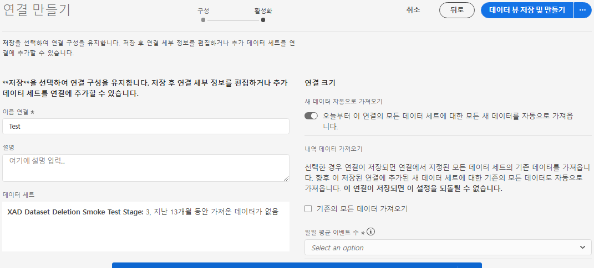

# 연결 만들기

연결을 통해 데이터 세트를 [!DNL Adobe Experience Platform] 에 통합할 수 [!UICONTROL Workspace]있습니다. 데이터 세트에 대해 보고하려면 [!DNL Experience Platform] 먼저 데이터 세트와 데이터 세트 사이의 연결을 [!DNL Experience Platform] 설정해야 [!UICONTROL Workspace]합니다.

비디오 개요를 보려면 [여기를](https://docs.adobe.com/content/help/en/platform-learn/tutorials/cja/connecting-customer-journey-analytics-to-data-sources-in-platform.html) 클릭하십시오.

>[!IMPORTANT] 여러 [!DNL Experience Platform] 데이터 세트를 하나의 연결로 결합할 수 있습니다.

1. https://analytics.adobe.com으로 [이동합니다](https://analytics.adobe.com).

1. Click the **[!UICONTROL Connections]** tab.

1. 오른쪽 **[!UICONTROL Create new connection]** 상단을 클릭합니다.

1. 왼쪽 레일은 가져올 수 [!DNL Experience Platform] 있는 모든 데이터 세트를 표시합니다. 가져올 데이터 세트를 하나 이상 선택하고 [!UICONTROL Customer Journey Analytics] 클릭합니다 **[!UICONTROL Add]**. 선택할 데이터 집합이 많은 경우 데이터 집합 목록 위의 검색 막대를 사용하여 올바른 데이터 집합을 검색할 수 있습니다.

1. 다음으로 이 연결에 추가한 각 데이터 세트에 대해 들어오는 데이터를 기반으로 데이터 집합 유형을 [!UICONTROL Customer Journey Analytics] 자동으로 설정합니다. 세 가지 데이터 세트 유형이 있습니다.데이터, [!UICONTROL Event] 데이터 및 [!UICONTROL Profile] [!UICONTROL Lookup] 데이터

   | 데이터 세트 유형 | 설명 | 타임스탬프 | 스키마 | 개인 ID |
   |---|---|---|---|---|
   | [!UICONTROL Event] | 시간(예: 웹 방문, 상호 작용, 거래, POS 데이터, 설문 조사 데이터, 광고 노출 데이터 등)으로 이벤트를 나타내는 데이터 예를 들어 고객 ID 또는 쿠키 ID와 타임스탬프가 있는 일반적인 클릭스트림 데이터일 수 있습니다. 이벤트 데이터를 사용하면 개인 ID로 사용되는 ID에 대한 유연성이 있습니다. | UICONTROL Experience Platform의 이벤트 기반 스키마에서 기본 타임스탬프 [필드로 자동 설정됩니다]. | &quot;Time Series&quot; 비헤이비어가 있는 XDM 클래스를 기반으로 하는 모든 내장 스키마 또는 사용자 지정 스키마입니다. &quot;XDM 경험 이벤트&quot; 또는 &quot;XDM 결정 이벤트&quot;가 그 예입니다. | 포함할 사람 ID를 선택할 수 있습니다. 경험 플랫폼에 정의된 각 데이터 세트 스키마는 하나 이상의 ID를 정의하거나 ID 네임스페이스와 연결할 수 있습니다. 이러한 ID 중 하나를 개인 ID로 사용할 수 있습니다. 쿠키 ID, 스티칭된 ID, 사용자 ID, 추적 코드 등이 있습니다. |
   | [!UICONTROL Lookup] | 분류 파일과 유사합니다. 이 데이터는 이벤트 또는 프로필 데이터에 있는 값이나 키를 찾는 데 사용됩니다. 예를 들어 이벤트 데이터의 숫자 ID를 제품 이름으로 매핑하는 조회 데이터를 업로드할 수 있습니다. | 해당 없음 | &quot;XDM 개별 프로필&quot; 클래스를 제외하고 &quot;기록&quot; 비헤이비어가 있는 XDM 클래스를 기반으로 하는 모든 기본 제공 또는 사용자 지정 스키마. | 해당 없음 |
   | [!UICONTROL Profile] | 비변경 및 비임시 [!UICONTROL Customer Attributes] 속성에 대한 것과 유사합니다. 방문자, 사용자 또는 [!UICONTROL Event] 데이터에 있는 고객에게 적용되는 데이터입니다. 예를 들어 고객에 대한 CRM 데이터를 업로드할 수 있습니다. | 해당 없음 | &quot;XDM 개인 프로필&quot; 클래스를 기반으로 하는 모든 기본 제공 또는 사용자 정의 스키마. | 포함할 사람 ID를 선택할 수 있습니다. 에 정의된 각 데이터 집합에는 쿠키 ID, 스티칭된 ID, 사용자 ID, 추적 코드 등과 같은 하나 이상의 개인 ID가 정의되어 [!DNL Experience Platform] 있습니다. **정보&#x200B;**:ID가 다른 데이터 세트를 포함하는 연결을 만들면 보고에 해당 ID가 반영됩니다. 실제로 데이터 세트를 병합하려면 동일한 개인 ID를 사용해야 합니다. |

1. 클릭하면 **[!UICONTROL Next]** 대화 상자로 이동합니다 [!UICONTROL Create Connection] .

   

1. 대화 [!UICONTROL Create Connection] 상자에서 다음 설정을 정의합니다.

   | 필드 | 설명 |
   |---|---|
   | [!UICONTROL Name Connection] | 연결에 설명형 이름을 지정합니다. 이름 없이 연결을 저장할 수 없습니다. |
   | [!UICONTROL Description] | 이 연결을 다른 연결과 구분하려면 세부 사항을 더 추가합니다. |
   | [!UICONTROL Datasets] | 이 연결에 포함된 데이터 집합. |
   | [!UICONTROL Automatically import all new datasets in this connection, beginning today.] | 이 연결의 데이터 세트에 추가되는 모든 새 데이터 배치가 자동으로 [!UICONTROL Workspace]들어오도록 지속적인 연결을 설정하려면 이 옵션을 선택합니다. |
   | [!UICONTROL Import all existing data] | 이 옵션을 선택하고 연결을 저장하면 이 연결에 있는 모든 데이터 세트에 [!DNL Experience Platform] 대한 기존(내역) 데이터를 모두 가져옵니다. 나중에 이 저장된 연결에 추가된 새 데이터 세트에 대한 기존의 모든 내역 데이터도 자동으로 가져옵니다.  **이 연결이 저장되면 이 설정을 변경할 수 없습니다.** |

   **주의 사항:**

   * 연결에 있는 모든 데이터 세트에 대한 내역 데이터의 누적 크기가 15억 행을 초과하는 경우 이 양의 내역 데이터를 가져올 수 없다는 오류 메시지가 표시됩니다. 하지만 10억 행의 내역 데이터를 포함하는 데이터 세트를 추가하고 해당 데이터를 가져온 다음 1주일 후에 동일한 크기의 다른 데이터 세트를 추가하고 내역 데이터를 가져오면 이렇게 됩니다.
   * 연결 시 데이터 세트에 추가된 새 데이터의 우선 순위를 지정하므로 이 데이터의 지연 시간이 가장 짧습니다.
   * 모든 채우기(내역) 데이터는 더 느린 속도로 가져옵니다.

1. 클릭 **[!UICONTROL Save]**.

워크플로우의 다음 단계는 데이터 보기를 [만드는 것입니다](/help/data-views/create-dataview.md).
