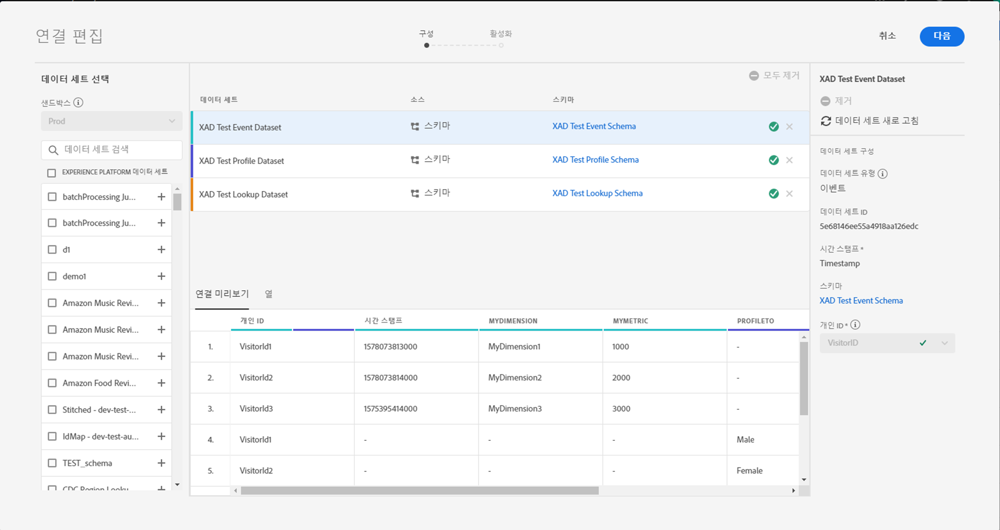
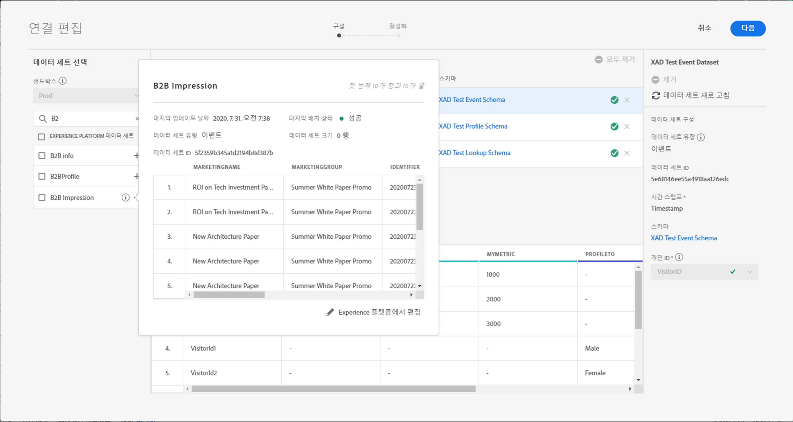
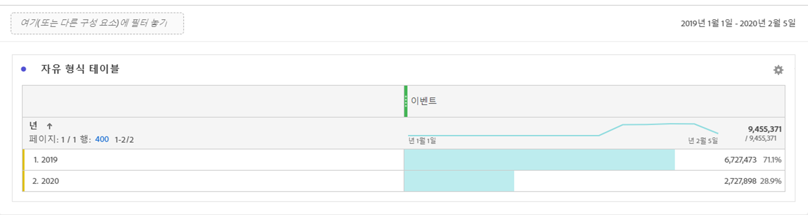

# 연결 크기 예상

현재 [!UICONTROL Customer Journey Analytics]에 있는 데이터의 행 수를 알고 있어야 할 수 있습니다. 이 항목의 목적은 비용 청구를 위해 현재 [!UICONTROL Customer Journey Analytics]의 사용 현황을 보고하는 방법을 보여주는 것입니다.

1. [!UICONTROL Customer Journey Analytics]에서 **[!UICONTROL 연결]** 탭을 클릭합니다.
1. [!UICONTROL 연결 편집] 화면에서 사용/연결 크기를 확인할 연결을 선택합니다.

   

1. 왼쪽 레일에서 연결의 일부인 데이터 세트를 선택합니다. 이 경우 &quot;B2B 노출 수&quot; 데이터 집합입니다.

   

1. 이름 옆에 있는 파란색(i) 아이콘(정보)을 클릭합니다. 데이터 세트에 3.8k 행/이벤트가 있음을 알 수 있습니다. 또한 정확한 행 수를 보려면 미리 보기 테이블 아래 Experience Platform **[!UICONTROL 에서 편집을 클릭하십시오.]** 이렇게 하면 [!UICONTROL Adobe Experience Platform]의 데이터 세트로 리디렉션됩니다.

   

1. 이 데이터 세트에 대한 **[!UICONTROL 총 레코드]**&#x200B;은 3.83k 레코드이며 데이터 크기는 388.59KB입니다.

1. 연결의 다른 데이터 세트에 대해 1-5단계를 반복하여 레코드/행 수를 추가합니다. 마지막으로 집계된 숫자는 연결의 사용 지표가 되며, 이 수는 [!UICONTROL Adobe Experience Platform]에서 인제스트할 연결의 데이터 집합 수입니다.

## 수집되는 행 수 확인

CJA에서 실제로 수집되는 이벤트 수는 연결 구성 설정에 따라 달라집니다. 또한 잘못된 개인 ID를 선택했거나 데이터 집합의 일부 행에 이 ID를 사용할 수 없는 경우 [!UICONTROL Customer Journey Analytics]은 해당 행을 무시합니다. 이렇게 하면 연결이 저장되면 수집되는 이벤트의 실제 행을 확인할 수 있습니다.

1. 연결을 저장하면 필터 없이 동일한 연결의 데이터 보기를 만듭니다.
1. 작업 공간 프로젝트를 만들고 올바른 데이터 보기를 선택합니다. 자유 형식 테이블을 만들고 **[!UICONTROL 이벤트]** 지표를 **[!UICONTROL 년]** 차원으로 드래그하여 놓습니다. 날짜 선택 달력에서 최대 날짜 범위를 선택합니다. 이렇게 하면 인제스트되는 이벤트 수가 [!UICONTROL Customer Journey Analytics]에 표시됩니다.

   

   >[!NOTE]
   >
   >이를 통해 이벤트 데이터 세트에서 수집되는 이벤트 수를 확인할 수 있습니다. 여기에는 프로필 및 조회 유형 데이터 집합이 포함되지 않습니다. 프로필 및 조회 데이터 세트에 대해 1-3단계를 수행하고 숫자를 추가하여 이 연결에 대한 총 이벤트를 가져옵니다.

## 디버그 불일치

수집되는 총 이벤트 수가 &quot;7650&quot;이지만 AEP에서 &quot;3830개 행&quot;과 함께 이벤트 데이터 세트 &quot;B2B 노출 수&quot;만 있었습니다. 왜 차이가 있습니까? 디버깅을 해 봅시다.

1. 이 차원을 **[!UICONTROL 플랫폼 데이터 집합 ID]**&#x200B;로 분류하면 크기가 같지만 크기가 다른 데이터 집합 ID ]**이 두 개 있음을 알 수 있습니다.**[!UICONTROL  각 데이터 세트에 3825개의 레코드가 있습니다. 즉, [!UICONTROL Customer Journey Analytics]이 개인 ID 또는 BAVID가 누락되어 5개의 레코드를 무시했습니다(최대 방문자 ID).

   

1. 또한 [!UICONTROL Adobe Experience Platform]을 체크 인하는 경우 ID가 &quot;5f21c12b73204194bffpc1d0&quot;인 데이터 집합이 없으므로 첫 연결이 생성될 때 누군가가 [!UICONTROL Adobe Experience Platform]에서 이 특정 데이터 집합을 삭제했습니다. 나중에 [!UICONTROL Customer Journey Analytics]에 다시 추가되었지만 다른 [!UICONTROL 플랫폼 데이터 집합 ID]이(가) [!UICONTROL Adobe Experience Platform]에 의해 생성되었습니다.

   [!UICONTROL Customer Journey Analytics] 및 [!UICONTROL Adobe Experience Platform]에서 데이터 집합 및 연결 삭제](https://experienceleague.adobe.com/docs/analytics-platform/using/cja-overview/cja-faq.html?lang=en#implications-of-deleting-data-components)에 대한 자세한 내용을 참조하십시오.[