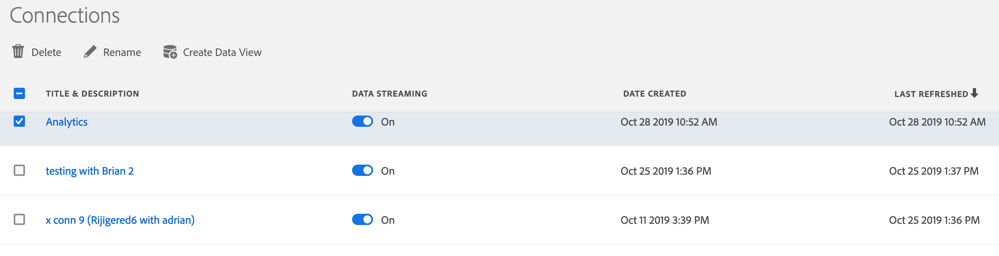

# 연결 관리

하나 이상의 연결을 만들면 관리자에서 이를 관리할 수 [!UICONTROL Connections] 있습니다. You can

* 연결을 삭제합니다.
* 연결 이름을 변경합니다.
* 연결에서 데이터 보기를 만듭니다.
* 데이터 스트리밍을 시작 및 중지합니다.

1. Click the **[!UICONTROL Connections]** tab.

2. 편집 또는 관리할 연결을 선택합니다.

3. 다음 작업 중 하나를 완료합니다.

   | 작업 | 설명 |
   |---|---|
   | [!UICONTROL Delete] | 데이터 집합이 아직 남아 있으므로 연결을 삭제해도 데이터 집합이 삭제되지 않습니다 [!DNL Adobe Experience Platform]. |
   | [!UICONTROL Rename] | 더 설명적인 이름으로 연결 이름을 변경할 수 있습니다. |
   | [!UICONTROL Create Data View] | 이 링크를 클릭하면 [데이터 뷰 빌더로](/help/data-views/create-dataview.md)이동합니다. |
   | [!UICONTROL Start or stop data streaming] | &quot;스트리밍&quot;은 연결에서 데이터 세트에 새 일괄 처리를 추가하는 경우 이 새 데이터를 보고에 [!UICONTROL Customer Journey Analytics] 사용하게 됨을 의미합니다. |

