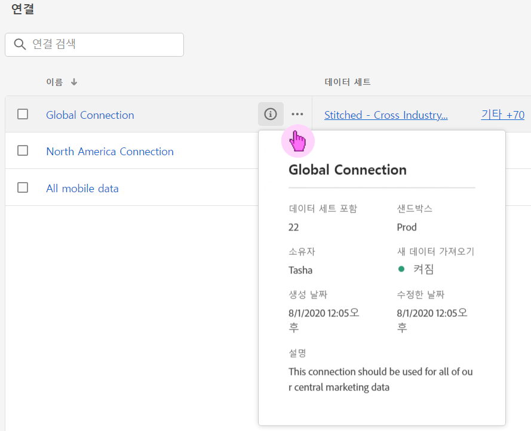
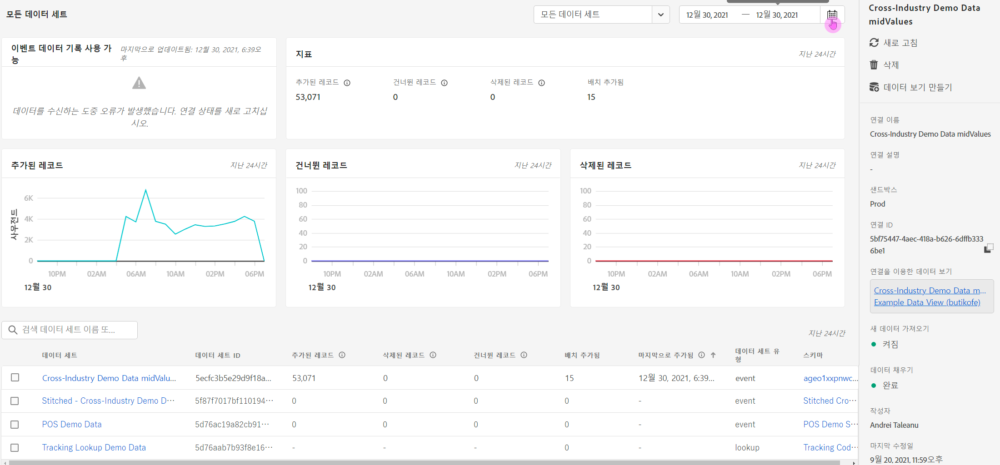

# 연결 관리

[하나 이상의 연결을 만들거나 편집](/help/connections/create-connection.md)하면 **[!UICONTROL 연결]**&#x200B;에서 관리할 수 있습니다. 연결을 통해 다음 작업을 수행할 수 있습니다.

* 소유자, 샌드박스 및 연결 생성 및 수정 시기를 포함하여 모든 연결을 한 눈에 볼 수 있습니다.
* 연결을 편집합니다.
* 연결을 삭제할 수 있습니다.
* 연결에서 데이터 보기를 만들 수 있습니다.
* 모든 데이터 세트를 연결하여 볼 수 있습니다.
* 연결의 데이터 세트 상태 및 수집 프로세스 상태를 확인합니다. 예를 들어, Analysis Workspace에서 보고 및 분석을 시작할 수 있도록 가 데이터를 사용하는 경우입니다.
* 구성 오류로 인해 발생하는 모든 데이터 불일치를 식별합니다. 혹시 누락된 행이 있습니까? 그렇다면 어떤 행이 누락되었고 이유는 무엇입니까? 연결을 잘못 구성하여 Customer Journey Analytics에서 데이터가 누락되었습니까?
* 모든 연결에서 수집되고 보고 가능한 행의 사용에 대한 통찰력을 얻으십시오.

[!UICONTROL 연결]에 두 개의 인터페이스가 있습니다. [[!UICONTROL 목록]](#list) 및 [[!UICONTROL 사용량]](#usage).

## 목록

[!UICONTROL List] 인터페이스는 연결의 기본 인터페이스입니다. 선택하지 않은 경우 **[!UICONTROL 목록]** 탭을 선택하여 인터페이스에 액세스합니다.

[!UICONTROL List] 인터페이스에 사용 가능한 모든 연결 테이블이 표시됩니다.  상자를 사용하여 연결을 빠르게 검색할 수 있습니다.

표에서 다음 열 또는 아이콘을 사용할 수 있습니다.

| 열 또는 아이콘 | 설명 |
| --- | --- |
| [!UICONTROL 이름] | 연결에 대한 친숙한 이름입니다. 연결 세부 정보를 보려면 하이퍼링크된 이름을 선택합니다. [연결 세부 정보](#connection-details)를 참조하세요. |
|  | [!UICONTROL 포함된 데이터 세트], [!UICONTROL 샌드박스], [!UICONTROL 소유자] 등에 대한 정보를 보려면 연결 이름 옆에 있는 를 선택하십시오.
팝업 창에 세부 정보가 표시됩니다. 
 |
|  | 연결을 위해 [데이터 보기를 만들려면](#create-a-data-view) 를 선택하십시오. 이 아이콘은 데이터 보기가 연결에 이미 연결되어 있지 않은 경우에만 표시됩니다. |
|  |  선택: 
연결을  [편집](#edit-a-connection)합니다.
연결을  [삭제](#delete-a-connection)합니다.
 [새 데이터 보기 만들기](#create-a-data-view). 연결에 대한 추가 데이터 보기를 만들려면 .
 연결 맵입니다. 연결에 대한 연결 맵을 보려면 다음을 수행하십시오. |
| **[!UICONTROL 데이터 세트]** | 연결에 포함된 데이터 세트에 대한 하나 이상의 링크입니다. 데이터 세트 하이퍼링크를 선택하여 연결에서 데이터 세트를 볼 수 있습니다. 선택한 연결에 더 많은 데이터 세트가 포함된 경우 **[!UICONTROL +*x* 추가]**&#x200B;를 선택하여 **[!UICONTROL 포함된 데이터 세트]** 패널을 표시합니다. 이 패널에는 모든 데이터 세트에 대한 링크와 연결에 포함된 특정 데이터 세트를 검색하는 옵션이 표시됩니다.

데이터 세트 이름을 선택하면 Experience Platform UI의 데이터 세트가 새 탭에서 열립니다. |
| **[!UICONTROL 샌드박스]** | 이 연결이 데이터 세트를 가져오는 출처 [Experience Platform 샌드박스](https://experienceleague.adobe.com/ko/docs/experience-platform/sandbox/home)입니다. 이 샌드박스는 처음에 이 연결을 만들었을 때 선택된 것이며 이는 변경할 수 없습니다. |
| **[!UICONTROL 소유자]** | 연결을 만든 사람입니다. |
| **[!UICONTROL 새 데이터 가져오기]** | 데이터 세트에 대한 새 데이터 가져오기 상태: 
    새 데이터를 가져오도록 구성된 데이터 세트의 경우 **[!UICONTROL _x _켜짐]**
   새 데이터를 가져오도록 구성되지 않은 데이터 세트에 대한 **[!UICONTROL _x 해제_]**. |
| **[!UICONTROL 만든 날짜]** | 연결이 생성된 시점의 타임스탬프입니다. |
| **[!UICONTROL 마지막 수정일]** | 연결을 마지막으로 업데이트할 때의 타임스탬프입니다. |
| **[!UICONTROL 채우기 데이터]** | 데이터 세트 간 데이터 채우기의 상태입니다.
   데이터 세트 간 실패한 다시 채우기 횟수에 대한 **[!UICONTROL _x _개 다시 채우기 실패]**,
   데이터 세트 간 처리 다시 채우기 횟수에 대한 **[!UICONTROL _x _다시 채우기 처리 중]**,
   데이터 세트에 대해 완료된 다시 채우기 횟수에 대해 **[!UICONTROL _x _개 다시 채우기 완료됨]**및
   연결의 데이터 세트에 대해 백필이 정의되지 않은 경우 **[!UICONTROL _해제_]**. |

표시할 열을 구성하려면 을 선택합니다. 이 옵션은 테이블에서 열을 켜거나 끌 수 있는 **테이블 사용자 지정** 대화 상자를 표시합니다.

### 연결 편집

연결을 편집하려면:

1. 연결 이름 옆에 있는  선택
1. 컨텍스트 메뉴에서  **[!UICONTROL 편집]**&#x200B;을 선택합니다.

또는 다음을 수행할 수 있습니다.

1. 연결 행을 선택합니다.

1. 파란색 막대에서  **[!UICONTROL 편집]**&#x200B;을 선택합니다.

연결을 편집할 때 다음 작업을 수행할 수 있습니다.

* 새 데이터 가져오기를 시작 및 중지합니다.
* 연결 이름을 변경할 수 있습니다.
* 데이터 세트를 새로 고칩니다.
* 연결에서 데이터 세트를 제거합니다.

자세한 내용은 [연결 만들기 또는 편집](create-connection.md)을 참조하십시오.

### 연결 삭제 {#connections-delete}

연결을 삭제하려면:

1. 연결 이름 옆에 있는 를 선택합니다.
1.  **[!UICONTROL 삭제]**&#x200B;를 선택합니다.

또는 다음을 수행할 수 있습니다.

1. 연결 행을 선택합니다.

1. 파란색 막대에서  **[!UICONTROL 삭제]**&#x200B;을(를) 선택합니다.

연결을 삭제하면 **[!UICONTROL 연결 삭제]** 패널에 삭제되는 데이터 보기와 영향을 받는 작업 영역 프로젝트가 표시됩니다.

연결을 삭제하려면 **[!UICONTROL 계속]**&#x200B;을(를) 선택하십시오.

연결 삭제에 대한 자세한 내용은 [삭제 의미](/help/technotes/deletion.md)를 참조하십시오.

### 연결을 위한 데이터 보기 만들기

연결에 대한 새 데이터 보기를 만들려면

* 연결과 연결된 데이터 보기가 없는 경우:

   1. 연결 이름 옆에 있는 를 선택합니다.

* 연결에 대해 하나 이상의 데이터 보기가 이미 만들어진 경우:

   1. 연결 이름 옆에 있는 를 선택합니다.
   1.  **[!UICONTROL 새 데이터 보기 만들기]**&#x200B;를 선택합니다.

또는 다음을 수행할 수 있습니다.

1. 연결 행을 선택합니다.

1. 파란색 단추 모음에서  **[!UICONTROL 데이터 보기 만들기]**&#x200B;를 선택합니다.

자세한 내용은 [데이터 보기 만들기 또는 편집](/help/data-views/create-dataview.md)을 참조하십시오.

### 연결 매핑

연결의 일부인 데이터 세트 간의 관계를 자세히 설명하는 연결 맵](/help/connections/create-connection.md#connection-map)을 보[려면:

1. 연결 이름 옆에 있는 자세히](https://spectrum.adobe.com/static/icons/workflow_18/Smock_More_18_N.svg)를 선택합니다![.
1. GraphPathing 연결 맵&#x200B;]**을 선택합니다**[!UICONTROL 

### 연결 세부 정보 {#connection-detail}

연결에 대한 세부 정보로 이동하려면 연결 테이블에서 연결 이름을 선택합니다.

연결 세부 정보 인터페이스는 연결 상태에 대한 세부 보기를 제공합니다. 다음과 같은 작업을 수행할 수 있습니다.

* 이를 통해 연결의 데이터 세트 상태 및 수집 프로세스 상태를 점검할 수 있습니다.
* 레코드를 건너뛰거나 삭제할 수 있는 구성 문제를 식별합니다.
* 데이터를 보고에 사용할 수 있게 되는 시기를 알 수 있습니다.

| 사용자 인터페이스 | 설명 |
| --- | --- |
|  **[!UICONTROL 연결 편집]** | 연결의 세부 정보를 편집하려면  **[!UICONTROL 연결 편집]**&#x200B;을 선택하세요. 자세한 내용은 [연결 만들기 또는 편집](create-connection.md)을 참조하십시오. |
| **[!UICONTROL *데이터 집합 선택기&#x200B;*]** | 연결 안에 있는 한 개의 데이터 세트 또는 모든 데이터 세트를 선택할 수 있습니다. 다수의 데이터 세트를 선택할 수는 없습니다. 기본값은 **[!UICONTROL 모든 데이터 세트]**&#x200B;로 설정되어 있습니다. |
| **[!UICONTROL *날짜 범위 선택기&#x200B;*]** | 시작 날짜, 종료 날짜를 편집하거나 을 선택하여 날짜 범위 선택기를 엽니다. 날짜 범위 선택기에서 미리 정의된 기간(예: **[!UICONTROL 최근 6개월]**) 중 하나를 사용하여 날짜 범위를 선택하거나 달력을 사용하여 시작 및 종료 날짜를 선택합니다. 새 날짜 범위를 적용하려면 **[!UICONTROL 적용]**&#x200B;을 선택하세요. |
| **[!UICONTROL 사용 가능한 이벤트 데이터 레코드]** | 보고에 사용할 수 있는 총 이벤트 데이터 세트 행 수, 전체 연결에 대해 **개**. 이 수는 어떠한 달력 설정과도 관련이 없습니다. 카운트는 데이터 세트 선택기에서 또는 표에서 데이터 세트를 선택하면 변경됩니다. 데이터가 추가되면 보고에 데이터를 표시하는 데 1~2시간의 지연 시간이 있습니다. |
| [!UICONTROL **[!UICONTROL 지표]**] | 추가, 생략 및 삭제된 이벤트, 조회, 프로필 및 요약 데이터 세트 레코드와 추가된 배치 수를 요약합니다. 이 지표는 **선택한 데이터 세트 및 날짜 범위**&#x200B;를 기반으로 합니다.
**[!UICONTROL 세부 정보 확인]**&#x200B;을 선택하여 **[!UICONTROL 건너뛴 세부 정보 확인]** 팝업을 표시합니다. 팝업에 건너뛴 레코드 수와 모든 이벤트 데이터 세트 또는 선택한 데이터 세트에 대한 이유가 나열됩니다.

자세한 정보가 포함된  팝업을 선택하십시오. [!UICONTROL 빈 방문자 ID]와 같은 일부 건너뛴 이유로 팝업에 [쿼리 서비스](https://experienceleague.adobe.com/ko/docs/experience-platform/query/home)에서 데이터 집합에서 건너뛴 레코드를 쿼리하는 데 사용할 수 있는 EQS(Experience Platform for Query Service)에 대한 샘플 PSQL이 표시됩니다. SQL을 복사하려면  **[!UICONTROL EQS에 대한 샘플 PSQL 복사]**&#x200B;를 선택하십시오. |
| **[!UICONTROL 추가된 레코드]** | 선택된 기간 내에 **선택한 데이터 세트 및 날짜 범위**&#x200B;에 대해 얼마나 많은 행이 추가되었는지 나타냅니다. 10분마다 업데이트됩니다. |
| **[!UICONTROL 생략된 레코드]** | 선택된 기간 내에 **선택한 데이터 세트 및 날짜 범위**&#x200B;에 대해 얼마나 많은 행이 생략되었는지 나타냅니다. 기록 생략의 이유에는 타임스탬프 누락, 누락되었거나 잘못된 또는 계정 ID [!BADGE B2B edition]{type=Informative url="https://experienceleague.adobe.com/en/docs/analytics-platform/using/cja-overview/cja-b2b/cja-b2b-edition" newtab=true tooltip="Customer Journey Analytics B2B edition"} 등이 포함됩니다. 10분마다 업데이트됩니다. 
잘못된 ID(예: `undefined` 또는 `00000000`, 또는 [!UICONTROL 개인 ID]에 있는 1달 동안 1백만 번 이상 이벤트에 나타나는 숫자 및 문자의 조합)는 특정 사용자 또는 개인의 특성을 가질 수 없는 ID입니다. 이러한 행은 시스템으로 수집될 수 없으며 오류 유발 수집 및 보고를 초래할 수 있습니다. 잘못된 개인 ID 또는 계정 ID [!BADGE B2B edition]{type=Informative url="https://experienceleague.adobe.com/en/docs/analytics-platform/using/cja-overview/cja-b2b/cja-b2b-edition" newtab=true tooltip="Customer Journey Analytics B2B edition"}을(를) 수정하려면 3가지 옵션이 필요합니다.<ul><li>[결합](/help/stitching/overview.md)을 사용하여 정의되지 않은 또는 모두 영으로 된 사용자 ID를 올바른 사용자 ID로 채웁니다.</li><li>사용자 ID를 지우면 해당 ID는 수집 중에 키핑됩니다(잘못된 또는 모두 영으로 된 사용자 ID보다 선호됨).</li><li>데이터를 수집하기 전에 사용자의 시스템 내에서 모든 잘못된 사용자 ID를 수정합니다.</li></ul> |
| **[!UICONTROL 삭제된 레코드]** | 선택된 기간 내에 **선택한 데이터 세트 및 날짜 범위**&#x200B;에 대해 얼마나 많은 행이 삭제되었는지 나타냅니다. 예를 들어 누군가가 [!DNL Experience Platform]에서 데이터 세트를 삭제했을 수 있습니다. 10분마다 업데이트됩니다.
일부 시나리오에서 이 값에는 결합 또는 일부 조회 데이터 세트 업데이트와 같이 대체된 레코드도 포함될 수 있습니다. 다음 예를 생각해 보십시오.
<ul><li>Customer Journey Analytics 프로필 조회 데이터로 수집하도록 구성된 XDM 개별 프로필 데이터 세트에 하나의 레코드를 업로드합니다. 연결 세부 정보에서 이 데이터 세트에는 추가된 레코드 1개가 표시됩니다.</li><li>이제 두 개의 레코드가 포함된 동일한 AEP 데이터 세트에 원래 레코드의 복제본을 업로드합니다. Customer Journey Analytics 프로필 또는 B2B Edition]{type=Informative url="https://experienceleague.adobe.com/en/docs/analytics-platform/using/cja-overview/cja-b2b/cja-b2b-edition" newtab=true tooltip="Customer Journey Analytics B2B edition"} 조회 데이터 세트 계정 [!BADGE 추가 레코드를 수집합니다. 프로필 또는 계정 레코드가 해당 개인 ID 또는 계정 [!BADGE ID B2B Edition]{type=Informative url="https://experienceleague.adobe.com/en/docs/analytics-platform/using/cja-overview/cja-b2b/cja-b2b-edition" newtab=true tooltip="Customer Journey Analytics B2B edition"}에 대한 연결에서 이미 수집되었음을 확인Customer Journey Analytics 이전 버전을 삭제하고 새 프로필 데이터를 추가합니다. 연결 세부 정보에서 이 작업은 수집된 개인 ID 또는 계정 ID [!BADGE B2B 버전]{type=Informative url="https://experienceleague.adobe.com/en/docs/analytics-platform/using/cja-overview/cja-b2b/cja-b2b-edition" newtab=true tooltip="Customer Journey Analytics B2B edition"}에 대한 최신 프로필 조회 데이터만 유지하므로 1개의 레코드가 추가되고 1개의 레코드가 삭제됨Customer Journey Analytics 나타냅니다.</li><li>전체적으로 AEP 데이터 세트에는 동일한 두 개의 레코드가 포함되어 있습니다. 별도로 Customer Journey Analytics 연결 세부 정보에 수집된 데이터의 상태가 표시됩니다. 이 프로필 데이터 세트에 대해 추가된 레코드 2개와 삭제된 레코드 1개가 표시됩니다. </li></ul> |
|  | 데이터 세트 검색 필드. 데이터 세트 이름 또는 [!UICONTROL 데이터 세트 ID]&#x200B;(으)로 데이터 세트 테이블을 검색할 수 있습니다. |
| [!UICONTROL 데이터 세트 테이블] | 연결에 포함된 데이터 세트를 표시합니다. 자세한 내용은 아래 표를 참조하십시오. |

데이터 세트 테이블에는 다음 열이 표시됩니다.

| 열 | 설명 |
| --- | --- |
| **[!UICONTROL 데이터 세트]** | 연결의 일부인 데이터 세트 이름입니다. 하이퍼링크를 선택하여 Experience Platform UI의 데이터 세트 새 탭에서 열 수 있습니다. 행 또는 확인란을 선택하여 선택한 데이터 세트에 대한 세부 사항만 표시할 수 있습니다. |
| **[!UICONTROL 데이터 세트 ID]** | Experience Platform 에서 자동으로 생성됩니다. |
| **[!UICONTROL 추가된 레코드]** | 선택한 시간 간격 동안 연결에 추가된 데이터 세트 레코드(행) 수입니다. |
| **[!UICONTROL 생략된 레코드]** | 선택한 시간 간격 동안 연결을 위한 데이터 전송 중 건너뛴 데이터 세트 레코드(행) 수입니다. |
| **[!UICONTROL 삭제된 레코드]** | 선택한 시간 간격 동안 연결에서 제거된 데이터 세트 레코드(행) 수입니다. |
| **[!UICONTROL 배치 추가됨]** | 데이터 세트 배치 수가 연결에 추가되었습니다. |
| **[!UICONTROL 마지막으로 추가됨]** | 연결에 추가된 데이터 세트에서 최신 일괄 처리의 타임스탬프. |
| **[!UICONTROL 데이터 소스 유형]** | 데이터 세트의 소스 유형입니다. 연결을 만들 때 소스 유형을 정의합니다. |
| **[!UICONTROL 데이터 세트 유형]** | 이 데이터 세트의 데이터 세트 유형입니다. 유형은 [!UICONTROL 이벤트], [!UICONTROL 프로필], [!UICONTROL 조회] 또는 [!UICONTROL 요약]일 수 있습니다. [자세히 알아보기](https://experienceleague.adobe.com/en/docs/analytics-platform/using/cja-connections/create-connection) |
| **[!UICONTROL 스키마]** | 데이터 세트가 기반으로 삼는 Experience Platform 스키마. |
| **[!UICONTROL 새 데이터 가져오기]** | 데이터 세트에 대한 새 데이터 가져오기 상태: 
   **[!UICONTROL _x _일자]**데이터 세트가 새 데이터를 가져오도록 구성된 경우 및
   새 데이터 가져오기를 가져오지 않도록 데이터 세트가 구성된 경우 **[!UICONTROL _x 해제_]**. |
| **[!UICONTROL 데이터 변환]** | 적용 가능한 B2B 조회 데이터 세트의 변환 상태입니다. 자세한 내용은 [B2B 조회를 위해 데이터 세트 변환](transform-datasets-b2b-lookups.md)을 참조하십시오.
   변환을 위해 활성화된 적용 가능한 데이터 세트의 경우 **[!UICONTROL _x _켜기]**, 
   변환에 사용할 수 없는 적용 가능한 데이터 세트에 대한 **[!UICONTROL _x 해제_]** 및
다른 모든 데이터 세트의 경우 **[!UICONTROL 해당 없음]**&#x200B;을(를) 변환에 적용할 수 없습니다. |
| **[!UICONTROL 채우기 데이터]** | 데이터 세트에 대한 데이터 채우기 상태입니다.
   실패한 다시 채우기 횟수에 대해 **[!UICONTROL _x _개의 다시 채우기 실패]**,
   **[!UICONTROL _x _다시 채우기 처리 중]**다시 채우기 처리 횟수,
   완료된 다시 채우기 횟수에 대해 **[!UICONTROL _x _개 다시 채우기 완료됨]**및
   다시 채우기가 구성되지 않은 경우 **[!UICONTROL _끄기_]**. |
| **[!UICONTROL 새 데이터 가져오기]** | 데이터 세트에 대한 새 데이터 가져오기 상태: 
   **[!UICONTROL _x _일자]**데이터 세트가 새 데이터를 가져오도록 구성된 경우 및
   데이터 세트가 새 데이터를 가져오지 않도록 구성된 경우 **[!UICONTROL _x 해제_]**. |
| **[!UICONTROL 채우기 데이터]** | 데이터 세트에 대한 데이터 채우기 상태입니다.
   실패한 다시 채우기 횟수에 대해 **[!UICONTROL _x _개의 다시 채우기 실패]**,
   **[!UICONTROL _x _다시 채우기 처리 중]**다시 채우기 처리 횟수,
   완료된 다시 채우기 횟수에 대해 **[!UICONTROL _x _개 다시 채우기 완료됨]**및
   **[!UICONTROL _채우기가 구성되지 않은 경우 꺼_]** 집니다. |

>[!IMPORTANT]
>
>2021년 8월 13일 이전에 수집된 데이터는 Connections] 인터페이스에 [!UICONTROL 반영되지 않습니다.

#### 연결 패널

데이터 세트 테이블에서 선택된 데이터 세트가 없는 경우, 연결 인터페이스의 오른쪽에 있는 패널에 연결 옵션 및 세부사항이 표시됩니다.

| 옵션 | 설명 |
| --- | --- |
|  [!UICONTROL 새로 고침] | 연결을 새로 고치고 최근에 추가한 레코드를 반영하도록 허용하려면  **[!UICONTROL 새로 고침]**&#x200B;을 선택하십시오. |
|  **[!UICONTROL 삭제]** | 이 연결을 [삭제](#delete-a-connection)합니다. |
|  **[!UICONTROL 데이터 보기 만들기]** | 이 연결을 기반으로 [데이터 보기를 만듭니다](#create-a-data-view). 자세한 내용은 [데이터 보기](https://experienceleague.adobe.com/en/docs/analytics-platform/using/cja-dataviews/data-views)를 참조하세요. |
| **[!UICONTROL 연결 이름]** | 연결의 이름입니다. |
| **[!UICONTROL 연결 설명]** | 이 연결의 목적을 설명하는 자세한 설명입니다. |
| **[!UICONTROL 샌드박스]** | [이 연결이 데이터 세트를 가져오는 Experience Platform 샌드박스](https://experienceleague.adobe.com/ko/docs/experience-platform/sandbox/home)입니다. 이 샌드박스는 연결을 처음 만들 때 선택되었습니다. 이는 변경할 수 없습니다. |
| **[!UICONTROL 연결 ID]** | 이 ID는 Experience Platform에서 생성됩니다. 를 사용하여 ID를 복사할 수 있습니다. |
| **[!UICONTROL 연결을 이용한 데이터 보기]** | 이 연결을 사용하는 데이터 보기를 모두 나열합니다. |
| **[!UICONTROL 새 데이터 가져오기]** | 데이터 세트에 대한 새 데이터 가져오기 상태: 
   새 데이터를 가져오도록 구성된 데이터 세트 수에 대한 **[!UICONTROL _x _날짜]**및
   새 데이터 가져오기가 해제되는 데이터 세트 수에 대해 **[!UICONTROL _x 해제_]**&#x200B;합니다. |
| **[!UICONTROL 채우기 데이터]** | 데이터 세트에 대한 데이터 채우기 상태입니다.
   데이터 세트 간 실패한 다시 채우기 횟수에 대한 **[!UICONTROL _x _개 다시 채우기 실패]**,
   데이터 세트 간 처리 다시 채우기 횟수에 대한 **[!UICONTROL _x _다시 채우기 처리 중]**,
   데이터 세트에 대해 완료된 다시 채우기 횟수에 대해 **[!UICONTROL _x _개 다시 채우기 완료됨]**및
   연결의 데이터 세트에 대해 백필이 정의되지 않은 경우 **[!UICONTROL _해제_]**. |
| **[!UICONTROL 데이터 변환]** | 적용 가능한 B2B 조회 데이터 세트의 변환 상태입니다. 자세한 내용은 [B2B 조회를 위해 데이터 세트 변환](transform-datasets-b2b-lookups.md)을 참조하십시오.
   변환을 위해 활성화된 데이터 세트 수에 대해 **[!UICONTROL _x _켜기]**. |
| **[!UICONTROL 작성자]** | 연결을 만든 사람의 이름입니다. |
| **[!UICONTROL 마지막 수정일]** | 연결에 대한 마지막 변경 사항의 타임스탬프입니다. |
| **[!UICONTROL 마지막 수정자]** | 연결을 마지막으로 수정한 사람입니다. |

#### 데이터 세트 패널

데이터 세트 테이블에서 데이터 세트 행을 선택하면 연결 인터페이스 오른쪽의 패널에 선택한 데이터 세트에 대한 세부 정보가 표시됩니다.

| 세부 사항 | 설명 |
| --- | --- |
| **[!UICONTROL 개인 ID]** | Experience Platform의 데이터 세트 스키마에 정의된 ID. 이 ID는 연결 생성 중에 선택한 개인 ID입니다. ID가 다른 데이터 세트를 포함하는 연결을 만들면 이러한 내용이 보고에 반영됩니다. 데이터 세트를 병합하려면 데이터 세트 간에 동일한 개인 ID를 사용해야 합니다. |
| **[!UICONTROL 키]** | 조회 데이터 세트에 대해 지정한 키입니다. |
| **[!UICONTROL 일치하는 키]** | 조회 데이터 세트에 대해 지정한 일치하는 키입니다. |
| **[!UICONTROL 타임스탬프]** | 이벤트 데이터 세트에 대해 정의된 타임스탬프입니다. |
| **[!UICONTROL 사용 가능한 레코드]** | 달력을 통해 선택한 특정 기간 동안 이 데이터 세트에 대해 수집된 행의 총 수입니다. 데이터가 추가되고 난 후 보고에 표시되기까지의 지연 시간은 없습니다. 그러나 새 연결을 만들 때는 [지연](https://experienceleague.adobe.com/en/docs/analytics-platform/using/cja-overview/cja-faq)이 있습니다. |
| **[!UICONTROL 추가된 레코드]** | 선택한 기간 내에 얼마나 많은 행이 추가되었는지를 나타냅니다. |
| **[!UICONTROL 삭제된 레코드]** | 선택한 기간 동안 삭제된 레코드 수입니다. |
| **[!UICONTROL 배치 추가됨]** | 이 데이터 세트에 얼마나 많은 데이터가 추가되었는지 나타냅니다. |
| **[!UICONTROL 생략된 레코드]** | 선택한 기간 내에 수집 중 얼마나 많은 행이 생략되었는지를 나타냅니다.
기록 생략의 이유에는 타임스탬프 누락, 개인 ID 또는 계정 ID [!BADGE B2B edition]{type=Informative url="https://experienceleague.adobe.com/en/docs/analytics-platform/using/cja-overview/cja-b2b/cja-b2b-edition" newtab=true tooltip="Customer Journey Analytics B2B edition"} 누락 또는 잘못된 ID 등이 포함됩니다. 10분마다 업데이트됩니다.
잘못된 ID(예: `undefined` 또는 `00000000`, 또는 [!UICONTROL 개인 ID]에 있는 1달 동안 1백만 번 이상 이벤트에 나타나는 숫자 및 문자의 조합)는 특정 사용자 또는 개인의 특성을 가질 수 없는 ID입니다. 이러한 행은 시스템으로 수집될 수 없으며 오류 유발 수집 및 보고를 초래할 수 있습니다. 잘못된 개인 ID 또는 계정 ID를 수정하려면 3가지 옵션이 있습니다.<ul><li>[결합](/help/stitching/overview.md)을 사용하여 정의되지 않은 또는 모두 영으로 된 사용자 ID를 올바른 사용자 ID로 채웁니다.</li><li>사용자 ID를 지우면 해당 ID는 수집 중에 건너뜁니다(잘못된 또는 모두 영으로 된 사용자 ID보다 선호됨).</li><li>데이터를 수집하기 전에 사용자의 시스템 내에서 모든 잘못된 사용자 ID를 수정합니다.</li></ul> |
| **[!UICONTROL 마지막으로 추가됨]** | 마지막 배치가 추가된 타임스탬프입니다. |
| **[!UICONTROL 새 데이터 가져오기]** | 데이터 세트 새 데이터를 가져오는 단계의 상태입니다. 
   **[!UICONTROL _x _켜]**짐 경우 데이터 세트가 새 데이터를 가져오도록 구성되고,
   데이터 세트가 새 데이터를 가져오지 않도록 구성된 경우 **[!UICONTROL _x 해제_]**. |
| **[!UICONTROL 채우기 데이터]** | 데이터 세트에 대한 데이터 채우기 상태입니다.
   실패한 다시 채우기 횟수에 대해 **[!UICONTROL _x _개의 다시 채우기 실패]**,
   **[!UICONTROL _x _다시 채우기 처리 중]**다시 채우기 처리 횟수,
   완료된 다시 채우기 횟수에 대해 **[!UICONTROL _x _개 다시 채우기 완료됨]**및
   다시 채우기가 구성되지 않은 경우 **[!UICONTROL _끄기_]**.
데이터 세트에 대한 과거 채우기 개요가 포함된 대화 상자를 표시하려면 을 선택합니다.  **[!UICONTROL 지난 다시 채우기]**. |
| **[!UICONTROL 데이터 소스 유형]** | 연결에 데이터 세트를 추가할 때 정의된 데이터 소스 유형. |
| **[!UICONTROL 데이터 세트 유형]** | [!UICONTROL 이벤트], [!UICONTROL 프로필], [!UICONTROL 조회] 또는 [!UICONTROL 요약]입니다. [자세히 알아보기](https://experienceleague.adobe.com/en/docs/analytics-platform/using/cja-connections/create-connection) |
| **[!UICONTROL 스키마]** | 이 데이터 세트가 기반으로 삼는 Experience Platform 스키마. |
| **[!UICONTROL 데이터 세트 ID]** | 이 데이터 세트 ID는 Experience Platform에서 생성됩니다. |

## 사용 {#connections-usage}

<!-- markdownlint-disable MD034 -->

>[!CONTEXTUALHELP]
>id="cja_connections_usage_keyusagemetrics"
>title="주요 사용 지표"
>abstract="핵심 및 내역 보고 가능 행에 대한 월별 및 전체 데이터를 제공합니다."
<!-- markdownlint-enable MD034 -->

<!-- markdownlint-disable MD034 -->

>[!CONTEXTUALHELP]
>id="cja_connections_usage_monthlyingestedrows"
>title="월별 수집된 행"
>abstract="매달 시스템에 추가된 총 레코드 수를 측정하여 데이터 증가 및 수집 비율에 대한 통찰력을 제공합니다."
<!-- markdownlint-enable MD034 -->

<!-- markdownlint-disable MD034 -->

>[!CONTEXTUALHELP]
>id="cja_connections_usage_monthlyreportablerows"
>title="월별 보고 가능한 행"
>abstract="보고에 사용할 수 있는 행 수를 추적합니다. 보고 가능한 행은 수집된 행에서 수집 중에 건너뛰거나 삭제된 행을 뺀 것입니다. 보고 가능한 행은 결제 및 데이터 사용량에 대한 주요 지표로 사용됩니다."
<!-- markdownlint-enable MD034 -->

<!-- markdownlint-disable MD034 -->

>[!CONTEXTUALHELP]
>id="cja_connections_usage_detailbreakdown"
>title="세부 분류."
>abstract="연결, 데이터 세트, 샌드박스 및 태그별로 자세한 지표를 조회할 수 있으며, 데이터의 CSV 파일을 다운로드할 수도 있습니다."
<!-- markdownlint-enable MD034 -->

<!-- markdownlint-disable MD034 -->

>[!CONTEXTUALHELP]
>id="cja_connections_usage_otherdatasets"
>title="다른 데이터 세트"
>abstract="2024년 9월 이전 몇 개월 동안 데이터는 데이터 세트 수준에서 수집되었고, 명확성을 위해 *다른 데이터 세트*&#x200B;로 표시됩니다. 2024년 9월부터 데이터는 세부적인 데이터 세트 수준에서 수집되고 *다른 데이터 세트*&#x200B;가 더 이상 표시되지 않습니다."
<!-- markdownlint-enable MD034 -->

<!-- markdownlint-disable MD034 -->

>[!CONTEXTUALHELP]
>id="cja_connections_usage_unknowndatasetsorconnections"
>title="알 수 없는 데이터 세트나 연결"
>abstract="알 수 없는 데이터 세트나 연결은 해당 ID를 사용하여 표시합니다."
<!-- markdownlint-enable MD034 -->

<!-- markdownlint-disable MD034 -->

>[!CONTEXTUALHELP]
>id="cja_connections_usage_datanotavailable"
>title="데이터를 사용할 수 없음"
>abstract="시스템 제한으로 2024년 9월 이전의 내역 데이터는 사용할 수 없습니다. 2024년 9월부터 지표를 수집하여 표시합니다. 차트는 타임라인에서 지난 18개월을 보여 주고 데이터는 추후 사용될 경우 표시됩니다."
<!-- markdownlint-enable MD034 -->

<!-- markdownlint-disable MD034 -->

>[!CONTEXTUALHELP]
>id="cja_connections_corereportablerows"
>title="핵심 보고 가능 행"
>abstract="지난 13개월 동안 사용 가능한 총 행 수를 표시합니다. 예: 2024년 2월 1일의 수는 2023년 1월부터 2024년 1월까지의 이벤트 타임스탬프에서 사용 가능한 합계 행을 보여 줍니다."
<!-- markdownlint-enable MD034 -->

<!-- markdownlint-disable MD034 -->

>[!CONTEXTUALHELP]
>id="cja_connections_historicalreportablerows"
>title="내역 보고 가능 행"
>abstract="13개월 이상 지난 해당 기간의 사용 가능한 총 행 수를 표시합니다. 예: 2024년 2월 1일의 수는 2023년 1월 이전 이벤트 타임스탬프에서 사용 가능한 합계 행을 보여 줍니다."

<!-- markdownlint-enable MD034 -->

<!-- markdownlint-disable MD034 -->

>[!CONTEXTUALHELP]
>id="connections_usage_keyusagemetrics"
>title="주요 사용 지표"
>abstract="핵심 및 내역 보고 가능 행에 대한 월별 및 전체 데이터를 제공합니다."
<!-- markdownlint-enable MD034 -->

<!-- markdownlint-disable MD034 -->

>[!CONTEXTUALHELP]
>id="connections_usage_monthlyingestedrows"
>title="월별 수집된 행"
>abstract="매달 시스템에 추가된 총 레코드 수를 측정하여 데이터 증가 및 수집 비율에 대한 통찰력을 제공합니다."
<!-- markdownlint-enable MD034 -->

<!-- markdownlint-disable MD034 -->

>[!CONTEXTUALHELP]
>id="connections_usage_monthlyreportablerows"
>title="월별 보고 가능한 행"
>abstract="보고에 사용할 수 있는 행 수를 추적합니다. 보고 가능한 행은 수집된 행에서 수집 중에 건너뛰거나 삭제된 행을 뺀 것입니다. 보고 가능한 행은 결제 및 데이터 사용량에 대한 주요 지표로 사용됩니다."
<!-- markdownlint-enable MD034 -->

<!-- markdownlint-disable MD034 -->

>[!CONTEXTUALHELP]
>id="connections_usage_detailbreakdown"
>title="세부 분류."
>abstract="연결, 데이터 세트, 샌드박스 및 태그별로 자세한 지표를 조회할 수 있으며, 데이터의 CSV 파일을 다운로드할 수도 있습니다."
<!-- markdownlint-enable MD034 -->

<!-- markdownlint-disable MD034 -->

>[!CONTEXTUALHELP]
>id="connections_usage_otherdatasets"
>title="다른 데이터 세트"
>abstract="2024년 9월 이전 몇 개월 동안 데이터는 데이터 세트 수준에서 수집되었고, 명확성을 위해 *다른 데이터 세트*&#x200B;로 표시됩니다. 2024년 9월부터 데이터는 세부적인 데이터 세트 수준에서 수집되고 *다른 데이터 세트*&#x200B;가 더 이상 표시되지 않습니다."
<!-- markdownlint-enable MD034 -->

<!-- markdownlint-disable MD034 -->

>[!CONTEXTUALHELP]
>id="connections_usage_unknowndatasetsorconnections"
>title="알 수 없는 데이터 세트나 연결"
>abstract="알 수 없는 데이터 세트나 연결은 해당 ID를 사용하여 표시합니다."
<!-- markdownlint-enable MD034 -->

<!-- markdownlint-disable MD034 -->

>[!CONTEXTUALHELP]
>id="connections_usage_datanotavailable"
>title="데이터를 사용할 수 없음"
>abstract="시스템 제한으로 2024년 9월 이전의 내역 데이터는 사용할 수 없습니다. 2024년 9월부터 지표를 수집하여 표시합니다. 차트는 타임라인에서 지난 18개월을 보여 주고 데이터는 추후 사용될 경우 표시됩니다."
<!-- markdownlint-enable MD034 -->

<!-- markdownlint-disable MD034 -->

>[!CONTEXTUALHELP]
>id="connections_corereportablerows"
>title="핵심 보고 가능 행"
>abstract="지난 13개월 동안 사용 가능한 총 행 수를 표시합니다. 예: 2024년 2월 1일의 수는 2023년 1월부터 2024년 1월까지의 이벤트 타임스탬프에서 사용 가능한 합계 행을 보여 줍니다."
<!-- markdownlint-enable MD034 -->

<!-- markdownlint-disable MD034 -->

>[!CONTEXTUALHELP]
>id="connections_historicalreportablerows"
>title="내역 보고 가능 행"
>abstract="13개월 이상 지난 해당 기간의 사용 가능한 총 행 수를 표시합니다. 예: 2024년 2월 1일의 수는 2023년 1월 이전 이벤트 타임스탬프에서 사용 가능한 합계 행을 보여 줍니다."

<!-- markdownlint-enable MD034 -->

<!-- markdownlint-disable MD034 -->

>[!CONTEXTUALHELP]
>id="connections_breakdown_corereportablerows"
>title="핵심 보고 가능 행"
>abstract="코어 보고 가능 행은 집계된 합계가 아닌 스냅샷 값입니다. 이 값은 선택한 날짜 범위에서 마지막 달을 기준으로 동적으로 업데이트됩니다. 고객이 1월 - 3월을 선택하면 이 값에 3월의 스냅샷이 반영됩니다."

>[!CONTEXTUALHELP]
>id="connections_breakdown_historicalreportablerows"
>title="내역 보고 가능 행"
>abstract="기록 보고 가능 행은 합계되지 않은 스냅샷 값입니다. 이 값은 선택한 날짜 범위에서 마지막 달을 기준으로 동적으로 업데이트됩니다. 고객이 1월 - 3월을 선택하면 이 값에 3월의 스냅샷이 반영됩니다."

>[!CONTEXTUALHELP]
>id="connections_breakdown_cumulativereportablerows"
>title="누적 보고 가능한 행"
>abstract="누적 보고 가능 행은 집계된 합계가 아닌 스냅샷 값입니다. 이 값은 선택한 날짜 범위에서 마지막 달을 기준으로 동적으로 업데이트됩니다. 고객이 1월 - 3월을 선택하면 이 값에 3월의 스냅샷이 반영됩니다."

<!-- markdownlint-enable MD034 -->

[!UICONTROL 사용] 인터페이스는 모든 연결에서 수집되고 보고 가능한 행의 사용을 보여 줍니다. 선택하지 않은 경우 **[!UICONTROL 사용량]** 탭을 선택하여 인터페이스에 액세스합니다.

이 인터페이스는 Customer Journey Analytics 사용이 계약상 합의된 사항을 준수하는지 여부를 확인할 수 있도록 지원합니다. 모니터링 목적 외에 사용 인터페이스를 사용하여 Customer Journey Analytics 라이선스 갱신을 계획할 수 있습니다.

사용 인터페이스는 다음 지표를 사용합니다

| 지표 이름 | 설명 |
|---|---|
| 내역 보고 가능 행 | 13개월보다 오래된 기간의 행 수입니다. |
| 핵심 보고 가능 행 | 지난 13개월 동안의 행 수입니다. |
| 수집된 행 | 특정 기간 동안 수집되는 행 수입니다. |
| 보고 가능한 행 | 특정 기간 동안 연결의 일부로 가지고 있는 데이터 행 수입니다. |
| 누적 행 | 특정 달까지 몇 개의 행이 수집됩니까? |

>[!NOTE]
>
>코어, 내역 및 전체 레코드에 대한 데이터는 2024년 7월부터 수집됩니다. 이전 이전 내역 데이터는 계정 관리자에게 문의하십시오.
>

사용 인터페이스는 두 개의 패널로 구성됩니다.

* **[!UICONTROL 주요 사용 지표]** 패널: 보고 가능한 핵심 및 내역 데이터 행을 제공합니다. 또한 패널은 핵심 데이터 행과 내역 데이터 행 모두에 대해 이전 달과 비교한 백분율 변경 사항을 추적합니다.

  패널이 시각화에 표시됩니다.

   * **[!UICONTROL 핵심 데이터 보고 가능 행]**.

     지난 13개월 동안 보고 가능한 행 수 요약 번호는 지난 달(예: 2024년 12월)에 대한 코어 보고 가능 행(예: 741M) 수입니다.

   * **[!UICONTROL 내역 데이터 보고 가능 행]**.

     13개월보다 오래된 기간에 대해 보고 가능한 행 수가 얼마나 됩니까? 요약 번호는 지난 달(예: 2024년 12월)에 대한 기록 보고 가능한 행(예: 127M) 수입니다.

  시각화에서 스택 막대 위로 마우스를 가져가면 팝업에 막대의 특정 부분에 대한 행 수가 표시됩니다(예:).

  

* 다음에 대한 세 개의 하위 패널을 보여주는 결합된 패널:

+++ 수집된 행

  **[!UICONTROL 수집된 행]** 하위 패널은 매월 시스템에 추가된 총 레코드 수를 측정하여 데이터 증가 및 수집 속도에 대한 통찰력을 제공합니다. 하위 패널에서는 이번 달의 총 수집된 행 수와 이전 달과의 변경 사항에 대한 요약을 제공합니다.

  

  시각화의 데이터 포인트 위로 마우스를 가져가면 자세한 정보가 포함된 팝업이 표시됩니다.

+++

+++ 보고 가능한 행

  **[!UICONTROL 보고 가능한 행]** 시각화는 수집된 행에서 생략된 행과 삭제된 행을 빼서 보고에 사용할 수 있는 행 수를 추적하며, 청구 및 데이터 사용의 주요 지표로 사용됩니다. 하위 패널은 다음 두 가지 요약을 제공합니다.

   * **[!UICONTROL 지난 달 합계]**: 이번 달까지 보고 가능한 총 행의 요약입니다.
   * **[!UICONTROL 이번 달]**: 이번 달의 총 보고 가능한 행 및 이전 달에서의 변경 내용에 대한 요약입니다.

  

  시각화의 데이터 포인트 위로 마우스를 가져가면 자세한 내용이 포함된 팝업을 표시할 수 있습니다.

+++

+++ 세부 분류

  **[!UICONTROL 세부 분류]** 테이블을 사용하여 연결, 데이터 세트, 샌드박스 및 태그별로 세부 지표를 볼 수 있습니다. 데이터 세트 이름은 보고 기간 동안 수정할 수 있으므로 데이터 세트는 이름 대신 ID를 사용하여 보고됩니다. 알 수 없는 데이터 세트 또는 연결은 ID를 사용하여 보고됩니다.

  2024년 9월 이전 몇 개월 동안 데이터는 데이터 세트 수준에서 수집되었고, 명확성을 위해 [!UICONTROL 다른 데이터 세트]로 표시됩니다. 2024년 9월부터 데이터는 세분화된 데이터 세트 수준으로 수집되며 [!UICONTROL 다른 데이터 세트]는 더 이상 나타나지 않습니다.

   * 분류를 변경하려면 **[!UICONTROL 보기 기준]** 및 **[!UICONTROL 분류 기준]**&#x200B;의 조합을 선택하십시오.

     | **[!UICONTROL 보기 기준]** 옵션 | **[!UICONTROL 분류 기준]** 옵션 |
     |---|---|
     | **[!UICONTROL 연결]** | **[!UICONTROL -]** 및 **[!UICONTROL 데이터 집합]** |
     | **[!UICONTROL 데이터 세트]** | **[!UICONTROL -]** |
     | **[!UICONTROL 샌드박스]** | **[!UICONTROL 연결]** |
     | **[!UICONTROL 태그]** | **[!UICONTROL 연결]** |

  

+++

  보고할 **[!UICONTROL 시간 범위]**&#x200B;를(를) 월 단위로 정의할 수 있습니다. 을(를) 사용하여 시간 범위를 선택하십시오.

>[!MORELIKETHIS]
>
>[연결 설정 보기, 문제 해결 및 수정](https://experienceleague.adobe.com/en/docs/customer-journey-analytics-learn/tutorials/connections/connections-details-experience-in-cja) 자습서.
