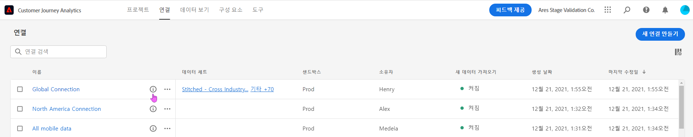
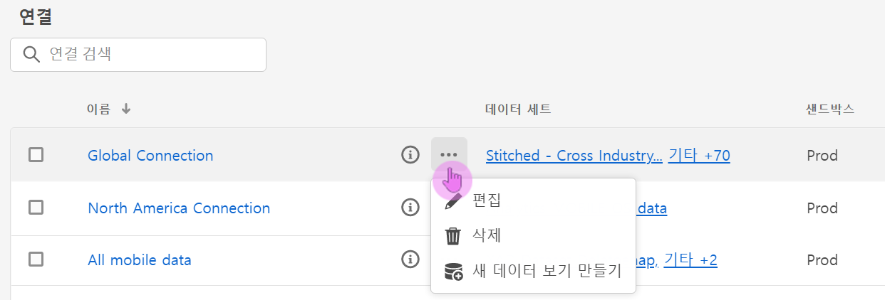

# 연결 관리

관리자 사용자는 [연결을 한 개 이상 만든 경우](/help/connections/create-connection.md) 이를 [!UICONTROL 연결] 관리자에서 관리할 수 있습니다. 연결 경험의 최신 업데이트를 통해 연결 세부 정보 페이지에 중요한 기능이 두 개 추가되었습니다. 이는 이 페이지의 아래에서 설명되어 있습니다.

* 이 옵션을 통해 **연결의 데이터 세트 상태 및 수집 프로세스**&#x200B;를 확인할 수 있습니다. 이 상태 점검을 통해 Analysis Workspace으로 이동하여 분석을 시작할 수 있도록 데이터가 사용 가능해지는 시기를 알 수 있습니다.

* 이를 통해 구성 오류로 인해 발생하는 **모든 데이터 불일치를 식별**&#x200B;할 수 있습니다. 혹시 누락된 행이 있습니까? 그렇다면 어떤 행이 누락되었고 이유는 무엇입니까? 연결을 잘못 구성하여 Customer Journey Analytics에서 데이터가 누락되었습니까?

다음은 새로운 Connections Manager에 대한 비디오입니다.

>[!VIDEO](https://video.tv.adobe.com/v/342097/?quality=12&learn=on)

## 연결 관리자 {#connections-manager}

연결 관리자를 사용하여 다음과 같은 작업을 수행할 수 있습니다.

* 연결의 소유자, 샌드박스, 연결 생성 및 수정 시간에 관한 정보를 포함하여 모든 연결을 한눈에 볼 수 있습니다.
* 모든 데이터 세트를 연결하여 볼 수 있습니다.
* 연결 상태를 점검할 수 있습니다.
* 연결을 삭제할 수 있습니다.
* 연결 이름을 변경할 수 있습니다.
* 연결에서 데이터 보기를 만들 수 있습니다.

### 연결 관리자 설정

| 설정 | 설명 |
| --- | --- |
| [!UICONTROL 이름] | 연결에 대한 친숙한 이름입니다. 하이퍼링크가 연결된 이름을 클릭하면 아래에 설명된 연결 세부 정보 페이지로 이동됩니다. |
| 연결 정보 | 연결 이름 옆의 정보 아이콘을 클릭하면 다음의 정보를 볼 수 있습니다. |
| 연결 편집 | 연결 이름 옆의 생략 부호(...)를 클릭한 뒤 [!UICONTROL 편집]을 클릭합니다. 자세한 정보는 아래의 &quot;연결 편집&quot;을 참조하십시오. |
| 연결 삭제 | 연결 이름 옆의 생략 부호(...)를 클릭한 뒤 [!UICONTROL 삭제]를 클릭합니다. 자세한 정보는 아래의 &quot;연결 삭제&quot;를 참조하십시오. |
| 데이터 보기 만들기 | 연결 이름 옆의 생략 부호(...)를 클릭한 뒤 [!UICONTROL 데이터 보기 만들기]를 클릭합니다. 이 작업을 수행하면 이 연결에 기반하여 새로운 데이터 보기가 만들어집니다. [자세히 알아보기](https://experienceleague.adobe.com/docs/analytics-platform/using/cja-dataviews/data-views.html) |
| [!UICONTROL 데이터 세트] | 연결에 포함된 데이터 세트입니다. 하이퍼링크를 클릭하면 이 연결의 모든 데이터 세트를 볼 수 있습니다. 데이터 세트를 클릭하면 Adobe Experience Platform에서 새 탭으로 데이터 세트가 열립니다. |
| [!UICONTROL 샌드박스] | 이 연결이 데이터 세트를 가져오는 출처가 되는 [Adobe Experience Platform 샌드박스](https://experienceleague.adobe.com/docs/experience-platform/sandbox/home.html)입니다. 이 샌드박스는 처음에 이 연결을 만들었을 때 선택된 것이며 이는 변경할 수 없습니다. |
| [!UICONTROL 소유자] | 연결을 만든 사람입니다. |
| [!UICONTROL 데이터 세트 가져오기] | &quot;데이터 스트리밍&quot;으로 불렸던 기능을 활성화 또는 비활성화할 수 있습니다. |
| [!UICONTROL 만든 날짜] | 연결을 처음 만든 날짜입니다. |
| [!UICONTROL 마지막 수정일] | 연결을 마지막으로 업데이트한 날짜입니다. |

### 연결 삭제 {#connections-delete}

관리자만 연결을 삭제할 수 있는 권한을 보유합니다. 이 작업은 비관리자에게 나타나지 않습니다.

1. 연결 이름 옆에 있는 생략 부호(...)를 클릭합니다.
1. [!UICONTROL 삭제]를 클릭합니다.

[!UICONTROL Customer Journey Analytics]에서 연결을 삭제하면 다음과 같은 오류 메시지가 나타납니다.

* 삭제된 연결을 기반으로 만들어진 모든 데이터 보기가 더 이상 작동하지 않습니다.
* 마찬가지로, 삭제된 연결의 데이터 보기에 의존하는 모든 Analysis Workspace 프로젝트의 작동이 정지됩니다.

삭제 영향에 관해 [자세히 알아보십시오](/help/admin/cja-deletion.md).

### 연결 또는 데이터 세트 검색

맨 위에 [!UICONTROL 연결] 제목 아래의 검색창을 사용하면 연결을 검색할 수 있습니다.

### 연결 정렬

연결의 각 열 헤더를 클릭하여 연결을 위 또는 아래로 정렬할 수 있습니다.

## 연결 세부 정보 페이지 {#connection-detail}

새로운 연결 세부 정보 페이지에서는 연결의 상태를 매우 상세하게 볼 수 있습니다.

여기에서 다음 작업을 수행할 수 있습니다.

* 이를 통해 연결의 데이터 세트 상태 및 수집 프로세스 상태를 점검할 수 있습니다.
* 기록 생략 또는 삭제를 초래한 구성 문제를 파악할 수 있습니다.
* 데이터를 보고에 사용할 수 있게 되는 시기를 알 수 있습니다.

>[!IMPORTANT]
>2021년 8월 13일 이전에 수집된 데이터는 이 [!UICONTROL 연결] 대화 상자에 반영되지 않습니다.

위젯과 설정에 대한 설명은 다음과 같습니다.

### 연결 세부 정보 설정

| 위젯/설정 | 설명 |
| --- | --- |
| 데이터 세트 선택기 | 연결 안에 있는 한 개의 데이터 세트 또는 모든 데이터 세트를 선택할 수 있습니다. 다수의 데이터 세트를 선택할 수는 없습니다. 기본값은 [!UICONTROL 모든 데이터 세트]로 설정되어 있습니다. |
| 달력/날짜 범위 | 데이터 범위는 연결에 데이터를 추가하는 시기를 나타냅니다. 모든 표준 달력 사전 설정이 포함됩니다. 날짜 범위를 사용자 지정할 수 있지만, 사용자 지정 날짜 범위는 드롭다운 목록에 표시되지 않습니다. |
| [!UICONTROL 사용 가능한 이벤트 데이터 기록] 위젯 | 전체 연결&#x200B;**에 대해 보고 가능한 총 이벤트 데이터 세트 행 수**&#x200B;를 나타냅니다. 이 수는 어떠한 달력 설정과도 관련이 없습니다. 이 수는 데이터 세트 선택기에서 또는 표에서 데이터 세트를 선택하면 변경됩니다. (참고로 데이터가 새로 추가되고 나면 보고에 표시되기까지 1~2시간의 지연 시간이 있습니다.) |
| [!UICONTROL 지표] 위젯 | **선택한 데이터 세트 및 날짜 범위**&#x200B;에 대한 추가/생략/삭제된 이벤트 기록 및 추가된 배치 수를 요약합니다. |
| [!UICONTROL 추가된 기록] 위젯 | 선택된 기간 내에 **선택한 데이터 세트 및 날짜 범위**&#x200B;에 대해 얼마나 많은 행이 추가되었는지 나타냅니다. 10분마다 업데이트됩니다. |
| [!UICONTROL 생략된 기록] 위젯 | 선택된 기간 내에 **선택한 데이터 세트 및 날짜 범위**&#x200B;에 대해 얼마나 많은 행이 생략되었는지 나타냅니다. 기록 생략의 이유에는 타임스탬프 누락, 누락된 또는 잘못된 개인 ID 등이 포함됩니다. 10분마다 업데이트됩니다.
잘못된 개인 ID(예를 들면 [!UICONTROL 개인 ID]에 &quot;정의되지 않은&quot; 또는 &quot;00000000&quot; 또는 1달 동안 1백만 번 이상 하나의 이벤트에 나타나는 숫자 및 문자의 조합이 사용되는 경우)는 특정 사용자 또는 개인의 속성으로 할당될 수 없습니다. 이러한 ID는 시스템에서 수집될 수 없으며 오류 유발 수집 및 보고를 초래할 수 있습니다. 잘못된 개인 ID를 수정할 수 있는 세 가지 방법이 있습니다.<ul><li>[크로스 채널 분석](/help/cca/overview.md)을 사용해서 정의되지 않은 또는 모두 영으로 된 사용자 ID를 유효한 사용자 ID로 변경합니다.</li><li>사용자 ID를 지우면 해당 ID는 수집 동안 누락됩니다(잘못된 또는 모두 영으로 된 사용자 ID보다는 선호됨)</li><li>데이터를 수집하기 전에 사용자의 시스템 내에서 모든 잘못된 사용자 ID를 수정합니다.</li></ul> |
| [!UICONTROL 삭제된 기록] 위젯 | 선택된 기간 내에 **선택한 데이터 세트 및 날짜 범위**&#x200B;에 대해 얼마나 많은 행이 삭제되었는지 나타냅니다. 예를 들어 누군가가 Experience Platform에서 데이터 세트를 삭제했을 수도 있습니다. 10분마다 업데이트됩니다. |
| 데이터 세트 검색 상자 | 데이터 세트 이름 또는 [!UICONTROL 데이터 세트 ID]로 검색할 수 있습니다. |
| [!UICONTROL 데이터 세트] | 연결에 포함된 데이터 세트를 표시합니다. 하이퍼링크를 클릭하면 이 연결의 모든 데이터 세트를 볼 수 있습니다. |
| [!UICONTROL 데이터 세트 ID] | 이 ID는 Adobe Experience Platform에서 자동으로 생성합니다. |
| [!UICONTROL 배치] | 이 데이터 세트에 얼마나 많은 데이터 배치가 추가되었는지 나타냅니다. |
| [!UICONTROL 마지막으로 추가됨] | 이 데이터 세트에 마지막으로 추가된 배치의 타임스탬프를 표시합니다. |
| [!UICONTROL 데이터 세트 유형] | 이 데이터 세트의 데이터 세트 유형은 [!UICONTROL 이벤트], [!UICONTROL 조회] 또는 [!UICONTROL 프로필]이 될 수 있습니다. [자세히 알아보기](https://experienceleague.adobe.com/docs/analytics-platform/using/cja-connections/create-connection.html#configure-dataset) |
| 스키마 | 이 연결의 데이터 세트가 기반으로 삼는 Adobe Experience Platform 스키마입니다. |

### 연결 수준의 오른쪽 레일 설정

| 설정 | 설명 |
| --- | --- |
| [!UICONTROL 새로 고침] | 최근에 추가된 기록이 반영될 수 있도록 연결을 새로 고침합니다. |
| [!UICONTROL 삭제] | 이 연결을 삭제합니다. |
| [!UICONTROL 데이터 보기 만들기] | 이 연결을 기반으로 새 데이터 보기를 만듭니다. [자세히 알아보기](https://experienceleague.adobe.com/docs/analytics-platform/using/cja-dataviews/data-views.html) |
| [!UICONTROL 연결 이름] | 연결의 알기 쉬운 이름을 표시합니다. |
| [!UICONTROL 연결 설명] | 이 연결의 목적을 가장 잘 설명하는 비교적 상세한 설명을 표시합니다. |
| [!UICONTROL 샌드박스] | 이 연결이 그 데이터 세트를 가져오는 출처 [Adobe Experience Platform](https://experienceleague.adobe.com/docs/experience-platform/sandbox/home.html)입니다. 이 샌드박스는 연결을 처음 만들 때 선택됩니다. 이는 변경할 수 없습니다. |
| [!UICONTROL 연결 ID] | 이 ID는 Adobe Experience Platform에서 시스템에 의해 생성됩니다. |
| [!UICONTROL 연결을 이용한 데이터 보기] | 이 연결을 사용하는 데이터 보기를 모두 나열합니다. |
| [!UICONTROL 새 데이터 가져오기] | (켜기/끄기) 데이터의 새 배치를 내역(채우기) 데이터에 추가해야 하는지 여부를 나타냅니다. |
| [!UICONTROL 채우기 데이터] | 채우기(내역) 데이터는 [!UICONTROL 대기 중], [!UICONTROL 진행 중] (진행률 함께 표시), [!UICONTROL 완료]의 3가지 상태로 추적됩니다. |
| [!UICONTROL 작성자] | 연결을 만든 사람의 이름을 표시합니다. |
| [!UICONTROL 마지막 수정일] | 연결에 대한 마지막 변경 날짜 및 시간을 표시합니다. |
| [!UICONTROL 마지막 수정자] | 연결을 마지막으로 수정한 사람을 표시합니다. |

### 데이터 세트 수준의 오른쪽 레일 설정

| 설정 | 설명 |
| --- | --- |
| [!UICONTROL 개인 ID] | Experience Platform의 데이터 세트 스키마에 정의된 ID를 표시합니다. 이는 연결 생성 중 선택한 개인 ID입니다. 다양한 ID가 있는 데이터 세트를 포함하는 연결을 만들면 이러한 내용이 보고에 반영됩니다. 데이터 세트를 실제로 병합하려면 데이터 세트 간에 동일한 개인 ID를 사용해야 합니다. |
| [!UICONTROL 사용 가능한 레코드] | 달력을 통해 선택한 특정 기간 동안 이 데이터 세트에 대해 수집된 행의 총 수를 나타냅니다. 데이터가 추가되고 난 후 보고에 표시되기까지의 지연 시간은 없습니다. (예외적으로, 새 연결을 만들 때는 [지연 시간](https://experienceleague.adobe.com/docs/analytics-platform/using/cja-overview/cja-faq.html#3.-getting-data-into-customer-journey-analytics)이 있습니다. |
| [!UICONTROL 추가된 레코드] | 선택한 기간 내에 얼마나 많은 행이 추가되었는지를 나타냅니다. |
| [!UICONTROL 삭제된 레코드] | 선택한 기간 내에 얼마나 많은 레코드가 삭제되었는지를 나타냅니다. |
| [!UICONTROL 배치 추가됨] | 이 데이터 세트에 얼마나 많은 데이터 배치가 추가되었는지 나타냅니다. |
| [!UICONTROL 생략된 레코드] | 선택한 기간 내에 수집 중 얼마나 많은 행이 생략되었는지를 나타냅니다.
기록 생략의 이유에는 타임스탬프 누락, 누락된 또는 잘못된 개인 ID 등이 포함됩니다. 10분마다 업데이트됩니다.
잘못된 개인 ID(예를 들면 [!UICONTROL 개인 ID]에 &quot;정의되지 않은&quot; 또는 &quot;00000000&quot; 또는 1달 동안 1백만 번 이상 하나의 이벤트에 나타나는 숫자 및 문자의 조합이 사용되는 경우)는 특정 사용자 또는 개인의 속성으로 할당될 수 없습니다. 이러한 ID는 시스템에서 수집될 수 없으며 오류 유발 수집 및 보고를 초래할 수 있습니다. 잘못된 개인 ID를 수정할 수 있는 세 가지 방법이 있습니다.<ul><li>[크로스 채널 분석](/help/cca/overview.md)을 사용해서 정의되지 않은 또는 모두 영으로 된 사용자 ID를 유효한 사용자 ID로 변경합니다.</li><li>사용자 ID를 지우면 해당 ID는 수집 동안 누락됩니다(잘못된 또는 모두 영으로 된 사용자 ID보다는 선호됨)</li><li>데이터를 수집하기 전에 사용자의 시스템 내에서 모든 잘못된 사용자 ID를 수정합니다.</li></ul> |
| [!UICONTROL 마지막으로 추가됨] | 마지막 배치가 추가된 시간을 표시합니다. |
| [!UICONTROL 데이터 세트 유형] | [!UICONTROL 이벤트], [!UICONTROL 조회] 또는 [!UICONTROL 프로필]입니다. [자세히 알아보기](https://experienceleague.adobe.com/docs/analytics-platform/using/cja-connections/create-connection.html#configure-dataset) |
| [!UICONTROL 스키마] | 이 데이터 세트가 기반으로 삼는 Adobe Experience Platform 스키마를 표시합니다. |
| [!UICONTROL 데이터 세트 ID] | 이 ID는 Adobe Experience Platform에서 시스템에 의해 생성됩니다. |

## 연결 편집

관리자가 연결을 편집할 수 있습니다. 이 대화 상자를 사용하려면 연결을 선택하고 [!UICONTROL 연결 편집]을 클릭합니다. 여기에서 다음과 같은 작업을 수행할 수 있습니다.

* 새 데이터 가져오기를 시작 및 정지할 수 있습니다. 이 프로세스는 이전에 &quot;데이터 스트리밍&quot;으로 불렸습니다.
* 연결 이름을 변경할 수 있습니다.
* 데이터 세트를 새로 고칩니다.
* 연결에서 데이터 세트를 제거합니다.

