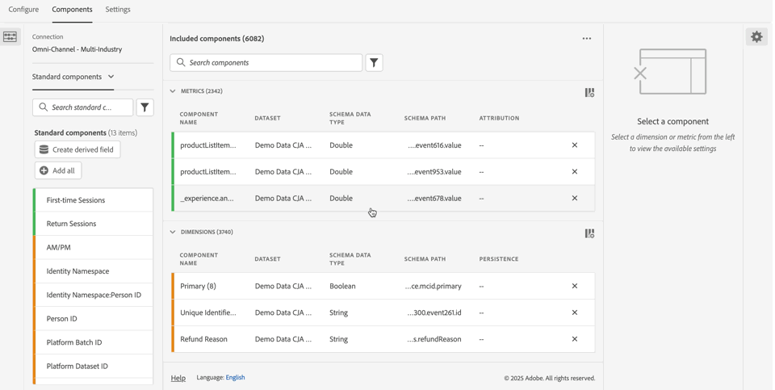
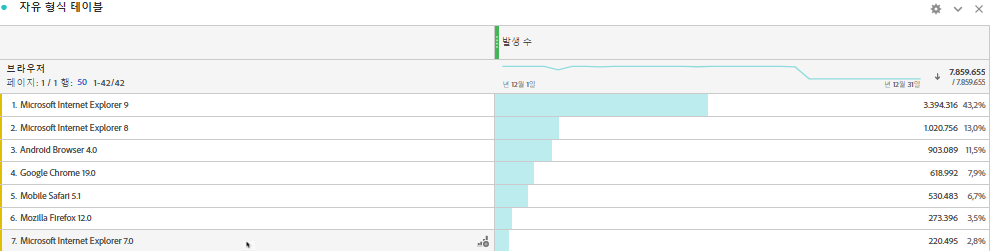

# 데이터 세트에 표준 조회 추가

>[!IMPORTANT]
>
>표준 조회는 Customer Journey Analytics의 Analytics 소스 커넥터 데이터 소스에만 사용할 수 있습니다. 표준 Adobe Analytics 구현, [Adobe Experience Platform Web SDK](https://experienceleague.adobe.com/docs/experience-platform/edge/home.html?lang=ko) 또는 Experience Platform 데이터 수집 API에서 사용할 수 있습니다.
>

표준 조회(Adobe 제공 조회)를 사용하면 Customer Journey Analytics의 기능이 확장되어 단독으로는 유용하지 않지만 다른 데이터와 결합될 때 유용하게 사용할 수 있는 일부 차원/속성에 대해 보고할 수 있습니다. 이러한 예로는 모바일 디바이스의 특성과 브라우저 버전 번호와 같은 OS 및 브라우저 차원의 특성이 있습니다. &#39;표준 조회&#39;는 조회 데이터 세트와 유사합니다. 표준 조회는 Experience Cloud 조직 전체에 대해 적용할 수 있습니다. 이 조회는 특정 XDM 스키마 필드를 포함하는 모든 이벤트 데이터 세트에 자동으로 적용됩니다(특정 필드는 아래 참조). Adobe이 분류하는 각 스키마 위치에 표준 조회 데이터 세트가 있습니다.

기존 Adobe Analytics에서는 이러한 차원이 개별적으로 표시되지만 Customer Journey Analytics에서는 데이터 보기를 만들 때 이러한 차원을 반드시 포함해야 합니다. 연결 워크플로에서 표준 조회에 대한 키가 있는 데이터 세트로 플래그가 지정된 데이터 세트를 선택하십시오. 데이터 보기 UI는 보고에 사용할 수 있는 모든 표준 조회 차원을 포함해야 한다는 것을 자동으로 인지합니다. 조회 파일은 모든 지역 및 모든 계정에 대해 자동으로 최신 상태로 유지되어 제공됩니다. 이러한 파일은 고객과 연관된 지역별 조직에 저장됩니다.

## Analytics 소스 커넥터 데이터 세트에서 표준 조회 사용

표준 조회 데이터 세트는 보고서 시간에 자동으로 적용됩니다. Analytics 소스 커넥터를 사용하고 Adobe에서 표준 조회를 제공하는 차원을 가져오는 경우, 이 표준 조회를 자동으로 적용합니다. 이벤트 데이터 세트에 XDM 필드가 포함된 경우 표준 조회를 해당 이벤트에 적용할 수 있습니다.

<!--
### Specific IDs that need to be populated

The following IDs need to be populated in the specific XDM mixins for this functionality to work:

* Environment Details Mixin – device/typeID value populated - Must match Device Atlas IDs and will populate device data.
* Adobe Analytics ExperienceEvent Template Mixin or Adobe Analytics ExperienceEvent Full Extension Mixin with analytics/environment/browserIDStr and analytics/environment/operatingSystemIDStr. Both must match the Adobe IDs and  populate browser and OS data, respectively.

You need these mixins with the three IDs populated (device/typeID, environment/browserIDStr, and environment/operatingSystemIDStr). The lookup dimensions will then be pulled automatically by Customer Journey Analytics and will be available in the Data View.

The catch here is that they can only populate those IDs today if they have a direct relationship with Device Atlas. They are Device Atlas IDs, and they provide an API to allow a customer to look them up. This is a significant hurdle, and we may just want to take the reference to this capability out of the product documentation until we have a productized way to expose the Device Atlas ID lookup functionality.
-->

### 사용 가능한 표준 조회 필드

* `browser`
   * `browser`, `group_id`, `id`
* `browser_group`
   * `browser_group`, `id`
* `os`
   * `os`, `group_id`, `id`
* `os_group`
   * `os_group`, `id`
* `mobile_audio_support - multi`
* `mobile_color_depth`
* `mobile_cookie_support`
* `mobile_device_name`
* `mobile_device_number_transmit`
* `mobile_device_type`
* `mobile_drm - multi`
* `mobile_image_support - multi`
* `mobile_information_services`
* `mobile_java_vm - multi`
* `mobile_mail_decoration`
* `mobile_manufacturer`
* `mobile_max_bookmark_url_length`
* `mobile_max_browser_url_length`
* `mobile_max_mail_url_length`
* `mobile_net_protocols - multi`
* `mobile_os`
* `mobile_push_to_talk`
* `mobile_screen_height`
* `mobile_screen_size`
* `mobile_screen_width`
* `mobile_video_support - multi`

## 표준 조회 차원에 대한 보고서

Adobe 표준 조회 차원에 대해 보고하려면 Customer Journey Analytics에서 [데이터 보기](/help/data-views/data-views.md)를 만들 때 이러한 차원을 하나 이상 추가해야 합니다. **[!UICONTROL 데이터 보기]** > **[!UICONTROL 구성 요소]**&#x200B;에서:

1. 왼쪽 레일의 드롭다운 메뉴에서 **[!UICONTROL 스키마 필드]**&#x200B;을(를) 선택합니다.
1. 스키마 필드 컨테이너 목록에서 **[!UICONTROL Adobe 조회]**&#x200B;을(를) 선택하십시오.
1. 추가할 차원을 찾을 때까지 **[!UICONTROL 브라우저]**, **[!UICONTROL 모바일]** 또는 **[!UICONTROL 운영 체제]**&#x200B;로 드릴다운합니다.
1. 차원을 **[!UICONTROL 포함된 구성 요소]** 내의 **[!UICONTROL 지표]** 또는 **[!UICONTROL 차원]** 테이블로 끌어옵니다.

   

그런 다음 Workspace에서 조회 데이터를 사용할 수 있습니다.

데이터를 표시하는 
