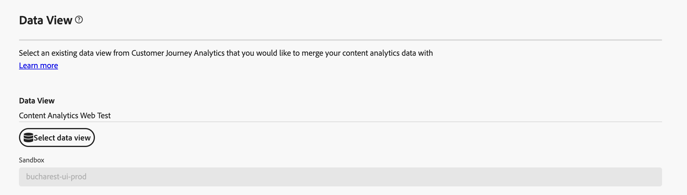
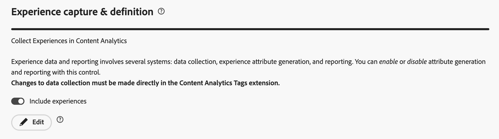

# Content Analytics 안내 구성

>[!WARNING]
>
>이 문서는 예정된 최종 버전의 임시 비공식 초안 버전이며 Content Analytics 설명서의 일부입니다. 모든 내용은 변경될 수 있으며 이 문서의 현재 버전에서 파생될 수 있는 법적 의무는 없습니다.
>

{{release-limited-testing}}

안내식 구성을 통해 콘텐츠 분석을 빠르고 쉽게 구성할 수 있습니다. 안내식 구성은 마법사를 사용하여 콘텐츠 분석을 조직에 맞게 자동으로 구성하기 위한 요구 사항을 설정합니다. **[!UICONTROL 구성]** 화면에서 새 구성을 만들거나 기존 구성을 편집할 수 있습니다.

>[!IMPORTANT]
>
>조직의 샌드박스당 하나의 Content Analytics 구성만 가질 수 있습니다.

Content Analytics 구성에 액세스하려면

* Customer Journey Analytics의 기본 메뉴에서 **[!UICONTROL 데이터 관리]** > **[!UICONTROL 콘텐츠 분석]**&#x200B;을 선택합니다.

콘텐츠 분석 구성 화면에 기존 콘텐츠 분석 구성 표가 표시됩니다.

각 구성에 대해 다음 세부 정보를 사용할 수 있습니다.

| 열 | 설명 |
|---|---|
| **[!UICONTROL 이름]** | 구성의 이름입니다. |
| **[!UICONTROL 작성자]** | 구성을 만든 기술 계정입니다. |
| **[!UICONTROL 만든 날짜]** | 구성이 생성되었을 때의 타임스탬프입니다. |
| **[!UICONTROL 수정일]** | 구성을 마지막으로 수정한 시점의 타임스탬프입니다. |
| **[!UICONTROL 샌드박스]** | Content Analytics가 구성 및 구현되는 조직 내 샌드박스. |
| **[!UICONTROL 상태]** | 구성의 상태입니다. 상태는   **[!UICONTROL 초안]**&#x200B;일 수 있습니다. 구성은 나중에 저장되며 배포되지 않습니다.  **[!UICONTROL 실패]**: 구성이 실패했습니다. 구성을 편집하고 필요한 사항을 변경해야 합니다.  **[!UICONTROL 완료]**: 구성이 완료되었으며 구현되었습니다. |

을 사용하여 테이블을 사용자 지정할 수 있습니다. **[!UICONTROL 테이블 사용자 지정]** 대화 상자에 표시할 열을 선택하고 **[!UICONTROL 적용]**&#x200B;을 선택하여 변경 내용을 적용합니다.

콘텐츠 분석 **[!UICONTROL 구성]** 화면에서 새 구성을 만들거나 기존 구성을 편집할 수 있습니다.

새 구성을 만들려면 다음 작업을 수행하십시오.

* **[!UICONTROL 구성 만들기]**&#x200B;를 선택합니다. 이 작업을 수행하면 안내가 있는 구성 마법사가 열립니다.

기존 구성을 편집하려면 다음을 수행하십시오.

* 기존 Content Analytics 구성에 대해 를 선택한 다음  **[!UICONTROL 편집]**&#x200B;을 선택합니다. 이 작업을 수행하면 안내가 있는 구성 마법사가 열립니다.

## 안내식 구성 마법사

안내식 구성 마법사는 네 개의 섹션([세부 정보](#details), [데이터 보기](#data-view), [경험 캡처 및 정의](#experience-capture-and-definition), [데이터 수집](#data-collection))으로 구성되며, 각 섹션에는 올바르게 설정하고 Content Analytics를 구성하는 데 필요한 세부 정보를 묻는 메시지가 표시됩니다. 섹션의 일부 설정은 이전 섹션의 구성 값에 따라 달라질 수 있으므로 다음 섹션으로 이동하기 전에 각 섹션을 완료하십시오.

### 세부 사항 {#onboarding-details}

<!-- markdownlint-disable MD034 -->

>[!CONTEXTUALHELP]
>id="aca_onboarding_details_button"
>title="세부 사항"
>abstract="연결의 이름을 입력합니다. **[!UICONTROL 데이터 보기]**, **[!UICONTROL 경험 캡처 및 정의]**, **[!UICONTROL 데이터 수집]** 섹션에서 세부 정보를 제공하여 Content Analytics가 올바르게 구성되도록 합니다."

>[!CONTEXTUALHELP]
>id="aca_onboarding_details_name_header"
>title="세부 사항"
>abstract="이 안내서에서는 콘텐츠 분석을 구성하는 데 필요한 요구 사항에 대해 설명합니다. 이 구성에 대한 이름을 제공합니다."

<!-- markdownlint-enable MD034 -->

각 구성에는 고유한 이름이 필요합니다. (예: `Example Content Analytics configuration`)

### 데이터 보기 {#onboarding-data-view}

<!-- markdownlint-disable MD034 -->

>[!CONTEXTUALHELP]
>id="ac_onboarding_dataview_button"
>title="데이터 보기"
>abstract="Content Analytics을 구성하려면 기존 데이터 보기를 선택해야 합니다. 따라서 콘텐츠 분석 데이터를 다른 데이터와 병합할 수 있습니다."

>[!CONTEXTUALHELP]
>id="aca_onboarding_dataview_header"
>title="데이터 보기"
>abstract="Customer Journey Analytics에서 기존 데이터 보기를 선택하여 원하는 콘텐츠 분석 데이터를 병합합니다."

>[!CONTEXTUALHELP]
>id="aca_onboarding_dataview_header_alt"
>title="데이터 보기"
>abstract="Customer Journey Analytics에서 기존 데이터 보기를 선택하여 원하는 콘텐츠 분석 데이터를 병합합니다. "

<!-- markdownlint-enable MD034 -->

구성을 사용하려면 [데이터 보기](/help/data-views/data-views.md)를 선택해야 합니다.

데이터 보기의 

데이터 보기를 선택하려면 다음을 수행하십시오.

1.  **[!UICONTROL 데이터 보기 선택]**&#x200B;을 사용합니다. 구성에 대한 데이터 보기를 선택할 수 있는 **[!UICONTROL 데이터 보기]** 대화 상자가 표시됩니다.

   새 구성을 만드는 경우 목록에는 활성 구성이 없는 샌드박스와 연결된 데이터 보기만 표시됩니다.
기존 구성을 편집하는 경우 목록에는 기존 구성과 이미 연결된 샌드박스 내에서 사용할 수 있는 데이터 보기만 표시됩니다.

   * 사용 가능한 데이터 보기 목록을 필터링하려면 를 선택하세요. 연결, 소유자 및 샌드박스에 대한 목록을 필터링할 수 있습니다. 필터 창을 숨기려면  **[!UICONTROL 필터 숨기기]**&#x200B;를 사용합니다.
   * 테이블에 표시할 열을 정의하려면 을(를) 선택합니다. **[!UICONTROL 테이블 사용자 지정]** 대화 상자에 표시할 열을 선택하고 **[!UICONTROL 적용]**&#x200B;을 선택하여 변경 내용을 적용합니다.
1. **[!UICONTROL 저장]**&#x200B;을 선택하여 선택한 데이터 보기를 확인합니다. 취소하려면 **[!UICONTROL 취소]**&#x200B;를 선택하십시오.

데이터 보기는 Customer Journey Analytics [연결](/help/connections/overview.md)에 연결되어 있습니다. 또한 연결은 조직 내의 샌드박스를 기반으로 합니다. 구성을 저장하면 **[!UICONTROL 샌드박스]**&#x200B;가 선택한 데이터 보기에 따라 적절한 샌드박스 이름으로 자동 채워집니다.

### 경험 캡처 및 정의 {#onboarding-experiences}

<!-- markdownlint-disable MD034 -->

>[!CONTEXTUALHELP]
>id="aca_onboarding_experiences_button"
>title="경험 캡처 및 정의"
>abstract="콘텐츠 분석을 통해 수집한 데이터에 경험을 포함하도록 선택할 수 있습니다. 선택한 경우 정규 표현식과 쿼리 매개변수의 조합을 하나 이상 설정하여 경험을 포함할 URL을 정의해야 합니다."

>[!CONTEXTUALHELP]
>id="aca_onboarding_experiences_header"
>title="경험 캡처 및 정의"
>abstract="콘텐츠 분석에서 경험 수집"

>[!CONTEXTUALHELP]
>id="aca_onboarding_experiences_url_header"
>title="경험 캡처 및 정의"
>abstract="아래 매개변수가 적용되는 URL을 지정합니다."

>[!CONTEXTUALHELP]
>id="aca_onboarding_experiences_edit_button"
>title="경험 캡처 및 정의"
>abstract="선택한 구성과 연결된 태그 속성의 Adobe Content Analytics 확장 기능에서 설정을 편집할 수 있습니다."

<!-- markdownlint-enable MD034 -->

이 섹션에서는 컨텐츠 분석으로 수집하는 데이터에 경험을 포함하도록 선택할 수 있습니다.  경험은 웹 페이지를 방문한 초기 사용자가 사용한 URL을 사용하여 재현할 수 있는 웹 페이지의 모든 텍스트입니다.

기본적으로 **[!UICONTROL 경험 포함]**&#x200B;이 꺼져 있습니다. 선택한 경우 경험을 포함할 URL을 정의해야 합니다.

다음을 적용할 수 있는 경우에만 경험을 포함시키는 것이 좋습니다.

* 사이트의 컨텐츠는 URL로만 구동됩니다.
* 사이트의 페이지는 페이지 URL을 사용하여 재현할 수 있어야 합니다.

새 구성이나 구현되지 않은 구성에 경험을 포함하려면 다음을 수행하십시오.

1. **[!UICONTROL 경험 포함]**&#x200B;을 사용하도록 설정합니다.
1. 웹 사이트에서 콘텐츠가 렌더링되는 방식을 결정하는 매개 변수를 지정합니다. 매개 변수는 **[!UICONTROL 도메인 정규식]**&#x200B;과(와) **[!UICONTROL 쿼리 매개 변수]**&#x200B;의 0개 이상의 조합입니다.
   1. **[!UICONTROL 도메인 정규식]**(예: `(?!.*\b(store|help|admin)\b)`)을 입력하십시오.
   1. `outdoors, patio, kitchen`과(와) 같이 쉼표로 구분된 **[!UICONTROL 쿼리 매개 변수]** 목록을 지정하십시오.
1. 도메인 정규식과 쿼리 매개 변수의 조합을 제거하려면 **[!UICONTROL 제거]**&#x200B;를 선택하십시오.
1. 정규 표현식과 쿼리 매개 변수의 다른 조합을 추가하려면 **[!UICONTROL 다른 항목 추가]**&#x200B;를 선택하십시오.

기존 경험을 편집하거나 구현된 구성에 새 경험을 포함하려면 다음을 수행하십시오.

* 선택한 구성과 연결된 Tag 속성의 Adobe Content Analytics 확장에서 매개 변수를 편집하려면  편집을 선택합니다.

### 데이터 수집 {#onboarding-data-collection}

<!-- markdownlint-disable MD034 -->

>[!CONTEXTUALHELP]
>id="aca_onboarding_datacollection_button"
>title="데이터 수집"
>abstract="사용할 태그 속성을 정의하거나 태그 속성을 새로 만듭니다. 정규 표현식을 사용하여 포함하거나 제외할 페이지 및 자산을 정의합니다."

>[!CONTEXTUALHELP]
>id="aca_onboarding_datacollection_tag_header"
>title="데이터 수집"
>abstract="태그 속성 제공"

>[!CONTEXTUALHELP]
>id="aca_onboarding_datacollection_pages_excluded_boldheader"
>title="데이터 수집"
>abstract="**포함/제외할 페이지**"

>[!CONTEXTUALHELP]
>id="aca_onboarding_datacollection_pages_excluded_header"
>title="데이터 수집"
>abstract="콘텐츠 분석을 위해 데이터를 수집할 때 **포함**&#x200B;하거나 **제외**&#x200B;할 페이지를 지정합니다."

>[!CONTEXTUALHELP]
>id="aca_onboarding_datacollection_assets_excluded_boldheader"
>title="데이터 수집"
>abstract="**포함/제외할 자산**"

>[!CONTEXTUALHELP]
>id="aca_onboarding_datacollection_assets_excluded_header"
>title="데이터 수집"
>abstract="콘텐츠 분석을 위해 데이터를 수집할 때 **포함**&#x200B;하거나 **제외**&#x200B;할 자산을 지정합니다."

>[!CONTEXTUALHELP]
>id="aca_onboarding_datacollection_experiences_edit_button"
>title="데이터 수집"
>abstract="선택한 구성과 연결된 태그 속성의 Adobe Content Analytics 확장 페이지에서 설정을 편집할 수 있습니다."

>[!CONTEXTUALHELP]
>id="aca_onboarding_datacollection_assets_edit_button"
>title="데이터 수집"
>abstract="선택한 구성과 연결된 태그 속성의 Adobe Content Analytics 확장 자산에서 설정을 편집할 수 있습니다."

<!-- markdownlint-enable MD034 -->

#### 새 구성

새 구성에서 사용할 Tag 속성을 정의하거나 새 Tag 속성을 만들어야 합니다. 정규 표현식을 사용하여 포함 또는 제외할 페이지 및 에셋을 정의해야 합니다.

* 기존 태그 속성을 사용하려면 다음을 수행하십시오.

  

   * **[!UICONTROL 기존]**&#x200B;을(를) 선택하십시오.
   * **[!UICONTROL 태그 속성]** 드롭다운 메뉴에서 기존 속성을 선택합니다.

* 새 태그 속성을 만들려면 다음 작업을 수행하십시오.

  

   1. **[!UICONTROL 새로 만들기]**&#x200B;를 선택합니다.
   2. **[!UICONTROL 태그 이름]**(예: `ACA Test`)을 지정하십시오.
   3. **[!UICONTROL 도메인]**(예: `example.com`)을 지정하십시오.

* 경험을 포함하도록 선택한 경우 컨텐츠 분석에 대한 데이터를 수집할 때 포함 또는 제외할 페이지를 나타냅니다.

   * **[!UICONTROL 경험]**&#x200B;에 대한 정규식을 지정하십시오. 예: `(?!.*\b(store|help|admin)\b)`.

* 콘텐츠 분석에 대한 데이터를 수집할 때 포함 또는 제외할 자산을 나타냅니다.

   * **[!UICONTROL 자산]**&#x200B;에 대한 정규식을 지정하십시오. 예: `(?!.*\b(store|help|admin)\b)`.

#### 기존 구성

기존 구성의 경우 태그 속성을 편집할 수 없습니다. 그러나 포함 또는 제외할 페이지 및 에셋을 편집할 수 있습니다.

* Content Analytics에 대한 데이터를 수집할 때 포함 또는 제외할 페이지를 편집하려면 **[!UICONTROL 경험]** 아래에서  **[!UICONTROL 편집]**&#x200B;을 선택하십시오.

* Content Analytics에 대한 데이터를 수집할 때 포함 또는 제외할 자산을 편집하려면 **[!UICONTROL 자산]** 아래에서  **[!UICONTROL 편집]**&#x200B;을 선택하십시오.

### 요약 {#summary}

필요한 모든 세부 정보를 제공했으면 요약에 생성 또는 수정된 객체에 대한 세부 정보가 제공됩니다.

* 새 구성을 구현할 때 **[!UICONTROL 콘텐츠 분석에 대한 _구성 이름_을(를) 구현할 준비가 되었습니다]** 요약이 표시됩니다.

* 구현된 기존 구성의 경우 **[!UICONTROL Content Analytics에 대해 _구성 이름_을 구현했습니다]** 요약이 표시됩니다.

### 작업 {#actions}

<!-- markdownlint-disable MD034 -->

>[!CONTEXTUALHELP]
>id="aca_onboarding_implementation_warning"
>title="온보딩 구현 경고"
>abstract="이렇게 하면 이 워크플로우에서 제공한 입력을 기반으로 콘텐츠 분석이 구성됩니다. 다른 몇 가지 설정은 일반적으로 콘텐츠 분석에 유용한 설정에 따라 자동으로 선택됩니다. 각 아티팩트의 설정을 검토하여 요구 사항과 지침을 충족하는지 확인하는 것이 좋습니다.   이 구성과 연결된 Tags 라이브러리가 수동으로 게시될 때까지 데이터가 수집되지 않습니다.  이미지 및 텍스트의 특성을 가져오기 위해 Adobe은 사용자가 방문한 시간에 캡처한 URL을 사용하여 사용자가 구현한 데이터 수집 설정에 따라 이러한 특성을 검색합니다."

<!-- markdownlint-enable MD034 -->

구성을 만들거나 편집한 경우 다음 작업을 사용할 수 있습니다.

* **[!UICONTROL 버리기]**: 새 구성을 만들거나 기존 구성을 편집하는 과정에서 변경한 모든 내용이 무시됩니다.
* **[!UICONTROL 나중에 저장]**: 새 구성 또는 아직 구현되지 않은 기존 구성에 대한 변경 내용이 저장됩니다. 이후 단계에서 구성을 다시 방문하여 추가 변경을 수행하거나 구성을 구현할 수 있습니다.
* **[!UICONTROL 구현]**: 새 구성 또는 아직 구현되지 않은 기존 구성에 대한 변경 내용이 저장되고 구현됩니다. 구현은 다음과 같이 구성됩니다.
   * **[!UICONTROL Adobe Experience Platform]** 구성:
      1. 콘텐츠 분석 이벤트, 자산 속성 및 경험 속성(구성된 경우)을 모델링하기 위한 스키마 생성.
      1. 콘텐츠 분석 이벤트, 자산 속성 및 경험 속성(구성된 경우)을 수집하기 위한 데이터 세트 생성.
      1. 기능 서비스를 사용하여 Content Analytics 이벤트에서 콘텐츠 속성을 생성하고 업데이트하는 데이터 흐름 생성.
   * **[!UICONTROL 콘텐츠 분석]** 구성:
      * 구성을 기반으로 한 피쳐화 어셈블러 프로세스 설정.
   * **[!UICONTROL Customer Journey Analytics]** 구성:
      1. 선택한 데이터 보기가 Content Analytics 차원 및 지표를 포함하도록 업데이트됩니다.
      1. 선택한 데이터 보기에 연결된 연결이 Content Analytics 이벤트 및 속성 데이터 세트를 포함하도록 수정됩니다.
      1. Content Analytics 보고 템플릿이 Workspace에 추가됩니다.
   * **[!UICONTROL 데이터 수집]** 구성:
      1. 새 태그 속성 또는 기존 태그 속성이 콘텐츠 분석 데이터 수집을 지원하도록 구성되었습니다. 이 구성은 태그용 Adobe Content Analytics 확장 포함을 의미합니다.
      1. Content Analytics 이벤트에 대한 데이터 스트림이 만들어집니다.
      1. Adobe Content Analytics 확장은 Content Analytics 이벤트가 Content Analytics용 데이터 스트림으로 전송되도록 구성되었습니다.
      1. 웹 SDK이 Tags 속성에 대해 구성되지 않은 경우 Content Analytics 이벤트만 전송하도록 새 웹 SDK 구성이 만들어집니다.
      1. 웹 SDK이 이 태그 속성에 대해 구성된 경우 기존 웹 SDK 구성이 변경되지 않습니다.
* **[!UICONTROL 저장]**: 구현된 구성에 대한 변경 내용이 저장되고 구현이 업데이트됩니다.
* **[!UICONTROL 종료]**. 안내식 구성을 종료합니다. 구현된 구성에 대한 모든 변경 사항이 무시됩니다.

>[!MORELIKETHIS]
>
>[콘텐츠 분석의 수동 구성](manual.md)
>
