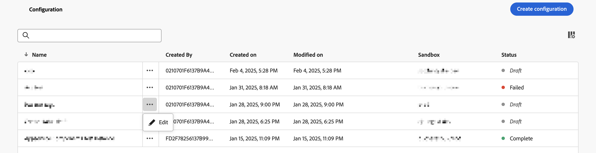

# Content Analytics 가이드 구성

가이드 구성을 통해 Content Analytics를 빠르고 쉽게 구성할 수 있습니다. 가이드 구성은 마법사를 사용하여 조직에 맞게 Content Analytics를 자동으로 구성하기 위한 요구 사항을 설정합니다. **[!UICONTROL 구성]** 화면에서 새로운 구성을 만들거나 기존 구성을 편집할 수 있습니다.

>[!IMPORTANT]
>
>조직의 샌드박스당 Content Analytics 구성은 하나만 있을 수 있습니다.

>[!NOTE]
>
>구성 마법사는 여러 데이터 보기 및 채널을 지원하며, 한 데이터 보기 및 웹 채널만 지원하던 이전 버전과 다릅니다. [데이터 보기](#data-views) 섹션에서 하나 이상의 데이터 보기를 선택하려면 먼저 샌드박스와 연결을 선택해야 합니다. **[!UICONTROL 경험 캡처]**, **[!UICONTROL 데이터 수집]** 및 **[!UICONTROL 헤더 재정의]**&#x200B;에 대한 구성은 채널에 따라 다르며 [채널](#channels) 섹션에서 구성하는 각 채널의 일부입니다.

Content Analytics 구성 액세스 방법

* Customer Journey Analytics 메인 메뉴에서 **[!UICONTROL 데이터 관리]** > **[!UICONTROL Content Analytics 구성]**&#x200B;을 선택합니다.

**[!UICONTROL Content Analytics 구성]** 화면에 기존의 Content Analytics 구성 테이블이 표시됩니다.

각 구성에 대해 다음 세부 정보를 사용할 수 있습니다.

| 열 | 설명 |
|---|---|
| **[!UICONTROL 이름]** | 구성의 이름 |
| **[!UICONTROL 작성자]** | 구성을 생성한 기술 계정 |
| **[!UICONTROL 생성 일자]** | 구성을 처음 만든 타임스탬프 |
| **[!UICONTROL 수정 일자]** | 구성이가 마지막으로 수정된 타임스탬프 |
| **[!UICONTROL 샌드박스]** | Content Analytics가 구성되고 구현될 (예정인) 조직 내의 샌드박스 |
| **[!UICONTROL 상태]** | 구성의 상태. 상태는 활성화된 채널 중 구성이 완료된 채널 수를 나타냅니다. 자세한 정보가 있는 팝업을 열려면 을(를) 사용하세요. |

을 사용해 테이블을 사용자 정의할 수 있습니다. **[!UICONTROL 테이블 사용자 정의]** 대화 상자에서 표시할 열을 선택하고 **[!UICONTROL 적용]**&#x200B;을 선택해 변경 사항을 적용합니다.

Content Analytics **[!UICONTROL 구성]** 화면에서 새로운 구성을 만들거나 기존 구성을 편집할 수 있습니다.

새 구성을 만드는 방법:

* **[!UICONTROL 구성 만들기]**&#x200B;를 선택합니다. 이 액션을 수행하면 [가이드 구성 마법사](#guided-configuration-wizard)가 열립니다.

기존 구성을 편집하는 방법:

* 를 선택한 후 기존 Content Analytics 구성을  **[!UICONTROL 편집]**&#x200B;합니다. 이 액션을 수행하면 [가이드 구성 마법사](#guided-configuration-wizard)가 열립니다.

## 가이드 구성 마법사

안내식 구성 마법사는 네 개의 섹션([세부 정보](#details), [연결](#connection), [데이터 보기](#data-view), [채널](#channels))으로 구성되며, 각 섹션에는 Content Analytics을 올바르게 설정하고 구성하는 데 필요한 세부 정보를 묻는 메시지가 표시됩니다. 섹션의 일부 설정은 이전 섹션의 구성 값에 따라 달라질 수 있으므로 다음 섹션으로 이동하기 전에 각 섹션을 완료합니다.

### 세부 사항 {#onboarding-details}

>[!CONTEXTUALHELP]
>id="aca_onboarding_details_button"
>title="세부 사항"
>abstract="연결의 이름을 입력합니다. **[!UICONTROL 데이터 보기]**, **[!UICONTROL 경험 캡처 및 정의]**, **[!UICONTROL 데이터 수집]** 섹션에서 세부 정보를 제공하여 Content Analytics가 올바르게 구성되도록 합니다."

>[!CONTEXTUALHELP]
>id="aca_onboarding_details_name_header"
>title="세부 사항"
>abstract="이 안내서에서는 Content Analytics를 구성하는 데 필요한 요구 사항에 대해 설명합니다. 이 구성에 대한 이름을 제공합니다."

>[!CONTEXTUALHELP]
>id="aca_onboarding_connection_boldheader"
>title="연결"
>abstract="**연결**"

>[!CONTEXTUALHELP]
>id="aca_onboarding_connection_header"
>title="연결"
>abstract="Customer Journey Analytics에서 기존 연결을 선택하여 원하는 Content Analytics 데이터를 병합합니다."

각 구성에는 고유한 이름이 필요합니다. 예, `Example Content Analytics configuration`. 해당 이름은 구성을 저장하거나 구현하는 데 필요합니다.

또한 각 구성에 대해 Content Analytics을 구성할 샌드박스를 선택해야 합니다.

* **[!UICONTROL 이름]**: 각 구성에는 고유한 이름이 필요합니다. 예, `Example Content Analytics configuration`. 해당 이름은 구성을 저장하거나 구현하는 데 필요합니다.

* **[!UICONTROL 샌드박스]**: 구성에는 샌드박스가 필요합니다. 액세스 권한이 있고 Content Analytics에 사용할 데이터가 수집되는 샌드박스 목록에서 샌드박스를 선택합니다.

  연결을 정의한 구성된 샌드박스 및 선택적으로 데이터 보기를 변경하는 경우 연결 및 데이터 보기를 재구성해야 한다는 메시지가 표시됩니다.

### 연결

Content Analytics 데이터 수집을 추가할 연결을 선택해야 합니다.

구성에 대한 연결을 선택하지 않은 경우:

1. 샌드박스에서 사용할 수 있는 모든 연결을 나열하는 **[!UICONTROL 연결 선택]** 대화 상자를 열려면  **[!UICONTROL 연결 선택]**&#x200B;을 사용합니다.
1. **[!UICONTROL 연결 선택]** 대화 상자에서 사용할 연결을 을(를) 선택합니다. 연결을 하나만 선택할 수 있습니다.
1. **[!UICONTROL 연결 사용]**&#x200B;을 선택합니다.

연결을 이미 선택했지만 해당 연결을 변경하려는 경우:

1.  **[!UICONTROL 편집]**&#x200B;을 선택합니다.
1. **[!UICONTROL 연결 선택]** 대화 상자에서 사용할 연결을 수정합니다.
1. **[!UICONTROL 연결 사용]**&#x200B;을 선택합니다.

### 데이터 보기 {#onboarding-data-view}

>[!CONTEXTUALHELP]
>id="ac_onboarding_dataview_button"
>title="데이터 보기"
>abstract="Content Analytics를 구성하려면 기존 데이터 보기를 선택해야 합니다. 따라서 Content Analytics 데이터를 다른 데이터와 병합할 수 있습니다."

>[!CONTEXTUALHELP]
>id="aca_onboarding_dataview_header"
>title="데이터 보기"
>abstract="Customer Journey Analytics에서 기존 데이터 보기를 선택하여 원하는 Content Analytics 데이터를 병합합니다."

>[!CONTEXTUALHELP]
>id="aca_onboarding_dataview_header_alt"
>title="데이터 보기"
>abstract="Customer Journey Analytics에서 기존 데이터 보기를 선택하여 원하는 Content Analytics 데이터를 병합합니다. "

>[!CONTEXTUALHELP]
>id="aca_onboarding_dataview_change_dialog"
>title="새로운 데이터 보기"
>abstract="이 구성에 대한 새로운 데이터 보기를 선택했습니다. 새 데이터 보기가 Content Analytics 지표 및 차원을 포함하도록 업데이트됩니다. 원래 선택된 데이터 보기의 이들 지표 및 차원은 제거됩니다.  새 데이터 보기에 다른 연결이 연결된 경우 해당 연결은 Content Analytics 데이터 세트를 포함하도록 업데이트됩니다. Content Analytics 데이터 세트는 원래 선택된 연결에서 제거되지 않습니다."

>[!CONTEXTUALHELP]
>id="aca_onboarding_dataview_current_cleanup_labels_dialog"
>title="선택한 데이터 보기 정리"
>abstract="Content Analytics에 이미 프로비저닝된 데이터 보기를 선택했습니다. 해당 기존 Content Analytics 구성이 제거되고 데이터 보기에 새 구성이 프로비저닝됩니다."

>[!CONTEXTUALHELP]
>id="aca_onboarding_dataview_prev_cleanup_labels_dialog"
>title="이전 데이터 보기 정리"
>abstract="새로운 데이터 보기를 선택했습니다. 이전에 선택한 데이터 보기에 대한 Content Analytics 구성이 제거됩니다."

>[!CONTEXTUALHELP]
>id="aca_onboarding_dataview_new_dialog"
>title="새로운 데이터 보기"
>abstract="이 구성에 대한 새로운 데이터 보기를 선택했습니다. 새 데이터 보기가 Content Analytics 지표 및 차원을 포함하도록 업데이트됩니다. 기존 데이터 보기의 유사한 지표 및 차원은 제거됩니다. 새 데이터 보기에 다른 연결이 연결된 경우 해당 연결은 Content Analytics 데이터 세트를 포함하도록 업데이트됩니다. Content Analytics 데이터 세트는 기존 구성에서 제거되지 않습니다."

>[!CONTEXTUALHELP]
>id="ac_onboarding_dataviews_button"
>title="데이터 보기"
>abstract="Content Analytics를 구성하려면 하나 이상의 데이터 보기를 선택해야 합니다. 따라서 Content Analytics 데이터를 다른 데이터와 병합할 수 있습니다."

>[!CONTEXTUALHELP]
>id="aca_onboarding_dataviews_header"
>title="데이터 보기"
>abstract="Customer Journey Analytics에서 하나 이상의 데이터 보기를 선택하여 원하는 Content Analytics 데이터를 병합합니다."

>[!CONTEXTUALHELP]
>id="aca_onboarding_dataviews_header_alt"
>title="데이터 보기"
>abstract="Customer Journey Analytics에서 하나 이상의 데이터 보기를 선택하여 원하는 Content Analytics 데이터를 병합합니다. "

>[!CONTEXTUALHELP]
>id="aca_onboarding_dataviews_new_dialog"
>title="선택된 데이터 보기"
>abstract="이 구성에 대해 선택된 데이터 보기를 수정했습니다. 선택된 데이터 보기가 Content Analytics 지표 및 차원을 포함하도록 업데이트됩니다. 이러한 지표와 차원은 더 이상 선택되지 않은 이전에 선택한 데이터 보기에서 제거됩니다.  선택한 데이터 보기와 다른 연결이 관련된 경우, 해당 연결은 Content Analytics 데이터 세트를 포함하도록 업데이트됩니다. Content Analytics 데이터 세트는 원래 선택된 연결에서 제거되지 않습니다.  선택한 모든 데이터 보기는 이 구성의 일부인 채널을 상속합니다."

>[!CONTEXTUALHELP]
>id="aca_onboarding_dataviews_change_dialog"
>title="선택된 데이터 보기"
>abstract="이 구성에 대해 선택된 데이터 보기를 수정했습니다. 선택된 데이터 보기가 Content Analytics 지표 및 차원을 포함하도록 업데이트됩니다. 이러한 지표와 차원은 더 이상 선택되지 않은 이전에 선택한 데이터 보기에서 제거됩니다.  선택한 데이터 보기와 다른 연결이 연결된 경우, 해당 연결은 Content Analytics 데이터 세트를 포함하도록 업데이트됩니다. Content Analytics 데이터 세트는 원래 선택된 연결에서 제거되지 않습니다.  선택한 모든 데이터 보기는 이 구성의 일부인 채널을 상속합니다."

>[!CONTEXTUALHELP]
>id="aca_onboarding_dataviews_current_cleanup_labels_dialog"
>title="선택된 데이터 보기"
>abstract="이 구성에 대해 선택된 데이터 보기를 수정했습니다. 선택된 데이터 보기가 Content Analytics 지표 및 차원을 포함하도록 업데이트됩니다. 이러한 지표와 차원은 더 이상 선택되지 않은 이전에 선택한 데이터 보기에서 제거됩니다.  선택한 데이터 보기와 다른 연결이 연결된 경우, 해당 연결은 Content Analytics 데이터 세트를 포함하도록 업데이트됩니다. Content Analytics 데이터 세트는 원래 선택된 연결에서 제거되지 않습니다.  선택한 모든 데이터 보기는 이 구성의 일부인 채널을 상속합니다."

>[!CONTEXTUALHELP]
>id="aca_onboarding_dataviews_prev_cleanup_labels_dialog"
>title="선택된 데이터 보기"
>abstract="이 구성에 대해 선택된 데이터 보기를 수정했습니다. 선택된 데이터 보기가 Content Analytics 지표 및 차원을 포함하도록 업데이트됩니다. 이러한 지표와 차원은 더 이상 선택되지 않은 이전에 선택한 데이터 보기에서 제거됩니다.  선택한 데이터 보기와 다른 연결이 연결된 경우, 해당 연결은 Content Analytics 데이터 세트를 포함하도록 업데이트됩니다. Content Analytics 데이터 세트는 원래 선택된 연결에서 제거되지 않습니다.  선택한 모든 데이터 보기는 이 구성의 일부인 채널을 상속합니다."

>[!CONTEXTUALHELP]
>id="aca_onboarding_channels_button"
>title="채널"
>abstract="구성에 대해 하나 이상의 채널을 활성화하고 구성합니다."

>[!CONTEXTUALHELP]
>id="aca_onboarding_channels_header"
>title="채널"
>abstract="구성에 대해 하나 이상의 채널을 활성화하고 구성합니다. 구성의 일부로 포함된 모든 데이터 보기는 활성화된 채널을 상속합니다."

구성에서는 하나 이상의 [데이터 보기](/help/data-views/data-views.md)를 선택해야 합니다.

구성에 대해 데이터 보기 를 선택하지 않은 경우:

1. Content Analytics에 대해 구성한 연결에 사용할 수 있는 모든 데이터 보기를 나열하는 **[!UICONTROL 데이터 보기]** 대화 상자를 열려면  **[!UICONTROL 데이터 보기 선택]**&#x200B;을 사용합니다.
1. **[!UICONTROL 데이터 보기]** 대화 상자에서 사용할 하나 이상의 데이터 보기를 합니다.
1. **[!UICONTROL 저장]**&#x200B;을 선택합니다.

이미 하나 이상의 데이터 보기를 선택했지만 해당 선택을 변경하려는 경우:

1.  **[!UICONTROL 데이터 보기 선택 편집]**&#x200B;을 선택합니다.
1. **[!UICONTROL 데이터 보기]** 대화 상자에서 사용할 데이터 보기의 선택 을(를) 수정합니다.
1. **[!UICONTROL 저장]**&#x200B;을 선택합니다.

**[!UICONTROL 저장]**&#x200B;을 선택하면 선택한 데이터 보기에 Content Analytics을 포함하는 의미에 대해 알려주는 **[!UICONTROL 선택한 데이터 보기]** 대화 상자가 표시됩니다. 계속하려면 **[!UICONTROL 계속]**&#x200B;을 선택하고 취소하려면 **[!UICONTROL 취소]**&#x200B;를 선택하십시오.

다음 작업은 **[!UICONTROL 데이터 보기]** 대화 상자에서 사용할 수 있습니다.

* 특정 데이터 보기를 검색하려면  필드를 사용합니다.
* 사용 가능한 데이터 보기 목록을 필터링하려면 를 선택합니다. [!UICONTROL 소유자]의 목록을 필터링할 수 있습니다. 세그먼트 창을 숨기려면  **[!UICONTROL 필터 숨기기]**&#x200B;를 사용하세요.
* 테이블에 표시할 열을 정의하려면 을 선택합니다. **[!UICONTROL 테이블 사용자 정의]** 대화 상자에서 표시할 열을 선택하고 **[!UICONTROL 적용]**&#x200B;을 선택해 변경 사항을 적용합니다.

### 채널

**[!UICONTROL 채널]** 섹션에서 Content Analytics에 사용할 채널을 선택합니다. **[!UICONTROL 모바일]**&#x200B;에서 **[!UICONTROL 웹]** 중 하나를 선택할 수 있습니다.

* 아직 구성하지 않은 채널을 선택하려면 **[!UICONTROL 사용]**&#x200B;을 선택하세요.
* 이미 구성되었지만 구성을 변경할 채널을 선택하려면 **[!UICONTROL 구성 편집]**&#x200B;을 선택하십시오.

그런 다음 채널을 더 자세히 구성할 수 있습니다. 이 구성은 [mobile](#mobile) 또는 [web](#web) 채널에 대한 구성을 사용 및 구성하는지 또는 편집하는지에 따라 다릅니다.

#### 모바일 {#mobile}

<!-- For updated ACA -->

>[!CONTEXTUALHELP]
>id="aca_onboarding_datacollection_mobile_experience_locations_boldheader"
>title="모바일 경험 위치 데이터 수집"
>abstract="**제외할 경험 위치**"

>[!CONTEXTUALHELP]
>id="aca_onboarding_datacollection_mobile_experience_locations_header"
>title="모바일 경험 위치 데이터 수집"
>abstract="Content Analytics를 위한 데이터를 수집할 때 **제외**&#x200B;할 경험 위치를 지정합니다. 개인 식별이 가능한 경험 위치를 제외해야 합니다."

>[!CONTEXTUALHELP]
>id="aca_onboarding_datacollection_mobile_asset_locations_boldheader"
>title="모바일 에셋 위치 데이터 수집"
>abstract="**제외할 에셋 위치**"

>[!CONTEXTUALHELP]
>id="aca_onboarding_datacollection_mobile_asset_locations_header"
>title="모바일 에셋 위치 데이터 수집"
>abstract="Content Analytics를 위한 데이터를 수집할 때 **제외**&#x200B;할 에셋 위치를 지정합니다. 개인 식별이 가능한 에셋 위치를 제외해야 합니다."

>[!CONTEXTUALHELP]
>id="aca_onboarding_datacollection_mobile_asset_urls_boldheader"
>title="모바일 에셋 URL 데이터 수집"
>abstract="**제외할 에셋 URL**"

>[!CONTEXTUALHELP]
>id="aca_onboarding_datacollection_mobile_asset_urls_header"
>title="모바일 에셋 URL 데이터 수집"
>abstract="Content Analytics를 위한 데이터를 수집할 때 **제외**&#x200B;할 에셋 URL을 지정합니다. 개인 식별이 가능한 에셋 URL을 제외해야 합니다."

모바일 채널의 경우 [경험 캡처 및 정의](#experience-capture-and-definition), [데이터 수집](#data-collection) 및 [헤더 재정의](#header-overrides)를 구성할 수 있습니다.

##### 경험 캡처 및 정의 {#mobile-experience-capture-and-definition}

이 섹션에서는 Content Analytics으로 수집하는 모바일 데이터에 경험을 포함하도록 선택할 수 있습니다.  모바일 채널의 경우 경험은 Content Analytics용 Adobe Experience Platform SDK을 사용하여 경험으로 등록한 것입니다.

기본적으로 **[!UICONTROL 경험 포함]**&#x200B;이 비활성화되어 있습니다.

경험을 등록하고 경험 보기 및 경험 클릭을 추적하기 위해 모바일 앱을 계측한 경우에만 경험을 포함시키는 것을 고려하십시오.

##### 데이터 수집 {#mobile-data-collection}

데이터 수집 설정을 사용하면 Content Analytics에 대해 수집할 데이터(경험 위치, 에셋 위치, 에셋 URL)를 정의할 수 있습니다. 해당 데이터 수집의 일부로 개인 식별 정보를 수집하지 않도록 하십시오.

데이터 수집을 구성하려면 다음 작업을 수행하십시오.

* 기존 모바일 태그 속성을 사용하거나 새 모바일 태그 속성을 만듭니다.

   * 기존 모바일 태그 속성을 사용하려면 다음을 수행하십시오.

      1. **[!UICONTROL 기존 항목 선택]**&#x200B;을 선택합니다.
      2. **[!UICONTROL 태그 속성]** 드롭다운 메뉴에서 기존 속성을 선택합니다. 속성을 입력하여 검색하고 사용 가능한 옵션을 제한할 수 있습니다. 다른 구현된 Content Analytics 구성에서 이미 사용하고 있는 태그 속성을 선택할 수 없습니다.

   * 새 모바일 태그 속성을 만들려면 다음 작업을 수행하십시오.

      1. **[!UICONTROL 새로 만들기]**&#x200B;를 선택합니다.
      1. **[!UICONTROL 태그 이름]**&#x200B;을 지정합니다(예: `ACA Test for Documentation`).
      1. **[!UICONTROL 도메인]**&#x200B;을 지정합니다(예: `example.com`).

* Content Analytics에 대한 데이터를 수집할 때 제외할 경험 위치를 나타냅니다. 개인 식별이 가능한 경험 위치를 제외해야 합니다.

  **[!UICONTROL 제외할 경험 위치]**&#x200B;에 대해 **[!UICONTROL 정규 표현식 문자열]**&#x200B;을 지정하십시오.  예: `^(?!.*documentation).*` Content Analytics에서 모든 설명서 경험 위치를 제외합니다.

* Content Analytics에 대한 데이터를 수집할 때 제외할 자산 위치를 지정합니다. 개인 식별이 가능한 에셋 위치를 제외해야 합니다.

  **[!UICONTROL 제외할 자산 위치]**&#x200B;에 대해 **[!UICONTROL 정규 표현식 문자열]**&#x200B;을 지정하십시오.  예: `^(?!.*(logo\.jpg)).*$` Content Analytics에서 로고 JPEG 이미지가 있는 모든 자산 위치를 제외합니다.

* Content Analytics에 대한 데이터를 수집할 때 제외할 자산 URL을 나타냅니다. 개인 식별이 가능한 에셋 URL을 제외해야 합니다.

  **[!UICONTROL 제외할 자산 URL에 대해**&#x200B;[!UICONTROL &#x200B;정규 표현식 문자열&#x200B;]&#x200B;**을 지정하십시오]**.  예: `^(?!.*(logo\.jpg)).*$` Content Analytics에서 로고 JPEG 이미지를 참조하는 모든 에셋 URL을 제외합니다.

##### 헤더 재정의 {#mobile-header-overrides}

<!-- needs modification for mobile channel -->

선택적으로 **[!UICONTROL 헤더 무시]** 섹션에서 헤더 이름과 암호 헤더 값을 지정할 수 있습니다.  이 헤더는 구성을 무시하므로 Content Analytics은 보트 감지 또는 트래픽 게이팅 기술을 우회하여 모바일 앱 자산을 검색하기 위해 사용자 지정 HTTP 헤더를 보냅니다.

1. **[!UICONTROL 헤더 재정의 구성]**&#x200B;을 사용하도록 설정합니다.
1. **[!UICONTROL 헤더 이름]**&#x200B;을(를) 입력하십시오. (예: `x-asset-service`)
1. **[!UICONTROL 헤더 값]**&#x200B;을(를) 입력하십시오. 지정하는 내용은 비밀이며 사용자 인터페이스에 표시되지 않습니다(입력 중에 을(를) 공개하도록 명시적으로 선택하지 않은 경우).

##### 저장 {#mobile-save}

모바일 채널을 구성했으면 **[!UICONTROL 저장]**&#x200B;을 선택하여 구성을 저장합니다. 구성을 취소하려면 **[!UICONTROL 취소]**&#x200B;를 선택하십시오.

#### 웹 {#web}

웹 채널의 경우 [경험 캡처 및 정의](#experience-capture-and-definition-1), [데이터 수집](#data-collection-1) 및 [헤더 재정의](#header-overrides-1)를 구성할 수 있습니다.

>[!CONTEXTUALHELP]
>id="aca_onboarding_experiences_button"
>title="경험 캡처 및 정의"
>abstract="Content Analytics를 통해 수집한 데이터에 경험을 포함하도록 선택할 수 있습니다. 선택한 경우 정규 표현식과 쿼리 매개변수의 조합을 하나 이상 설정하여 경험을 포함할 URL을 정의해야 합니다."

>[!CONTEXTUALHELP]
>id="aca_onboarding_experiences_header"
>title="경험 캡처 및 정의"
>abstract="Content Analytics에서 경험 수집"

>[!CONTEXTUALHELP]
>id="aca_onboarding_experiences_parameters_header"
>title="경험 캡처 및 정의"
>abstract="웹 사이트에서 콘텐츠가 렌더링되는 방식을 결정하는 매개변수를 지정합니다."

>[!CONTEXTUALHELP]
>id="aca_onboarding_experiencecapture_new_include_experiences"
>title="경험 캡처 및 정의"
>abstract="이 기능을 활성화하면 경험 데이터가 수집되고, 경험 속성이 생성되며, 경험 보고가 가능합니다."

>[!CONTEXTUALHELP]
>id="aca_onboarding_experiencecapture_edit_include_experiences"
>title="경험 캡처 및 정의"
>abstract="이 기능을 활성화하면 경험 데이터가 수집되고, 경험 속성이 생성되며, 경험 보고가 가능합니다.   편집  **[!UICONTROL 편집]**&#x200B;을 사용하여 태그 속성에서 현재 구성과 관련 있는 경험에 대한 수집 구성을 수정합니다."

>[!CONTEXTUALHELP]
>id="aca_onboarding_experiencecapture_edit_button"
>title="경험 캡처 및 정의"
>abstract="Adobe Content Analytics 확장 기능에서 경험 데이터 수집에 대한 설정을 편집해야 합니다."

>[!CONTEXTUALHELP]
>id="aca_onboarding_datacollection_button"
>title="데이터 수집"
>abstract="사용할 태그 속성을 정의하거나 태그 속성을 새로 만듭니다. 정규 표현식을 사용하여 포함하거나 제외할 페이지 및 자산을 정의합니다."

>[!CONTEXTUALHELP]
>id="aca_onboarding_datacollection_tag_header"
>title="데이터 수집"
>abstract="**태그 속성 제공**"

>[!CONTEXTUALHELP]
>id="aca_onboarding_datacollection_pages_excluded_boldheader"
>title="데이터 수집"
>abstract="**포함/제외할 페이지**"

>[!CONTEXTUALHELP]
>id="aca_onboarding_datacollection_pages_excluded_header"
>title="데이터 수집"
>abstract="Content Analytics를 위한 데이터를 수집할 때 **포함**&#x200B;하거나 **제외**&#x200B;할 페이지를 지정합니다. 개인 식별이 가능한 페이지를 제외해야 합니다."

>[!CONTEXTUALHELP]
>id="aca_onboarding_datacollection_assets_excluded_boldheader"
>title="데이터 수집"
>abstract="**포함/제외할 자산**"

>[!CONTEXTUALHELP]
>id="aca_onboarding_datacollection_assets_excluded_header"
>title="데이터 수집"
>abstract="Content Analytics를 위한 데이터를 수집할 때 **포함**&#x200B;하거나 **제외**&#x200B;할 에셋을 지정합니다. 개인 식별이 가능한 에셋을 제외해야 합니다."

>[!CONTEXTUALHELP]
>id="aca_onboarding_datacollection_experiences_edit_button"
>title="데이터 수집"
>abstract="현재 구성과 연결된 태그 속성의 Adobe Content Analytics 확장 기능에서 페이지 설정을 편집할 수 있습니다."

>[!CONTEXTUALHELP]
>id="aca_onboarding_datacollection_assets_edit_button"
>title="데이터 수집"
>abstract="현재 구성과 연결된 태그 속성의 Adobe Content Analytics 확장 기능에서 자산 설정을 편집할 수 있습니다."

>[!CONTEXTUALHELP]
>id="aca_onboarding_datacollection_tags_disabled_description "
>title="태그 속성 비활성화됨"
>abstract="Content Analytics 확장 기능이 이미 활성화되었습니다."

<!-- For updated ACA -->

>[!CONTEXTUALHELP]
>id="aca_onboarding_datacollection_web_pages_boldheader"
>title="웹 페이지 데이터 수집"
>abstract="**포함/제외할 페이지**"

>[!CONTEXTUALHELP]
>id="aca_onboarding_datacollection_web_pages_header"
>title="웹 페이지 데이터 수집"
>abstract="Content Analytics를 위한 데이터를 수집할 때 **포함**&#x200B;하거나 **제외**&#x200B;할 페이지를 지정합니다."

>[!CONTEXTUALHELP]
>id="aca_onboarding_datacollection_web_assets_boldheader"
>title="웹 에셋 데이터 수집"
>abstract="**포함/제외할 에셋**"

>[!CONTEXTUALHELP]
>id="aca_onboarding_datacollection_web_assets_header"
>title="웹 에셋 데이터 수집"
>abstract="Content Analytics를 위한 데이터를 수집할 때 **포함**&#x200B;하거나 **제외**&#x200B;할 에셋을 지정합니다. 개인 식별이 가능한 에셋을 제외해야 합니다."

##### 경험 캡처 및 정의 {#web-experience-capture-and-definition}

이 섹션에서는 Content Analytics으로 수집하는 웹 데이터에 경험을 포함하도록 선택할 수 있습니다.  경험은 초기 사용자 방문의 URL을 사용하여 재현할 수 있는 웹 페이지의 모든 텍스트로 구성됩니다.

기본적으로 **[!UICONTROL 경험 포함]**&#x200B;이 꺼져 있습니다. 선택한 경우 경험을 포함할 URL을 정의합니다.

다음 사항이 해당되는 경우에만 경험을 포함하는 것을 고려하십시오.

* 사이트의 페이지는 페이지 URL을 사용하여 재현될 수 있어야 합니다.
* 특정 사용자가 보는 텍스트 콘텐츠는 페이지 URL을 사용하여 재생산될 수 있으며, 쿠키나 기타 개인화 메커니즘에 의존하지 않아야 합니다.

>[!IMPORTANT]
>
>Content Analytics의 적용을 받는 경험(페이지)에 대한 변경 사항을 수집하도록 [Content Analytics 버전 관리](manual.md#versioning)를 구현하십시오.

###### 새 구성 {#new-experiences-configuration}

새 구성이나 구현되지 않은 구성에 경험을 포함하는 방법은 다음과 같습니다.

1. **[!UICONTROL 경험 포함]**&#x200B;을 활성화합니다. 경험을 활성화하도록 토글하면 다음에 영향을 미칩니다.

   * Content Analytics 확장 기능의 데이터 수집
   * Content Analytics 이벤트 데이터에서 경험 속성을 생성하는 프로세스
   * Customer Journey Analytics의 보고 템플릿

1. 도메인 정규식과 쿼리 매개 변수의 조합을 추가하려면 **[!UICONTROL 정규식 추가]**&#x200B;를 선택하십시오.
1. 페이지 콘텐츠에 영향을 주는 **[!UICONTROL 도메인 정규식]** 및 **[!UICONTROL 쿼리 매개 변수]**&#x200B;의 조합을 정의하여 웹 사이트에서 콘텐츠가 렌더링되는 방식을 지정합니다.
   1. **[!UICONTROL 도메인 정규 표현식]**&#x200B;을 입력합니다(예: `/^(?!.*\b(store|help|admin)\b)/`). `/`을 사용하여 정규 표현식을 이스케이프해야 합니다. 도메인 정규 표현식은 이러한 매개변수가 적용되는 URL을 나타냅니다. 예를 들어 여러 사이트가 있고 각 사이트마다 다른 매개변수가 콘텐츠를 결정할 수 있습니다. 쿼리 매개변수가 모든 페이지에 적용되는 경우 `.*`를 사용하여 모든 페이지를 나타낼 수 있습니다.
   1. **[!UICONTROL 쿼리 매개 변수]**&#x200B;의 쉼표로 구분된 목록을 지정하십시오(예: `outdoors, patio, kitchen`).
1. 도메인 정규 표현식과 쿼리 매개변수의 조합을 제거하려면 **[!UICONTROL 제거]**&#x200B;를 선택합니다.
1. 정규 표현식과 쿼리 매개변수의 다른 조합을 추가하려면 **[!UICONTROL 정규 표현식 추가]**&#x200B;를 선택합니다.

###### 구현된 구성 {#implemented-experiences-configuration}

기존 경험을 편집하거나 구현된 구성에 새 경험을 포함하는 방법은 다음과 같습니다.

* **[!UICONTROL 경험 포함]**&#x200B;을 토글하여 다음을 활성화 또는 비활성화합니다.

   * Content Analytics 이벤트 데이터에서 경험 속성을 생성하는 프로세스
   * Customer Journey Analytics의 보고 템플릿

* Content Analytics의 경험에 대한 데이터 수집 구성을 더 편집하려면  **[!UICONTROL 편집]**&#x200B;을 선택하십시오. 현재 구성과 연결된 태그 속성의 [Adobe Content Analytics 확장 기능](https://experienceleague.adobe.com/ko/docs/experience-platform/tags/extensions/client/content-analytics/overview#configure-event-segmenting)으로 리디렉션됩니다.

##### 데이터 수집 {#web-data-collection}

데이터 수집 설정을 사용하면 Content Analytics에 대해 수집할 데이터(페이지, 에셋)를 정의할 수 있습니다. 해당 데이터 수집의 일부로 개인 식별 정보를 수집하지 마십시오.

데이터 수집을 구성하려면 다음 작업을 수행하십시오.

* 기존 웹 태그 속성을 사용하거나 새 웹 태그 속성을 만듭니다.

   * 기존 웹 태그 속성을 사용하려면 다음을 수행하십시오.

      1. **[!UICONTROL 기존 항목 선택]**&#x200B;을 선택합니다.
      2. **[!UICONTROL 태그 속성]** 드롭다운 메뉴에서 기존 속성을 선택합니다. 속성을 입력하여 검색하고 사용 가능한 옵션을 제한할 수 있습니다. 다른 구현된 Content Analytics 구성에서 이미 사용하고 있는 태그 속성을 선택할 수 없습니다.

   * 새 웹 태그 속성을 만들려면 다음 작업을 수행하십시오.

      1. **[!UICONTROL 새로 만들기]**&#x200B;를 선택합니다.
      1. **[!UICONTROL 태그 이름]**&#x200B;을 지정합니다(예: `ACA Test for Documentation`).
      1. **[!UICONTROL 도메인]**&#x200B;을 지정합니다(예: `example.com`).

     [Content Analytics Javascript 라이브러리](/help/content-analytics/config/tags-agnostic.md)를 사용하여 웹 채널에 대한 태그 독립적인 구현을 만들려면 새 태그 속성을 사용하십시오. Tags 속성이 만들어지지만 불가지론적 구현에서는 이 속성을 사용하지 않습니다. 그러나 불가지론적 구현은 안내가 있는 구성 마법사를 한 번 이상 실행해야 합니다.

* Content Analytics를 통해 데이터를 수집할 때 포함하거나 제외할 페이지를 지정합니다. 개인 식별이 가능한 페이지를 제외해야 합니다.

  **[!UICONTROL 포함/제외]**&#x200B;할 페이지에 대해 **[!UICONTROL 정규식 문자열]**&#x200B;을 지정하십시오.  예를 들어 `^(?!.*documentation).*`을 지정하여 Content Analytics에서 모든 설명서 페이지를 제외할 수 있습니다.

* Content Analytics를 통해 데이터를 수집할 때 포함하거나 제외할 자산을 지정합니다. 개인 식별이 가능한 에셋을 제외해야 합니다.

  **[!UICONTROL 포함/제외]**&#x200B;할 자산에 대해 **[!UICONTROL 정규식 문자열]**&#x200B;을 지정하십시오.  예를 들어 `^(?!.*(logo\.jpg)).*$`를 지정하여 Content Analytics에서 모든 로고 JPEG 이미지를 제외할 수 있습니다.

##### 헤더 재정의 {#web-header-overrides}

>[!CONTEXTUALHELP]
>id="aca_onboarding_datacollection_header_overrides_boldheader"
>title="헤더 재정의"
>abstract="**헤더 재정의**"

>[!CONTEXTUALHELP]
>id="aca_onboarding_datacollection_header_overrides_header"
>title="헤더 재정의"
>abstract="봇 탐지 또는 게이트 트래픽을 우회하기 위한 고급 기능입니다. Content Analytics는 엔드포인트를 호출할 때 사용자 지정 HTTP 헤더를 포함시킵니다."

<!-- needs modification for mobile channel -->

선택적으로 **[!UICONTROL 헤더 무시]** 섹션에서 헤더 이름과 암호 헤더 값을 지정할 수 있습니다.  이 헤더 재정의 구성을 사용하면 Content Analytics이 사용자 지정 HTTP 헤더를 전송하여 구현한 보트 감지 또는 트래픽 게이팅 기술을 우회할 수 있습니다.

1. **[!UICONTROL 헤더 재정의 구성]**&#x200B;을 사용하도록 설정합니다.
1. **[!UICONTROL 헤더 이름]**&#x200B;을(를) 입력하십시오. (예: `x-asset-service`)
1. **[!UICONTROL 헤더 값]**&#x200B;을(를) 입력하십시오. 지정하는 내용은 비밀이며 사용자 인터페이스에 표시되지 않습니다(입력 중에 을(를) 공개하도록 명시적으로 선택하지 않은 경우).

#### 저장 {#web-save}

웹 채널에 대한 세부 정보를 지정한 후 **[!UICONTROL 저장]**&#x200B;을 선택하여 구성을 저장합니다. 구성을 취소하려면 **[!UICONTROL 취소]**&#x200B;를 선택하십시오.

### 요약 {#summary}

필요한 모든 세부 정보를 제공하면 요약을 통해 생성되거나 수정된 아티팩트에 대한 세부 정보가 제공됩니다.

* 새 구성을 구현하면 **[!UICONTROL Content Analytics에 대한 _구성 이름_을 구현할 준비가 거의 되었습니다]** 요약이 표시됩니다.

* 기존에 구현된 구성의 경우 **[!UICONTROL Content Analytics에 대한 _구성 이름_을 구현했습니다]** 요약이 표시됩니다.

### 액션 {#actions}

>[!CONTEXTUALHELP]
>id="aca_onboarding_implementation_warning_dialog"
>title="구현 확인"
>abstract="**[!UICONTROL 구현]**&#x200B;을 선택하면 이 워크플로에서 제공한 입력을 기반으로 Content Analytics가 구성됩니다. 일반적으로 Content Analytics에 유용한 내용을 기반으로 여러 설정이 기본 선택되지만 귀하(데이터 컨트롤러)는 각 아티팩트의 설정을 검토하여 해당 설정이 귀하의 개인정보 처리방침, 계약상의 권리 및 의무, 해당 법에 따른 동의 요구 사항에 따라 구현되었는지 확인해야 합니다.  이 구성과 관련된 태그 라이브러리가 수동으로 게시될 때까지는 아무런 데이터도 수집되지 않습니다.  이미지와 텍스트의 속성을 얻기 위해 Adobe는 다음을 사용하여 속성을 가져옵니다.<ol><li>사용자가 구성한 데이터 수집 설정별로 사용자의 사이트 방문 시 캡처된 페이지의 URL</li><li>이미지가 호스팅되는 URL</li></ol>서드파티 사이트에 호스팅된 이미지에는 태그를 지정해서는 안 됩니다."

구성을 생성하거나 편집할 때 다음과 같은 옵션이 있습니다.

* **[!UICONTROL 삭제]**: 구성의 일부로 적용된 모든 변경 사항이 삭제됩니다.
* **[!UICONTROL 나중을 위해 저장]**: 구성에 대한 변경 사항이 저장됩니다. 나중에 구성을 다시 방문하여 추가로 변경하거나 구성을 구현할 수 있습니다. 구성을 저장하려면 [!UICONTROL 이름] 값만 필요합니다.
* **[!UICONTROL 구현]**: 구성에 대한 설정 또는 변경 사항이 저장되고 구현됩니다. (으)로 표시된 모든 필드에는 적절한 값이 있어야 합니다. 구현은 다음으로 구성됩니다.

   * **[!UICONTROL Customer Journey Analytics]** 구성:
      * 선택한 데이터 보기가 Content Analytics 차원 및 지표를 포함하도록 업데이트됩니다.
      * 선택한 데이터 보기에 연결된 연결이 Content Analytics 이벤트 및 속성 데이터 세트를 포함하도록 수정됩니다.
      * Content Analytics 보고 템플릿이 Workspace에 추가됩니다.

   * **[!UICONTROL Adobe Experience Platform]** 구성:
      * Content Analytics 이벤트, 자산 속성 및 (구성된 경우) 경험 속성을 모델링하기 위한 스키마 생성.
      * Content Analytics 이벤트, 자산 속성 및 (구성된 경우) 경험 속성을 수집하기 위한 데이터 세트 생성.
      * Content Analytics 이벤트에서 콘텐츠 속성을 생성하고 업데이트하기 위해 기능화 서비스를 사용하는 데이터 흐름 생성.

   * **[!UICONTROL 데이터 수집]** 구성:
      * 새 태그 속성 또는 기존 태그 속성이 Content Analytics 데이터 수집을 지원하도록 구성됩니다. 이 구성에는 태그에 대한 Adobe Content Analytics 확장 기능이 포함됨을 의미합니다.
      * Content Analytics 이벤트에 대한 데이터스트림이 생성됩니다.
      * Adobe Content Analytics 확장 기능은 Content Analytics 이벤트가 Content Analytics의 데이터스트림으로 전송되도록 구성됩니다.
      * 웹 SDK 또는 모바일 SDK이 Tags 속성에 대해 구성되지 않은 경우 Content Analytics 이벤트만 전송하도록 새 웹 SDK 또는 모바일 SDK 구성이 만들어집니다.
      * 웹 SDK 또는 모바일 SDK이 태그 속성에 대해 구성된 경우 기존 웹 SDK 또는 모바일 SDK 구성이 변경되지 않습니다.

* **[!UICONTROL 저장]**: 구현된 구성의 변경 사항이 저장되고 구현이 업데이트됩니다.
* **[!UICONTROL 종료]**. 가이드 구성을 종료합니다. 구현된 구성에 대한 모든 변경 사항이 삭제됩니다.

## 게시 {#publish}

Content Analytics 구성에 대한 데이터 수집을 시작하려면 활성화한 채널에 대해 만들어진 태그 속성을 [수동으로](manual.md)게시해야 합니다.

>[!MORELIKETHIS]
>
>[수동 구성](manual.md)
>

