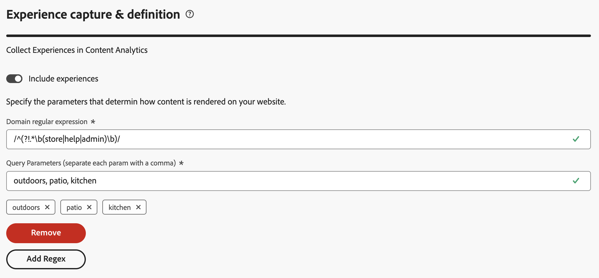

# Content Analytics 안내 구성

{{draft-aca}}

{{release-limited-testing}}

안내식 구성을 통해 콘텐츠 분석을 빠르고 쉽게 구성할 수 있습니다. 안내식 구성은 마법사를 사용하여 콘텐츠 분석을 조직에 맞게 자동으로 구성하기 위한 요구 사항을 설정합니다. **[!UICONTROL 구성]** 화면에서 새 구성을 만들거나 기존 구성을 편집할 수 있습니다.

>[!IMPORTANT]
>
>조직의 샌드박스당 하나의 Content Analytics 구성만 가질 수 있습니다.

Content Analytics 구성에 액세스하려면

* Customer Journey Analytics의 기본 메뉴에서 **[!UICONTROL 데이터 관리]** > **[!UICONTROL 콘텐츠 분석]**&#x200B;을 선택합니다.

**[!UICONTROL Content Analytics 구성]** 화면에 기존 Content Analytics 구성 표가 표시됩니다.

각 구성에 대해 다음 세부 정보를 사용할 수 있습니다.

| 열 | 설명 |
|---|---|
| **[!UICONTROL 이름]** | 구성의 이름입니다. |
| **[!UICONTROL 작성자]** | 구성을 만든 기술 계정입니다. |
| **[!UICONTROL 만든 날짜]** | 구성이 생성되었을 때의 타임스탬프입니다. |
| **[!UICONTROL 수정일]** | 구성을 마지막으로 수정한 시점의 타임스탬프입니다. |
| **[!UICONTROL 샌드박스]** | Content Analytics가 구성 및 구현되는 조직 내 샌드박스. |
| **[!UICONTROL 상태]** | 구성의 상태입니다. 상태는   **[!UICONTROL 초안]**&#x200B;일 수 있습니다. 구성은 나중에 저장되며 배포되지 않습니다.  **[!UICONTROL 실패]**: 구성이 실패했습니다. 구성을 편집하고 필요한 사항을 변경해야 합니다.  **[!UICONTROL 완료]**: 구성이 완료되었으며 구현되었습니다. |

을 사용하여 테이블을 사용자 지정할 수 있습니다. **[!UICONTROL 테이블 사용자 지정]** 대화 상자에 표시할 열을 선택하고 **[!UICONTROL 적용]**&#x200B;을 선택하여 변경 내용을 적용합니다.

콘텐츠 분석 **[!UICONTROL 구성]** 화면에서 새 구성을 만들거나 기존 구성을 편집할 수 있습니다.

새 구성을 만들려면 다음 작업을 수행하십시오.

* **[!UICONTROL 구성 만들기]**&#x200B;를 선택합니다. 이 작업은 [안내가 있는 구성 마법사](#guided-configuration-wizard)를 엽니다.

기존 구성을 편집하려면 다음을 수행하십시오.

* 기존 Content Analytics 구성에 대해 를 선택한 다음  **[!UICONTROL 편집]**&#x200B;을 선택합니다. 이 작업은 [안내가 있는 구성 마법사](#guided-configuration-wizard)를 엽니다.

## 안내식 구성 마법사

안내식 구성 마법사는 네 개의 섹션([세부 정보](#details), [데이터 보기](#data-view), [경험 캡처 및 정의](#experience-capture-and-definition), [데이터 수집](#data-collection))으로 구성되며, 각 섹션에는 Content Analytics을 올바르게 설정하고 구성하는 데 필요한 세부 정보를 묻는 메시지가 표시됩니다. 섹션의 일부 설정은 이전 섹션의 구성 값에 따라 달라질 수 있으므로 다음 섹션으로 이동하기 전에 각 섹션을 완료하십시오.

### 세부 사항 {#onboarding-details}

<!-- markdownlint-disable MD034 -->

>[!CONTEXTUALHELP]
>id="aca_onboarding_details_button"
>title="세부 사항"
>abstract="연결의 이름을 입력합니다. **[!UICONTROL 데이터 보기]**, **[!UICONTROL 경험 캡처 및 정의]**, **[!UICONTROL 데이터 수집]** 섹션에서 세부 정보를 제공하여 Content Analytics가 올바르게 구성되도록 합니다."

>[!CONTEXTUALHELP]
>id="aca_onboarding_details_name_header"
>title="세부 사항"
>abstract="이 안내서는 Content Analytics을 구성하는 데 필요한 요구 사항을 설정합니다. 이 구성에 대한 이름을 제공합니다."

<!-- markdownlint-enable MD034 -->

각 구성에는 고유한 이름이 필요합니다. 예, `Example Content Analytics configuration`. 구성을 저장하거나 구현하려면 이름이 필요합니다.

### 데이터 보기 {#onboarding-data-view}

<!-- markdownlint-disable MD034 -->

>[!CONTEXTUALHELP]
>id="ac_onboarding_dataview_button"
>title="데이터 보기"
>abstract="Content Analytics을 구성하려면 기존 데이터 보기를 선택해야 합니다. 따라서 콘텐츠 분석 데이터를 다른 데이터와 병합할 수 있습니다."

>[!CONTEXTUALHELP]
>id="aca_onboarding_dataview_header"
>title="데이터 보기"
>abstract="Customer Journey Analytics에서 기존 데이터 보기를 선택하여 원하는 콘텐츠 분석 데이터를 병합합니다."

>[!CONTEXTUALHELP]
>id="aca_onboarding_dataview_header_alt"
>title="데이터 보기"
>abstract="Customer Journey Analytics에서 기존 데이터 보기를 선택하여 원하는 콘텐츠 분석 데이터를 병합합니다. "

>[!CONTEXTUALHELP]
>id="aca_onboarding_dataview_change_dialog"
>title="새로운 데이터 보기"
>abstract="새 데이터 보기를 선택하면 해당 데이터 보기가 업데이트되어 Content Analytics 지표 및 차원이 포함됩니다. 필요한 경우 연관된 연결도 콘텐츠 분석 데이터 세트를 포함하도록 업데이트됩니다. 현재 Content Analytics에 대해 구성된 연결 및 데이터 보기는 수정되지 않습니다."

>[!CONTEXTUALHELP]
>id="aca_onboarding_dataview_current_cleanup_labels_dialog"
>title="선택한 데이터 보기 정리"
>abstract="Content Analytics에 대해 이미 프로비저닝된 데이터 보기를 선택했습니다. 기존 Content Analytics 구성이 제거되고 데이터 보기가 새 구성으로 프로비저닝됩니다."

>[!CONTEXTUALHELP]
>id="aca_onboarding_dataview_prev_cleanup_labels_dialog"
>title="이전 데이터 보기 정리"
>abstract="새 데이터 보기를 선택했습니다. 이전에 선택한 데이터 보기에 대한 Content Analytics 구성이 제거됩니다."

<!-- markdownlint-enable MD034 -->

구성을 사용하려면 [데이터 보기](/help/data-views/data-views.md)를 선택해야 합니다.

1. 데이터 보기 선택

   * 구성에 대한 새 데이터 보기를 선택하려면  **[!UICONTROL 데이터 보기 선택]**&#x200B;을 사용하세요.

     데이터 보기의 

   * 구성에 대한 데이터 보기를 수정하려면  **[!UICONTROL 편집]**&#x200B;을 선택하세요.

     데이터 보기의 

   두 시나리오 모두에 구성에 대한 데이터 보기를 선택할 수 있는 **[!UICONTROL 데이터 보기]** 대화 상자가 표시됩니다.

   

   새 구성의 경우 활성 구성이 없는 샌드박스와 연결된 데이터 보기만 목록에 표시됩니다.

   기존 구성을 편집하는 경우 목록에는 기존 구성과 이미 연결된 샌드박스 내에서 사용할 수 있는 데이터 보기만 표시됩니다.

   다음 작업을 수행할 수 있습니다.

   * 특정 데이터 보기를 검색하려면  필드를 사용하십시오.
   * 사용 가능한 데이터 보기 목록을 필터링하려면 를 선택하세요. [!UICONTROL 연결], [!UICONTROL 소유자] 및 [!UICONTROL 샌드박스]에서 목록을 필터링할 수 있습니다. 필터 창을 숨기려면  **[!UICONTROL 필터 숨기기]**&#x200B;를 사용합니다.
   * 테이블에 표시할 열을 정의하려면 을(를) 선택합니다. **[!UICONTROL 테이블 사용자 지정]** 대화 상자에 표시할 열을 선택하고 **[!UICONTROL 적용]**&#x200B;을 선택하여 변경 내용을 적용합니다.

1. 사용할 데이터 보기에서 을(를) 선택합니다.
1. **[!UICONTROL 저장]**&#x200B;을 선택하여 선택한 데이터 보기를 확인합니다. 취소하려면 **[!UICONTROL 취소]**&#x200B;를 선택하십시오.

Customer Journey Analytics에서 데이터 보기는 Customer Journey Analytics [연결](/help/connections/overview.md)에 연결되어 있습니다. 또한 연결은 조직 내의 샌드박스를 기반으로 합니다. 구성을 저장하면 선택한 데이터 보기에 따라 **[!UICONTROL 샌드박스]**&#x200B;가 샌드박스 이름으로 자동 채워집니다.

### 경험 캡처 및 정의 {#onboarding-experiences}

<!-- markdownlint-disable MD034 -->

>[!CONTEXTUALHELP]
>id="aca_onboarding_experiences_button"
>title="경험 캡처 및 정의"
>abstract="콘텐츠 분석을 통해 수집한 데이터에 경험을 포함하도록 선택할 수 있습니다. 선택한 경우 정규 표현식과 쿼리 매개변수의 조합을 하나 이상 설정하여 경험을 포함할 URL을 정의해야 합니다."

>[!CONTEXTUALHELP]
>id="aca_onboarding_experiences_header"
>title="경험 캡처 및 정의"
>abstract="콘텐츠 분석에서 경험 수집"

>[!CONTEXTUALHELP]
>id="aca_onboarding_experiences_parameters_header"
>title="경험 캡처 및 정의"
>abstract="웹 사이트에서 콘텐츠가 렌더링되는 방식을 결정하는 매개 변수를 지정합니다."

>[!CONTEXTUALHELP]
>id="aca_onboarding_experiencecapture_edit_button"
>title="경험 캡처 및 정의"
>abstract="현재 구성과 연결된 태그 속성의 Adobe Content Analytics 확장에서 설정을 편집할 수 있습니다."

<!-- markdownlint-enable MD034 -->

이 섹션에서는 컨텐츠 분석으로 수집하는 데이터에 경험을 포함하도록 선택할 수 있습니다.  경험은 웹 페이지를 방문한 초기 사용자가 사용한 URL을 사용하여 재현할 수 있는 웹 페이지의 모든 텍스트입니다.

기본적으로 **[!UICONTROL 경험 포함]**&#x200B;이 꺼져 있습니다. 선택한 경우 경험을 포함할 URL을 정의해야 합니다.

다음을 적용할 수 있는 경우에만 경험을 포함하십시오.

* 공개 URL만 사용하여 사이트 콘텐츠에 액세스할 수 있습니다. 사이트에 액세스하려면 URL을 통해 사용할 수 없는 개인화된 토큰, 쿠키 또는 기타 메커니즘이 필요하지 않습니다.
* 사이트의 페이지는 페이지 URL을 사용하여 재현할 수 있어야 합니다.

새 구성이나 구현되지 않은 구성에 경험을 포함하려면 다음을 수행하십시오.

1. **[!UICONTROL 경험 포함]**&#x200B;을 사용하도록 설정합니다.
1. 선택 사항입니다. 웹 사이트에서 콘텐츠가 렌더링되는 방식에 대한 매개 변수를 지정합니다. 매개 변수는 **[!UICONTROL 도메인 정규식]**&#x200B;과(와) **[!UICONTROL 쿼리 매개 변수]**&#x200B;의 0개 이상의 조합입니다.
   1. **[!UICONTROL 도메인 정규식]**(예: `/^(?!.*\b(store|help|admin)\b)/`)을 입력하십시오. `/`을(를) 사용하여 정규식을 이스케이프 처리합니다.
   1. `outdoors, patio, kitchen`과(와) 같이 쉼표로 구분된 **[!UICONTROL 쿼리 매개 변수]** 목록을 지정하십시오.
1. 도메인 정규식과 쿼리 매개 변수의 조합을 제거하려면 **[!UICONTROL 제거]**&#x200B;를 선택하십시오.
1. 정규 표현식과 쿼리 매개 변수의 다른 조합을 추가하려면 **[!UICONTROL 정규 표현식 추가]**&#x200B;를 선택합니다.

기존 경험을 편집하거나 구현된 구성에 새 경험을 포함하려면 다음을 수행하십시오.

* Content Analytics에서 경험 수집의 구성을 편집하려면  **[!UICONTROL 편집]**&#x200B;을 선택하십시오. 현재 구성과 연결된 Tags 속성에서 [Adobe Content Analytics 확장](https://experienceleague.adobe.com/en/docs/experience-platform/tags/extensions/client/content-analytics/overview#configure-event-filtering)&#x200B;(으)로 리디렉션됩니다.

### 데이터 수집 {#onboarding-data-collection}

이 섹션에서는 콘텐츠 분석 데이터를 수집하는 방법을 구성합니다.

<!-- markdownlint-disable MD034 -->

>[!CONTEXTUALHELP]
>id="aca_onboarding_datacollection_button"
>title="데이터 수집"
>abstract="사용할 태그 속성을 정의하거나 새 속성을 만듭니다. 정규 표현식을 사용하여 포함하거나 제외할 페이지 및 자산을 정의합니다."

>[!CONTEXTUALHELP]
>id="aca_onboarding_datacollection_tag_header"
>title="데이터 수집"
>abstract="**태그 속성 제공**"

>[!CONTEXTUALHELP]
>id="aca_onboarding_datacollection_pages_excluded_boldheader"
>title="데이터 수집"
>abstract="**포함/제외할 페이지**"

>[!CONTEXTUALHELP]
>id="aca_onboarding_datacollection_pages_excluded_header"
>title="데이터 수집"
>abstract="콘텐츠 분석을 위해 데이터를 수집할 때 **포함**&#x200B;하거나 **제외**&#x200B;할 페이지를 지정합니다."

>[!CONTEXTUALHELP]
>id="aca_onboarding_datacollection_assets_excluded_boldheader"
>title="데이터 수집"
>abstract="**포함/제외할 자산**"

>[!CONTEXTUALHELP]
>id="aca_onboarding_datacollection_assets_excluded_header"
>title="데이터 수집"
>abstract="콘텐츠 분석을 위해 데이터를 수집할 때 **포함**&#x200B;하거나 **제외**&#x200B;할 자산을 지정합니다."

>[!CONTEXTUALHELP]
>id="aca_onboarding_datacollection_experiences_edit_button"
>title="데이터 수집"
>abstract="현재 구성과 연결된 태그 속성에서 Adobe Content Analytics 확장의 페이지 설정을 편집할 수 있습니다."

>[!CONTEXTUALHELP]
>id="aca_onboarding_datacollection_assets_edit_button"
>title="데이터 수집"
>abstract="현재 구성과 연결된 태그 속성에서 Adobe Content Analytics 확장의 에셋에 대한 설정을 편집할 수 있습니다."

<!-- markdownlint-enable MD034 -->

#### 새 구성 {#new-configuration}

새 구성에서 기존 Tags 속성을 사용할지 또는 새 Tags 속성을 만들지 여부를 정의해야 합니다. 정규 표현식을 사용하여 포함 또는 제외할 페이지 및 에셋을 정의해야 합니다.

* 기존 Tags 속성을 사용하려면 다음을 수행하십시오.

  

   1. **[!UICONTROL 기존 항목 선택]**&#x200B;을 선택합니다.
   2. **[!UICONTROL Tags 속성]** 드롭다운 메뉴에서 기존 속성을 선택합니다. 입력을 시작하여 사용 가능한 옵션을 검색하고 제한할 수 있습니다.

* 새 태그 속성을 만들려면 다음 작업을 수행하십시오.

  

   1. **[!UICONTROL 새로 만들기]**&#x200B;를 선택합니다.
   1. **[!UICONTROL 태그 이름]**(예: `ACA Test for Documentation`)을 지정하십시오.
   1. **[!UICONTROL 도메인]**(예: `example.com`)을 지정하십시오.

* 경험을 포함하도록 선택한 경우 컨텐츠 분석에 대한 데이터를 수집할 때 포함 또는 제외할 페이지를 나타냅니다.

   * **[!UICONTROL 포함/제외]**&#x200B;할 페이지에 대한 정규식 문자열을 지정하십시오. 예를 들어 Content Analytics에서 모든 문서 페이지를 제외하려면 `/^(?!.*documentation).*/`을(를) 사용하십시오. `/`을(를) 사용하여 정규식을 이스케이프 처리합니다.

* 콘텐츠 분석에 대한 데이터를 수집할 때 포함 또는 제외할 자산을 나타냅니다.

   * **[!UICONTROL Assets에 대해 포함/제외]**&#x200B;할 정규식 문자열을 지정하십시오. 예: `/^(?!.*(logo\.jpg|\.svg)).*$/` Content Analytics에서 모든 로고 JPEG 및 SVG 이미지를 제외합니다. `/`을(를) 사용하여 정규식을 이스케이프 처리합니다.

#### 기존 구성 {#existing-configuration}

기존 구성의 경우 태그 속성을 편집할 수 없습니다. 그러나 포함 또는 제외할 페이지 및 에셋을 편집할 수 있습니다.

* Content Analytics에 대한 데이터를 수집할 때 포함 또는 제외할 페이지를 편집하려면 **[!UICONTROL 경험]** 아래에서  **[!UICONTROL 편집]**&#x200B;을 선택하십시오. 현재 Content Analytics 구성의 Tags 속성과 연결된 [Adobe Content Analytics 확장](https://experienceleague.adobe.com/en/docs/experience-platform/tags/extensions/client/content-analytics/overview#configure-event-filtering)&#x200B;(으)로 리디렉션됩니다. 정규 표현식을 편집하여 페이지를 포함하거나 제외할 수 있습니다. 변경 내용을 [게시](manual.md#publish)합니다.

* Content Analytics에 대한 데이터를 수집할 때 포함 또는 제외할 자산을 편집하려면 **[!UICONTROL 자산]** 아래에서  **[!UICONTROL 편집]**&#x200B;을 선택하십시오. 현재 Content Analytics 구성의 Tags 속성과 연결된 [Adobe Content Analytics 확장](https://experienceleague.adobe.com/en/docs/experience-platform/tags/extensions/client/content-analytics/overview#configure-event-filtering)&#x200B;(으)로 리디렉션됩니다. 정규 표현식을 편집하여 에셋을 포함하거나 제외할 수 있습니다. 변경 내용을 [게시](manual.md#publish)하세요.

### 요약 {#summary}

필요한 모든 세부 정보를 제공했으면 요약에 생성 또는 수정된 객체에 대한 세부 정보가 제공됩니다.

* 새 구성을 구현할 때 **[!UICONTROL 콘텐츠 분석에 대한 _구성 이름_을(를) 구현할 준비가 되었습니다]** 요약이 표시됩니다.

* 구현된 기존 구성의 경우 **[!UICONTROL Content Analytics에 대해 _구성 이름_을 구현했습니다]** 요약이 표시됩니다.

### 액션 {#actions}

<!-- markdownlint-disable MD034 -->

>[!CONTEXTUALHELP]
>id="aca_onboarding_implementation_warning_dialog"
>title="구현 확인"
>abstract="**[!UICONTROL 구현]**&#x200B;을 선택하면 이 워크플로에서 제공한 입력을 기반으로 콘텐츠 분석이 구성됩니다. 여러 설정은 기본적으로 Content Analytics에 일반적으로 유용한 사항을 기반으로 선택되지만, 데이터 제어자로서 사용자는 각 아티팩트의 설정을 검토하여 설정이 개인정보 처리방침, 계약상 권리 및 의무, 관련 법률에 따른 동의 요구 사항에 따라 구현되는지 확인해야 합니다.  이 구성과 관련된 태그 라이브러리가 수동으로 게시될 때까지는 아무런 데이터도 수집되지 않습니다.  이미지 및 텍스트의 특성을 가져오기 위해 Adobe은 다음을 사용하여 특성을 검색합니다.<ol><li>사용자가 사이트를 방문할 때 구성한 데이터 수집 설정에 따라 캡처되는 URL 및</li><li>이미지가 호스팅되는 URL</li></ol>서드파티 사이트에 호스팅된 이미지에는 태그를 지정해서는 안 됩니다."

<!-- markdownlint-enable MD034 -->

구성을 만들거나 편집한 경우 다음 작업을 사용할 수 있습니다.

* **[!UICONTROL 버리기]**: 새 구성을 만들거나 기존 구성을 편집하는 과정에서 변경한 모든 내용이 무시됩니다.
* **[!UICONTROL 나중에 저장]**: 새 구성 또는 아직 구현되지 않은 기존 구성에 대한 변경 내용이 저장됩니다. 이후 단계에서 구성을 다시 방문하여 추가 변경을 수행하거나 구성을 구현할 수 있습니다.
* **[!UICONTROL 구현]**: 새 구성 또는 아직 구현되지 않은 기존 구성에 대한 설정 또는 변경 내용이 저장되고 구현됩니다. 구현은 다음과 같이 구성됩니다.

   * **[!UICONTROL Customer Journey Analytics]** 구성:
      * 선택한 데이터 보기가 Content Analytics 차원 및 지표를 포함하도록 업데이트됩니다.
      * 선택한 데이터 보기에 연결된 연결이 Content Analytics 이벤트 및 특성 데이터 세트를 포함하도록 수정됩니다.
      * Content Analytics 보고 템플릿이 Workspace에 추가됩니다.

+++ 세부 사항

     자세한 내용은 다음 시나리오에 제공됩니다.

      * **Tags** 속성이 **✓**&#x200B;에 있거나 **✕**&#x200B;에 없습니다.
      * Tags 속성에 대한 **Web SDK** 확장이 **✓**&#x200B;에 있거나 **✕**&#x200B;에 없습니다.
      * Tag 속성에 대한 Adobe **Content Analytics** 확장이 **✓**&#x200B;에 있거나 **✕**&#x200B;에 없습니다.

     <table style="table-layout:fixed">
      <tr>
        <th></th>
        <th colspan="4">시나리오:</th>
      </tr>
      <tr>
        <th>
          <strong>설정</strong>
        </th>
        <th>
          <strong>✓ 태그 ✓ 웹 SDK ✓ Content Analytics</strong>
        </th>
        <th>
          <strong>✓ 태그 ✓ 웹 SDK ✕ Content Analytics</strong>
        </th>
        <th>
          <strong>✓태그 ✕ 웹 SDK ✕ Content Analytics</strong>
        </th>
        <th>
          <strong>✕ 태그 ✕ 웹 SDK ✕ Content Analytics</strong>
        </th>
      </tr>
      <tbody>
        <tr>
          <td>보고서 템플릿</td>
          <td colspan="4">보고서 템플릿을 사용할 수 있습니다</td>
        </tr>
        <tr>
          <td>데이터 보기</td>
          <td colspan="4">ACA 차원 및 지표를 갖도록 수정/생성됨</td>
        </tr>
        <tr>
          <td>연결</td>
          <td colspan="4">ACA 데이터 세트(ACA 이벤트, 에셋 속성, 경험 속성)를 포함하도록 수정됨</td>
        </tr>
      </tbody>
    </table>

+++

   * **[!UICONTROL Adobe Experience Platform]** 구성:
      * 콘텐츠 분석 이벤트, 자산 속성 및 경험 속성(구성된 경우)을 모델링하기 위한 스키마 생성.
      * 콘텐츠 분석 이벤트, 자산 속성 및 경험 속성(구성된 경우)을 수집하기 위한 데이터 세트 생성.
      * 기능 서비스를 사용하여 Content Analytics 이벤트에서 콘텐츠 속성을 생성하고 업데이트하는 데이터 흐름 생성.

+++ 세부 사항

     자세한 내용은 다음 시나리오에 제공됩니다.

      * **Tags** 속성이 **✓**&#x200B;에 있거나 **✕**&#x200B;에 없습니다.
      * Tags 속성에 대한 **Web SDK** 확장이 **✓**&#x200B;에 있거나 **✕**&#x200B;에 없습니다.
      * Tag 속성에 대한 Adobe **Content Analytics** 확장이 **✓**&#x200B;에 있거나 **✕**&#x200B;에 없습니다.

     <table style="table-layout:fixed">
      <tr>
        <th></th>
        <th colspan="4">시나리오:</th>
      </tr>
      <tr>
        <th>
          <strong>설정</strong>
        </th>
        <th>
          <strong>✓ 태그 ✓ 웹 SDK ✓ Content Analytics</strong>
        </th>
        <th>
          <strong>✓ 태그 ✓ 웹 SDK ✕ Content Analytics</strong>
        </th>
        <th>
          <strong>✓태그 ✕ 웹 SDK ✕ Content Analytics</strong>
        </th>
        <th>
          <strong>✕ 태그 ✕ 웹 SDK ✕ Content Analytics</strong>
        </th>
      </tr>
      <tbody>
        <tr>
          <td colspan="5"><strong> Content Analytics 이벤트 스키마</strong></td>
        </tr>
        <tr>
          <td style="margin-left: 160.0px;">이름</td>
          <td>Content Analytics 이벤트</td>
          <td>Content Analytics 이벤트</td>
          <td>Content Analytics 이벤트</td>
          <td>Content Analytics 이벤트</td>
        </tr>
        <tr>
          <td>설명</td>
          <td><i>미리 결정된 tbd</i></td>
          <td><i>미리 결정된 tbd</i></td>
          <td><i>미리 결정된 tbd</i></td>
          <td><i>미리 결정된 tbd</i></td>
        </tr>
        <tr>
          <td>프로필 활성화됨</td>
          <td>아니요</td>
          <td>아니요</td>
          <td>아니요</td>
          <td>아니요</td>
        </tr>
        <tr>
          <td colspan="5"><strong> Content Analytics 이벤트 데이터 세트</strong></td>
        </tr>
        <tr>
          <td>이름</td>
          <td>Content Analytics 이벤트</td>
          <td>Content Analytics 이벤트</td>
          <td>Content Analytics 이벤트</td>
          <td>Content Analytics 이벤트</td>
        </tr>
        <tr>
          <td>스키마</td>
          <td>Content Analytics 이벤트</td>
          <td>Content Analytics 이벤트</td>
          <td>Content Analytics 이벤트</td>
          <td>Content Analytics 이벤트</td>
        </tr>
        <tr>
          <td>설명</td>
          <td><i>미리 결정된 tbd</i></td>
          <td><i>미리 결정된 tbd</i></td>
          <td><i>미리 결정된 tbd</i></td>
          <td><i>미리 결정된 tbd</i></td>
        </tr>
        <tr>
          <td>태그</td>
          <td><i>비어?</i></td>
          <td><i>비어?</i></td>
          <td><i>비어?</i></td>
          <td><i>비어?</i></td>
        </tr>
        <tr>
          <td>시스템 데이터 세트</td>
          <td>?</td>
          <td>?</td>
          <td>?</td>
          <td>?</td>
        </tr>
        <tr>
          <td>프로필 활성화됨</td>
          <td>아니요</td>
          <td>아니요</td>
          <td>아니요</td>
          <td>아니요</td>
        </tr>
        <tr>
          <td>데이터 거버넌스 (DULE 레이블)</td>
          <td>?</td>
          <td>?</td>
          <td>?</td>
          <td>?</td>
        </tr>
        <tr>
          <td colspan="5"><strong> Content Analytics 자산 속성 스키마</strong></td>
        </tr>
        <tr>
          <td>이름</td>
          <td>Content Analytics 자산 속성</td>
          <td>Content Analytics 자산 속성</td>
          <td>Content Analytics 자산 속성</td>
          <td>Content Analytics 자산 속성</td>
        </tr>
        <tr>
          <td>설명</td>
          <td><i>미리 결정된 tbd</i></td>
          <td><i>미리 결정된 tbd</i></td>
          <td><i>미리 결정된 tbd</i></td>
          <td><i>미리 결정된 tbd</i></td>
        </tr>
        <tr>
          <td>프로필 활성화됨</td>
          <td>아니요</td>
          <td>아니요</td>
          <td>아니요</td>
          <td>아니요</td>
        </tr>
        <tr>
          <td colspan="5"><strong> Content Analytics Assets 속성 데이터 세트</strong></td>
        </tr>
        <tr>
          <td>이름</td>
          <td>Content Analytics 자산 속성</td>
          <td>Content Analytics 자산 속성</td>
          <td>Content Analytics 자산 속성</td>
          <td>Content Analytics 자산 속성</td>
        </tr>
        <tr>
          <td>스키마</td>
          <td>Content Analytics 자산 속성</td>
          <td>Content Analytics 자산 속성</td>
          <td>Content Analytics 자산 속성</td>
          <td>Content Analytics 자산 속성</td>
        </tr>
        <tr>
          <td>설명</td>
          <td><i>미리 결정된 tbd</i></td>
          <td><i>미리 결정된 tbd</i></td>
          <td><i>미리 결정된 tbd</i></td>
          <td><i>미리 결정된 tbd</i></td>
        </tr>
        <tr>
          <td>태그</td>
          <td><i>비어?</i></td>
          <td><i>비어?</i></td>
          <td><i>비어?</i></td>
          <td><i>비어?</i></td>
        </tr>
        <tr>
          <td>시스템 데이터 세트</td>
          <td>?</td>
          <td>?</td>
          <td>?</td>
          <td>?</td>
        </tr>
        <tr>
          <td>프로필 활성화됨</td>
          <td>아니요</td>
          <td>아니요</td>
          <td>아니요</td>
          <td>아니요</td>
        </tr>
        <tr>
          <td>데이터 거버넌스 (DULE 레이블)</td>
          <td>?</td>
          <td>?</td>
          <td>?</td>
          <td>?</td>
        </tr>
        <tr>
          <td colspan="5"><strong> Content Analytics 경험 속성 스키마</strong></td>
        </tr>
        <tr>
          <td>이름</td>
          <td>Content Analytics 경험 속성</td>
          <td>Content Analytics 경험 속성</td>
          <td>Content Analytics 경험 속성</td>
          <td>Content Analytics 경험 속성</td>
        </tr>
        <tr>
          <td>설명</td>
          <td><i>미리 결정된 tbd</i></td>
          <td><i>미리 결정된 tbd</i></td>
          <td><i>미리 결정된 tbd</i></td>
          <td><i>미리 결정된 tbd</i></td>
        </tr>
        <tr>
          <td>프로필 활성화됨</td>
          <td>아니요</td>
          <td>아니요</td>
          <td>아니요</td>
          <td>아니요</td>
        </tr>
        <tr>
          <td colspan="5"><strong> Content Analytics 경험 속성 데이터 세트</strong></td>
        </tr>
        <tr>
          <td>이름</td>
          <td>Content Analytics 경험 속성</td>
          <td>Content Analytics 경험 속성</td>
          <td>Content Analytics 경험 속성</td>
          <td>Content Analytics 경험 속성</td>
        </tr>
        <tr>
          <td>스키마</td>
          <td>Content Analytics 경험 속성</td>
          <td>Content Analytics 경험 속성</td>
          <td>Content Analytics 경험 속성</td>
          <td>Content Analytics 경험 속성</td>
        </tr>
        <tr>
          <td>설명</td>
          <td><i>미리 결정된 tbd</i></td>
          <td><i>미리 결정된 tbd</i></td>
          <td><i>미리 결정된 tbd</i></td>
          <td><i>미리 결정된 tbd</i></td>
        </tr>
        <tr>
          <td>태그</td>
          <td><i>비어?</i></td>
          <td><i>비어?</i></td>
          <td><i>비어?</i></td>
          <td><i>비어?</i></td>
        </tr>
        <tr>
          <td>시스템 데이터 세트</td>
          <td>?</td>
          <td>?</td>
          <td>?</td>
          <td>?</td>
        </tr>
        <tr>
          <td>프로필 활성화됨</td>
          <td>아니요</td>
          <td>아니요</td>
          <td>아니요</td>
          <td>아니요</td>
        </tr>
        <tr>
          <td>데이터 거버넌스 (DULE 레이블)</td>
          <td>?</td>
          <td>?</td>
          <td>?</td>
          <td>?</td>
        </tr>
      </tbody>
    </table>

+++

   * **[!UICONTROL 데이터 수집]** 구성:
      * 새 태그 속성 또는 기존 태그 속성이 Content Analytics 데이터 수집을 지원하도록 구성되었습니다. 이 구성은 태그용 Adobe Content Analytics 확장 포함을 의미합니다.
      * Content Analytics 이벤트에 대한 데이터 스트림이 만들어집니다.
      * Adobe Content Analytics 확장은 Content Analytics 이벤트가 Content Analytics용 데이터 스트림으로 전송되도록 구성되었습니다.
      * 웹 SDK이 Tags 속성에 대해 구성되지 않은 경우 Content Analytics 이벤트만 전송하도록 새 웹 SDK 구성이 만들어집니다.
      * 웹 SDK이 이 태그 속성에 대해 구성된 경우 기존 웹 SDK 구성이 변경되지 않습니다.

+++ 세부 사항

     자세한 내용은 다음 시나리오에 제공됩니다.

      * **Tags** 속성이 **✓**&#x200B;에 있거나 **✕**&#x200B;에 없습니다.
      * Tags 속성에 대한 **Web SDK** 확장이 **✓**&#x200B;에 있거나 **✕**&#x200B;에 없습니다.
      * Tag 속성에 대한 Adobe **Content Analytics** 확장이 **✓**&#x200B;에 있거나 **✕**&#x200B;에 없습니다.

     <table style="table-layout:fixed">
      <tr>
        <th></th>
        <th colspan="4">시나리오:</th>
      </tr>
      <tr>
        <th>
          <strong>설정</strong>
        </th>
        <th>
          <strong>✓ 태그 ✓ 웹 SDK ✓ Content Analytics</strong>
        </th>
        <th>
          <strong>✓ 태그 ✓ 웹 SDK ✕ Content Analytics</strong>
        </th>
        <th>
          <strong>✓태그 ✕ 웹 SDK ✕ Content Analytics</strong>
        </th>
        <th>
          <strong>✕ 태그 ✕ 웹 SDK ✕ Content Analytics</strong>
        </th>
      </tr>
      <tbody>
        <tr>
          <td colspan="5"><strong> 데이터스트림</strong></td>
        </tr>
        <tr>
          <td>이름</td>
          <td><i>기존 값</i></td>
          <td>콘텐츠 분석</td>
          <td>콘텐츠 분석</td>
          <td>콘텐츠 분석</td>
        </tr>
        <tr>
          <td>설명</td>
          <td><i>기존 값</i></td>
          <td><i>predetermined</i></td>
          <td><i>predetermined</i></td>
          <td><i>predetermined</i></td>
        </tr>
        <tr>
          <td>스키마 매핑</td>
          <td><i>기존 값</i></td>
          <td><i>predetermined</i></td>
          <td><i>predetermined</i></td>
          <td><i>predetermined</i></td>
        </tr>
        <tr>
          <td>지리적 위치 및 네트워크 조회</td>
          <td><i>기존 값</i></td>
          <td>모든 옵션 끄기</td>
          <td>모든 옵션 끄기</td>
          <td>모든 옵션 끄기</td>
        </tr>
        <tr>
          <td>장치 조회</td>
          <td><i>기존 값</i></td>
          <td>장치 정보 수집 안 함</td>
          <td>장치 정보 수집 안 함</td>
          <td>장치 정보 수집 안 함</td>
        </tr>
        <tr>
          <td>IP 난독화</td>
          <td><i>기존 값</i></td>
          <td>없음</td>
          <td>없음</td>
          <td>없음</td>
        </tr>
        <tr>
          <td>자사 ID 쿠키</td>
          <td><i>기존 값</i></td>
          <td>꺼짐</td>
          <td>꺼짐</td>
          <td>꺼짐</td>
        </tr>
        <tr>
          <td>타사 ID 동기화</td>
          <td><i>기존 값</i></td>
          <td>꺼짐</td>
          <td>꺼짐</td>
          <td>꺼짐</td>
        </tr>
        <tr>
          <td>액세스 유형</td>
          <td><i>기존 값</i></td>
          <td>혼합 인증</td>
          <td>혼합 인증</td>
          <td>혼합 인증</td>
        </tr>
        <tr>
          <td>미디어 분석</td>
          <td><i>기존 값</i></td>
          <td>꺼짐</td>
          <td>꺼짐</td>
          <td>꺼짐</td>
        </tr>
            <tr>
          <td>보트 탐지</td>
          <td><i>기존 값</i></td>
          <td>꺼짐</td>
          <td>꺼짐</td>
          <td>꺼짐</td>
        </tr>
        <tr>
          <td>매핑</td>
          <td><i>기존 값</i></td>
          <td><i>사용자 제공</i></td>
          <td><i>사용자 제공</i></td>
          <td><i>사용자 제공</i></td>
        </tr>
        <tr>
          <td colspan="5"><strong> 태그 속성</strong> 기존 속성이나 새 속성입니다. 이름과 도메인은 사용자가 제공합니다.</td>
        </tr>
        <tr>
          <td>이름</td>
          <td><i>기존 값</i></td>
          <td><i>기존 값</i></td>
          <td><i>기존 값</i></td>
          <td><i>사용자 제공</i>(기본 "Content Analytics")</td>
        </tr>
        <tr>
          <td>도메인</td>
          <td><i>기존 값</i></td>
          <td><i>기존 값</i></td>
          <td><i>기존 값</i></td>
          <td ><i>predetermined</i></td>
        </tr>
        <tr>
          <td colspan="5"><strong> 태그 라이브러리</strong></td>
        </tr>
        <tr>
          <td>이름</td>
          <td><i>기존 값</i></td>
          <td><i>기존 값</i></td>
          <td><i>기존 값</i></td>
          <td>
             
          </td>
        </tr>
        <tr>
          <td colspan="5"><strong> 웹 SDK 확장</strong></td>
        </tr>
        <tr>
          <td>이름</td>
          <td><i>기존 값</i></td>
          <td><i>기존 값</i></td>
          <td>Content Analytics - 웹 SDK</td>
          <td>Content Analytics - 웹 SDK</td>
        </tr>
        <tr>
          <td>IMS 조직</td>
          <td><i>자동으로 채워짐</i></td>
          <td><i>자동으로 채워짐</i></td>
          <td><i>자동으로 채워짐</i></td>
          <td><i>자동으로 채워짐</i></td>
        </tr>
        <tr>
          <td>Edge 도메인</td>
          <td><i>기존 값 AppMeasurement 구현과 일치하도록 업데이트가 필요할 수 있음</i></td>
          <td><i>기존 값 AppMeasurement 구현과 일치하도록 업데이트가 필요할 수 있음</i></td>
          <td>
            <a href="http://edge.adobedc.net">edge.adobedc.net</a>
          </td>
          <td>
            <a href="http://edge.adobedc.net">edge.adobedc.net</a>
          </td>
        </tr>
        <tr>
          <td colspan="5"><strong> 데이터 스트림</strong></td>
        </tr>
        <tr>
          <td>프로덕션</td>
          <td><i>기존 값 다른 데이터 스트림으로 보내는 데 사용되는 데이터 스트림 재정의</i></td>
          <td><i>기존 값 다른 데이터 스트림으로 보내는 데 사용되는 데이터 스트림 재정의</i></td>
          <td><i>사용자 입력</i>?</td>
          <td><i>사용자 입력</i>?</td>
        </tr>
        <tr>
          <td>스테이징</td>
          <td><i>기존 값 다른 데이터 스트림으로 보내는 데 사용되는 데이터 스트림 재정의</i></td>
          <td><i>기존 값 다른 데이터 스트림으로 보내는 데 사용되는 데이터 스트림 재정의</i></td>
          <td><i>사용자 입력</i>?</td>
          <td><i>사용자 입력</i>?</td>
        </tr>
        <tr>
          <td>개발</td>
          <td><i>기존 값 다른 데이터 스트림으로 보내는 데 사용되는 데이터 스트림 재정의</i></td>
          <td><i>기존 값 다른 데이터 스트림으로 보내는 데 사용되는 데이터 스트림 재정의</i></td>
          <td><i>사용자 입력</i>?</td>
          <td><i>사용자 입력</i>?</td>
        </tr>
        <tr>
          <td>개인 정보 보호</td>
          <td><i>기존 값</i></td>
          <td><i>기존 값</i></td>
          <td>안에?</td>
          <td>안에?</td>
        </tr>
        <tr>
          <td colspan="5"><strong> ID</strong></td>
        </tr>
        <tr>
          <td>ECID 마이그레이션</td>
          <td><i>기존 값</i></td>
          <td><i>기존 값</i></td>
          <td>선택됨</td>
          <td>선택됨</td>
        </tr>
        <tr>
          <td>서드파티 쿠키 사용</td>
          <td><i>기존 값</i></td>
          <td><i>기존 값</i></td>
          <td>선택됨</td>
          <td>선택됨</td>
        </tr>
        <tr>
          <td colspan="5"><strong> 개인화</strong></td>
        </tr>
        <tr>
          <td>Target을 at.js에서 Web SDK으로 마이그레이션</td>
          <td><i>기존 값</i></td>
          <td><i>기존 값</i></td>
          <td>선택되지 않음</td>
          <td>선택되지 않음</td>
        </tr>
        <tr>
          <td>개인화 스토리지 활성화</td>
          <td><i>기존 값</i></td>
          <td><i>기존 값</i></td>
          <td>선택되지 않음</td>
          <td>선택되지 않음</td>
        </tr>
        <tr>
          <td>Adobe Journey Optimizer용 자동 클릭 컬렉션</td>
          <td><i>기존 값</i></td>
          <td><i>기존 값</i></td>
          <td>항상</td>
          <td>항상</td>
        </tr>
        <tr>
          <td>Adobe Target용 자동 클릭 컬렉션</td>
          <td><i>기존 값</i></td>
          <td><i>기존 값</i></td>
          <td>절대 안 함</td>
          <td>절대 안 함</td>
        </tr>
        <tr>
          <td colspan="5"><strong> 데이터 수집</strong></td>
        </tr>
        <tr>
          <td>내부 링크 클릭 수 수집</td>
          <td><i>기존 값</i></td>
          <td><i>기존 값</i></td>
          <td>선택되지 않음</td>
          <td>선택되지 않음</td>
        </tr>
        <tr>
          <td>외부 링크 클릭 수 수집</td>
          <td><i>기존 값</i></td>
          <td><i>기존 값</i></td>
          <td>선택되지 않음</td>
          <td>선택되지 않음</td>
        </tr>
        <tr>
          <td>다운로드 링크 클릭 수 수집</td>
          <td><i>기존 값</i></td>
          <td><i>기존 값</i></td>
          <td>선택되지 않음</td>
          <td>선택되지 않음</td>
        </tr>
        <tr>
          <td>이벤트 데이터를 보낼 때 다음을 자동으로 포함</td>
          <td><i>기존 값</i></td>
          <td><i>기존 값</i></td>
          <td>모든 기본 컨텍스트 정보</td>
          <td>모든 기본 컨텍스트 정보</td>
        </tr>
        <tr>
          <td>스트리밍 미디어</td>
          <td><i>기존 값</i></td>
          <td><i>기존 값</i></td>
          <td>빈 값</td>
          <td>빈 값</td>
        </tr>
        <tr>
          <td>데이터 스트림 구성 무시</td>
          <td><i>기존 값</i></td>
          <td><i>기존 값</i></td>
          <td>데이터 스트림 구성 일치</td>
          <td>데이터 스트림 구성 일치</td>
        </tr>
        <tr>
          <td>고급 설정 - Edge 기본 경로</td>
          <td><i>기존 값</i></td>
          <td><i>기존 값</i></td>
          <td>ee</td>
          <td>ee</td>
        </tr>
        <tr>
          <td colspan="5"><strong> Content Analytics 확장</strong></td>
        </tr>
        <tr>
          <td>데이터 스트림</td>
          <td><i>기존 값</i></td>
          <td><i>predetermined</i></td>
          <td><i>predetermined</i></td>
          <td><i>predetermined</i></td>
        </tr>
        <tr>
          <td>경험 캡처 및 정의</td>
          <td><i>기존 값</i></td>
          <td><i>사용자 제공</i></td>
          <td><i>사용자 제공</i></td>
          <td><i>사용자 제공</i></td>
        </tr>
        <tr>
          <td>이벤트 필터링</td>
          <td><i>기존 값</i></td>
          <td><i>사용자 제공</i></td>
          <td><i>사용자 제공</i></td>
          <td><i>사용자 제공</i></td>
        </tr>
      </tbody>
    </table>

+++

* **[!UICONTROL 저장]**: 구현된 구성에 대한 변경 내용이 저장되고 구현이 업데이트됩니다.
* **[!UICONTROL 종료]**. 안내식 구성을 종료합니다. 구현된 구성에 대한 모든 변경 사항이 무시됩니다.

## 게시 {#publish}

Content Analytics 구성을 활성화하려면 **[!UICONTROL 구현]** [수동](manual.md)을 선택한 후 만들어진 태그 속성을 게시해야 합니다.

<!--
## Onboarding settings and configurations

The following sections outline the settings and configurations applied to [Customer Journey Analytics](#customer-journey-analytics-cja), [Experience Platform](#experience-platform-aep) and [Data Collection](#data-collection-dc) as part of the implementation of a Content Analytics configuration.

Details are provided for the following scenarios:

* **Tags** property exists **✓** or does not exist **✕**.
* **Web SDK** extension for the Tags property exists **✓** or does not exist **✕**.
* Adobe **Content Analytics** extension for the Tag property exists **✓** or does not exist **✕**.

### Customer Journey Analytics {#cja}

<table style="table-layout:fixed">
  <tr>
    <th></th>
    <th colspan="4">Scenarios:</th>
  </tr>
  <tr>
    <th>
      <strong>Setting</strong>
    </th>
    <th>
      <strong>✓ Tags ✓ Web SDK ✓ Content Analytics</strong>
    </th>
    <th>
      <strong>✓ Tags ✓ Web SDK ✕ Content Analytics</strong>
    </th>
    <th>
      <strong>✓Tags ✕ Web SDK ✕ Content Analytics</strong>
    </th>
    <th>
      <strong>✕ Tags ✕ Web SDK ✕ Content Analytics</strong>
    </th>
  </tr>
  <tbody>
    <tr>
      <td>Report Template</td>
      <td colspan="4">A report template is available</td>
    </tr>
    <tr>
      <td>Data view</td>
      <td colspan="4">Modified/Created to have ACA dimensions and metrics</td>
    </tr>
    <tr>
      <td>Connection</td>
      <td colspan="4">Modified to include ACA datasets (ACA events, Asset attributes, Experience Attribute)</td>
    </tr>
  </tbody>
</table>

### Experience Platform {#aep}

<table style="table-layout:fixed">
  <tr>
    <th></th>
    <th colspan="4">Scenarios:</th>
  </tr>
  <tr>
    <th>
      <strong>Setting</strong>
    </th>
    <th>
      <strong>✓ Tags ✓ Web SDK ✓ Content Analytics</strong>
    </th>
    <th>
      <strong>✓ Tags ✓ Web SDK ✕ Content Analytics</strong>
    </th>
    <th>
      <strong>✓Tags ✕ Web SDK ✕ Content Analytics</strong>
    </th>
    <th>
      <strong>✕ Tags ✕ Web SDK ✕ Content Analytics</strong>
    </th>
  </tr>
  <tbody>
    <tr>
      <td colspan="5"><strong> Content Analytics Events schema</strong></td>
    </tr>
    <tr>
      <td style="margin-left: 160.0px;">Name</td>
      <td>Content Analytics Events</td>
      <td>Content Analytics Events</td>
      <td>Content Analytics Events</td>
      <td>Content Analytics Events</td>
    </tr>
    <tr>
      <td>Description</td>
      <td><i>predetermined tbd</i></td>
      <td><i>predetermined tbd</i></td>
      <td><i>predetermined tbd</i></td>
      <td><i>predetermined tbd</i></td>
    </tr>
    <tr>
      <td>Profile enabled</td>
      <td>No</td>
      <td>No</td>
      <td>No</td>
      <td>No</td>
    </tr>
    <tr>
      <td colspan="5"><strong> Content Analytics Events dataset</strong></td>
    </tr>
    <tr>
      <td>Name</td>
      <td>Content Analytics Events</td>
      <td>Content Analytics Events</td>
      <td>Content Analytics Events</td>
      <td>Content Analytics Events</td>
    </tr>
    <tr>
      <td>Schema</td>
      <td>Content Analytics Event</td>
      <td>Content Analytics Event</td>
      <td>Content Analytics Event</td>
      <td>Content Analytics Event</td>
    </tr>
    <tr>
      <td>Description</td>
      <td><i>predetermined tbd</i></td>
      <td><i>predetermined tbd</i></td>
      <td><i>predetermined tbd</i></td>
      <td><i>predetermined tbd</i></td>
    </tr>
    <tr>
      <td>Tags</td>
      <td><i>empty?</i></td>
      <td><i>empty?</i></td>
      <td><i>empty?</i></td>
      <td><i>empty?</i></td>
    </tr>
    <tr>
      <td>System dataset</td>
      <td>?</td>
      <td>?</td>
      <td>?</td>
      <td>?</td>
    </tr>
    <tr>
      <td>Profile enabled</td>
      <td>No</td>
      <td>No</td>
      <td>No</td>
      <td>No</td>
    </tr>
    <tr>
      <td>Data governance (DULE labels)</td>
      <td>?</td>
      <td>?</td>
      <td>?</td>
      <td>?</td>
    </tr>
    <tr>
      <td colspan="5"><strong> Content Analytics Asset Attributes schema</strong></td>
    </tr>
    <tr>
      <td>Name</td>
      <td>Content Analytics Asset Attributes</td>
      <td>Content Analytics Asset Attributes</td>
      <td>Content Analytics Asset Attributes</td>
      <td>Content Analytics Asset Attributes</td>
    </tr>
    <tr>
      <td>Description</td>
      <td><i>predetermined tbd</i></td>
      <td><i>predetermined tbd</i></td>
      <td><i>predetermined tbd</i></td>
      <td><i>predetermined tbd</i></td>
    </tr>
    <tr>
      <td>Profile enabled</td>
      <td>No</td>
      <td>No</td>
      <td>No</td>
      <td>No</td>
    </tr>
    <tr>
      <td colspan="5"><strong> Content Analytics Assets Attributes dataset</strong></td>
    </tr>
    <tr>
      <td>Name</td>
      <td>Content Analytics Asset Attributes</td>
      <td>Content Analytics Asset Attributes</td>
      <td>Content Analytics Asset Attributes</td>
      <td>Content Analytics Asset Attributes</td>
    </tr>
    <tr>
      <td>Schema</td>
      <td>Content Analytics Asset Attributes</td>
      <td>Content Analytics Asset Attributes</td>
      <td>Content Analytics Asset Attributes</td>
      <td>Content Analytics Asset Attributes</td>
    </tr>
    <tr>
      <td>Description</td>
      <td><i>predetermined tbd</i></td>
      <td><i>predetermined tbd</i></td>
      <td><i>predetermined tbd</i></td>
      <td><i>predetermined tbd</i></td>
    </tr>
    <tr>
      <td>Tags</td>
      <td><i>empty?</i></td>
      <td><i>empty?</i></td>
      <td><i>empty?</i></td>
      <td><i>empty?</i></td>
    </tr>
    <tr>
      <td>System dataset</td>
      <td>?</td>
      <td>?</td>
      <td>?</td>
      <td>?</td>
    </tr>
    <tr>
      <td>Profile enabled</td>
      <td>No</td>
      <td>No</td>
      <td>No</td>
      <td>No</td>
    </tr>
    <tr>
      <td>Data governance (DULE labels)</td>
      <td>?</td>
      <td>?</td>
      <td>?</td>
      <td>?</td>
    </tr>
    <tr>
      <td colspan="5"><strong> Content Analytics Experience Attributes schema</strong></td>
    </tr>
    <tr>
      <td>Name</td>
      <td>Content Analytics Experience Attributes</td>
      <td>Content Analytics Experience Attributes</td>
      <td>Content Analytics Experience Attributes</td>
      <td>Content Analytics Experience Attributes</td>
    </tr>
    <tr>
      <td>Description</td>
      <td><i>predetermined tbd</i></td>
      <td><i>predetermined tbd</i></td>
      <td><i>predetermined tbd</i></td>
      <td><i>predetermined tbd</i></td>
    </tr>
    <tr>
      <td>Profile enabled</td>
      <td>No</td>
      <td>No</td>
      <td>No</td>
      <td>No</td>
    </tr>
    <tr>
      <td colspan="5"><strong> Content Analytics Experience Attributes dataset</strong></td>
    </tr>
    <tr>
      <td>Name</td>
      <td>Content Analytics Experience Attributes</td>
      <td>Content Analytics Experience Attributes</td>
      <td>Content Analytics Experience Attributes</td>
      <td>Content Analytics Experience Attributes</td>
    </tr>
    <tr>
      <td>Schema</td>
      <td>Content Analytics Experience Attributes</td>
      <td>Content Analytics Experience Attributes</td>
      <td>Content Analytics Experience Attributes</td>
      <td>Content Analytics Experience Attributes</td>
    </tr>
    <tr>
      <td>Description</td>
      <td><i>predetermined tbd</i></td>
      <td><i>predetermined tbd</i></td>
      <td><i>predetermined tbd</i></td>
      <td><i>predetermined tbd</i></td>
    </tr>
    <tr>
      <td>Tags</td>
      <td><i>empty?</i></td>
      <td><i>empty?</i></td>
      <td><i>empty?</i></td>
      <td><i>empty?</i></td>
    </tr>
    <tr>
      <td>System dataset</td>
      <td>?</td>
      <td>?</td>
      <td>?</td>
      <td>?</td>
    </tr>
    <tr>
      <td>Profile enabled</td>
      <td>No</td>
      <td>No</td>
      <td>No</td>
      <td>No</td>
    </tr>
    <tr>
      <td>Data governance (DULE labels)</td>
      <td>?</td>
      <td>?</td>
      <td>?</td>
      <td>?</td>
    </tr>
  </tbody>
</table>

### Data Collection {#dc}

<table style="table-layout:fixed">
  <tr>
    <th></th>
    <th colspan="4">Scenarios:</th>
  </tr>
  <tr>
    <th>
      <strong>Setting</strong>
    </th>
    <th>
      <strong>✓ Tags ✓ Web SDK ✓ Content Analytics</strong>
    </th>
    <th>
      <strong>✓ Tags ✓ Web SDK ✕ Content Analytics</strong>
    </th>
    <th>
      <strong>✓Tags ✕ Web SDK ✕ Content Analytics</strong>
    </th>
    <th>
      <strong>✕ Tags ✕ Web SDK ✕ Content Analytics</strong>
    </th>
  </tr>
  <tbody>
    <tr>
      <td colspan="5"><strong> Datastream</strong></td>
    </tr>
    <tr>
      <td>Name</td>
      <td><i>existing value</i></td>
      <td>Content Analytics</td>
      <td>Content Analytics</td>
      <td>Content Analytics</td>
    </tr>
    <tr>
      <td>Description</td>
      <td><i>existing value</i></td>
      <td><i>predetermined</i></td>
      <td><i>predetermined</i></td>
      <td><i>predetermined</i></td>
    </tr>
    <tr>
      <td>Mapping schema</td>
      <td><i>existing value</i></td>
      <td><i>predetermined</i></td>
      <td><i>predetermined</i></td>
      <td><i>predetermined</i></td>
    </tr>
    <tr>
      <td>Geolocation and Network Lookup</td>
      <td><i>existing values</i></td>
      <td>All options off</td>
      <td>All options off</td>
      <td>All options off</td>
    </tr>
    <tr>
      <td>Device Lookup</td>
      <td><i>existing value</i></td>
      <td>Do not collect any device information</td>
      <td>Do not collect any device information</td>
      <td>Do not collect any device information</td>
    </tr>
    <tr>
      <td>IP Obfuscation</td>
      <td><i>existing value</i></td>
      <td>None</td>
      <td>None</td>
      <td>None</td>
    </tr>
    <tr>
      <td>First Party ID Cookie</td>
      <td><i>existing value</i></td>
      <td>Off</td>
      <td>Off</td>
      <td>Off</td>
    </tr>
    <tr>
      <td>Third Party ID Synch</td>
      <td><i>existing value</i></td>
      <td>Off</td>
      <td>Off</td>
      <td>Off</td>
    </tr>
    <tr>
      <td>Access Type</td>
      <td><i>existing value</i></td>
      <td>Mixed Authentication</td>
      <td>Mixed Authentication</td>
      <td>Mixed Authentication</td>
    </tr>
    <tr>
      <td>Media Analytics</td>
      <td><i>existing value</i></td>
      <td>Off</td>
      <td>Off</td>
      <td>Off</td>
    </tr>
        <tr>
      <td>Bot Detection</td>
      <td><i>existing value</i></td>
      <td>Off</td>
      <td>Off</td>
      <td>Off</td>
    </tr>
    <tr>
      <td>Mapping</td>
      <td><i>existing value</i></td>
      <td><i>user provided</i></td>
      <td><i>user provided</i></td>
      <td><i>user provided</i></td>
    </tr>
    <tr>
      <td colspan="5"><strong> Tags property</strong> An existing property or new property. The name and domain are provided by the user.</td>
    </tr>
    <tr>
      <td>Name</td>
      <td><i>existing value</i></td>
      <td><i>existing value</i></td>
      <td><i>existing value</i></td>
      <td><i>user provided</i> (default "Content Analytics")</td>
    </tr>
    <tr>
      <td>Domain</td>
      <td><i>existing value</i></td>
      <td><i>existing value</i></td>
      <td><i>existing value</i></td>
      <td ><i>predetermined</i></td>
    </tr>
    <tr>
      <td colspan="5"><strong> Tags library</strong></td>
    </tr>
    <tr>
      <td>Name</td>
      <td><i>existing value</i></td>
      <td><i>existing value</i></td>
      <td><i>existing value</i></td>
      <td>
         
      </td>
    </tr>
    <tr>
      <td colspan="5"><strong> Web SDK Extension</strong></td>
    </tr>
    <tr>
      <td>Name</td>
      <td><i>existing value</i></td>
      <td><i>existing value</i></td>
      <td>Content Analytics - Web SDK</td>
      <td>Content Analytics - Web SDK</td>
    </tr>
    <tr>
      <td>IMS Org</td>
      <td><i>automatically populated</i></td>
      <td><i>automatically populated</i></td>
      <td><i>automatically populated</i></td>
      <td><i>automatically populated</i></td>
    </tr>
    <tr>
      <td>Edge Domain</td>
      <td><i>existing value Might require an update to match the AppMeasurement implementation</i></td>
      <td><i>existing value Might require an update to match the AppMeasurement implementation</i></td>
      <td>
        <a href="http://edge.adobedc.net">edge.adobedc.net</a>
      </td>
      <td>
        <a href="http://edge.adobedc.net">edge.adobedc.net</a>
      </td>
    </tr>
    <tr>
      <td colspan="5"><strong> Datastreams</strong></td>
    </tr>
    <tr>
      <td>Production</td>
      <td><i>existing value Datastream override used to send to a different datastream</i></td>
      <td><i>existing value Datastream override used to send to a different datastream</i></td>
      <td><i>user provided</i>?</td>
      <td><i>user provided</i>?</td>
    </tr>
    <tr>
      <td>Staging</td>
      <td><i>existing value Datastream override used to send to a different datastream</i></td>
      <td><i>existing value Datastream override used to send to a different datastream</i></td>
      <td><i>user provided</i>?</td>
      <td><i>user provided</i>?</td>
    </tr>
    <tr>
      <td>Development</td>
      <td><i>existing value Datastream override used to send to a different datastream</i></td>
      <td><i>existing value Datastream override used to send to a different datastream</i></td>
      <td><i>user provided</i>?</td>
      <td><i>user provided</i>?</td>
    </tr>
    <tr>
      <td>Privacy</td>
      <td><i>existing value</i></td>
      <td><i>existing value</i></td>
      <td>In?</td>
      <td>In?</td>
    </tr>
    <tr>
      <td colspan="5"><strong> Identity</strong></td>
    </tr>
    <tr>
      <td>Migrate ECID</td>
      <td><i>existing value</i></td>
      <td><i>existing value</i></td>
      <td>Checked</td>
      <td>Checked</td>
    </tr>
    <tr>
      <td>Use third-party cookies</td>
      <td><i>existing value</i></td>
      <td><i>existing value</i></td>
      <td>Checked</td>
      <td>Checked</td>
    </tr>
    <tr>
      <td colspan="5"><strong> Personalization</strong></td>
    </tr>
    <tr>
      <td>Migrate Target from at.js to Web SDK</td>
      <td><i>existing value</i></td>
      <td><i>existing value</i></td>
      <td>Unchecked</td>
      <td>Unchecked</td>
    </tr>
    <tr>
      <td>Enable personalization storage</td>
      <td><i>existing value</i></td>
      <td><i>existing value</i></td>
      <td>Unchecked</td>
      <td>Unchecked</td>
    </tr>
    <tr>
      <td>Auto click collection for Adobe Journey Optimizer</td>
      <td><i>existing value</i></td>
      <td><i>existing value</i></td>
      <td>Always</td>
      <td>Always</td>
    </tr>
    <tr>
      <td>Auto click collection for Adobe Target</td>
      <td><i>existing value</i></td>
      <td><i>existing value</i></td>
      <td>Never</td>
      <td>Never</td>
    </tr>
    <tr>
      <td colspan="5"><strong> Data Collection</strong></td>
    </tr>
    <tr>
      <td>Collect internal links clicks</td>
      <td><i>existing value</i></td>
      <td><i>existing value</i></td>
      <td>Unchecked</td>
      <td>Unchecked</td>
    </tr>
    <tr>
      <td>Collect external link clicks</td>
      <td><i>existing value</i></td>
      <td><i>existing value</i></td>
      <td>Unchecked</td>
      <td>Unchecked</td>
    </tr>
    <tr>
      <td>Collect download links clicks</td>
      <td><i>existing value</i></td>
      <td><i>existing value</i></td>
      <td>Unchecked</td>
      <td>Unchecked</td>
    </tr>
    <tr>
      <td>When sending event data, automatically include</td>
      <td><i>existing value</i></td>
      <td><i>existing value</i></td>
      <td>All default context information</td>
      <td>All default context information</td>
    </tr>
    <tr>
      <td>Streaming Media</td>
      <td><i>existing values</i></td>
      <td><i>existing values</i></td>
      <td>Blank values</td>
      <td>Blank values</td>
    </tr>
    <tr>
      <td>Datastream Configuration Overrides</td>
      <td><i>existing value</i></td>
      <td><i>existing value</i></td>
      <td>Match datastream configuration</td>
      <td>Match datastream configuration</td>
    </tr>
    <tr>
      <td>Advanced Settings - Edge base path</td>
      <td><i>existing value</i></td>
      <td><i>existing value</i></td>
      <td>ee</td>
      <td>ee</td>
    </tr>
    <tr>
      <td colspan="5"><strong> Content Analytics Extension</strong></td>
    </tr>
    <tr>
      <td>Datastreams</td>
      <td><i>existing value</i></td>
      <td><i>predetermined</i></td>
      <td><i>predetermined</i></td>
      <td><i>predetermined</i></td>
    </tr>
    <tr>
      <td>Experience Capturing & Definition</td>
      <td><i>existing value</i></td>
      <td><i>user provided</i></td>
      <td><i>user provided</i></td>
      <td><i>user provided</i></td>
    </tr>
    <tr>
      <td>Event Filtering</td>
      <td><i>existing value</i></td>
      <td><i>user provided</i></td>
      <td><i>user provided</i></td>
      <td><i>user provided</i></td>
    </tr>
  </tbody>
</table>

-->

>[!MORELIKETHIS]
>
>[수동 구성](manual.md)
>
