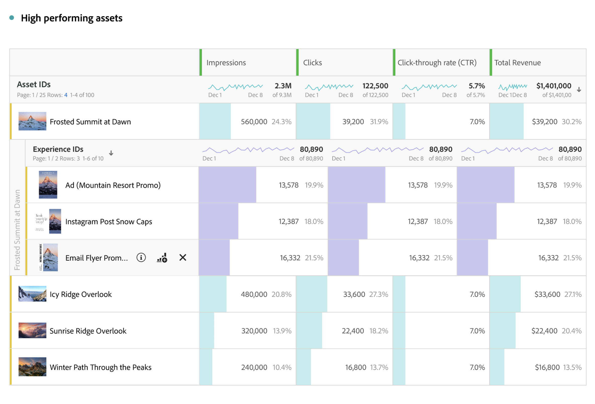

# Content Analytics 보고 개요

[Analysis Workspace](/help/analysis-workspace/home.md)에서 Content Analytics에 대한 보고, 분석 수행 및 인사이트 확보가 가능합니다. 특정 Workspace [템플릿](#template)을 사용할 수 있으므로 관련 콘텐츠 인사이트로 미리 채워진 Workspace 프로젝트에 즉시 액세스할 수 있습니다.

Content Analytics에 대한 보고를 처음부터 시작하려면:

1. Workspace에서 [새 프로젝트를 만들거나](/help/analysis-workspace/build-workspace-project/create-projects.md) [기존 프로젝트를 엽니다](/help/analysis-workspace/build-workspace-project/open-projects.md).
1. Content Analytics 보고를 위해 [데이터 보기](/help/analysis-workspace/c-panels/panels.md#data-view)를 선택해야 합니다. Content Analytics 보고는 Content Analytics에 대해 [구성된](/help/content-analytics/config/configuration.md) 데이터 보기에서만 사용할 수 있습니다.
1. 캔버스에  [자유 형식 테이블](/help/analysis-workspace/visualizations/freeform-table/freeform-table.md) 시각화를 끌어다 놓습니다.
1. [특정 Content Analytics 구성 요소](components.md)와 기타 일반 [구성 요소](/help/components/overview.md)(세그먼트, 날짜 범위, 주석 등)를 사용하여 Content Analytics 인사이트를 빌드합니다.

## 썸네일

프로젝트에서 사용하는 Content Analytics 특정 차원에 따라 자산과 차원에 대한 썸네일이 표시됩니다.

기본적으로 관련 Content Analytics 차원에 대한 썸네일이 표시됩니다. Content Analytics 차원에 대한 썸네일 표시를 구성하려면:

* Content Analytics 차원의 헤더 행 위에 마우스를 가져다 댑니다. 예: **[!UICONTROL 자산 ID]** 또는 **[!UICONTROL 경험 ID]**.
* 을 선택합니다.
* **[!UICONTROL 행 설정]** 팝업에서 **[!UICONTROL 설정]** 아래에서 **[!UICONTROL 썸네일 표시]**&#x200B;를 선택하거나 선택 취소합니다.

## 미리보기

썸네일을 표시하는 Content Analytics 차원의 행에 대해 미리보기 팝업 창을 열 수 있습니다.

다음 세부 정보로 미리보기를 열려면:

* 을 선택합니다. 다음 세부 정보를 확인할 수 있습니다.

  | 경험 미리보기 | 자산 미리보기 |
  |---|---|
  |  |  |
  | 차원의 이름 (예: **[!UICONTROL 경험 ID])** | 자산 차원의 이름 (예: **[!UICONTROL 자산 ID])** |
  | **[!UICONTROL 노출 횟수(전체 기간)]**: 해당 경험에 대한 노출 횟수 | **[!UICONTROL 노출 횟수(전체 시간)]**: 해당 자산에 대한 노출 횟수 |
  | **[!UICONTROL 자산]**: 이 경험에 포함된 자산의 수   **[!UICONTROL 분류]**&#x200B;를 선택해 자산을 검사합니다. | **[!UICONTROL 경험 수]**: 이 자산이 표시된 경험의 수   **[!UICONTROL 분류]**&#x200B;를 선택해 자산을 검사합니다. |
  | **[!UICONTROL 첫 번째 노출]**: 해당 경험의 첫 번째 노출 날짜 | **[!UICONTROL 첫 번째 노출]**: 해당 자산의 첫 번째 노출 날짜 |
  | **[!UICONTROL 가장 최근 노출]**: 해당 경험의 가장 최근 노출 날짜 | **[!UICONTROL 가장 최근 노출]**: 해당 자산의 가장 최근 노출 날짜 |
  | **[!UICONTROL 경험 속성]**: 해당 경험의 [속성](/help/content-analytics/report/components.md#experience-attributes) | **[!UICONTROL 자산 속성]**: 해당 자산의 [속성](/help/content-analytics/report/components.md#asset-attributes) |

## 템플릿

Content Analytics [템플릿](/help/analysis-workspace/templates/use-templates.md)은 어떤 콘텐츠와 콘텐츠 속성이 가장 좋은 성과를 내고 있는지 알 수 있도록 도와줍니다. 템플릿은 [웹 채널 및 참여 사용 사례](/help/analysis-workspace/templates/use-templates.md#web-engagement)의 일부이며 콘텐츠가 세부적으로 어떻게 성과를 내는지 자세히 설명합니다. 개별 자산 또는 특정 속성의 성과를 살펴볼 수 있습니다.

학습한 내용을 바탕으로, 홈 페이지에서 성과가 좋은 자산을 홍보하거나, 성과가 좋은 속성을 포함하도록 특정 세그먼트에 맞춰 콘텐츠를 개인화하거나, 오래된 콘텐츠를 교체하는 등 다양한 작업을 수행할 수 있습니다.

템플릿 사용하려면:

1. 메인 메뉴에서 **[!UICONTROL Workspace]**&#x200B;를 선택합니다.
1. Content Analytics에 구성된 데이터 보기를 선택해야 합니다.
1. 세그먼트(**[!UICONTROL 채널]**&#x200B;의 경우 **[!UICONTROL 웹]**, **[!UICONTROL 사용 사례]**의 경우 **[!UICONTROL 참여도]**)를 검색하거나 사용하여 **[!UICONTROL Content Analytics]** 템플릿을 찾고 선택합니다.
1. **[!UICONTROL 템플릿 사용]**&#x200B;을 선택합니다.
1. **[!UICONTROL 템플릿 설정]**&#x200B;대화 상자의 **[!UICONTROL 전환 지표 선택]** 대화 상자에서 지표를 선택합니다. 예를 들어 **[!UICONTROL 자산 CTR]**.
1. **[!UICONTROL 계속]**&#x200B;을 선택합니다.

[Analysis Workspace](/help/analysis-workspace/home.md)에서 **[!UICONTROL Content Analytics 개요]** 프로젝트가 열립니다. 이 프로젝트는 네 개의 [패널](/help/analysis-workspace/c-panels/panels.md)로 구성되어 있으며, 각 패널은 특정 질문에 답할 수 있는 [자유 형식 테이블](/help/analysis-workspace/visualizations/freeform-table/freeform-table.md)과 [시각화](/help/analysis-workspace/visualizations/freeform-analysis-visualizations.md)를 제공합니다.

* **가장 잘 수행되는 콘텐츠는 무엇입니까?**
이 패널은 어떤 경험과 어떤 자산이 참여와 전환을 촉진하는지 이해하는 데 도움이 됩니다. 경험은 특정 시간에 캡처된 전체 웹 페이지입니다. 경험에는 텍스트와 여러 개의 개별 이미지 자산이 모두 포함될 수 있습니다. 자산은 개별 이미지입니다.

  패널은 다음 시각화로 구성되어 있습니다.

   * **경험**.

     >[!NOTE]
     >
     >이러한 시각화는 Content Analytics 구성에 [경험을 포함](/help/content-analytics/config/guided.md#experience-capture-and-definition)시켰을 때만 표시됩니다.
     > 

      * **경험 CTR**: 경험 CTR을 보여 주는 [요약 변경](/help/analysis-workspace/visualizations/summary-number-change.md) 시각화
      * **상위 전환 경험**: 선택한 전환 지표를 기반으로 상위 전환 경험을 보여 주는 [가로 막대](/help/analysis-workspace/visualizations/horizontal-bar.md) 시각화
      * **최고 성과 경험**: 최고 성과 경험에 대한 [자유 형식 테이블](/help/analysis-workspace/visualizations/freeform-table/freeform-table.md)([썸네일](#thumbnails) 및 [미리보기](#previews) 포함)

   * **자산**

      * **자산 CTR**
: 자산 CTR을 보여 주는 [요약 변경](/help/analysis-workspace/visualizations/summary-number-change.md) 시각화
      * **상위 전환 자산**
: 선택한 전환 지표를 기반으로 상위 전환 자산을 보여 주는 [가로 막대](/help/analysis-workspace/visualizations/horizontal-bar.md) 시각화
      * **최고 성과 자산**
: 최고 성과 자산에 대한 [자유 형식 테이블](/help/analysis-workspace/visualizations/freeform-table/freeform-table.md)([썸네일](#thumbnails) 및 [미리보기](#previews) 포함)
      * **자산 - 조회수와 전환 비교**
: 자산 조회수 대비 전환의 산포도를 보여 주는 [산포도](/help/analysis-workspace/visualizations/scatterplot.md) 시각화

* **어떤 자산 속성이 전환에 가장 큰 영향을 미칩니까?**
Content Analytics는 AI와 생성형 AI를 사용하여 피사체, 장면, 전경색 등 모든 자산 메타데이터를 자동으로 지정합니다. 속성은 자산이나 경험에 포함된 내용을 설명하는 AI 할당 메타데이터 태그입니다. 예: <code>전경색: 빨간색</code> 자동으로 할당되는 속성입니다. 시각화는 자산의 전환에 가장 크게 기여하는 속성을 파악하는 데 도움이 됩니다.

  패널은 다음 시각화로 구성되어 있습니다.

   * **상위 전환 자산 속성**
: 선택한 전환 지표를 기반으로 상위 전환 자산 속성을 보여 주는 [가로 막대](/help/analysis-workspace/visualizations/horizontal-bar.md)
   * **상위 전환 자산 속성과 지난 30일 비교**
: 선택한 전환 지표를 기반으로 지난 30일과 비교하여 상위 전환 자산 속성을 보여 주는 [가로 막대](/help/analysis-workspace/visualizations/horizontal-bar.md) 시각화
   * **상위 전환 자산 속성 데이터**
: 선택한 전환 지표를 기준으로 상위 전환 속성을 보여 주는 [자유 형식 테이블](/help/analysis-workspace/visualizations/freeform-table/freeform-table.md). 테이블에서 행을 선택하여 속성 추세 시각화를 업데이트합니다.
   * **속성 추세**
: 선택한 상위 전환 자산 속성의 속성 추세를 보여 주는 [라인](/help/analysis-workspace/visualizations/line.md) 시각화
   * **자산 전경색**
: 단일 자산 속성 카테고리: 전경색의 항목 성과를 비교하는 예시 [자유 형식 테이블](/help/analysis-workspace/visualizations/freeform-table/freeform-table.md). 이 자산 속성을 다른 자산 속성 카테고리 차원으로 대체할 수 있습니다.

* **어떤 경험 속성이 전환에 가장 큰 영향을 미칩니까?**

  >[!NOTE]
  >
  >이 패널은 Content Analytics 구성에 [경험을 포함](/help/content-analytics/config/guided.md#experience-capture-and-definition)한 경우에만 표시됩니다.
  > 

  자산 속성은 이미지의 시각적 품질에 중점을 두는 반면, 경험 속성은 페이지의 텍스트에 중점을 둡니다. 아래 시각화를 통해 전환에 기여하는 경험 속성을 살펴볼 수 있습니다. 이러한 속성은 AI 및 생성형 AI 모델을 사용하여 자동으로 할당됩니다.

  패널은 다음 시각화로 구성되어 있습니다.

   * **상위 전환 경험 속성**
: 선택한 전환 지표를 기반으로 상위 전환 경험 속성을 보여 주는 [가로 막대](/help/analysis-workspace/visualizations/horizontal-bar.md) 시각화
   * **상위 전환 경험 속성과 지난 30일 비교**
: 선택한 전환 지표를 기반으로 지난 30일과 비교하여 상위 전환 경험 속성을 보여 주는 [가로 막대](/help/analysis-workspace/visualizations/horizontal-bar.md) 시각화
   * **상위 전환 경험 속성 데이터**
: 선택한 전환 지표를 기준으로 상위 전환 경험을 보여 주는 [자유 형식 테이블](/help/analysis-workspace/visualizations/freeform-table/freeform-table.md). 테이블에서 행을 선택하여 라인 시각화를 업데이트합니다.
   * **라인**
: 선택한 상위 전환 경험 속성에 대한 트렌드를 보여 주는 [라인](/help/analysis-workspace/visualizations/line.md) 시각화
   * **경험 키워드**
: 선택한 전환 지표를 기반으로 상위 경험 키워드를 보여 주는 [자유 형식 테이블](/help/analysis-workspace/visualizations/freeform-table/freeform-table.md)

* **자산은 내 사이트의 어디에 표시됩니까?**
사이트에서 가장 많이 조회된 자산의 위치를 자세히 설명하는 자유 형식 테이블 하나로 구성된 패널

  패널은 하나의 시각화로 구성됩니다.

   * **조회수가 가장 많은 자산은 어디에 표시됩니까?**
어떤 자산이든 차원별로 분류하면 해당 이미지가 나타나는 위치를 더 잘 이해하는 데 도움이 됩니다.

     예시에서 [자유 형식 테이블](/help/analysis-workspace/visualizations/freeform-table/freeform-table.md)([썸네일](#thumbnails) 및 [미리보기](#previews) 포함)에서는 **[!UICONTROL 자산 인식 ID]**&#x200B;가 [!UICONTROL 자산 ID] 대신 사용됩니다. 때로는 동일한 이미지가 사이트에서 다른 이미지 URL과 중복될 수 있습니다. [!UICONTROL 자산 인식 ID] 속성은 이러한 중복 항목을 단일 ID로 그룹화하는 데 도움이 됩니다.

     자산은 페이지에서 변경될 수 있으므로 각 자산은 **[!UICONTROL 경험 ID]**&#x200B;로 분류되어 해당 자산이 표시된 페이지 버전을 식별합니다. [!UICONTROL 경험 ID]를 사이트에서 자산의 위치를 파악하는 데 도움이 되는 다른 차원으로 대체할 수 있습니다. 예를 들어 [!UICONTROL 페이지 이름], [!UICONTROL 페이지 URL] 또는 [!UICONTROL 사이트 섹션]입니다.

     또한 [!UICONTROL 자산 인식 ID]를 [!UICONTROL 자산 ID]로 바꿔서 특정 이미지 URL이 참조되는 위치에 대한 기록을 얻을 수 있습니다.

>[!MORELIKETHIS]
>
>[Content Analytics 구성 요소](components.md)
>>[템플릿 사용](/help/analysis-workspace/templates/use-templates.md#web-engagement)
>
