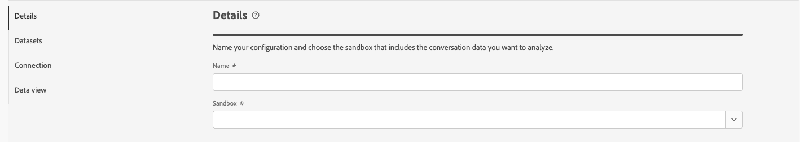
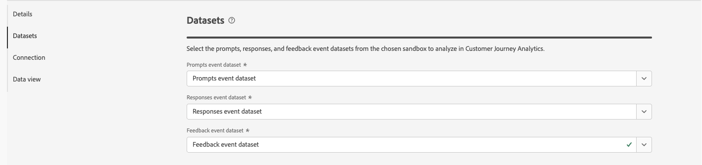

# 구성 만들기 또는 편집

대화 인사이트를 사용하면 고객에게 제공하는 에이전트 경험에서 대화를 분석할 수 있습니다. 이러한 에이전트 경험은 대형 언어 모델(LLM) 또는 사람의 대화를 기반으로 할 수 있습니다. 예를 들어, 고객 또는 콜 센터 대본과 상호 작용하는 챗봇입니다.
대화 인사이트를 통해 에이전트가 실제 사용자 결과에 미치는 영향을 이해할 수 있습니다.

Conversation Insights 구성 인터페이스를 통해 구성 및 관련 아티팩트(연결, 데이터 보기 등)를 빠르게 만들거나 편집할 수 있습니다.

대화 통찰력 구성을 만들거나 편집할 때 프롬프트, 응답 및 피드백 데이터가 포함된 샌드박스 및 이벤트 데이터 세트를 지정합니다. 이러한 데이터 세트를 추가할 Customer Journey Analytics 연결도 선택합니다. 대화 통찰력 지표 및 차원을 추가할 데이터 보기.

시스템 관리자만 대화 통찰력 구성을 만들거나 편집할 수 있습니다.

[대화 통찰력 구성 인터페이스](./conversation-insights-manage.md)에서 구성을 만들거나 편집합니다.

## 누락된 혼합 데이터 세트 복원

구성을 편집하고 구성에 대해 생성된 혼합 데이터 세트가 더 이상 존재하지 않는 경우 **[!UICONTROL 복원]**&#x200B;을 선택하여 혼합 데이터 세트를 다시 생성합니다.

## 구성 단계

각 구성의 경우:

1. **[!UICONTROL 세부 정보]** 섹션에서 다음 정보를 지정하십시오.

   

   | 필드 | 설명 |
   |---------|----------|
   | **[!UICONTROL 이름]** | 구성의 이름을 지정합니다. |
   | **[!UICONTROL 샌드박스]** | 연결에 추가하려는 프롬프트, 응답 및 피드백 이벤트 데이터 세트가 포함된 Experience Platform 샌드박스를 선택합니다. |

1. **[!UICONTROL 데이터 집합]** 섹션에서 다음 정보를 지정하십시오.

   

   | 필드 | 설명 |
   |---------|----------|
   | **[!UICONTROL 이벤트 데이터 집합을 묻는 메시지 표시]** | 프롬프트 이벤트 데이터를 포함하는 데이터 세트를 선택합니다. |
   | **[!UICONTROL 응답 이벤트 데이터 세트]** | 응답 이벤트 데이터를 포함하는 데이터 세트를 선택합니다. |
   | **[!UICONTROL 피드백 이벤트 데이터 세트]** | 피드백 이벤트 데이터가 포함된 데이터 세트를 선택합니다. |

1. **[!UICONTROL 연결]** 섹션에서 연결이 이미 구성되지 않은 경우 **[!UICONTROL 연결 선택]**&#x200B;을 사용하여 연결을 선택하십시오.

   

   이미 연결이 구성된 경우  **[!UICONTROL 편집]**&#x200B;을 선택하여 다른 연결을 선택하십시오.

   

   **[!UICONTROL 연결 선택]** 대화 상자에서:

   

   1. 프롬프트, 응답 및 피드백 이벤트 데이터 세트를 추가할 연결 옆에 있는 확인란을 선택합니다.
   1. **[!UICONTROL 연결 사용]**&#x200B;을 선택합니다.

   * 선택할 연결 목록에서 검색하려면  필드를 사용하십시오.
   * 테이블에 표시할 열을 구성하려면 을 선택합니다. **[!UICONTROL 표 사용자 지정]** 대화 상자에서 표시할 열을 선택합니다. 그런 다음 **[!UICONTROL 적용]**&#x200B;을 선택합니다.

1. **[!UICONTROL 데이터 보기]** 섹션에서 데이터 보기가 이미 구성되어 있지 않으면 **[!UICONTROL 데이터 보기 선택]**&#x200B;을 선택하여 데이터 보기를 선택하십시오.

   데이터 보기가 이미 구성된 경우  **[!UICONTROL 데이터 보기 선택 편집]**&#x200B;을 선택하여 데이터 보기 선택을 다시 구성하십시오.

   **[!UICONTROL 여러 데이터 보기 선택]** 대화 상자에서:

   

   1. 대화 통찰력 구성에 사용할 데이터 보기를 하나 이상 선택합니다.

   1. 데이터 보기를 사용하려면 **[!UICONTROL 데이터 보기 사용]**&#x200B;을 선택하세요. 취소하려면 취소를 선택합니다.

   * 선택할 데이터 보기 목록에서 검색하려면  필드를 사용하십시오.
   * 테이블에 표시할 열을 구성하려면 을 선택합니다. **[!UICONTROL 표 사용자 지정]** 대화 상자에서 표시할 열을 선택합니다. 그런 다음 **[!UICONTROL 적용]**&#x200B;을 선택합니다.

1. 구성을 완료하려면

   * 만들어지지 않은 새 구성에 대해 **[!UICONTROL 삭제]**&#x200B;를 선택하십시오.

   * 저장하려고 하지만 아티팩트를 만들지 않으려는 새 구성에 대해 **[!UICONTROL 나중에 저장]**&#x200B;을 선택합니다(예: 데이터 보기에 대한 업데이트). 나중에 구성을 다시 방문하여 실제 구성 만들기를 완료할 수 있습니다.

   * 새 구성을 만들려면 **[!UICONTROL 만들기]**&#x200B;를 선택하십시오.

   * **[!UICONTROL 저장]**&#x200B;을 선택하여 수정된 구성을 저장합니다.

   * 구성에 대한 새 혼합 데이터 집합을 다시 생성하려면 구성을 복원하려면 **[!UICONTROL 복원]**&#x200B;을(를) 선택하십시오.

   * 구성에 대한 변경 내용을 무시하려면 **[!UICONTROL 종료]**&#x200B;를 선택하십시오.

## 데이터 보기 확인

[구성 단계](#configuration-steps)에서 구성한 데이터 보기는 [데이터 보기](/help/data-views/manage-dataviews.md)에서 **[!UICONTROL 통합]**&#x200B;에 대한 값으로 **[!UICONTROL 대화 인사이트]**&#x200B;를 가집니다.

구성된 각 데이터 보기의 경우:

* **컨테이너**: [컨테이너 탭](/help/data-views/create-dataview.md#containers)에 새 **[!UICONTROL 컨테이너 이름]**: **[!UICONTROL 대화]**(추가 **[!UICONTROL 시스템]** **[!UICONTROL 컨테이너 형식]**(으)로 **[!UICONTROL 표시 이름]**: **[!UICONTROL 컨테이너]** 포함).
* **구성 요소**: 추가 스키마 필드 폴더가 표시됩니다. 예: agentExperience 및 conversation. 또한 다음 구성 요소가 자동으로 추가됩니다.

  | 지표 | 스키마 데이터 유형 | 스키마 경로 |
  |---|---|---|
  | 고객 피드백 | 문자열 | eventType |
  | 긍정적 감정 | 문자열 | 파생 필드 |
  | 추천 항목 | 문자열 | eventType |
  | 회전 | 문자열 | eventType |

  | 차원 | 스키마 데이터 유형 | 스키마 경로 |
  |---|---|---|
  | 에이전트 ID | 문자열 | `agenticExperience.agents.agentID` |
  | 에이전트 이름 | 문자열 | `agenticExperience.agents.name` |
  | Concierge 이름 | 문자열 | `agenticExperience.name` |
  | Concierge 버전 | 문자열 | `agenticExperience.version` |
  | 대화 ID | 문자열 | `conversation.conversationID` |
  | 대화 이름 | 문자열 | `conversation.conversationName` |
  | 대화 신호 이름 | 문자열 | `conversation.signals.name` |
  | 대화 요약 부울 값 | 부울 | `conversation.signals.values.booleanValue` |
  | 대화 요약 신뢰도 | 더블 | `conversation.signals.values.confidence` |
  | 대화 요약 메타데이터 키 | 문자열 | `conversation.signals.values.metadata.key` |
  | 대화 요약 숫자 값 | 더블 | `conversation.signals.values.numberValue` |
  | 대화 요약 한정자 | 문자열 | `conversation.signals.values.qualifiers` |
  | 대화 톤 신호 | 문자열 | `conversation.signals.attributes.tones.values` |
  | 환경 | 문자열 | `agenticExperience.environment` |
  | 피드백 분류 | 문자열 | 파생 필드 |
  | 피드백 평가 분류 | 문자열 | `conversation.feedback.rating.classification` |
  | 피드백 섹션 목적 | 문자열 | `conversation.feedback.raw.purpose` |
  | 피드백 소스 | 문자열 | `conversation.feedback.source` |
  | 구문 | 문자열 | `conversation.signals.attributes.subjects.values.phrase` |
  | 응답 원시 텍스트 | 문자열 | `conversation.response.raw.text` |
  | 응답 소스 | 문자열 | `conversation.response.source` |
  | 감정 분류 | 문자열 | 파생 필드 |
  | 스킬 이름 | 문자열 | `agenticExperience.agents.skills.name` |
  | 스킬 ID | 문자열 | `agenticExperience.agents.skills.version` |
  | 값 | 문자열 | `agenticExperience.agents.skills.parameters.value` |

<!--

1. In the Data views dialog, select the checkbox next to one or more data views that you want to use when analyzing Experience Platform audience data within Analysis Workspace. These data views are automatically configured with Experience Platform audience data for reporting.

1. Select **[!UICONTROL Use data views]**.

1. Select **[!UICONTROL Create]** to create the configuration.

   >[!IMPORTANT]
   >
   >Because the profile dataset is updated once per day, audiences are available in Customer Journey Analytics data views on the day after you create the audience analysis configuration.

1. After 24 hours, [view audience dimensions in the data view](#view-audience-dimensions-in-the-data-view) to verify that the audience dimensions are available in the data views that you selected. 

 
## View audience dimensions in the data view

After you [create an audience analysis configuration](#create-an-audience-analysis-configuration), you can verify that audience dimensions were added to the data views that you selected during the configuration.

To view audience dimensions in the data view, you must be a product profile administrator for the product profile that the data view is assigned to. For more information, see [Access control](/help/technotes/access-control.md).

To view the audience analysis dimensions in the data view:

1. In Customer Journey Analytics, select **[!UICONTROL Data Management]** > **[!UICONTROL Data views]**.

1. In the **[!UICONTROL Dimensions]** section, the following dimensions should now be available:

   * **[!UICONTROL Audience Name]**

   * **[!UICONTROL Audience Origin]**

   * **[!UICONTROL Exited Audience Origin]**

   * **[!UICONTROL Exited Audience Name]**

   Note that each of these dimensions was added to the profile dataset that is associated with the merge policy that you selected during the audience analysis configuration, and each was added to the new lookup dataset that was created.

   

1. Use the audience analysis dimensions in Analysis Workspace. 

   Users who have access to use the data view in Analysis Workspace can now see the new dimensions and use them in their analyses. For information about how to use the audience analysis dimensions in Analysis Workspace, see [Analyze Experience Platform audiences in Customer Journey Analytics](/help/connections/audience-analysis/analyze-audiences.md).

-->