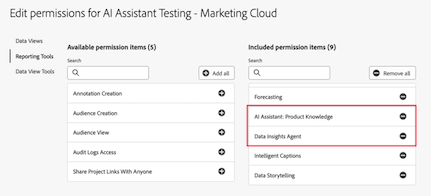

# Data Insights 에이전트를 사용하여 데이터 시각화

>[!AVAILABILITY]
>
>Data Insights 에이전트는 적격 고객에게 한정된 기간 동안 제공됩니다. Data Insights 에이전트에 대한 액세스는 2025년 11월 30일에 종료됩니다. 중단 없이 Data Insights 에이전트를 계속 사용하려면 Adobe 계정 담당자에게 문의하여 Data Insights 에이전트 라이선스에 대해 자세히 알아보십시오.

Customer Journey Analytics의 [AI 어시스턴트](/help/ai-assistant.md)에서 액세스할 수 있는 Data Insights 에이전트는 데이터에 대한 질문에 빠르고 효율적으로 답변하는 생성형 AI 대화 에이전트입니다. 데이터 보기의 구성 요소와 실제 데이터를 사용하여 Analysis Workspace에서 관련 시각화를 빌드합니다.

Data Insights 에이전트를 사용하여 Analysis Workspace에서 데이터 중심 질문에 답하면 Analysis Workspace에서 시각화를 수작업으로 빌드하고 데이터 보기 구성 요소에 익숙해지는 데 드는 수많은 시간을 절약할 수 있습니다.

## 범위 내 기능과 범위 외 기능

| 기능 | 범위 내 | 범위 외 |
| --- | --- | --- |
| **시각화 유형** | <ul><li>라인</li><li>다중 라인</li><li>자유 형식 테이블</li><li>막대</li><li>도넛</li><li>요약 번호</li></ul> | <ul><li>플로우</li><li>폴아웃</li><li>코호트 테이블</li><li>영역, 스택 영역</li><li>스택 막대</li><li>글머리 기호</li><li>콤보</li><li>히스토그램</li><li>가로 막대, 스택 가로 막대</li><li>주요 지표 요약</li><li>분산</li><li>요약 변경</li><li>텍스트</li><li>트리맵</li><li>벤</li><li>가이드 분석: 활성 성장, 전환 추세, 참여, 첫 사용 영향, 빈도, 유입 경로, 순 성장, 출시 영향, 유지, 타임라인, 트렌드</li></ul> |
| **Workspace 액션 및 에이전트 기능** | <ul><li>시각화 빌드 및 업데이트
자유 형식 테이블과 관련 시각화(라인, 막대, 도넛 등)를 생성합니다.
예: *2월부터 5월까지 SKU 전체의 수익은 얼마입니까?*
</li><li>후속 질문하기
이전 프롬프트의 컨텍스트에서 프롬프트에 응답합니다. 예:
 <ul><li>프롬프트 1: *3월의 트렌드 이벤트.*</li><li>프롬프트 2: *대신 3월부터 4월까지의 데이터를 보여 주십시오*</li></ul> </li><li>범위 외 신속한 감지
*이 프로젝트 내보내기*&#x200B;와 같이 범위를 벗어난 프롬프트를 제출하면 Data Insights 에이전트는 질문이 범위를 벗어났음을 알려 줍니다.
</li></ul> | <ul><li>공유</li><li>내보내기</li><li>다운로드</li><li>사용자 환경 설정 관리</li><li>데이터 보기 관리</li><li>Analytics 대시보드 앱</li><li>속성</li><li>인라인 요약 또는 응답
Data Insights 에이전트는 사용자 프롬프트에 대한 요약 답변을 채팅 레일에 직접 응답할 수 없습니다. 범위에 포함되지 않는 프롬프트의 예로는 *지난번 질문에서 얻은 인사이트를 요약해 주십시오.* 또는 *라인 시각화의 주요 내용을 요약해 주십시오.* 등이 있습니다.
</li></ul> |
| **질문 명료화** | Data Insights 에이전트가 답변하기에 충분한 맥락이 없거나 너무 일반적인 질문을 하면 Data Insights 에이전트는 명확한 질문이나 제안된 옵션으로 응답합니다. 
다음 질문 명료화는 구성 요소 관련 질문의 예입니다.
<ul><li>지표: *어떤 “수익” 지표를 말씀하시는 겁니까?*</li><li>차원: *아래 “지역” 중 어느 지역에 집중하고 싶으십니까?*</li><li>세그먼트: *어떤 “계정” 세그먼트를 적용하고 싶으십니까?*</li><li>날짜 범위: *“지난 달”이란 지난 한 달을 의미하는 것입니까, 아니면 지난 30일을 의미하는 겁니까?*</li></ul>
다음 질문 명료화는 차원 항목과 관련된 질문의 예입니다.
 <ul><li>어떤 “매장 이름”을 말씀하시는 겁니까? (예: 매장 #5274, 매장 #2949 등)</li></ul> | 질문 명료화는 구성 요소와 차원 항목으로 제한됩니다. Data Insights 에이전트는 데이터 보기, 시각화, 데이터 세분화, 비교 및 범위와 같은 사항을 명확히 할 수 없습니다. 확인 질문을 사용할 수 없는 경우 상담원은 기본적으로 사용자가 가장 궁금해하는 내용을 묻습니다. 예상하지 못한 시각화 또는 데이터 세분화가 반환될 경우, 후속 질문을 하거나 시각화 및 데이터를 조정할 수 있습니다. |
| **데이터 검증 가능성 및 정확성** | 생성된 자유 형식 테이블과 데이터 시각화를 통해 데이터 검증 가능성과 정확성을 확인할 수 있습니다. 
예를 들어 사용자가 Data Insights 에이전트에 *지난달 트렌드 주문*&#x200B;을 묻는 경우 새로 생성된 패널, 데이터 시각화 및 자유 형식 테이블에서 올바른 지표(“주문”)와 기간(“지난 달”)이 선택되었는지 확인할 수 있습니다. | Data Insights 에이전트는 어떤 구성 요소나 시각화가 추가되었는지에 대해서는 알려 주지 않습니다.
 |
| **피드백 메커니즘** | <ul><li>좋아요</li><li>싫어요</li><li>플래그</li></ul> |  |

## Data Insights 에이전트에 대한 액세스 관리 {#manage-access}

<!-- markdownlint-disable MD034 -->

>[!CONTEXTUALHELP]
>id="cja-enable-data-insights-data-view"
>title="Data Insights Agent에 사용"
>abstract="이 옵션을 사용하면 Data Insights Agent에서 사용할 수 있도록 이 데이터 보기를 사용할 수 있습니다. Data Insights Agent은 Customer Journey Analytics의 AI Assistant에서 액세스할 수 있는 생성 AI 대화 에이전트입니다. 텍스트 프롬프트를 통해 데이터를 빠르게 분석하는 데 도움이 됩니다. 데이터 보기의 구성 요소와 실제 데이터를 사용하여 Analysis Workspace에서 관련 시각화를 빌드합니다."

<!-- markdownlint-enable MD034 -->

다음 매개변수는 Customer Journey Analytics의 Data Insights 에이전트에 대한 액세스를 제어합니다.

* **솔루션 액세스**: Data Insights 에이전트는 2025년 11월 30일까지 제한된 액세스 프로그램의 일부로 모든 Customer Journey Analytics 고객이 이용할 수 있습니다. Adobe Analytics에서는 사용할 수 없습니다.

* **계약적 액세스**: AI 어시스턴트에서 Data Insights 에이전트를 사용할 수 없는 경우, 조직의 관리자나 Adobe 계정 팀에게 문의하십시오. 조직에서 Data Insights 에이전트를 사용하려면 먼저 특정 생성형 AI 관련 법적 조건에 동의해야 합니다.

* **권한**: 사용자가 Data Insights 에이전트에 액세스하려면 [!UICONTROL Adobe Admin Console]에서 필수 권한이 부여되어야 합니다.

  권한을 부여하려면 [제품 프로필 관리자](https://helpx.adobe.com/kr/enterprise/using/manage-product-profiles.html)가 [!UICONTROL Admin Console]에서 다음 단계를 수행해야 합니다.
   1. **[!UICONTROL Admin Console]**&#x200B;에서 **[!UICONTROL 제품]** 탭을 선택하여 **[!UICONTROL 모든 제품 및 서비스]** 페이지를 엽니다.
   1. **[!UICONTROL Customer Journey Analytics]**&#x200B;를 선택합니다.
   1. **[!UICONTROL 제품 프로필]** 탭에서 [!UICONTROL AI 어시스턴트: 제품 지식]에 대한 액세스를 제공하려는 제품 프로필의 제목을 선택합니다.
   1. 특정 제품 프로필에서 **[!UICONTROL 권한]** 탭을 선택합니다.

      

   1. 제공된 테이블의 **[!UICONTROL 보고 도구]** 행에서  아이콘을 선택합니다.
   1. **[!UICONTROL AI 어시스턴트: 제품 지식]**&#x200B;를 스크롤하여 찾거나 검색한 후 해당 권한 옆에 있는 더하기 아이콘()을 선택합니다.

      **[!UICONTROL AI 어시스턴트: 제품 지식]** 권한이 **[!UICONTROL 포함된 권한 항목]** 열에 추가됩니다.

      .

   1. **[!UICONTROL 데이터 보기 도구]** 탭을 선택한 다음 **[!UICONTROL Data Insights 에이전트]** 권한 옆에 있는 더하기 아이콘()을 선택합니다.

      **[!UICONTROL Data Insights 에이전트]** 권한이 **[!UICONTROL 포함된 권한 항목]** 열에 추가되었습니다.

      .

   1. Data Insights 에이전트에 대해 활성화하려는 데이터 보기를 선택하려면 **[!UICONTROL 데이터 보기]** 탭을 선택합니다.

      >[!IMPORTANT]
      >
      >이 데이터 보기를 활성화할 때 다음 사항을 고려하십시오.
      >* IMS 조직당 최대 50개의 데이터 보기를 활성화할 수 있습니다. 특정 조직의 모든 제품 프로필에서 50개가 넘는 데이터 보기를 활성화하는 경우, Data Insights 에이전트는 가장 많이 사용되는 50개의 데이터 보기를 사용합니다.
      >* Data Insights 에이전트는 Admin Console에서 데이터 보기를 활성화한 당일에 포함된 데이터 보기를 참조할 수 있습니다.

   1. 활성화하려는 데이터 보기를 검색하거나 스크롤한 다음 각 데이터 보기 이름 옆에 있는 더하기 아이콘()을 선택합니다.

      추가하는 각 데이터 보기는 **[!UICONTROL 포함된 권한 항목]** 열에 표시됩니다.

      .

   1. 권한을 저장하려면 **[!UICONTROL 저장]**&#x200B;을 선택합니다.

  액세스 제어에 대한 자세한 내용은 [액세스 제어](/help/technotes/access-control.md#access-control)를 참조하십시오.

## AI 어시스턴트에서 Data Insights 에이전트 액세스

1. [experience.adobe.com](https://experience.adobe.com/)으로 이동하여 Adobe ID로 로그인합니다.

2. Experience Cloud 홈에서 **Customer Journey Analytics**&#x200B;를 선택합니다.

3. 프로젝트 페이지 상단 배너에서 **[!UICONTROL 빈 프로젝트]**&#x200B;를 선택하여 새로운 빈 프로젝트를 엽니다.

4. [Customer Journey Analytics에서 Data Insights 에이전트에 대한 액세스 관리](#manage-access-to-data-insights-agent-in-customer-journey-analytics)에 설명된 대로, 패널에 대해 선택한 데이터 보기가 Data Insights 에이전트와 함께 사용하도록 활성화된 데이터 보기인지 확인하십시오.

5. 페이지 오른쪽 상단에 있는 AI 어시스턴트 채팅 아이콘을 선택합니다.

   채팅 아이콘이 보이지 않으면 관리자에게 문의하여 Admin Console에서 다음 기능을 활성화합니다.

   * 보고 도구: **[!UICONTROL AI 어시스턴트: 제품 지식]**

   * 데이터 보기 도구: **[!UICONTROL Data Insights 에이전트]**

   자세한 내용은 [Customer Journey Analytics에서 Data Insights Agent에 대한 액세스 관리](#manage-access-to-data-insights-agent-in-customer-journey-analytics)를 참조하십시오.

   

6. 페이지 하단의 **[!UICONTROL Customer Journey Analytics에 대해 문의]** 대화 상자에서 Data Insights 에이전트를 사용하여 데이터 시각화에 대해 질문합니다.

   자세한 내용은 다음 예제를 참조하십시오.

### 예제 1

예를 들어 귀하의 비즈니스가 7월에 받은 주문에 관심이 있다고 가정해 보겠습니다.

**프롬프트:** *“7월의 트렌드 주문”*&#x200B;을 입력합니다.

**응답:** Data Insights 에이전트는 지표와 구성 요소를 포함한 데이터 보기의 데이터를 살펴보고 인사이트를 수집합니다. 프롬프트를 데이터 범위 내에서 올바른 차원과 지표로 변환합니다.

보시다시피, 7월 주문을 표시하기 위해 자동으로 선 그래프와 자유 형식 테이블을 생성했습니다.

### 예제 2

다음으로, 지역별로 수익을 비교하려고 합니다.

**프롬프트:** 프롬프트 창에 *“지역별 수익 표시”*&#x200B;를 입력합니다.

**응답:** Data Insights 에이전트는 “지역”이라는 말이 “고객 지역”을 의미한다는 것을 지능적으로 이해합니다. 지역별 수익을 가장 잘 보여 주는 막대형 차트를 생성합니다.

### 예제 3

다음으로, 지역별 수익을 이해하는 것 외에도 지역별 이익에 대한 데이터도 확인하고 싶을 것입니다. 이전 프롬프트를 반복하는 대신 Data Insights 에이전트에게 최근 시각화 및 자유 형식 테이블을 업데이트하도록 요청할 수 있습니다.

**프롬프트:** 프롬프트 창에 *“수익 추가”*&#x200B;를 입력합니다.

**응답:** **[!UICONTROL 막대]** 그래프는 여전히 가장 간결한 답변을 제공하지만 수익 지표는 자유 형식 테이블에 열로 추가되었습니다.

### 예제 4

마지막으로 제품 카테고리별 매출을 살펴보겠습니다.

**프롬프트:** 프롬프트 창에 *“제품 카테고리별 수익 비율”*&#x200B;을 입력합니다.

**응답:** 다시 한번, Data Insights 에이전트는 질문에 답하기 위해 가장 적절한 시각화, 이 경우에는 **[!UICONTROL 도넛]** 시각화를 선택합니다.

## Experience Cloud 애플리케이션에서 Data Insights Agent 액세스

Adobe Experience Platform Agent Orchestrator을 사용하면 Adobe Journey Optimizer 및 Real-Time CDP과 같은 여러 Adobe Experience Cloud 애플리케이션에서 Data Insights Agent의 기능에 액세스할 수 있습니다.

Agent Orchestrator은 요청을 해석하고 필요한 전문 에이전트를 결정하고 올바른 응답을 제공하도록 조정합니다. 다중 전환 상호 작용 간의 컨텍스트를 추적하므로 자연스럽게 이전 쿼리를 빌드할 수 있습니다.

자세한 내용은 [Adobe Experience Platform Agent Orchestrator](http://www.adobe.com/go/agent-orchestrator-home)을 참조하세요.

## 데이터 시각화 프롬프트 예시

다음은 일반적인 프롬프트와 Data Insights 에이전트가 해당 프롬프트에 응답하는 데 사용하는 시각화의 몇 가지 예입니다.

| 예시 프롬프트 | 예상 시각화 |
| --- | --- |
| [월별] 이익 보기 | 라인
기본적으로 특정 시간 범위 내의 트렌드나 지표를 요청하면 라인 시각화가 반환됩니다. |
| [월별] 트렌드 주문 | 라인 |
| [월별] 지역별 수익 보기 | 막대 |
| 제품 카테고리별 매출 점유율 | 도넛 |
| 1월부터 5월까지 일별 주문 | 막대 |
| 3월부터 6월까지 성별 주문 보기 | 막대 |
| 2월부터 5월까지 SKU 전체의 수익은 얼마입니까? | 막대 |
| [월별] 매장명별 매출 | 막대 |
| [월별] 수익이 가장 높았던 상위 10개 SKU는 무엇입니까? | 막대 |
| 연간 월별 구매 비율 | 도넛 |
| [월별] 총 이익 | 요약 번호
특정 시간 범위에 걸친 지표의 “전체”를 요청하면 요약 번호 시각화가 반환되어야 합니다. |

## 프롬프트 모범 사례

Data Insights 에이전트는 각 사용자 프롬프트에서 제공하는 컨텍스트를 처리하고 자유 형식 테이블에서 가장 적절한 시각화 및 구성 요소로 지능적으로 응답하려고 합니다.

응답은 프롬프트에 사용된 특정 단어와 구문에 따라 달라질 수 있으며, 언어의 미세한 변화는 다른 결과를 초래할 수 있습니다.

최상의 결과를 얻으려면 다음 지침을 고려해야 합니다.

* **구체적으로 말합니다.** 응답을 좁히기 위해 정확한 용어를 포함합니다. 다음은 구체적인 프롬프트의 예입니다. “캘리포니아의 지난달 매출”

* **명확한 지표와 차원, 세그먼트를 사용합니다.** 구체적인 지표(예: “수익”), 차원(예: “웹 사이트 이름”), 세그먼트(예: “iPhone 사용자”), 날짜 범위(예: “지난 3개월”)를 추가하면 Data Insights 에이전트가 올바른 데이터에 집중하는 데 도움이 됩니다.

* **직접적인 질문을 합니다.** 질문을 직접적으로 표현하면 Data Insights 에이전트가 명확하고 관련성 있는 인사이트를 더 쉽게 제공할 수 있습니다. 다음은 프롬프트에서 직접적인 질문을 하는 예입니다. “올해 제품 카테고리별 평균 매출은 얼마입니까?”

다음 예시 용어 및 구문 테이블을 검토하여 Data Insights 에이전트를 통해 프롬프트에서 사용할 수 있으며, 예상할 수 있는 응답 유형을 확인합니다.

이 예시들은 특정 단어나 구조가 Data Insight 에이전트의 출력에 어떻게 영향을 미치는지 이해하고, 더 정확하고 가치 있는 인사이트를 얻는 데 도움이 되도록 설계되었습니다. Data Insights 에이전트는 생성형 AI를 사용하므로 유사한 프롬프트에서도 시각화나 선택한 데이터가 약간씩 다를 수 있습니다.

| 원하는 결과 | 예시 용어 및 구문 |
| --- | --- |
| 요약 번호 시각화 | <ul><li>합계</li></ul> |
| 구성 요소 비교 | <ul><li>비교</li><li>및</li><li>대비</li><li>주별</li><li>월별</li><li>분기별</li><li>전년 대비</li></ul> |
| 도넛 시각화 | <ul><li>비율</li><li>점유율</li><li>분포</li><li>백분율</li><li>기여도</li><li>부분</li><li>부분</li></ul> |
| 라인 시각화 | <ul><li>트렌드</li><li>[시간 범위]의 [지표]</li></ul> |
| 막대 시각화 | <ul><li>[차원]별 [지표]</li></ul> |

<!--

## Beta testing expectations and requested feedback

After posing each question, carefully review the assistant's provided answer. It's crucial to evaluate the generated visualizations comprehensively before providing feedback. 

Consider the following when evaluating a response from Data Insights Agent: 

* Chat rail response or template: Evaluate the textual response provided. Is the response appropriate given the context of your prompt? 

* Visualization/chart: Evaluate the visualization. Is it the appropriate or expected visualization for your question, or would you have expected a different visualization?  

* Freeform table: Evaluate the freeform table. Is the freeform table data correct? Is it breaking down data where requested? Are the applied segments those that you requested or expected? 

* Error Message / Out-of-Scope: If a generic error message is given stating the question is out of scope, provide feedback on whether you think the out-of-scope message is appropriate, given your prompt. Was your prompt actually in scope? 

**For every response, give a thumbs up or thumbs down, based on the response.**

Following the thumbs up or thumbs down selection, please make a selection for the relevant multi-select feedback boxes. If you want to provide additional feedback, add notes in the open text box.

## Questions and Contact

* Send questions and feedback in the Beta Slack channel: #data-insights-agent-in-cja-beta

-->

## 구성 모범 사례

다음은 Customer Journey Analytics 구성(데이터 보기, 계산된 지표, 세그먼트 등)에 대한 모범 사례입니다. 이를 통해 Data Insights 에이전트가 올바른 구성 요소를 식별하고 추가 정보를 위한 프롬프트 없이 더 명확한 답변을 제공할 수 있습니다.

* **필요한 구성 요소의 균형을 조정합니다**. 데이터 보기에 데이터 세트의 모든 필드를 지표나 차원 구성 요소로 추가하지 마십시오. 특히 분석에 사용하지 않을 필드는 제외해야 합니다. 반면, 분석에 필요하다고 예상되는 필드만으로 엄격히 제한하지 마십시오. 너무 제한적인 데이터 보기는 분석 유연성과 Data Insights 에이전트의 기능을 저하시킬 수 있습니다.
* **항상 친숙한 표시 이름을 사용합니다**. 데이터 보기에서 지표나 차원 구성 요소로 정의되는 모든 필드에 친숙한 구성 요소 이름을 지정하십시오. 특히 Adobe Analytics 소스 커넥터 데이터 세트의 필드는 친숙한 이름으로 변경하는 프로세스를 거쳐야 합니다. 이러한 필드는 일반적으로 `eVar41`, `prop25`와 같은 친숙하지 않고 식별하기 어려운 이름을 가지고 있습니다.
* **구분 가능한 이름을 사용합니다**. 데이터 보기에서 동일한 필드를 지표와 차원 구성 요소 모두로 사용하는 경우에는 이름을 구분해서 지정하는 것이 특히 중요합니다. 또는 동일한 유형의 여러 구성 요소(예: 두 개의 서로 다른 지표)에 같은 필드를 사용하고 각 구성 요소 설정이 서로 다른 경우, 구분이 더욱 중요합니다.
* **구성 요소 이름 지정 규칙을 사용합니다**. 구성 요소 이름 지정 규칙을 사용하여 구성 요소를 그룹화할 수 있습니다. 예를 들어 **[!UICONTROL 주문 | 제품]** 및 **[!UICONTROL 주문 | 고객]**&#x200B;와 같은 방식으로 데이터에 존재할 수 있는 다양한 주문 관련 지표를 구분할 수 있습니다.
* **데이터 사전을 사용합니다**. 데이터 사전에 구성 요소에 대한 설명 및 관련 데이터를 추가합니다. 현재 Data Insights 에이전트는 데이터 사전의 설명이나 태그를 활용하지 않지만 향후에는 사용될 가능성이 있습니다.
* **승인된 계산된 지표를 사용합니다**. 데이터 보기에서 사용하는 계산된 지표는 승인된 항목만 포함하고 실험적인 계산된 지표는 사용하지 않는 프로세스에 동의합니다.
* **필요한 세그먼트를 공유합니다**. Data Insights 에이전트 프롬프트에 필요한 세그먼트를 공유하고 표시해야 합니다.
* **데이터 보기 전반에서 구성 요소 이름을 표준화합니다**. 여러 데이터 보기에서 동일한 필드를 구성 요소로 사용할 경우, 해당 구성 요소에 대해 친숙한 이름과 식별자를 하나씩 사용해야 합니다. 단일 이름 및 식별자를 사용할 경우, Data Insights 에이전트가 데이터 보기를 전환할 때도 컨텍스트를 유지할 수 있습니다.

>[!MORELIKETHIS]
>
>[구성 요소 설정](/help/data-views/component-settings/overview.md)
>>[데이터 사전 ](/help/components/data-dictionary/data-dictionary-overview.md)
>>[계산된 지표 승인](/help/components/calc-metrics/cm-workflow/cm-approving.md)
>>[세그먼트 공유](/help/components/segments/seg-share.md)
>
