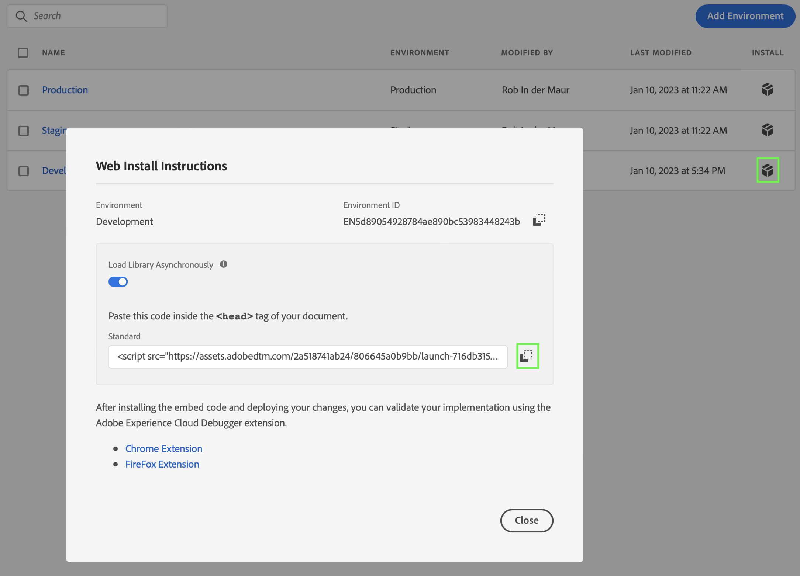

# 웹 SDK을 통해 데이터 수집

이 빠른 시작 안내서에서는 Adobe Experience Platform Web SDK 및 Edge Network를 사용하여 웹 사이트 추적 데이터를 Adobe Experience Platform으로 직접 수집한 다음 Customer Journey Analytics에서 해당 데이터를 사용하는 방법을 설명합니다.

이를 구현하려면 다음 작업을 수행해야 합니다.

- **Adobe Experience Platform의 스키마 및 데이터 세트**&#x200B;를 설정하여 수집하려는 데이터의 모델(스키마)과 실제로 데이터(데이터 세트)를 수집하는 위치를 정의합니다.

- **데이터스트림을 설정**&#x200B;하여 수집된 데이터를 Adobe Experience Platform에서 구성한 데이터 세트로 라우팅하는 Adobe Experience Platform Edge Network를 구성합니다.

- **태그를 사용**&#x200B;하여 웹 사이트의 데이터 레이어에 있는 데이터에 대한 규칙 및 데이터 요소를 쉽게 구성합니다. 그런 다음 데이터가 Adobe Experience Platform Edge Network에 구성된 데이터스트림으로 전송되는지 확인합니다.

- **배포 및 검증**. 태그 개발을 반복적으로 수행할 수 있는 환경을 마련하고, 모든 것이 검증되면 프로덕션 환경에 라이브로 게시합니다.

- Customer Journey Analytics에서 **연결 설정**. 이 연결에 (적어도) Adobe Experience Platform 데이터 세트가 포함되어야 합니다.

- Customer Journey Analytics에서 **데이터 보기를 설정**&#x200B;하여 Analysis Workspace에서 사용하려는 지표 및 차원을 정의합니다.

- Customer Journey Analytics에서 **프로젝트를 설정**&#x200B;하여 보고서 및 시각화를 빌드합니다.

>[!NOTE]
>
> 이 빠른 시작 안내서는 사이트에서 수집된 데이터를 Adobe Experience Platform으로 수집하고 Customer Journey Analytics에서 사용하는 방법에 대한 간단한 안내서입니다. 추가 정보를 참고하는 경우 연구하는 것이 좋습니다.


## 스키마 및 데이터 세트 설정

데이터를 Adobe Experience Platform에 수집하려면 먼저 수집할 데이터를 정의해야 합니다. Adobe Experience Platform으로 수집된 모든 데이터는 다운스트림 기능에서 인식 및 활성화될 수 있도록 비정규화된 표준 구조를 준수해야 합니다. 경험 데이터 모델(XDM)은 스키마 형태로 이러한 구조를 제공하는 표준 프레임워크입니다.

스키마를 정의한 후에는 하나 이상의 데이터 세트를 사용하여 데이터 컬렉션을 저장하고 관리합니다. 데이터 집합은 스키마(열) 및 필드(행)를 포함하는 데이터 컬렉션(일반적으로 테이블)에 대한 저장소 및 관리 구성입니다.

Adobe Experience Platform으로 수집된 모든 데이터는 데이터 세트로 지속되기 전에 사전 정의된 스키마를 준수해야 합니다.

### 스키마 설정

웹 사이트 방문 프로필(예: 페이지 이름, ID 등)에서 최소한의 일부 데이터를 추적하려고 합니다.
먼저 이 데이터를 모델링하는 스키마를 정의해야 합니다.

스키마를 설정하는 경우:

1. 왼쪽 레일의 Adobe Experience Platform UI에서 [!UICONTROL 데이터 관리]에 있는 **[!UICONTROL 스키마]**&#x200B;를 선택합니다.

1. **[!UICONTROL 스키마 만들기]**&#x200B;를 선택합니다.
.
1. 스키마 만들기 마법사의 클래스 선택 단계에서 다음을 수행합니다.

   1. **[!UICONTROL 경험 이벤트]**&#x200B;를 참석합니다.

      

      >[!INFO]
      >
      >    경험 이벤트 스키마는 프로필의 _비헤이비어_(예: 장면 이름, 장바구니에 추가 푸시 버튼)를 모델링하는 데 사용됩니다. 개별 프로필 스키마는 프로필 _속성_(예: 이름, 이메일, 성별)을 모델링하는 데 사용됩니다.

   1. **[!UICONTROL 다음]**&#x200B;을 선택합니다.


1. [!UICONTROL 스키마 만들기] 마법사의 [!UICONTROL 이름 및 검토 단계]:

   1. **[!UICONTROL 스키마 디스플레이 이름]**&#x200B;과 **[!UICONTROL 설명]**(선택 사항)을 입력합니다.

      

   1. **[!UICONTROL 마침]**&#x200B;을 선택합니다.

1. 예제 스키마의 구조 탭에서:

   1. [!UICONTROL 필드 그룹]에서 **[!UICONTROL + 추가]**&#x200B;를 선택합니다.

      

      필드 그룹은 손쉽게 스키마를 확장할 수 있는 재사용 가능한 오브젝트 및 속성의 컬렉션입니다.

   1. [!UICONTROL 필드 그룹 추가] 대화 상자의 목록에서 **[!UICONTROL AEP Web SDK ExperienceEvent]** 필드 그룹을 선택합니다.

      

      미리보기 버튼을 선택하여 이 필드 그룹(예: `web > webPageDetails > name`)에 포함된 필드의 미리보기를 볼 수 있습니다.

      

      **[!UICONTROL 뒤로]**&#x200B;를 선택하여 미리보기를 닫습니다.

   1. **[!UICONTROL 필드 그룹 추가]**&#x200B;를 선택합니다.

1. [!UICONTROL 구조] 패널의 스키마 이름 옆에 있는 **[!UICONTROL +]**&#x200B;를 선택합니다.

   

1. [!UICONTROL 필드 속성] 패널에서 `Identification`을 이름으로, **[!UICONTROL 식별]**&#x200B;을 [!UICONTROL 디스플레이 이름]으로 입력하고 **[!UICONTROL 오브젝트]**&#x200B;를 [!UICONTROL 유형]으로 **[!UICONTROL ExperienceEvent 코어 v2.1]**&#x200B;을 [!UICONTROL 필드 그룹]으로 선택합니다.

   >[!NOTE]
   >
   >해당 필드 그룹을 사용할 수 없는 경우 ID 필드가 포함된 다른 필드 그룹을 찾습니다. 또는 [새로운 필드 그룹을 만들고](https://experienceleague.adobe.com/docs/experience-platform/xdm/ui/resources/field-groups.html) 필드 그룹에 [새로운 ID 필드(`ecid`, `crmId` 등 필요한 필드)를 추가](https://experienceleague.adobe.com/docs/experience-platform/xdm/ui/fields/identity.html#define-a-identity-field)한 다음 해당 새로운 필드 그룹을 선택합니다.

   

   식별 오브젝트는 스키마에 식별 기능을 추가합니다. 이 경우 Experience Cloud ID 및 이메일 주소를 사용하여 사이트 방문 프로필을 식별하려고 합니다. 방문자 식별을 추적하는 데 사용할 수 있는 다른 많은 속성들이 있습니다(예: 고객 ID, 로열티 ID).

   **[!UICONTROL 적용]**&#x200B;을 선택하여 이 오브젝트를 스키마에 추가합니다.

1. 방금 추가한 식별 오브젝트에서 **[!UICONTROL ECID]** 필드를 선택한 다음 오른쪽 패널의 [!UICONTROL ID 네임스페이스] 목록에서 **[!UICONTROL ID]**, **[!UICONTROL 기본 ID]** 및 **[!UICONTROL ECID]**&#x200B;를 선택합니다.

   

   Experience Cloud ID를 Adobe Experience Platform ID 서비스가 프로필의 비헤이비어를 동일한 ECID와 결합하는 데 사용할 수 있는 기본 ID로 지정합니다.

   **[!UICONTROL 적용]**&#x200B;을 선택합니다. ECID 속성에 지문 아이콘이 표시되는 것을 볼 수 있습니다.

1. 방금 추가한 식별 오브젝트에서 **[!UICONTROL 이메일]** 필드를 선택한 다음 [!UICONTROL 필드 속성] 패널의 [!UICONTROL ID 네임스페이스] 목록에서 **[!UICONTROL ID]** 및 **[!UICONTROL 이메일]**&#x200B;을 선택합니다.

   

   이메일 주소를 Adobe Experience Platform ID 서비스가 프로필의 비헤이비어를 결합하는 데 사용할 수 있는 다른 ID로 지정합니다.

   **[!UICONTROL 적용]**&#x200B;을 선택합니다. 이메일 속성에 지문 아이콘이 표시되는 것을 볼 수 있습니다.

   **[!UICONTROL 저장]**&#x200B;을 선택합니다.

1. 스키마 이름을 표시하는 스키마의 루트 요소를 선택한 다음 **[!UICONTROL 프로필]** 스위치를 선택합니다.

   스키마를 프로필용으로 활성화하라는 메시지가 표시됩니다. 활성화한 후 데이터가 이 스키마를 기반으로 데이터 세트로 수집되면 해당 데이터는 실시간 고객 프로필에 병합됩니다.

   자세한 내용은 [실시간 고객 프로필에 사용할 스키마 활성화](https://experienceleague.adobe.com/docs/experience-platform/xdm/tutorials/create-schema-ui.html#profile)를 참조하십시오.

   >[!IMPORTANT]
   >
   >    프로필용으로 활성화된 스키마를 저장하고 나면 더 이상 프로필용으로 비활성화할 수 없습니다.

   

1. 스키마를 저장하려면 **[!UICONTROL 저장]**&#x200B;을 클릭합니다.

웹 사이트에서 캡처할 수 있는 데이터를 모델링하는 최소한의 스키마를 만들었습니다. 스키마를 통해 Experience Cloud ID 및 이메일 주소를 사용하여 프로필을 식별할 수 있습니다. 스키마를 프로필용으로 활성화하여 웹 사이트에서 캡처된 데이터가 실시간 고객 프로필에 추가되었는지 확인합니다.

비헤이비어 데이터 옆에서 사이트의 프로필 속성 데이터(예: 뉴스레터를 구독하는 프로필의 세부 정보)를 캡처할 수도 있습니다.

이 프로필 데이터를 캡처하려면 다음 작업을 수행하십시오.

- XDM 개별 프로필 클래스를 기반으로 스키마를 만듭니다.

- 프로필 코어 v2 필드 그룹을 스키마에 추가합니다.

- 프로필 코어 v2 필드 그룹을 기반으로 식별 오브젝트를 추가합니다.

- Experience Cloud ID를 기본 식별자로, 이메일을 식별자로 정의합니다.

- 프로필용으로 스키마 활성화

스키마에 필드 그룹 및 개별 필드 추가 및 제거에 대한 자세한 내용은 [UI에서 스키마 생성 및 편집](https://experienceleague.adobe.com/docs/experience-platform/xdm/ui/resources/schemas.html)을 참조하십시오.

### 데이터 세트 설정

스키마를 통해 데이터 모델은 정의됩니다. 이제 데이터 세트를 통해 수행되는 해당 데이터를 저장하고 관리할 구성을 정의해야 합니다.

데이터 세트를 설정하는 경우:

1. 왼쪽 레일의 Adobe Experience Platform UI에서 [!UICONTROL 데이터 관리]에 있는 **[!UICONTROL 데이터 세트]**&#x200B;를 선택합니다.

2. **[!UICONTROL 데이터 세트 만들기]**&#x200B;를 선택합니다.

   

3. **[!UICONTROL 스키마에서 데이터 세트 만들기]**&#x200B;를 선택합니다.

   

4. 이전에 만든 스키마를 선택하고 **[!UICONTROL 다음]**&#x200B;을 선택합니다.

5. 데이터 세트의 이름을 지정하고 (선택 사항) 설명을 제공합니다.

   

6. **[!UICONTROL 마침]**&#x200B;을 선택합니다.

7. **[!UICONTROL 프로필]** 전환을 선택합니다.

   데이터 세트를 프로필용으로 활성화하라는 메시지가 표시됩니다. 활성화되면 데이터 세트는 수집된 데이터로 실시간 고객 프로필을 강화합니다.

   >[!IMPORTANT]
   >
   >    데이터 세트가 준수하는 스키마가 프로필용으로 활성화된 경우에만 데이터 세트를 프로필용으로 활성화할 수 있습니다.

   

데이터 세트를 보고, 미리 보고, 만들고, 삭제하는 방법에 대한 자세한 내용은 [데이터 세트 UI 안내서](https://experienceleague.adobe.com/docs/experience-platform/catalog/datasets/user-guide.html)를 참조하십시오. 데이터 세트를 실시간 고객 프로필용으로 활성화하는 방법.

## 데이터스트림 설정

데이터스트림은 Adobe Experience Platform Web 및 Mobile SDK 구현 시 서버측 구성을 나타냅니다. Adobe Experience Platform SDK로 데이터를 수집하는 경우 데이터는 Adobe Experience Platform Edge Network로 전송됩니다. 데이터가 전달되는 서비스를 결정하는 것은 데이터스트림입니다.

설정에서 Adobe Experience Platform의 데이터 세트로 웹 사이트에서 수집한 데이터를 전송하려고 합니다.

데이터스트림을 설정하는 경우:

1. 왼쪽 레일의 Adobe Experience Platform UI에서 [!UICONTROL 데이터 수집]의 **[!UICONTROL 데이터스트림]**&#x200B;을 선택합니다.

2. **[!UICONTROL 새 데이터스트림]**&#x200B;을 선택합니다.

3. 데이터스트림의 이름을 지정하고 데이터스트림에 대해 설명합니다. [!UICONTROL 이벤트 스키마] 목록에서 스키마를 선택합니다.

   

4. **[!UICONTROL 저장]**&#x200B;을 선택합니다.

5. **[!UICONTROL 서비스 추가]**&#x200B;를 선택합니다.

6. [!UICONTROL 서비스 추가 화면]에서:

   1. [!UICONTROL 서비스] 목록에서 **[!UICONTROL Adobe Experience Platform]**&#x200B;을 선택합니다.

   2. **[!UICONTROL 활성화됨]**&#x200B;이 선택되었는지 확인합니다.

   3. [!UICONTROL 이벤트 데이터 세트] 목록에서 데이터 세트를 선택합니다.

      

   4. 다른 설정을 종료하고 **[!UICONTROL 저장]**&#x200B;을 선택하여 데이터스트림을 저장합니다.

이제 데이터스트림을 구성하여 웹 사이트에서 수집한 데이터를 Adobe Experience Platform의 데이터 세트로 전달합니다.

데이터스트림을 구성하는 방법과 민감한 데이터를 처리하는 방법에 대한 자세한 내용은 [데이터스트림 개요](https://experienceleague.adobe.com/docs/experience-platform/datastreams/overview.html)를 참조하십시오.


## 태그 사용

사이트에서 코드를 구현하여 실제로 데이터를 수집하려면 Adobe Experience Platform 내의 태그 기능 을 사용하십시오. 이는 다른 태그 지정 요구 사항과 함께 코드를 배포할 수 있도록 해 주는 태그 관리 솔루션입니다. 태그는 Adobe Experience Platform Web SDK 확장을 사용하여 Adobe Experience Platform과 원활하게 통합할 수 있도록 해 줍니다.

### 태그 만들기

1. 왼쪽 레일의 Adobe Experience Platform UI에서 [!UICONTROL 데이터 수집] 에 있는 **[!UICONTROL 태그]**&#x200B;를 선택합니다.

2. **[!UICONTROL 새 속성]**&#x200B;을 선택합니다.

   태그 이름을 지정하고 **[!UICONTROL 웹]**&#x200B;을 선택한 다음 도메인 이름을 입력합니다. 계속하려면 **[!UICONTROL 저장]**&#x200B;을 선택합니다.

   

### 태그 구성

태그를 만든 후에는 올바른 확장으로 태그를 구성하고 사이트를 추적하고 데이터를 Adobe Experience Platform에 보내는 방법에 따라 데이터 요소와 규칙을 구성해야 합니다.

[!UICONTROL 태그 속성] 목록에서 새로 만든 태그를 선택하여 엽니다.


#### **확장**

데이터 스트림을 통해 Adobe Experience Platform으로 데이터를 보낼 수 있도록 Adobe Platform 웹 SDK 확장을 태그에 추가합니다.

Adobe Experience Platform Web SDK 확장을 만들고 구성하는 경우:

1. 왼쪽 레일에서 **[!UICONTROL 확장]**&#x200B;을 선택합니다.

2. 상단 막대에서 **[!UICONTROL 카탈로그]**&#x200B;를 선택합니다.

3. Adobe Experience Platform Web SDK 확장을 검색하거나 스크롤하고 **[!UICONTROL 설치]**&#x200B;를 선택하여 설치합니다.

   

4. [!UICONTROL 프로덕션 환경], (선택 사항) [!UICONTROL 스테이징 환경] 및 [!UICONTROL 개발 환경]에 대해 샌드박스와 이전에 만든 데이터스트림을 선택합니다.

   

   **[!UICONTROL 저장]**&#x200B;을 선택합니다.

자세한 내용은 [Adobe Experience Platform Web SDK 확장 구성](https://experienceleague.adobe.com/docs/experience-platform/tags/extensions/client/web-sdk/web-sdk-extension-configuration.html)을 참조하십시오.

Web SDK에는 [!UICONTROL Adobe Experience Cloud ID 서비스]가 기본적으로 제공되므로 태그에 ID 서비스 확장 기능을 추가할 필요가 없습니다.

#### **데이터 요소**

데이터 요소는 데이터 사전(또는 데이터 맵)의 기본 구성단위입니다. 데이터 요소를 사용하여 마케팅 및 광고 기술 전반에서 데이터를 수집, 구성 및 전달합니다. 데이터 레이어에서 읽고 데이터를 Adobe Experience Platform으로 전달하는 데 사용할 수 있는 데이터 요소를 태그에 설정합니다.

데이터 요소에는 세 가지 유형이 있습니다. 먼저 데이터 요소를 설정하여 사이트에서 사람들이 보고 있는 페이지 이름을 캡처합니다.

페이지 이름 데이터 요소를 정의하는 경우:

1. 왼쪽 레일에서 **[!UICONTROL 데이터 요소]**&#x200B;를 선택합니다.

2. **[!UICONTROL 데이터 요소 추가]**&#x200B;를 선택합니다.

3. [!UICONTROL 데이터 요소 만들기] 대화 상자에서:

   - 데이터 요소의 이름을 지정합니다(예: `Page Name`).

   - **[!UICONTROL 확장]** 목록에서 [!UICONTROL 코어]를 선택합니다.

   - [!UICONTROL 데이터 요소 유형] 목록에서 **[!UICONTROL 페이지 정보]**&#x200B;를 선택합니다.

   - [!UICONTROL 속성] 목록에서 **[!UICONTROL 제목]**&#x200B;을 선택합니다.

     

     또는 데이터 레이어의 변수 값(예: `pageName` 및 [!UICONTROL JavaScript 변수] 데이터 요소 유형)을 사용하여 데이터 요소를 정의할 수 있습니다.

     

   - **[!UICONTROL 저장]**&#x200B;을 선택합니다.

이제 Adobe Experience Platform Web SDK에서 자동으로 제공되고 Experience Cloud ID 서비스 확장을 통해 사용할 수 있는 Experience Cloud ID를 참조하는 데이터 요소를 설정하려고 합니다.

ECID 데이터 요소를 정의하는 경우:

1. 왼쪽 레일에서 **[!UICONTROL 데이터 요소]**&#x200B;를 선택합니다.

2. **[!UICONTROL 데이터 요소 추가]**&#x200B;를 선택합니다.

3. [!UICONTROL 데이터 요소 만들기] 대화 상자에서:

   - 데이터 요소의 이름을 지정합니다(예: `ECID`).

   - [!UICONTROL 확장] 목록에서 **[!UICONTROL Experience Cloud ID 서비스]**&#x200B;를 선택합니다.

   - [!UICONTROL 데이터 요소 유형] 목록에서 **[!UICONTROL ECID]**&#x200B;를 선택합니다.

     

   - **[!UICONTROL 저장]**&#x200B;을 선택합니다.

이제 마지막으로 특정 데이터 요소를 이전에 정의한 스키마에 매핑하려고 합니다. XDM 스키마를 나타내는 다른 데이터 요소를 정의합니다.

XDM 오브젝트 데이터 요소를 정의하는 경우:

1. 왼쪽 레일에서 **[!UICONTROL 데이터 요소]**&#x200B;를 선택합니다.

2. **[!UICONTROL 데이터 요소 추가]**&#x200B;를 선택합니다.

3. [!UICONTROL 데이터 요소 만들기] 대화 상자에서:

   - 데이터 요소의 이름을 지정합니다(예: `XDM - Page View`).

   - [!UICONTROL 확장] 목록에서 **[!UICONTROL Adobe Experience Platform Web SDK]**&#x200B;를 선택합니다.

   - [!UICONTROL 데이터 요소 유형] 목록에서 **[!UICONTROL XDM 오브젝트]**&#x200B;를 선택합니다.

   - [!UICONTROL 샌드박스] 목록에서 샌드박스를 선택합니다.

   - [!UICONTROL 스키마] 목록에서 스키마를 선택합니다.

   - 스키마에 정의된 `identification > core > ecid` 속성을 ECID 데이터 요소에 매핑합니다. 원통 아이콘을 선택하여 데이터 요소 목록에서 ECID 데이터 요소를 쉽게 선택합니다.

     

     


   - 스키마에 정의된 `web > webPageDetails > name` 속성을 페이지 이름 데이터 요소에 매핑합니다.

     

   - **[!UICONTROL 저장]**&#x200B;을 선택합니다.


#### **규칙**

Adobe Experience Platform의 태그는 규칙 기반 시스템을 따릅니다. 사용자 상호 작용과 관련 데이터를 찾습니다. 규칙에 요약된 기준이 충족되면 규칙이 정의한 확장, 스크립트 또는 클라이언트측 코드를 트리거합니다. Adobe Experience Platform Web SDK 확장을 통해 규칙을 사용하여 데이터(예: XDM 오브젝트)를 Adobe Experience Platform에 전송할 수 있습니다.

규칙을 정의하는 경우:

1. 왼쪽 레일에서 **[!UICONTROL 규칙]**&#x200B;을 선택합니다.

2. **[!UICONTROL 새 규칙 만들기]**&#x200B;를 선택합니다.

3. [!UICONTROL 규칙 만들기] 대화 상자에서:

   - 규칙의 이름을 지정합니다(예: `Page View`).

   - [!UICONTROL 이벤트] 아래의 **[!UICONTROL 더하기 추가]**&#x200B;를 선택합니다.

   - [!UICONTROL 이벤트 구성] 대화 상자에서:

      - **[!UICONTROL 확장]** 목록에서 [!UICONTROL 코어]를 선택합니다.

      - [!UICONTROL 이벤트 유형] 목록에서 **[!UICONTROL 로드된 창]**&#x200B;을 선택합니다.

        

      - **[!UICONTROL 변경사항 유지]**&#x200B;를 선택합니다.


   - [!UICONTROL 액션] 아래의 **[!UICONTROL 더하기 추가]**&#x200B;를 선택합니다.

   - [!UICONTROL 액션 구성] 대화 상자에서:

      - [!UICONTROL 확장] 목록에서 **[!UICONTROL Adobe Experience Platform Web SDK]**&#x200B;를 선택합니다.

      - [!UICONTROL 액션 유형] 목록에서 **[!UICONTROL 이벤트 전송]**&#x200B;을 선택합니다.

      - [!UICONTROL 유형] 목록에서 **[!UICONTROL web.webpagedetails.pageViews]**&#x200B;를 선택합니다.

      - [!UICONTROL XDM 데이터] 옆의 원통 아이콘을 선택하고 데이터 요소 목록에서 **[!UICONTROL XDM - 페이지 조회수]**&#x200B;를 선택합니다.

     

      - **[!UICONTROL 변경사항 유지]**&#x200B;를 선택합니다.

   - 규칙은 다음과 같습니다.

     

   - **[!UICONTROL 저장]**&#x200B;을 선택합니다.

위의 예는 다른 데이터 요소의 값이 포함된 XDM 데이터를 Adobe Experience Platform으로 보내는 규칙을 정의하는 예제입니다.

태그에서 다양한 방식으로 규칙을 사용하여 변수를 조작할 수 있습니다(데이터 요소 사용).

자세한 내용은 [규칙](https://experienceleague.adobe.com/docs/experience-platform/tags/ui/rules.html)을 참조하십시오.

### 태그 빌드 및 게시

데이터 요소와 규칙을 정의한 후에는 태그를 빌드하고 게시해야 합니다. 라이브러리 빌드를 만들면 이를 환경에 지정해야 합니다. 그런 다음 빌드의 확장, 규칙 및 데이터 요소를 컴파일하여 지정된 환경에 배치합니다. 각 환경에서는 지정된 빌드를 사이트에 통합할 수 있는 고유한 임베드 코드를 제공합니다.

태그를 빌드하고 게시하는 경우:

1. 왼쪽 레일에서 **[!UICONTROL 흐름 게시]**&#x200B;를 선택합니다.

2. **[!UICONTROL 작업 중인 라이브러리 선택]**&#x200B;을 선택한 다음 **[!UICONTROL 라이브러리 추가...]**&#x200B;를 선택합니다.

3. [!UICONTROL 라이브러리 만들기] 대화 상자에서:

   - 라이브러리 이름을 지정합니다.

   - **[!UICONTROL 환경]** 목록에서 [!UICONTROL 개발(개발)]을 선택합니다.

   - **[!UICONTROL 변경된 모든 리소스 추가]**&#x200B;를 선택합니다.

     

   - **[!UICONTROL 개발에 저장 및 빌드]**&#x200B;을 선택합니다.

   개발 환경에 대해 태그가 저장되고 빌드됩니다. 녹색 점은 개발 환경에서 태그의 빌드가 완료되었음을 나타냅니다.

4. **[!UICONTROL ...]**&#x200B;를 선택하여 라이브러리를 다시 빌드하거나 라이브러리를 스테이징 또는 프로덕션 환경으로 이동할 수 있습니다.

   

Adobe Experience Platform 태그는 Adobe Experience Platform Web SDK 배포를 수용해야 하는 간단하면서 복잡한 게시 워크플로를 지원합니다.

자세한 내용은 [게시 개요](https://experienceleague.adobe.com/docs/experience-platform/tags/publish/overview.html)를 참조하십시오.


### 태그 코드 검색

마지막으로 추적할 웹 사이트에 태그를 설치해야 합니다. 이는 웹 사이트 템플릿의 헤더 태그에 코드를 배치함을 의미합니다.

태그를 참조하는 코드를 가져오는 경우:

1. 왼쪽 레일에서 **[!UICONTROL 환경]**&#x200B;을 선택합니다.

2. 환경 목록에서 올바른 설치(상자) 버튼을 선택합니다.

   [!UICONTROL 웹 설치 지침] 대화 상자에서 다음과 유사한 스크립트 코드 옆에 있는 복사 버튼을 선택합니다.

   ```
   <script src="https://assets.adobedtm.com/2a518741ab24/.../launch-...-development.min.js" async></script>>
   ```

   

3. **[!UICONTROL 닫기]**&#x200B;를 선택합니다.

개발 환경의 코드 대신 Adobe Experience Platform Web SDK 배포 과정을 기준으로 다른 환경(스테이징, 프로덕션)을 선택할 수 있습니다.

자세한 내용은 [환경](https://experienceleague.adobe.com/docs/experience-platform/tags/publish/environments/environments.html?)을 참조하십시오.

## 배포 및 검증

이제 `<head>` 태그 내에 있는 웹 사이트 개발 버전에 코드를 배포할 수 있습니다. 배포되면 웹 사이트에서 Adobe Experience Platform으로 데이터 수집을 시작합니다.

구현의 유효성을 검사하고 필요한 경우 수정합니다. 수정되면 태그의 게시 워크플로 기능을 사용하여 스테이징 및 프로덕션 환경에 배포합니다.

## 연결 설정

Customer Journey Analytics에서 Adobe Experience Platform 데이터를 사용하려면 스키마, 데이터 세트 및 워크플로 설정에서 도출된 데이터를 포함하는 연결을 만듭니다.

연결을 통해 Adobe Experience Platform의 데이터 세트를 작업 영역에 통합할 수 있습니다. 이러한 데이터 세트에 대해 보고하려면 먼저 Adobe Experience Platform과 Workspace의 데이터 세트 간에 연결을 설정해야 합니다.

연결을 만드는 경우:

1. Customer Journey Analytics UI의 상단 메뉴에서 **[!UICONTROL 연결]**(선택 사항: **[!UICONTROL 데이터 관리]**)을 선택합니다.

2. **[!UICONTROL 새 연결 만들기]**&#x200B;를 선택합니다.

3. [!UICONTROL 제목 없는 연결] 화면에서:

   [!UICONTROL 연결 설정]에서 연결의 이름을 지정하고 연결에 대해 설명합니다.

   [!UICONTROL 데이터 설정]의 [!UICONTROL 샌드박스 목록에서 올바른 샌드박스]를 선택하고 [!UICONTROL 일일 평균 이벤트 수] 목록에서 일일 이벤트 수를 선택합니다.

   

   **[!UICONTROL 데이터 세트 추가]**&#x200B;를 선택합니다.

   [!UICONTROL 데이터 세트 추가]의 [!UICONTROL 데이터 세트 선택] 단계에서:

   - 이전에 만든 데이터 세트(`Example dataset`)와 연결에 포함할 다른 데이터 세트를 선택합니다.

     

   - **[!UICONTROL 다음]**&#x200B;을 선택합니다.

   [!UICONTROL 데이터 세트 추가]의 [!UICONTROL 데이터 세트 설정] 단계에서:

   - 각 데이터 세트의 경우:

      - Adobe Experience Platform의 데이터 세트 스키마에 정의된 사용 가능한 ID에서 [!UICONTROL 개인 ID]를 선택합니다.

      - [!UICONTROL 데이터 소스 유형] 목록에서 올바른 데이터 소스를 선택합니다. **[!UICONTROL 기타]**&#x200B;를 지정한 경우 데이터 소스에 대한 설명을 추가합니다.

      - 환경 설정에 따라 **[!UICONTROL 새 데이터 모두 가져오기]** 및 **[!UICONTROL 데이터 세트 기존 데이터 채우기]**&#x200B;를 설정합니다.

     

   - **[!UICONTROL 데이터 세트 추가]**&#x200B;를 선택합니다.

   **[!UICONTROL 저장]**&#x200B;을 선택합니다.

연결을 만들고 관리하는 방법과 데이터 세트를 선택하고 결합하는 방법에 대한 자세한 내용은 [연결 개요](../connections/overview.md)를 참조하십시오.

## 데이터 보기 설정

데이터 보기는 Customer Journey Analytics와 관련된 컨테이너입니다. 이를 통해 연결에서 데이터를 해석하는 방법을 결정할 수 있습니다. Analysis Workspace에서 사용 가능한 모든 차원과 지표를 지정하고, 해당 차원과 지표가 데이터를 얻을 수 있는 열을 지정합니다. 데이터 보기는 Analysis Workspace의 데이터에 대한 보고 준비에 따라 정의됩니다.

데이터 보기를 만드는 경우:

1. Customer Journey Analytics UI의 상단 메뉴에서 **[!UICONTROL 데이터 보기]**(선택 사항: **[!UICONTROL 데이터 관리]**)를 선택합니다.

2. **[!UICONTROL 새 데이터 보기 만들기]**&#x200B;를 선택합니다.

3. [!UICONTROL 구성] 단계에서:

   [!UICONTROL 연결] 목록에서 연결을 선택합니다.

   연결의 이름을 지정하고 (선택 사항) 연결에 대해 설명합니다.

   

   **[!UICONTROL 저장 후 계속]**&#x200B;을 선택합니다.

4. [!UICONTROL 구성 요소] 단계에서:

   [!UICONTROL 지표] 또는 [!UICONTROL 차원] 구성 요소 상자에 포함할 스키마 필드 및/또는 표준 구성 요소를 추가합니다.

   

   **[!UICONTROL 저장 후 계속]**&#x200B;을 선택합니다.

5. [!UICONTROL 설정] 단계에서:

   

   설정은 그대로 두고 **[!UICONTROL 저장 후 마침]**&#x200B;을 선택합니다.

데이터 보기를 만들고 편집하는 방법, 데이터 보기에서 사용할 수 있는 구성 요소, 세그먼트 및 세션 설정을 사용하는 방법에 대한 자세한 내용은 [데이터 보기 개요](../data-views/data-views.md)를 참조하십시오.


## 프로젝트 설정

Analysis Workspace는 데이터를 기반으로 신속하게 분석을 빌드하고 인사이트를 공유할 수 있는 유연한 브라우저 도구입니다. 작업 영역 프로젝트를 사용하여 데이터 구성 요소, 테이블 및 시각화를 결합하여 분석을 작성하고 조직의 모든 사람과 공유할 수 있습니다.

프로젝트를 만드는 경우:

1. Customer Journey Analytics UI의 상단 메뉴에서 **[!UICONTROL 프로젝트]**&#x200B;를 선택합니다.

2. 왼쪽 탐색 영역에서 **[!UICONTROL 프로젝트]**&#x200B;를 선택합니다.

3. **[!UICONTROL 프로젝트 만들기]**&#x200B;를 선택합니다.

   

   **[!UICONTROL 빈 프로젝트]**&#x200B;를 선택합니다.

   

4. 목록에서 데이터 보기를 선택합니다.

   .

5. 첫 번째 보고서를 만들려면 [!UICONTROL 패널]의 [!UICONTROL 자유 형식 테이블]에서 차원 및 지표를 끌어서 놓습니다. 예를 들어 `Program Points Balance` 및 `Page View`를 지표로 `email`을 차원으로 드래그하여 웹 사이트를 방문한 적이 있고, 로열티 포인트를 수집하는 로열티 프로그램의 일부인 프로필에 대한 간단한 개요를 살펴봅니다.

   

구성 요소, 시각화 및 패널을 사용하여 프로젝트를 만들고 분석을 빌드하는 방법에 대한 자세한 내용은 [Analysis Workspace 개요](../analysis-workspace/home.md)를 참조하십시오.

>[!SUCCESS]
>
>모든 단계가 완료되었습니다. Adobe Experience Platform에서 수집할 데이터(스키마) 및 저장할 위치(데이터 세트)를 정의하는 것부터 시작합니다. 그런 다음 Edge Network에서 데이터 스트림을 구성하여 해당 데이터 세트로 데이터를 전달할 수 있도록 했습니다. 그런 다음 확장(Adobe Experience Platform Web SDK, Experience Cloud ID 서비스), 데이터 요소 및 규칙이 포함된 태그를 정의하고 배포하여 웹 사이트에서 데이터를 캡처하고 해당 데이터를 데이터스트림으로 보냈습니다. Customer Journey Analytics에서 연결을 정의하여 웹 사이트 추적 데이터 및 기타 데이터를 사용했습니다. 데이터 보기 정의를 통해 사용할 차원 및 지표를 지정했고 최종적으로 데이터를 시각화 및 분석하는 첫 번째 프로젝트를 제작했습니다.
