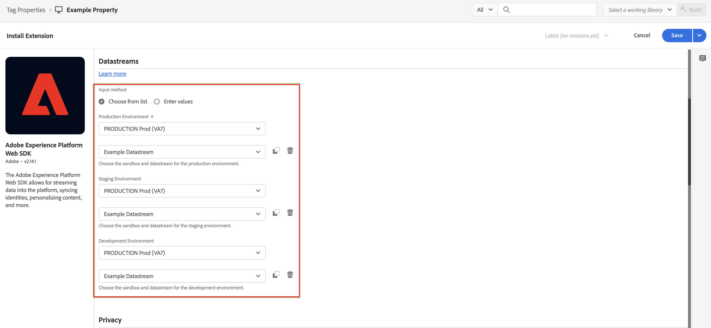

# Adobe Experience Platform Web SDK 및 Edge 네트워크를 통해 데이터 수집

이 빠른 시작 안내서에서는 Adobe Experience Platform Web SDK 및 Edge 네트워크를 사용하여 웹 사이트 추적 데이터를 Adobe Experience Platform에 직접 수집한 다음 해당 데이터를 Customer Journey Analytics에서 사용하는 방법을 설명합니다.

이를 위해서는 다음을 수행해야 합니다.

- **스키마 및 데이터 세트 설정** Adobe Experience Platform에서 수집할 데이터의 모델(스키마)과 데이터(데이터 세트)를 실제로 수집할 위치를 정의합니다.

- **데이터 스트림 설정** 수집된 데이터를 Adobe Experience Platform에 구성한 데이터 세트로 라우팅하도록 Adobe Experience Platform Edge 네트워크를 구성하는 방법

- **태그 사용** 를 사용하여 웹 사이트의 데이터 계층에 있는 데이터에 대해 규칙 및 데이터 요소를 쉽게 구성할 수 있습니다. 그런 다음 데이터가 Adobe Experience Platform Edge 네트워크에 구성된 데이터 스트림으로 전송되는지 확인합니다.

- **배포 및 유효성 검사**. 태그 개발을 반복적으로 수행할 수 있는 환경을 보유하고 있고, 모든 유효성 검사가 완료되면 프로덕션 환경에서 라이브로 게시합니다.

- **연결 설정** Customer Journey Analytics에서 확인하십시오. 이 연결에는 Adobe Experience Platform 데이터 세트가 포함되어야 합니다(최소).

- **데이터 보기 설정** Customer Journey Analytics에서 Analysis Workspace에서 사용할 지표 및 차원을 정의합니다.

- **프로젝트 설정** Customer Journey Analytics에서 보고서 및 시각화를 작성합니다.

>[!NOTE]
>
>사이트에서 수집한 데이터를 Adobe Experience Platform으로 수집하고 Customer Journey Analytics에서 사용하는 방법에 대한 간단한 안내서입니다. 참조할 때는 추가 정보를 학습하는 것이 좋습니다.


## 스키마 및 데이터 세트 설정

데이터를 Adobe Experience Platform에 수집하려면 먼저 수집할 데이터를 정의해야 합니다. Adobe Experience Platform에 수집되는 모든 데이터는 다운스트림 기능 및 기능으로 인식되고 동작하기 위해 표준화된 구조를 준수해야 합니다. XDM(Experience Data Model)은 스키마 형태로 이 구조를 제공하는 표준 프레임워크입니다.

스키마를 정의하면 하나 이상의 데이터 세트를 사용하여 데이터 수집을 저장하고 관리합니다. 데이터 세트는 스키마(열) 및 필드(행)를 포함하는 데이터 수집을 위한 저장소 및 관리 구조입니다. 

Adobe Experience Platform에 수집되는 모든 데이터는 데이터 집합으로 유지하려면 미리 정의된 스키마를 따라야 합니다.

### 스키마 설정

웹 사이트를 방문하는 프로필에서 페이지 이름, 식별 등 최소한의 데이터를 추적하려고 합니다.
이를 위해서는 먼저 이 데이터를 모델링하는 스키마를 정의해야 합니다.

스키마를 설정하려면 다음을 수행하십시오.

1. Adobe Experience Platform UI의 왼쪽 레일에서 를 선택합니다 **[!UICONTROL 스키마]** within [!UICONTROL 데이터 관리].

2. 선택 **[!UICONTROL 스키마 만들기]**. 선택 **[!UICONTROL XDM ExperienceEvent]** 옵션 목록에서 을 선택합니다.

   

   >[!INFO]
   >
   >    경험 이벤트 스키마는 을 모델링하는 데 사용됩니다 _동작_ 프로필(예: 페이지 보기, 장바구니에 추가)에 대한 정보를 검토하십시오. 개별 프로필 스키마가 프로필을 모델링하는 데 사용됩니다 _속성_ (이름, 이메일, 성별 등).


3. 에서 [!UICONTROL 제목 없는 스키마] 화면:

   1. 스키마의 표시 이름과 (선택 사항) 설명을 입력합니다.

      

   2. 선택 **[!UICONTROL + 추가]** in [!UICONTROL 필드 그룹].

      

      필드 그룹은 스키마를 쉽게 확장할 수 있도록 해주는 재사용 가능한 개체 및 속성 컬렉션입니다.

   3. 에서 [!UICONTROL 필드 그룹 추가] 대화 상자에서 다음을 선택합니다 **[!UICONTROL AEP 웹 SDK ExperienceEvent]** 목록에서 필드 그룹을 선택합니다.

      

      미리 보기 단추를 선택하여 다음과 같이 이 필드 그룹에 속하는 필드의 미리 보기를 볼 수 있습니다 `web > webPageDetails > name`.

      

      선택 **[!UICONTROL 뒤로]** 를 클릭하여 미리 보기를 닫습니다.

   4. 선택 **[!UICONTROL 필드 그룹 추가]**.

4. 선택 **[!UICONTROL +]** 를 클릭하십시오. [!UICONTROL 구조] 패널.

   

5. 에서 [!UICONTROL 필드 속성] 패널, 입력 `Identification` 이름으로, **[!UICONTROL 식별]** 로서의 [!UICONTROL 표시 이름], 선택 **[!UICONTROL 개체]** 로서의 [!UICONTROL 유형] 을(를) 선택합니다. **[!UICONTROL ExperienceEvent Core v2.1]** 로서의 [!UICONTROL 필드 그룹].

   

   이렇게 하면 스키마에 식별 기능이 추가됩니다. 이 경우 Experience Cloud ID 및 이메일 주소를 사용하여 사이트를 방문하는 프로필을 식별하려고 합니다. 방문자의 ID(예: 고객 ID, 충성도 ID)를 추적하는 데 사용할 수 있는 다른 많은 특성이 있습니다.

   선택 **[!UICONTROL 적용]** 이 개체를 스키마에 추가하려면

6. 을(를) 선택합니다 **[!UICONTROL ecid]** 방금 추가한 식별 개체의 필드를 선택하고 **[!UICONTROL ID]** 및 **[!UICONTROL 기본 ID]** 및 **[!UICONTROL ECID]** 에서 [!UICONTROL ID 네임스페이스] 오른쪽 패널에 있는 목록 .

   

   Adobe Experience Platform Identity 서비스에서 동일한 ECID를 사용하여 프로필의 동작을 결합(결합)하는 데 사용할 수 있는 기본 ID로 Experience Cloud ID를 지정합니다.

   선택 **[!UICONTROL 적용]**. ecid 속성에 지문 아이콘이 표시됩니다.

7. 을(를) 선택합니다 **[!UICONTROL 이메일]** 방금 추가한 식별 개체의 필드를 선택하고 **[!UICONTROL ID]** 및 **[!UICONTROL 이메일]** 에서 [!UICONTROL ID 네임스페이스] 목록의 [!UICONTROL 필드 속성] 패널.

   

   이메일 주소를 Adobe Experience Platform Identity 서비스에서 프로필의 동작을 결합(결합)하는 데 사용할 수 있는 다른 ID로 지정합니다.

   선택 **[!UICONTROL 적용]**. 이메일 속성에 지문 아이콘이 표시됩니다.

   **[!UICONTROL 저장]**&#x200B;을 선택합니다.

8. 스키마 이름을 표시하는 스키마의 루트 요소를 선택한 다음 **[!UICONTROL 프로필]** 스위치.

   프로파일에 대한 스키마를 활성화하라는 메시지가 표시됩니다. 사용하도록 설정하면 데이터를 이 스키마를 기반으로 한 데이터 세트에 수집할 때 해당 데이터가 실시간 고객 프로필에 병합됩니다.

   자세한 내용은 [실시간 고객 프로필에서 사용할 스키마 활성화](https://experienceleague.adobe.com/docs/experience-platform/xdm/tutorials/create-schema-ui.html?lang=en#profile) 추가 정보.

   >[!IMPORTANT]
   >
   >    프로파일에 대해 활성화된 스키마를 저장하면 프로필에 대해 해당 스키마를 비활성화할 수 없습니다.

   

9. 선택 **[!UICONTROL 저장]** 스키마를 저장하려면 을 클릭합니다.

웹 사이트에서 캡처할 수 있는 데이터를 모델링하는 최소한의 스키마를 만들었습니다. 스키마를 사용하면 Experience Cloud ID 및 이메일 주소를 사용하여 프로필을 식별할 수 있습니다. 프로필에 대한 스키마를 활성화하면 웹 사이트에서 캡처한 데이터가 실시간 고객 프로필에 추가되도록 합니다.

동작 데이터 옆에서 사이트에서 프로필 속성 데이터를 캡처할 수도 있습니다(예를 들어 뉴스레터를 구독하는 프로필의 세부 사항).

이 프로필 데이터를 캡처하려면 다음을 수행합니다.

- XDM 개별 프로필 클래스를 기반으로 스키마를 만듭니다.

- 프로필 코어 v2 필드 그룹을 스키마에 추가합니다.

- 프로필 코어 v2 필드 그룹을 기반으로 식별 개체를 추가합니다.

- ecid를 기본 식별자로 정의하고 이메일을 식별자로 정의합니다.

- 프로필용 스키마 활성화

자세한 내용은 [UI에서 스키마 만들기 및 편집](https://experienceleague.adobe.com/docs/experience-platform/xdm/ui/resources/schemas.html) 스키마에 필드 그룹 및 개별 필드 추가 및 제거에 대한 자세한 내용을 참조하십시오.

### 데이터 세트 설정

스키마를 사용하여 데이터 모델을 정의했습니다. 이제 해당 데이터를 저장하고 관리하기 위해 구성을 정의해야 합니다. 이 작업은 데이터 세트를 통해 수행됩니다.

데이터 세트를 설정하려면 다음을 수행하십시오.

1. Adobe Experience Platform UI의 왼쪽 레일에서 를 선택합니다 **[!UICONTROL 데이터 세트]** within [!UICONTROL 데이터 관리].

2. 선택 **[!UICONTROL 데이터 집합 만들기]**.

   

3. 선택 **[!UICONTROL 스키마에서 데이터 집합 만들기]**.

   

4. 앞에서 만든 스키마를 선택하고 을 선택합니다 **[!UICONTROL 다음]**.

5. 데이터 세트에 이름을 지정하고(선택 사항) 설명을 제공합니다.

   

6. 선택 **[!UICONTROL 완료]**.

7. 을(를) 선택합니다 **[!UICONTROL 프로필]** 스위치.

   프로필에 데이터 세트를 활성화하라는 메시지가 표시됩니다. 활성화되면 데이터 세트는 수집된 데이터로 실시간 고객 프로필을 보강합니다.

   >[!IMPORTANT]
   >
   >    데이터 세트가 준수하는 스키마가 프로필에 대해서도 활성화되어 있는 경우에만 프로필에 대한 데이터 세트를 활성화할 수 있습니다.

   

자세한 내용은 [데이터 세트 UI 안내서](https://experienceleague.adobe.com/docs/experience-platform/catalog/datasets/user-guide.html?lang=ko) 데이터 세트를 보고, 미리 보고, 만들고, 삭제하는 방법에 대한 자세한 내용은 다음을 참조하십시오. 실시간 고객 프로필에 데이터 세트를 활성화하는 방법

## 데이터 스트림 설정

데이터 스트림은 Adobe Experience Platform Web 및 Mobile SDK를 구현할 때 서버측 구성을 나타냅니다. Adobe Experience Platform SDK를 사용하여 데이터를 수집할 때 데이터가 Adobe Experience Platform Edge Network로 전송됩니다. 데이터가 전달되는 서비스를 결정하는 데이터 스트림입니다.

설정에서는 웹 사이트에서 수집한 데이터를 Adobe Experience Platform의 데이터 세트로 전송하려고 합니다.

데이터 스트림을 설정하려면 다음을 수행하십시오.

1. Adobe Experience Platform UI에서 **[!UICONTROL 데이터 스트림]** 변환 전: [!UICONTROL 데이터 수집] 왼쪽 레일에 있습니다.

2. 선택 **[!UICONTROL 새 데이터 스트림]**.

3. 데이터 스트림에 이름을 지정하고 설명합니다. 에서 스키마를 선택합니다 [!UICONTROL 이벤트 스키마] 목록.

   

4. **[!UICONTROL 저장]**&#x200B;을 선택합니다.

5. 선택 **[!UICONTROL 서비스 추가]**.

6. 에서 [!UICONTROL 서비스 추가 화면]:

   1. 선택 **[!UICONTROL Adobe Experience Platform]** 에서 [!UICONTROL 서비스] 목록.

   2. 확인 **[!UICONTROL 활성화됨]** 이 선택되어 있습니다.

   3. 에서 데이터 세트를 선택합니다 [!UICONTROL 이벤트 데이터 세트] 목록.

      

   4. 다른 설정을 그대로 두고 를 선택합니다. **[!UICONTROL 저장]** 데이터 스트림을 저장하려면 다음을 수행합니다.

이제 데이터 스트림이 웹 사이트에서 수집한 데이터를 Adobe Experience Platform의 데이터 세트에 전달하도록 구성되었습니다.

자세한 내용은 [데이터 스트림 개요](https://experienceleague.adobe.com/docs/experience-platform/edge/datastreams/overview.html?lang=ko-KR) 데이터 스트림을 구성하는 방법 및 중요 데이터를 처리하는 방법에 대한 자세한 내용을 참조하십시오.


## 태그 사용

Adobe Experience Platform 내의 태그 기능을 사용하여 실제로 데이터를 수집하기 위해 사이트에서 코드를 구현합니다. 이는 다른 태그 지정 요구 사항과 함께 코드를 배포할 수 있도록 해 주는 태그 관리 솔루션입니다. 태그는 Adobe Experience Platform Web SDK 확장을 사용하여 Adobe Experience Platform과 매끄럽게 통합됩니다.

### 태그 만들기

1. Adobe Experience Platform UI의 왼쪽 레일에서 를 선택합니다 **[!UICONTROL 태그]** within [!UICONTROL 데이터 수집].

2. 선택 **[!UICONTROL 새 속성]**.

   태그 이름을 지정하고 **[!UICONTROL 웹]** 도메인 이름을 입력합니다. 선택 **[!UICONTROL 저장]** 계속하십시오.

   

### 태그 구성

태그를 만든 후에는 올바른 확장으로 태그를 구성하고 사이트를 추적하고 Adobe Experience Platform에 데이터를 전송하는 방법에 따라 데이터 요소와 규칙을 구성해야 합니다.

목록에서 새로 만든 태그를 선택합니다 [!UICONTROL 태그 속성] 열려고


#### **확장**

Adobe Platform Web SDK 확장을 태그에 추가하여 데이터를 Adobe Experience Platform(데이터 스트림을 통해)에 보낼 수 있습니다.

Adobe Experience Platform 웹 SDK 확장을 만들고 구성하려면:

1. 선택 **[!UICONTROL 확장]** 왼쪽 레일에 있습니다.

2. 선택 **[!UICONTROL 카탈로그]** 상단 막대에서

3. Adobe Experience Platform 웹 SDK 확장을 검색하거나 스크롤하여 선택하고 **[!UICONTROL 설치]** 를 설치합니다.

   

4. 샌드박스 및 이전에 만든 데이터 스트림을 선택하여 [!UICONTROL 프로덕션 환경] 및 (선택 사항) [!UICONTROL 스테이징 환경] 및 [!UICONTROL 개발 환경].

   

   **[!UICONTROL 저장]**&#x200B;을 선택합니다.

자세한 내용은 [Adobe Experience Platform 웹 SDK 확장 구성](https://experienceleague.adobe.com/docs/experience-platform/edge/extension/web-sdk-extension-configuration.html) 추가 정보.

Experience Cloud ID를 쉽게 사용할 수 있도록 Experience Cloud ID 서비스 확장을 설정하려고 합니다. Experience Cloud ID 서비스는 모든 Adobe Experience Cloud 솔루션에서 방문자를 식별합니다.

Experience Cloud ID 서비스 확장을 만들고 구성하려면:

1. 선택 **[!UICONTROL 확장]** 왼쪽 레일에 있습니다.

2. 선택 **[!UICONTROL 카탈로그]** 상단 막대에서

3. Experience Cloud ID 서비스 확장을 검색하거나 스크롤하고 을 선택합니다 **[!UICONTROL 설치]** 를 설치합니다.

   

4. 모든 구성을 기본값으로 둡니다.

5. **[!UICONTROL 저장]**&#x200B;을 선택합니다.

#### **데이터 요소**

데이터 요소는 데이터 사전(또는 데이터 맵)의 기본 구성단위입니다. 데이터 요소를 사용하여 마케팅 및 광고 기술 전반에서 데이터를 수집, 구성 및 전달합니다. 데이터 계층에서 읽은 데이터 요소를 태그에 설정하고 데이터를 Adobe Experience Platform으로 전달하는 데 사용할 수 있습니다.

다양한 유형의 데이터 요소가 있습니다. 먼저 데이터 요소를 설정하여 방문자가 사이트에서 보고 있는 페이지 이름을 캡처합니다.

페이지 이름 데이터 요소를 정의하려면

1. 선택 **[!UICONTROL 데이터 요소]** 왼쪽 레일에 있습니다.

2. 선택 **[!UICONTROL 데이터 요소 추가]**.

3. 에서 [!UICONTROL 데이터 요소 만들기] 대화 상자:

   - 예를 들어 데이터 요소에 이름을 지정합니다 `Page Name`.

   - 선택 **[!UICONTROL 코어]** 에서 [!UICONTROL 확장] 목록.

   - 선택 **[!UICONTROL 페이지 정보]** 에서 [!UICONTROL 데이터 요소 유형] 목록.

   - 선택 **[!UICONTROL 제목]** 에서 [!UICONTROL 속성] 목록.

      

      또는 예를 들어 데이터 계층의 변수에 있는 값을 사용할 수 있습니다 `pageName` 그리고 [!UICONTROL JavaScript 변수] 데이터 요소를 정의하는 데이터 요소 유형.

      

   - **[!UICONTROL 저장]**&#x200B;을 선택합니다.

이제 Adobe Experience Platform Web SDK에서 자동으로 제공하며 Experience Cloud ID 서비스 확장을 통해 사용할 수 있는 Experience Cloud ID를 참조하는 데이터 요소를 설정하려고 합니다.

ECID 데이터 요소를 정의하려면

1. 선택 **[!UICONTROL 데이터 요소]** 왼쪽 레일에 있습니다.

2. 선택 **[!UICONTROL 데이터 요소 추가]**.

3. 에서 [!UICONTROL 데이터 요소 만들기] 대화 상자:

   - 예를 들어 데이터 요소에 이름을 지정합니다 `ECID`.

   - 선택 **[!UICONTROL Experience Cloud ID 서비스]** 에서 [!UICONTROL 확장] 목록.

   - 선택 **[!UICONTROL ECID]** 에서 [!UICONTROL 데이터 요소 유형] 목록.

      

   - **[!UICONTROL 저장]**&#x200B;을 선택합니다.

마지막으로, 이제 특정 데이터 요소를 이전에 정의한 스키마에 매핑하려고 합니다. XDM 스키마를 나타내는 다른 데이터 요소를 정의합니다.

XDM 개체 데이터 요소를 정의하려면

1. 선택 **[!UICONTROL 데이터 요소]** 왼쪽 레일에 있습니다.

2. 선택 **[!UICONTROL 데이터 요소 추가]**.

3. 에서 [!UICONTROL 데이터 요소 만들기] 대화 상자:

   - 예를 들어 데이터 요소에 이름을 지정합니다 `XDM - Page View`.

   - 선택 **[!UICONTROL Adobe Experience Platform Web SDK]** 에서 [!UICONTROL 확장] 목록.

   - 선택 **[!UICONTROL XDM 개체]** 에서 [!UICONTROL 데이터 요소 유형] 목록.

   - 에서 샌드박스를 선택합니다 [!UICONTROL 샌드박스] 목록.

   - 에서 스키마를 선택합니다 [!UICONTROL 스키마] 목록.

   - 맵 `identification > core > ecid` 스키마에 정의된 속성이 ECID 데이터 요소에 추가됨. 실린더 아이콘을 선택하여 데이터 요소 목록에서 ECID 데이터 요소를 쉽게 선택할 수 있습니다.

      

      


   - 맵 `web > webPageDetails > name` 스키마에 정의된 속성이 페이지 이름 데이터 요소에 설정됩니다.

      

   - **[!UICONTROL 저장]**&#x200B;을 선택합니다.


#### **규칙**

Adobe Experience Platform의 태그는 규칙 기반 시스템을 따릅니다. 사용자 상호 작용 및 관련 데이터를 찾습니다. 규칙에 요약된 기준이 충족되면, 규칙이 정의한 확장, 스크립트 또는 클라이언트측 코드를 트리거합니다. 규칙을 사용하여 Adobe Experience Platform Web SDK 확장을 사용하여 데이터(예: XDM 개체)를 Adobe Experience Platform에 보낼 수 있습니다.

규칙을 정의하려면

1. 선택 **[!UICONTROL 규칙]** 왼쪽 레일에 있습니다.

2. 선택 **[!UICONTROL 새 규칙 만들기]**.

3. 에서 [!UICONTROL 규칙 만들기] 대화 상자:

   - 규칙에 이름을 지정합니다(예: ) `Page View`.

   - 선택 **[!UICONTROL + 추가]** 아래 [!UICONTROL 이벤트].

   - 에서 [!UICONTROL 이벤트 구성] 대화 상자:

      - 선택 **[!UICONTROL 코어]** 에서 [!UICONTROL 확장] 목록.

      - 선택 **[!UICONTROL Window Loaded]** 에서 [!UICONTROL 이벤트 유형] 목록.

         

      - 선택 **[!UICONTROL 변경 내용 유지]**.
   - 선택 **[!UICONTROL + 추가]** 아래 [!UICONTROL 작업].

   - 에서 [!UICONTROL 작업 구성] 대화 상자:

      - 선택 **[!UICONTROL Adobe Experience Platform Web SDK]** 에서 [!UICONTROL 확장] 목록.

      - 선택 **[!UICONTROL 이벤트 보내기]** 에서 [!UICONTROL 작업 유형] 목록.

      - 선택 **[!UICONTROL web.webpagedetails.pageViews]** 에서 [!UICONTROL 유형] 목록.

      - 옆에 있는 실린더 아이콘을 선택합니다  [!UICONTROL XDM 데이터] 및 선택 **[!UICONTROL XDM - 페이지 보기]** 를 클릭합니다.

         

      - 선택 **[!UICONTROL 변경 내용 유지]**.
   - 규칙은 다음과 같습니다.

      

   - **[!UICONTROL 저장]**&#x200B;을 선택합니다.


이는 다른 데이터 요소의 값이 포함된 XDM 데이터를 Adobe Experience Platform으로 보내는 규칙을 정의하는 예일 뿐입니다.

태그에서 다양한 방법으로 규칙을 사용하여 변수를 조작할 수 있습니다(데이터 요소 사용).

자세한 내용은 [규칙](https://experienceleague.adobe.com/docs/experience-platform/tags/ui/rules.html?lang=ko-KR) 추가 정보.

### 태그 작성 및 게시

데이터 요소와 규칙을 정의한 후 태그를 작성하고 게시해야 합니다. 라이브러리 빌드를 만들 때 환경에 할당해야 합니다. 그런 다음 빌드의 확장, 규칙 및 데이터 요소를 컴파일하여 지정된 환경에 배치합니다. 각 환경에서는 지정된 빌드를 사이트에 통합할 수 있는 고유한 포함 코드를 제공합니다.

태그를 작성하고 게시하려면 다음을 수행하십시오.

1. 선택 **[!UICONTROL 게시 흐름]** 왼쪽 레일에서

2. 선택 **[!UICONTROL 작업 라이브러리 선택]**, 그 다음 **[!UICONTROL 라이브러리 추가...]**.

3. 에서 [!UICONTROL 라이브러리 만들기] 대화 상자:

   - 라이브러리에 이름을 지정합니다.

   - 선택 **[!UICONTROL 개발(개발)]** 에서 [!UICONTROL 환경] 목록.

   - 선택 **[!UICONTROL + 변경된 모든 리소스 추가]**.

      

   - 선택 **[!UICONTROL 개발에 저장 및 구축]**.

   이렇게 하면 개발 환경에 대한 태그가 저장되고 빌드됩니다. 녹색 점은 개발 환경에서 태그가 성공적으로 빌드되었음을 나타냅니다.

4. 선택할 수 있습니다 **[!UICONTROL ...]** 라이브러리를 다시 빌드하거나 라이브러리를 스테이징 또는 프로덕션 환경으로 이동하는 경우

   

Adobe Experience Platform 태그는 Adobe Experience Platform Web SDK 배포를 수용해야 하는 간단한 게시 워크플로우를 지원합니다.

자세한 내용은 [게시 개요](https://experienceleague.adobe.com/docs/experience-platform/tags/publish/overview.html?lang=ko-KR) 추가 정보.


### 태그 코드를 검색합니다

마지막으로 추적하려는 웹 사이트에 태그를 설치해야 합니다. 이것은 웹 사이트 템플릿의 헤더 태그에 코드를 배치함을 의미합니다.

태그를 참조하는 코드를 가져오려면 다음을 수행하십시오.

1. 선택 **[!UICONTROL 환경]** 왼쪽 레일에 있습니다.

2. 환경 목록에서 올바른 설치(상자) 단추를 선택합니다.

   에서 [!UICONTROL 웹 설치 지침] 대화 상자에서 다음과 같이 읽어야 하는 스크립트 코드 옆에 있는 복사 단추를 선택합니다.

   ```javascript
   <script src="https://assets.adobedtm.com/2a518741ab24/806645a0b9bb/launch-716db315b4e2-development.min.js" async></script>
   ```

   

3. 선택 **[!UICONTROL 닫기]**.

개발 환경에 대한 코드 대신 Adobe Experience Platform Web SDK를 배포하고 있는 위치를 기반으로 다른 환경(스테이징, 프로덕션)을 선택했을 수 있습니다.

자세한 내용은 [환경](https://experienceleague.adobe.com/docs/experience-platform/tags/publish/environments/environments.html?) 추가 정보.

## 배포 및 유효성 검사

이제 코드 를 `<head>` 태그에 가깝게 포함했습니다. 배포되면 웹 사이트가 Adobe Experience Platform에 데이터를 수집하기 시작합니다.

구현의 유효성을 확인하고, 필요한 경우 수정하고, 수정하면 태그의 게시 워크플로우 기능을 사용하여 스테이징 및 프로덕션 환경에 배포합니다.

## 연결 설정

Customer Journey Analytics에서 Adobe Experience Platform 데이터를 사용하려면 스키마, 데이터 세트 및 워크플로우를 설정하여 생성되는 데이터가 포함된 연결을 만듭니다.

연결을 통해 Adobe Experience Platform의 데이터 세트를 작업 영역에 통합할 수 있습니다. 이러한 데이터 세트에 대해 보고하려면 먼저 Adobe Experience Platform과 작업 공간의 데이터 세트 간에 연결을 설정해야 합니다.

연결을 만들려면 다음을 수행하십시오.

1. Customer Journey Analytics UI에서 **[!UICONTROL 연결]** 를 클릭합니다.

2. 선택 **[!UICONTROL 새 연결 만들기]**.

3. 에서 [!UICONTROL 제목 없는 연결] 화면:

   연결 이름을 로 지정하고 설명합니다. [!UICONTROL 연결 설정].

   에서 올바른 샌드박스를 선택합니다 [!UICONTROL 샌드박스] 목록 [!UICONTROL 데이터 설정] 및 에서 일별 이벤트 수를 선택합니다 [!UICONTROL 일일 평균 이벤트 수] 목록.

   

   선택 **[!UICONTROL 데이터 세트 추가]**.

   에서 [!UICONTROL 데이터 세트 선택] 단계 [!UICONTROL 데이터 세트 추가]:

   - 앞에서 만든 데이터 세트 선택(`Example dataset`)과 함께 사용할 데이터 세트를 만들 수 있습니다.

      

   - **[!UICONTROL 다음]**&#x200B;을 선택합니다.
   에서 [!UICONTROL 데이터 세트 설정] 단계 [!UICONTROL 데이터 세트 추가]:

   - 각 데이터 세트에 대해:

      - 선택 [!UICONTROL 개인 ID] Adobe Experience Platform의 데이터 세트 스키마에 정의된 사용 가능한 ID에서 생성합니다.

      - 에서 올바른 데이터 소스를 선택합니다 [!UICONTROL 데이터 소스 유형] 목록. 지정한 경우 **[!UICONTROL 기타]**&#x200B;를 입력한 다음 데이터 소스에 대한 설명을 추가합니다.

      - 설정 **[!UICONTROL 모든 새 데이터 가져오기]** 및 **[!UICONTROL 데이터 집합 기존 데이터 채우기]** 사용자의 기본 설정에 따라 다릅니다.

      

   - 선택 **[!UICONTROL 데이터 세트 추가]**.
   **[!UICONTROL 저장]**&#x200B;을 선택합니다.

자세한 내용은 [연결 개요](../connections/overview.md) 를 참조하십시오.

## 데이터 보기 설정

데이터 보기는 Customer Journey Analytics와 관련된 컨테이너입니다. 이를 통해 연결에서 데이터를 해석하는 방법을 결정할 수 있습니다. Analysis Workspace에서 사용 가능한 모든 차원과 지표를 지정하고, 해당 차원과 지표가 데이터를 얻을 수 있는 열을 지정합니다. 데이터 보기는 Analysis Workspace의 데이터에 대한 보고 준비에 따라 정의됩니다.

데이터 보기를 만들려면 다음을 수행하십시오.

1. Customer Journey Analytics UI에서 **[!UICONTROL 데이터 보기]** 를 클릭합니다.

2. 선택 **[!UICONTROL 새 데이터 보기 만들기]**.

3. 에서 [!UICONTROL 구성] 단계:

   에서 연결을 선택합니다 [!UICONTROL 연결] 목록.

   연결의 이름과 (선택 사항)를 설명합니다.

   

   선택 **[!UICONTROL 저장 후 계속]**.

4. 에서 [!UICONTROL 구성 요소] 단계:

   포함할 스키마 필드 및/또는 표준 구성 요소를 추가합니다 [!UICONTROL 지표] 또는 [!UICONTROL Dimension] 구성 요소 상자

   

   선택 **[!UICONTROL 저장 후 계속]**.

5. 에서 [!UICONTROL 설정] 단계:

   

   설정을 그대로 두고 를 선택합니다 **[!UICONTROL 저장 및 완료]**.

자세한 내용은 [데이터 보기 개요](../data-views/data-views.md) 데이터 보기를 만들고 편집하는 방법, 데이터 보기에서 사용할 수 있는 구성 요소 및 필터 및 세션 설정을 사용하는 방법에 대한 자세한 내용을 참조하십시오.


## 프로젝트 설정

Analysis Workspace은 데이터를 기반으로 분석을 신속하게 구축하고 통찰력을 공유할 수 있는 유연한 브라우저 도구입니다. Workspace 프로젝트를 사용하여 데이터 구성 요소, 테이블 및 시각화를 결합하여 분석을 만들고 조직의 모든 사람과 공유할 수 있습니다.

프로젝트를 만들려면 다음을 수행하십시오.

1. Customer Journey Analytics UI에서 **[!UICONTROL 프로젝트]** 를 클릭합니다.

2. 선택 **[!UICONTROL 프로젝트]** 을 클릭합니다.

3. 선택 **[!UICONTROL 프로젝트 만들기]**.

   

   선택 **[!UICONTROL 빈 프로젝트]**.

   

4. 목록에서 데이터 보기를 선택합니다.

   .

5. 차원 및 지표 드래그 앤 드롭을 [!UICONTROL 자유 형식 테이블] 에서 [!UICONTROL 패널] 첫 번째 보고서를 만들려면 예를 들어 `Program Points Balance` 및 `Page View` 지표 및 `email` 충성도 포인트를 수집하는 충성도 프로그램의 일부이며 웹 사이트를 방문한 프로필에 대한 빠른 개요를 알 수 있는 차원입니다.

   

자세한 내용은 [Analysis Workspace 개요](../analysis-workspace/home.md) 구성 요소, 시각화 및 패널을 사용하여 프로젝트를 만들고 분석을 빌드하는 방법에 대한 자세한 내용을 참조하십시오.

>[!SUCCESS]
>
>모든 단계를 완료했습니다. 수집하려는 데이터(스키마)와 Adobe Experience Platform에 저장할 위치(데이터 세트)를 정의하여, 데이터를 해당 데이터 세트에 전달할 수 있도록 Edge 네트워크에 데이터 스트림을 구성했습니다. 그런 다음 확장(Adobe Experience Platform Web SDK, Experience Cloud ID 서비스), 데이터 요소 및 규칙이 포함된 태그를 정의하고 배포하여 웹 사이트에서 데이터를 캡처하고 해당 데이터를 데이터 스트림으로 보냅니다. 웹 사이트 추적 데이터 및 기타 데이터를 사용하기 위해 Customer Journey Analytics에 연결을 정의했습니다. 데이터 보기 정의를 사용하여 사용할 차원 및 지표를 지정하고 최종적으로 데이터를 시각화하고 분석하는 첫 번째 프로젝트를 만들 수 있습니다.
