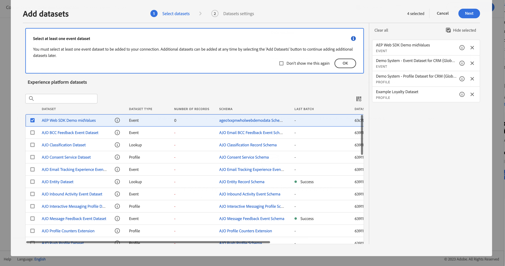
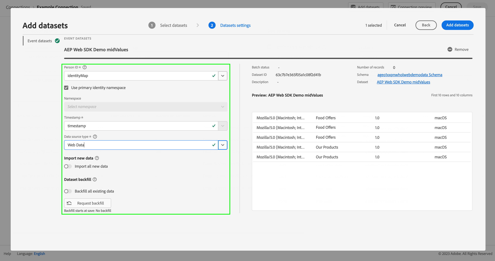

# Adobe Analytics에서 데이터 수집 및 사용

이 빠른 시작 안내서에서는 Adobe Analytics가 Customer Journey Analytics에서 수집한 데이터를 사용하는 방법을 설명합니다.

>[!PREREQUISITES]
>
>문서화된 구현 메서드를 사용하여 한 개 이상의 웹 사이트에 Adobe Analytics 라이선스를 부여하고 배포합니다.
>
>- [Experience Platform Edge를 사용하여 Analytics 구현](https://experienceleague.adobe.com/docs/analytics/implementation/aep-edge/overview.html)
>
>- [Adobe Analytics 확장을 사용하여 Analytics 구현](https://experienceleague.adobe.com/docs/analytics/implementation/launch/overview.html)
>
>- [JavaScript를 사용하여 Analytics 구현](https://experienceleague.adobe.com/docs/analytics/implementation/js/overview.html)

이를 구현하려면 다음 작업을 수행해야 합니다.

- Adobe Experience Platform에서 **Adobe Analytics 소스 커넥터 설정**. 소스 커넥터는 현재 Adobe Analytics 데이터를 Adobe Experience Platform의 데이터 세트로 수집하는 작업을 처리합니다.

- Customer Journey Analytics에서 **연결 설정**. 연결에는 Adobe Experience Platform 데이터 세트가 포함되어야 합니다.

- Customer Journey Analytics에서 **데이터 보기를 설정**&#x200B;하여 Analysis Workspace에서 사용하려는 지표 및 차원을 정의합니다.

- Customer Journey Analytics에서 **프로젝트를 설정**&#x200B;하여 보고서 및 시각화를 빌드합니다.

>[!NOTE]
>
>이 빠른 시작 안내서는 Adobe Analytics 소스 커넥터를 사용하여 데이터를 수집하고 Customer Journey Analytics에서 해당 데이터를 사용하는 방법에 대한 간단한 안내서입니다. 추가 정보를 참고하는 경우 연구하는 것이 좋습니다.

## Adobe Analytics 소스 커넥터 설정

Adobe Analytics 소스 커넥터를 사용하여 Adobe Analytics 보고서 세트 데이터를 Adobe Experience Platform으로 가져올 수 있습니다.

Adobe Analytics 소스 커넥터를 만드는 경우:

1. 플랫폼 UI의 왼쪽 레일에서 **[!UICONTROL 소스]**&#x200B;를 선택합니다.

2. [!UICONTROL 범주] 목록에서 **[!UICONTROL Adobe 애플리케이션]**&#x200B;을 선택합니다.

3. Adobe Analytics 타일에서 **[!UICONTROL 설정]** 또는 **[!UICONTROL 데이터 추가]**&#x200B;를 선택합니다.

   

4. **[!UICONTROL 보고서 세트]**&#x200B;를 선택합니다. 보고서 세트 목록에서 사용할 세트를 선택합니다.  또는  **[!UICONTROL _검색_]**&#x200B;을 사용하여 보고서 세트를 검색할 수 있습니다.

   

   **[!UICONTROL 다음]**&#x200B;을 선택합니다.

5. **[!UICONTROL 기본 스키마]**&#x200B;를 [!UICONTROL 대상 스키마]로 선택합니다. Adobe Experience Platform은 선택한 Adobe Analytics 보고서 세트의 모든 표준 필드를 매핑하는 스키마와 해당 데이터 세트를 자동으로 만듭니다.

   

   **[!UICONTROL 다음]**&#x200B;을 선택합니다.

6. 데이터 흐름의 이름을 지정하고 (선택 사항) 설명을 입력합니다.

   

   **[!UICONTROL 다음]**&#x200B;을 선택합니다.

7. 연결을 검토하고 **[!UICONTROL 마침]**&#x200B;을 선택합니다.

   

연결이 만들어지면 데이터 흐름이 자동으로 만들어져 데이터 세트를 보고서 세트의 Adobe Analytics 데이터로 채웁니다. 데이터 흐름은 프로덕션 샌드박스에 대해 최대 13개월의 내역 데이터를 수집합니다. 비프로덕션 샌드박스의 다시 채우기는 3개월로 제한됩니다.

초기 수집이 완료되면 Customer Journey Analytics에서 Adobe Analytics 보고서 세트 데이터를 사용할 수 있게 준비됩니다.

보다 포괄적인 튜토리얼은 [UI에서 Adobe Analytics 소스 연결 만들기](https://experienceleague.adobe.com/docs/experience-platform/sources/ui-tutorials/create/adobe-applications/analytics.html)를 참조하십시오.

## 연결 설정

Customer Journey Analytics에서 Adobe Experience Platform 데이터를 사용하려면 스키마, 데이터 세트 및 워크플로 설정에서 도출된 데이터를 포함하는 연결을 만듭니다.

연결을 통해 Adobe Experience Platform의 데이터 세트를 작업 영역에 통합할 수 있습니다. 이러한 데이터 세트에 대해 보고하려면 먼저 Adobe Experience Platform과 Workspace의 데이터 세트 간에 연결을 설정해야 합니다.

연결을 만드는 경우:

1. Customer Journey Analytics UI의 상단 메뉴에서 **[!UICONTROL 연결]**(선택 사항: **[!UICONTROL 데이터 관리]**)을 선택합니다.

2. **[!UICONTROL 새 연결 만들기]**&#x200B;를 선택합니다.

3. [!UICONTROL 제목 없는 연결] 화면에서:

   [!UICONTROL 연결 설정]에서 연결의 이름을 지정하고 연결에 대해 설명합니다.

   [!UICONTROL 데이터 설정]의 [!UICONTROL 샌드박스 목록에서 올바른 샌드박스]를 선택하고 [!UICONTROL 일일 평균 이벤트 수] 목록에서 일일 이벤트 수를 선택합니다.

   

   **[!UICONTROL 데이터 세트 추가]**&#x200B;를 선택합니다.

   [!UICONTROL 데이터 세트 추가]의 [!UICONTROL 데이터 세트 선택] 단계에서:

   - Adobe Analytics 소스 커넥터에서 자동으로 생성된 데이터 세트와 연결에 포함할 다른 데이터 세트를 선택합니다.

     

   - **[!UICONTROL 다음]**&#x200B;을 선택합니다.

   [!UICONTROL 데이터 세트 추가]의 [!UICONTROL 데이터 세트 설정] 단계에서:

   - 각 데이터 세트의 경우:

      - Adobe Experience Platform의 데이터 세트 스키마에 정의된 사용 가능한 ID에서 [!UICONTROL 개인 ID]를 선택합니다.

      - [!UICONTROL 데이터 소스 유형] 목록에서 올바른 데이터 소스를 선택합니다. **[!UICONTROL 기타]**&#x200B;를 지정한 경우 데이터 소스에 대한 설명을 추가합니다.

      - 환경 설정에 따라 **[!UICONTROL 새 데이터 모두 가져오기]** 및 **[!UICONTROL 데이터 세트 기존 데이터 채우기]**&#x200B;를 설정합니다.

     

   - **[!UICONTROL 데이터 세트 추가]**&#x200B;를 선택합니다.

   **[!UICONTROL 저장]**&#x200B;을 선택합니다.

연결을 만들고 관리하는 방법과 데이터 세트를 선택하고 결합하는 방법에 대한 자세한 내용은 [연결 개요](../connections/overview.md)를 참조하십시오.

## 데이터 보기 설정

데이터 보기는 Customer Journey Analytics와 관련된 컨테이너입니다. 이를 통해 연결에서 데이터를 해석하는 방법을 결정할 수 있습니다. Analysis Workspace에서 사용 가능한 모든 차원과 지표를 지정하고, 해당 차원과 지표가 데이터를 얻을 수 있는 열을 지정합니다. 데이터 보기는 Analysis Workspace의 데이터에 대한 보고 준비에 따라 정의됩니다.

데이터 보기를 만드는 경우:

1. Customer Journey Analytics UI의 상단 메뉴에서 **[!UICONTROL 데이터 보기]**(선택 사항: **[!UICONTROL 데이터 관리]**)를 선택합니다.

2. **[!UICONTROL 새 데이터 보기 만들기]**&#x200B;를 선택합니다.

3. [!UICONTROL 구성] 단계에서:

   [!UICONTROL 연결] 목록에서 연결을 선택합니다.

   연결의 이름을 지정하고 (선택 사항) 연결에 대해 설명합니다.

   

   **[!UICONTROL 저장 후 계속]**&#x200B;을 선택합니다.

4. [!UICONTROL 구성 요소] 단계에서:

   [!UICONTROL 지표] 또는 [!UICONTROL 차원] 구성 요소 상자에 포함할 스키마 필드 및/또는 표준 구성 요소를 추가합니다.

   

   **[!UICONTROL 저장 후 계속]**&#x200B;을 선택합니다.

5. [!UICONTROL 설정] 단계에서:

   

   설정은 그대로 두고 **[!UICONTROL 저장 후 마침]**&#x200B;을 선택합니다.

데이터 보기를 만들고 편집하는 방법, 데이터 보기에서 사용할 수 있는 구성 요소, 세그먼트 및 세션 설정을 사용하는 방법에 대한 자세한 내용은 [데이터 보기 개요](../data-views/data-views.md)를 참조하십시오.

## 프로젝트 설정

Analysis Workspace는 데이터를 기반으로 신속하게 분석을 빌드하고 인사이트를 공유할 수 있는 유연한 브라우저 도구입니다. 작업 영역 프로젝트를 사용하여 데이터 구성 요소, 테이블 및 시각화를 결합하여 분석을 작성하고 조직의 모든 사람과 공유할 수 있습니다.

프로젝트를 만드는 경우:

1. Customer Journey Analytics UI의 상단 메뉴에서 **[!UICONTROL 프로젝트]**&#x200B;를 선택합니다.

2. 왼쪽 탐색 영역에서 **[!UICONTROL 프로젝트]**&#x200B;를 선택합니다.

3. **[!UICONTROL 프로젝트 만들기]**&#x200B;를 선택합니다.

   

   **[!UICONTROL 빈 프로젝트]**&#x200B;를 선택합니다.

   

4. 목록에서 데이터 보기를 선택합니다.

   .

5. 첫 번째 보고서를 만들려면 [!UICONTROL 패널]의 [!UICONTROL 자유 형식 테이블]에서 차원 및 지표를 끌어서 놓습니다. 예를 들어 `Program Points Balance` 및 `Page View`를 지표로 `email`을 차원으로 드래그하여 웹 사이트를 방문한 적이 있고, 로열티 포인트를 수집하는 로열티 프로그램의 일부인 프로필에 대한 간단한 개요를 살펴봅니다.

   

구성 요소, 시각화 및 패널을 사용하여 프로젝트를 만들고 분석을 빌드하는 방법에 대한 자세한 내용은 [Analysis Workspace 개요](../analysis-workspace/home.md)를 참조하십시오.

>[!SUCCESS]
>
>모든 단계가 완료되었습니다. Adobe Analytics 데이터 소스 커넥터 설정 및 보고서 세트에 대해 해당 커넥터 구성을 시작으로 Adobe Analytics 데이터는 Adobe Experience Platform에 자동으로 업로드됩니다. 수집된 Adobe Analytics 데이터 및 기타 데이터를 사용하도록 Customer Journey Analytics에서 연결을 정의했습니다. 데이터 보기 정의를 통해 사용할 차원 및 지표를 지정했고 최종적으로 데이터를 시각화 및 분석하는 첫 번째 프로젝트를 제작했습니다.

