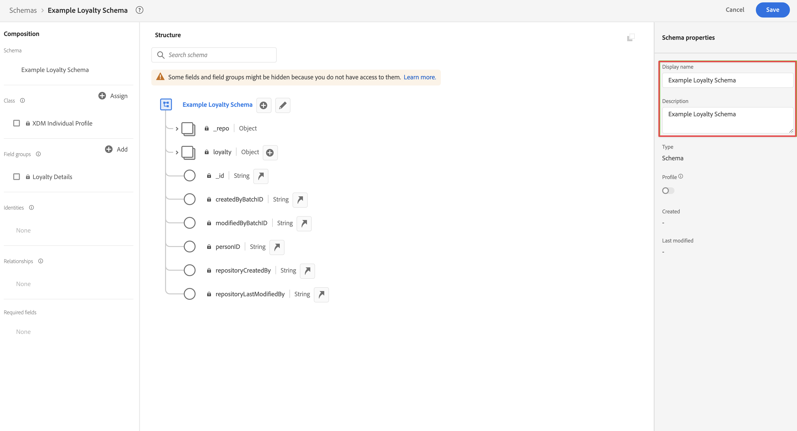

# 배치 데이터 수집 및 사용

이 빠른 시작 안내서에서는 일괄 처리 데이터를 Adobe Experience Platform으로 수집한 다음 Customer Journey Analytics에서 해당 데이터를 사용하는 방법을 설명합니다.

이를 위해서는 다음을 수행해야 합니다.

- **스키마 및 데이터 세트 설정** Adobe Experience Platform에서 수집할 데이터의 모델(스키마)과 데이터(데이터 세트)를 실제로 수집할 위치를 정의합니다.

- **워크플로우 사용** 일괄 처리 데이터를 Adobe Experience Platform에 구성된 데이터 세트에 쉽게 업로드할 수 있습니다.

- **연결 설정** Customer Journey Analytics에서 확인하십시오. 이 연결에는 Adobe Experience Platform 데이터 세트가 포함되어야 합니다(최소).

- **데이터 보기 설정** Customer Journey Analytics에서 Analysis Workspace에서 사용할 지표 및 차원을 정의합니다.

- **프로젝트 설정** Customer Journey Analytics에서 보고서 및 시각화를 작성합니다.

>[!NOTE]
>
>배치 데이터를 Adobe Experience Platform에 수집하고 Customer Journey Analytics에서 사용하는 방법에 대한 간단한 안내서입니다.  참조할 때는 추가 정보를 학습하는 것이 좋습니다.

## 스키마 및 데이터 세트 설정

데이터를 Adobe Experience Platform에 수집하려면 먼저 수집할 데이터를 정의해야 합니다. Adobe Experience Platform에 수집된 모든 데이터는 다운스트림 기능 및 기능으로 인식되고 조치를 취하려면 표준화된 구조를 준수해야 합니다. XDM(Experience Data Model)은 스키마 형태로 이 구조를 제공하는 표준 프레임워크입니다.

스키마를 정의하면, 하나 이상의 데이터 세트를 사용하여 데이터 수집을 저장하고 관리합니다. 데이터 세트는 스키마(열) 및 필드(행)를 포함하는 데이터 수집을 위한 저장소 및 관리 구조입니다. 

Adobe Experience Platform에 수집되는 모든 데이터는 데이터 집합으로 유지하려면 미리 정의된 스키마를 따라야 합니다.

### 스키마 설정

이 빠른 시작을 위해 충성도 ID, 충성도 포인트 및 충성도 상태와 같은 일부 충성도 데이터를 수집한다고 가정합니다.
이를 위해서는 먼저 이 데이터를 모델링하는 스키마를 정의해야 합니다.

스키마를 설정하려면 다음을 수행하십시오.

1. Adobe Experience Platform UI의 왼쪽 레일에서 를 선택합니다 **[!UICONTROL 스키마]** within [!UICONTROL 데이터 관리].

2. 선택 **[!UICONTROL 스키마 만들기]**. 선택 **[!UICONTROL XDM 개별 프로필]** 옵션 목록에서 을 선택합니다.

   

   >[!INFO]
   >
   >    개별 프로필 스키마가 프로필을 모델링하는 데 사용됩니다 _속성_ (이메일, 충성도 상태, 충성도 포인트 등) 경험 이벤트 스키마는 을 모델링하는 데 사용됩니다 _동작_ 프로필(예: 페이지 보기, 장바구니에 추가)에 대한 정보를 검토하십시오.


3. 에서 [!UICONTROL 제목 없는 스키마] 화면:

   1. 스키마의 표시 이름과 (선택 사항) 설명을 입력합니다.

      

   2. 선택 **[!UICONTROL + 추가]** in [!UICONTROL 필드 그룹].

      

      필드 그룹은 스키마를 쉽게 확장할 수 있도록 해주는 재사용 가능한 개체 및 속성 컬렉션입니다.

   3. 에서 [!UICONTROL 필드 그룹 추가] 대화 상자에서 다음을 선택합니다 **[!UICONTROL 충성도 세부 사항]** 목록에서 필드 그룹을 선택합니다.

      

      미리 보기 단추를 선택하여 이 필드 그룹에 속하는 필드의 미리 보기를 볼 수 있습니다.

      

      선택 **[!UICONTROL 뒤로]** 를 클릭하여 미리 보기를 닫습니다.

   4. 선택 **[!UICONTROL 필드 그룹 추가]**.

4. 선택 **[!UICONTROL +]** 를 클릭하십시오. [!UICONTROL 구조] 패널.

   

5. 에서 [!UICONTROL 필드 속성] 패널, 입력 `Identification` 이름으로, **[!UICONTROL 식별]** 로서의 [!UICONTROL 표시 이름], 선택 **[!UICONTROL 개체]** 로서의 [!UICONTROL 유형] 을(를) 선택합니다. **[!UICONTROL 프로필 코어 v2]** 로서의 [!UICONTROL 필드 그룹].

   

   그러면 스키마에 식별 기능이 추가됩니다. 이 경우 배치 데이터의 이메일 주소를 사용하여 충성도 정보를 식별하려고 합니다.

   선택 **[!UICONTROL 적용]** 이 개체를 스키마에 추가하려면

6. 을(를) 선택합니다 **[!UICONTROL 이메일]** 방금 추가한 식별 개체의 필드를 선택하고 **[!UICONTROL ID]** 및 **[!UICONTROL 이메일]** 에서 [!UICONTROL ID 네임스페이스] 에서 [!UICONTROL 필드 속성] 패널.

   

   이메일 주소를 Adobe Experience Platform Identity 서비스에서 프로필을 결합(결합)하는 데 사용할 수 있는 ID로 지정합니다.

   선택 **[!UICONTROL 적용]**. 이메일 속성에 지문 아이콘이 표시됩니다.

   **[!UICONTROL 저장]**&#x200B;을 선택합니다.

7. 스키마의 루트 레벨(스키마 이름 포함)을 선택한 다음 **[!UICONTROL 프로필]** 스위치.

   프로필에 대한 스키마를 활성화하라는 메시지가 표시됩니다. 사용하도록 설정하면, 이 스키마를 기반으로 하여 데이터를 데이터 세트에 수집할 때 해당 데이터는 실시간 고객 프로필에 병합됩니다.

   자세한 내용은 [실시간 고객 프로필에서 사용할 스키마 활성화](https://experienceleague.adobe.com/docs/experience-platform/xdm/tutorials/create-schema-ui.html?lang=en#profile) 추가 정보.

   >[!IMPORTANT]
   >
   >    프로파일에 대해 활성화된 스키마를 저장하면 프로필에 대해 해당 스키마를 비활성화할 수 없습니다.

   

8. 선택 **[!UICONTROL 저장]** 스키마를 저장하려면 을 클릭합니다.

Adobe Experience Platform에 수집할 수 있는 충성도 데이터를 모델링하는 최소 스키마를 만들었습니다. 스키마를 사용하면 이메일 주소를 사용하여 프로필을 식별할 수 있습니다. 프로필에 대한 스키마를 활성화하면 배치 파일의 데이터가 실시간 고객 프로필에 추가되도록 합니다.

자세한 내용은 [UI에서 스키마 만들기 및 편집](https://experienceleague.adobe.com/docs/experience-platform/xdm/ui/resources/schemas.html) 스키마에 필드 그룹 및 개별 필드 추가 및 제거에 대한 자세한 내용을 참조하십시오.

### 데이터 집합 설정

스키마를 사용하여 데이터 모델을 정의했습니다. 이제 해당 데이터를 저장하고 관리하기 위해 구성을 정의해야 합니다. 이 작업은 데이터 세트를 통해 수행됩니다.

데이터 세트를 설정하려면 다음을 수행하십시오.

1. Adobe Experience Platform UI의 왼쪽 레일에서 를 선택합니다 **[!UICONTROL 데이터 세트]** within [!UICONTROL 데이터 관리].

2. 선택 **[!UICONTROL 데이터 집합 만들기]**.

   

3. 선택 **[!UICONTROL 스키마에서 데이터 집합 만들기]**.

   

4. 앞에서 만든 스키마를 선택하고 을 선택합니다 **[!UICONTROL 다음]**.

5. 데이터 세트에 이름을 지정하고(선택 사항) 설명을 제공합니다.

   

6. 선택 **[!UICONTROL 완료]**.

7. 을(를) 선택합니다 **[!UICONTROL 프로필]** 스위치.

   프로필에 데이터 세트를 활성화하라는 메시지가 표시됩니다. 활성화되면 데이터 집합은 수집된 데이터로 실시간 고객 프로필을 보강합니다.

   >[!IMPORTANT]
   >
   >    데이터 세트가 준수하는 스키마가 프로필에 대해서도 활성화되어 있을 때만 프로필에 대한 데이터 세트를 활성화할 수 있습니다.

   

자세한 내용은 [데이터 세트 UI 안내서](https://experienceleague.adobe.com/docs/experience-platform/catalog/datasets/user-guide.html?lang=ko) 데이터 세트를 보고, 미리 보고, 만들고, 삭제하는 방법에 대한 자세한 내용은 다음을 참조하십시오. 실시간 고객 프로필에 데이터 세트를 활성화하는 방법


## 워크플로우 사용

워크플로우 기능을 사용하여 배치 데이터를 Adobe Experience Platform에 업로드합니다. 사용하는 배치 파일 예는 다음 컨텐츠가 있는 CSV 파일입니다.

```
email,loyaltyID,points,status
abrocking0@blog.com,793406,82.16,Silver
wnichol1@ycombinator.com,988654,40.39,Gold
paisbett2@slideshare.net,444897,91.25,Bronze
bdiamant3@xinhuanet.com,239658,57.87,Gold
ppales4@nsw.gov.au,365384,82.71,Silver
...
```

워크플로우를 사용하려면

1. 플랫폼 UI에서 **[!UICONTROL 워크플로우]** 왼쪽 레일에 있습니다.

2. 선택 **[!UICONTROL XDM 스키마에 CSV 매핑]**. 선택 **[!UICONTROL Launch]**.

   

3. 에서 [!UICONTROL XDM 스키마에 CSV 매핑] 화면, [!UICONTROL 데이터 흐름 세부 정보] 단계:

   선택 **[!UICONTROL 기존 데이터 세트]**&#x200B;데이터 세트 목록에서 을(를) 선택하고 이름을 지정합니다. [!UICONTROL 데이터 흐름 이름].

   

   **[!UICONTROL 다음]**&#x200B;을 선택합니다.

4. 에서 [!UICONTROL 데이터 선택] 단계:

   끌어다 놓거나 선택합니다 **[!UICONTROL 파일 선택]** 를 클릭하여 충성도 데이터가 있는 CSV 파일을 선택합니다. 충성도 데이터의 미리 보기가 표시됩니다.

   

   **[!UICONTROL 다음]**&#x200B;을 선택합니다.

5. 에서 [!UICONTROL 매핑] 단계:

   CSV 파일의 데이터를 스키마의 데이터에 매핑합니다. 워크플로우 기능은 AI를 사용하여 배치 데이터 필드를 스키마 필드에 자동으로 매핑하려고 합니다.

   

   다음을 사용할 수 있습니다 **[!UICONTROL 데이터 미리 보기]** 매핑된 데이터의 미리 보기를 보려면 다음을 수행하십시오.

   

6. 선택 **[!UICONTROL 완료]** 를 입력하여 배치 데이터를 Adobe Experience Platform에 수집할 수 있습니다.

자세한 내용은 [기존 XDM 스키마 위에 CSV 파일 매핑](https://experienceleague.adobe.com/docs/experience-platform/ingestion/tutorials/map-csv/existing-schema.html) 수신 데이터가 XDM 스키마와 호환되지 않을 때 데이터를 매핑하는 방법에 대한 자세한 내용은 매핑 템플릿을 사용하고, 계산된 필드를 사용하여 배치 데이터가 스키마에 대한 내용을 따르는지 등을 확인하십시오.


## 연결 설정

Customer Journey Analytics에서 Adobe Experience Platform 데이터를 사용하려면 스키마, 데이터 세트 및 워크플로우를 설정하여 생성되는 데이터가 포함된 연결을 만듭니다.

연결을 통해 Adobe Experience Platform의 데이터 세트를 작업 영역에 통합할 수 있습니다. 이러한 데이터 세트에 대해 보고하려면 먼저 Adobe Experience Platform과 작업 공간의 데이터 세트 간에 연결을 설정해야 합니다.

연결을 만들려면 다음을 수행하십시오.

1. Customer Journey Analytics UI에서 **[!UICONTROL 연결]** 를 클릭합니다.

2. 선택 **[!UICONTROL 새 연결 만들기]**.

3. 에서 [!UICONTROL 제목 없는 연결] 화면:

   연결 이름을 로 지정하고 설명합니다. [!UICONTROL 연결 설정].

   에서 올바른 샌드박스를 선택합니다 [!UICONTROL 샌드박스] 목록 [!UICONTROL 데이터 설정] 및 에서 일별 이벤트 수를 선택합니다 [!UICONTROL 일일 평균 이벤트 수] 목록.

   

   선택 **[!UICONTROL 데이터 세트 추가]**.

   에서 [!UICONTROL 데이터 세트 선택] 단계 [!UICONTROL 데이터 세트 추가]:

   - 앞에서 만든 데이터 세트 선택(`Example Loyalty Dataset`)과 함께 사용할 데이터 세트를 만들 수 있습니다.

      

   - **[!UICONTROL 다음]**&#x200B;을 선택합니다.
   에서 [!UICONTROL 데이터 세트 설정] 단계 [!UICONTROL 데이터 세트 추가]:

   - 각 데이터 세트에 대해:

      - 선택 [!UICONTROL 개인 ID] Adobe Experience Platform의 데이터 세트 스키마에 정의된 사용 가능한 ID에서 생성합니다.

      - 에서 올바른 데이터 소스를 선택합니다 [!UICONTROL 데이터 소스 유형] 목록. 지정한 경우 **[!UICONTROL 기타]** 그런 다음 데이터 소스에 대한 설명을 추가합니다.

      - 설정 **[!UICONTROL 모든 새 데이터 가져오기]** 및 **[!UICONTROL 데이터 집합 기존 데이터 채우기]** 사용자의 기본 설정에 따라 다릅니다.

      

   - 선택 **[!UICONTROL 데이터 세트 추가]**.
   **[!UICONTROL 저장]**&#x200B;을 선택합니다.

자세한 내용은 [연결 개요](../connections/overview.md) 를 참조하십시오.

## 데이터 보기 설정

데이터 보기는 Customer Journey Analytics와 관련된 컨테이너입니다. 이를 통해 연결에서 데이터를 해석하는 방법을 결정할 수 있습니다. Analysis Workspace에서 사용 가능한 모든 차원과 지표를 지정하고, 해당 차원과 지표가 데이터를 얻을 수 있는 열을 지정합니다. 데이터 보기는 Analysis Workspace의 데이터에 대한 보고 준비에 따라 정의됩니다.

데이터 보기를 만들려면 다음을 수행하십시오.

1. Customer Journey Analytics UI에서 **[!UICONTROL 데이터 보기]** 를 클릭합니다.

2. 선택 **[!UICONTROL 새 데이터 보기 만들기]**.

3. 에서 [!UICONTROL 구성] 단계:

   에서 연결을 선택합니다 [!UICONTROL 연결] 목록.

   연결의 이름과 (선택 사항)를 설명합니다.

   

   선택 **[!UICONTROL 저장 후 계속]**.

4. 에서 [!UICONTROL 구성 요소] 단계:

   포함할 스키마 필드 및/또는 표준 구성 요소를 추가합니다 [!UICONTROL 지표] 또는 [!UICONTROL Dimension] 구성 요소 상자

   

   선택 **[!UICONTROL 저장 후 계속]**.

5. 에서 [!UICONTROL 설정] 단계:

   

   설정을 그대로 두고 를 선택합니다 **[!UICONTROL 저장 및 완료]**.

자세한 내용은 [데이터 보기 개요](../data-views/data-views.md) 데이터 보기를 만들고 편집하는 방법, 데이터 보기에서 사용할 수 있는 구성 요소 및 필터 및 세션 설정을 사용하는 방법에 대한 자세한 내용을 참조하십시오.


## 프로젝트 설정

Analysis Workspace은 데이터를 기반으로 분석을 신속하게 구축하고 통찰력을 공유할 수 있는 유연한 브라우저 도구입니다. Workspace 프로젝트를 사용하여 데이터 구성 요소, 테이블 및 시각화를 결합하여 분석을 만들고 조직의 모든 사람과 공유할 수 있습니다.

프로젝트를 만들려면 다음을 수행하십시오.

1. Customer Journey Analytics UI에서 **[!UICONTROL 프로젝트]** 를 클릭합니다.

2. 선택 **[!UICONTROL 프로젝트]** 을 클릭합니다.

3. 선택 **[!UICONTROL 프로젝트 만들기]**.

   

   선택 **[!UICONTROL 빈 프로젝트]**.

   

4. 목록에서 데이터 보기를 선택합니다.

   .

5. 차원 및 지표 드래그 앤 드롭을 [!UICONTROL 자유 형식 테이블] 에서 [!UICONTROL 패널] 첫 번째 보고서를 만들려면 예를 들어 `Program Points Balance` 및 `Page View` 지표 및 `email` 충성도 포인트를 수집하는 충성도 프로그램의 일부이며 웹 사이트를 방문한 프로필에 대한 빠른 개요를 알 수 있는 차원입니다.

   

자세한 내용은 [Analysis Workspace 개요](../analysis-workspace/home.md) 구성 요소, 시각화 및 패널을 사용하여 프로젝트를 만들고 분석을 빌드하는 방법에 대한 자세한 내용을 참조하십시오.

>[!SUCCESS]
>
>모든 단계를 완료했습니다. 수집하려는 충성도 데이터(스키마)와 Adobe Experience Platform에 저장할 위치(데이터 세트)를 정의하여, 충성도 데이터를 데이터 세트에 일괄 업로드하는 워크플로우를 구성했습니다. 수집된 충성도 데이터 및 기타 데이터를 사용하기 위해 Customer Journey Analytics에서 연결을 정의했습니다. 데이터 보기 정의를 사용하여 사용할 차원 및 지표를 지정하고 최종적으로 데이터를 시각화하고 분석하는 첫 번째 프로젝트를 만들 수 있습니다.
