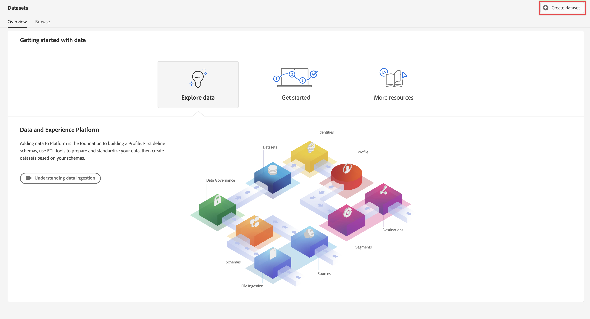

# Adobe Experience Platform Edge Network Server API를 통해 데이터 수집

이 빠른 시작 안내서에서는 Adobe Experience Platform Edge Network Server API 및 Edge Network를 사용하여 IoT 장치, 셋톱 박스, 게임 콘솔, 데스크탑 애플리케이션과 같은 장치에서 Adobe Experience Platform으로 직접 추적 데이터를 수집하는 방법을 설명합니다. 그런 다음 Customer Journey Analytics에서 해당 데이터를 사용합니다.

이를 수행하려면 다음을 수행해야 합니다.

- **Adobe Experience Platform의 스키마 및 데이터 세트**&#x200B;를 설정하여 수집하려는 데이터의 모델(스키마)과 실제로 데이터(데이터 세트)를 수집하는 위치를 정의합니다.

- **데이터스트림을 설정**&#x200B;하여 수집된 데이터를 Adobe Experience Platform에서 구성한 데이터 세트로 라우팅하는 Adobe Experience Platform Edge Network를 구성합니다.

- **서버 API 사용** 데스크탑, 게임 콘솔, IoT 장치 또는 셋톱 박스에서 실행되는 애플리케이션 또는 게임에서 직접 데이터스트림으로 데이터를 전송합니다.

- **배포 및 검증**. 개발을 반복하고 모든 것이 검증되면 프로덕션 환경에 라이브로 게시하는 환경을 갖습니다.

- Customer Journey Analytics에서 **연결 설정**. 이 연결에 (적어도) Adobe Experience Platform 데이터 세트가 포함되어야 합니다.

- Customer Journey Analytics에서 **데이터 보기를 설정**&#x200B;하여 Analysis Workspace에서 사용하려는 지표 및 차원을 정의합니다.

- Customer Journey Analytics에서 **프로젝트를 설정**&#x200B;하여 보고서 및 시각화를 빌드합니다.

>[!NOTE]
>
>이 빠른 시작 안내서는 IoT 장치, 셋톱 박스, 게임 콘솔 또는 데스크탑에서 실행되는 애플리케이션 또는 게임으로부터 수집된 데이터를 Adobe Experience Platform으로 수집하고 Customer Journey Analytics에서 사용하는 방법에 대한 간단한 안내서입니다. 추가 정보를 참고하는 경우 연구하는 것이 좋습니다.


## 스키마 및 데이터 세트 설정

데이터를 Adobe Experience Platform에 수집하려면 먼저 수집할 데이터를 정의해야 합니다. Adobe Experience Platform으로 수집된 모든 데이터는 다운스트림 기능에서 인식 및 활성화될 수 있도록 비정규화된 표준 구조를 준수해야 합니다. XDM(Experience Data Model)은 스키마 형태로 구조를 제공하는 표준 프레임워크입니다.

스키마를 정의한 후에는 하나 이상의 데이터 세트를 사용하여 데이터 컬렉션을 저장하고 관리합니다. 데이터 집합은 스키마(열) 및 필드(행)를 포함하는 데이터 컬렉션(일반적으로 테이블)에 대한 저장소 및 관리 구성입니다.

Adobe Experience Platform으로 수집된 모든 데이터는 데이터 세트로 지속되기 전에 사전 정의된 스키마를 준수해야 합니다.

### 스키마 설정

식별, 점수, 진행률 및 기타 정보 등 콘솔에서 게임을 플레이하는 프로필의 최소한의 데이터를 추적하려는 경우
먼저 이 데이터를 모델링하는 스키마를 정의해야 합니다.

스키마를 설정하는 경우:

1. 왼쪽 레일의 Adobe Experience Platform UI에서 [!UICONTROL 데이터 관리]에 있는 **[!UICONTROL 스키마]**&#x200B;를 선택합니다.

1. 선택 **[!UICONTROL 스키마 만들기]**. .
1. 스키마 만들기 마법사의 클래스 선택 단계에서 다음을 수행합니다.

   1. 선택 **[!UICONTROL 경험 이벤트]**.

      

      >[!INFO]
      >
      >    경험 이벤트 스키마를 사용하여 _비헤이비어_ 프로필 (예: 장면 이름, 장바구니에 추가하기 위한 푸시 버튼) 개별 프로필 스키마는 프로필 _속성_(예: 이름, 이메일, 성별)을 모델링하는 데 사용됩니다.

   1. **[!UICONTROL 다음]**&#x200B;을 선택합니다.


1. 다음에서 [!UICONTROL 이름 및 검토 단계] / [!UICONTROL 스키마 만들기] 마법사:

   1. 입력 **[!UICONTROL 스키마 표시 이름]** 스키마 및 (선택 사항) **[!UICONTROL 설명]**.

      

   1. **[!UICONTROL 마침]**&#x200B;을 선택합니다.

1. 예제 스키마의 구조 탭에서:

   1. [!UICONTROL 필드 그룹]에서 **[!UICONTROL + 추가]**&#x200B;를 선택합니다.

      

      필드 그룹은 손쉽게 스키마를 확장할 수 있는 재사용 가능한 오브젝트 및 속성의 컬렉션입니다.

   1. 다음에서 [!UICONTROL 필드 그룹 추가] 대화 상자에서 **[!UICONTROL 눈부신 불빛]** 목록의 필드 그룹입니다. 이 필드 그룹은 콘솔에서 Blinding Light라는 가상 게임을 플레이하는 사용자 진행률을 추적하기 위해 만들어집니다.

      

      미리보기 버튼을 선택하여 이 필드 그룹(예: `scores > afterMatch`)에 포함된 필드의 미리보기를 볼 수 있습니다.

      

      **[!UICONTROL 뒤로]**&#x200B;를 선택하여 미리보기를 닫습니다.

   1. **[!UICONTROL 필드 그룹 추가]**&#x200B;를 선택합니다.

1. 선택 **[!UICONTROL +]** 스키마 이름 옆에 있습니다.

   

1. 다음에서 [!UICONTROL 필드 속성] 패널, 입력 `identification` (으)로 [!UICONTROL 필드 이름], **[!UICONTROL 식별]** (으)로 [!UICONTROL 표시 이름], 선택 **[!UICONTROL 오브젝트]** (으)로 [!UICONTROL 유형] 및 선택 **[!UICONTROL ExperienceEvent 코어 v2.1]** (으)로 [!UICONTROL 필드 그룹].

   >[!NOTE]
   >
   >해당 필드 그룹을 사용할 수 없는 경우 ID 필드가 포함된 다른 필드 그룹을 찾습니다. 또는 [새 필드 그룹 만들기](https://experienceleague.adobe.com/docs/experience-platform/xdm/ui/resources/field-groups.html?lang=en) 및 [새 id 필드 추가](https://experienceleague.adobe.com/docs/experience-platform/xdm/ui/fields/identity.html?lang=en#define-a-identity-field) (와(과) 유사한 `ecid`, `crmId`및 필요한 기타)를 필드 그룹에 추가하고 해당 새 필드 그룹을 선택합니다.

   

   ID 개체는 스키마에 ID 기능을 추가합니다. 사용자의 경우 게임 콘솔에 로그인하는 데 사용하는 Experience Cloud ID 및 이메일 주소를 사용하여 게임을 플레이하는 프로필을 식별하려고 합니다. 개인의 식별을 추적하는 데 사용할 수 있는 다른 많은 속성들이 있습니다.

   **[!UICONTROL 적용]**&#x200B;을 선택하여 이 오브젝트를 스키마에 추가합니다.

1. 방금 추가한 식별 오브젝트에서 **[!UICONTROL ECID]** 필드를 선택한 다음 오른쪽 패널의 [!UICONTROL ID 네임스페이스] 목록에서 **[!UICONTROL ID]**, **[!UICONTROL 기본 ID]** 및 **[!UICONTROL ECID]**&#x200B;를 선택합니다.

   

   Experience Cloud ID를 Adobe Experience Platform ID 서비스가 프로필의 비헤이비어를 동일한 ECID와 결합하는 데 사용할 수 있는 기본 ID로 지정합니다.

   **[!UICONTROL 적용]**&#x200B;을 선택합니다. ECID 속성에 지문 아이콘이 표시되는 것을 볼 수 있습니다.

1. 방금 추가한 식별 오브젝트에서 **[!UICONTROL 이메일]** 필드를 선택한 다음 [!UICONTROL 필드 속성] 패널의 [!UICONTROL ID 네임스페이스] 목록에서 **[!UICONTROL ID]** 및 **[!UICONTROL 이메일]**&#x200B;을 선택합니다.

   

   이메일 주소를 Adobe Experience Platform ID 서비스가 프로필의 비헤이비어를 결합하는 데 사용할 수 있는 다른 ID로 지정합니다.

   **[!UICONTROL 적용]**&#x200B;을 선택합니다. 이메일 속성에 지문 아이콘이 표시되는 것을 볼 수 있습니다.

   **[!UICONTROL 저장]**&#x200B;을 선택합니다.

1. 스키마 이름을 표시하는 스키마의 루트 요소를 선택한 다음 **[!UICONTROL 프로필]** 스위치를 선택합니다.

   스키마를 프로필용으로 활성화하라는 메시지가 표시됩니다. 활성화한 후 데이터가 이 스키마를 기반으로 데이터 세트로 수집되면 해당 데이터는 실시간 고객 프로필에 병합됩니다.

   자세한 내용은 [실시간 고객 프로필에 사용할 스키마 활성화](https://experienceleague.adobe.com/docs/experience-platform/xdm/tutorials/create-schema-ui.html?lang=ko#profile)를 참조하십시오.

   >[!IMPORTANT]
   >
   >    프로필용으로 활성화된 스키마를 저장하고 나면 더 이상 프로필용으로 비활성화할 수 없습니다.

   

1. 스키마를 저장하려면 **[!UICONTROL 저장]**&#x200B;을 클릭합니다.

게임에서 캡처할 수 있는 데이터를 모델링하는 최소 스키마를 만들었습니다. 스키마를 통해 Experience Cloud ID 및 이메일 주소를 사용하여 프로필을 식별할 수 있습니다. 프로필에 대한 스키마를 활성화하면 콘솔 게임에서 캡처한 데이터가 실시간 고객 프로필에 추가됩니다.

동작 데이터 옆에 있는 콘솔에서 프로필 속성 데이터를 캡처할 수도 있습니다(예: 콘솔에 로그인한 프로필에 대한 세부 정보).

프로필 데이터를 캡처하려면 다음을 수행합니다.

- XDM 개별 프로필 클래스를 기반으로 스키마를 만듭니다.

- 프로필 코어 v2 필드 그룹을 스키마에 추가합니다.

- 프로필 코어 v2 필드 그룹을 기반으로 식별 오브젝트를 추가합니다.

- Experience Cloud ID를 기본 식별자로 정의하고 이메일을 식별자로 정의합니다.

- 프로필용으로 스키마 활성화

스키마에 필드 그룹 및 개별 필드 추가 및 제거에 대한 자세한 내용은 [UI에서 스키마 생성 및 편집](https://experienceleague.adobe.com/docs/experience-platform/xdm/ui/resources/schemas.html)을 참조하십시오.

### 데이터 세트 설정

스키마를 통해 데이터 모델은 정의됩니다. 이제 데이터 세트를 사용하여 해당 데이터를 저장하고 관리할 구성을 정의해야 합니다.

데이터 세트를 설정하는 경우:

1. 왼쪽 레일의 Adobe Experience Platform UI에서 [!UICONTROL 데이터 관리]에 있는 **[!UICONTROL 데이터 세트]**&#x200B;를 선택합니다.

2. **[!UICONTROL 데이터 세트 만들기]**&#x200B;를 선택합니다.

   

3. **[!UICONTROL 스키마에서 데이터 세트 만들기]**&#x200B;를 선택합니다.

   

4. 이전에 만든 스키마를 선택하고 **[!UICONTROL 다음]**&#x200B;을 선택합니다.

5. 데이터 세트의 이름을 지정하고 (선택 사항) 설명을 제공합니다.

   

6. **[!UICONTROL 마침]**&#x200B;을 선택합니다.

7. **[!UICONTROL 프로필]** 전환을 선택합니다.

   데이터 세트를 프로필용으로 활성화하라는 메시지가 표시됩니다. 활성화되면 데이터 세트는 수집된 데이터로 실시간 고객 프로필을 강화합니다.

   >[!IMPORTANT]
   >
   >    데이터 세트가 준수하는 스키마가 프로필용으로 활성화된 경우에만 데이터 세트를 프로필용으로 활성화할 수 있습니다.

   

데이터 세트를 보고, 미리 보고, 만들고, 삭제하는 방법에 대한 자세한 내용은 [데이터 세트 UI 안내서](https://experienceleague.adobe.com/docs/experience-platform/catalog/datasets/user-guide.html)를 참조하십시오. 데이터 세트를 실시간 고객 프로필용으로 활성화하는 방법.

## 데이터스트림 설정

데이터 스트림은 Adobe Experience Platform 웹 및 모바일 SDK와 Adobe Experience Platform Edge Network Server API를 구현할 때 서버측 구성을 나타냅니다. Adobe Experience Platform SDK 및 Edge Network Server API를 사용하여 데이터를 수집하면 데이터가 Adobe Experience Platform Edge Network로 전송됩니다. 데이터가 전달되는 서비스를 결정하는 데이터 스트림입니다.

설정에서는 게임에서 수집한 데이터를 Adobe Experience Platform의 데이터 세트로 전송하려고 합니다.

데이터스트림을 설정하는 경우:

1. 왼쪽 레일의 Adobe Experience Platform UI에서 [!UICONTROL 데이터 수집]의 **[!UICONTROL 데이터스트림]**&#x200B;을 선택합니다.

2. **[!UICONTROL 새 데이터스트림]**&#x200B;을 선택합니다.

3. 데이터스트림의 이름을 지정하고 데이터스트림에 대해 설명합니다. [!UICONTROL 이벤트 스키마] 목록에서 스키마를 선택합니다.

   

4. **[!UICONTROL 저장]**&#x200B;을 선택합니다.

5. **[!UICONTROL 서비스 추가]**&#x200B;를 선택합니다.

6. [!UICONTROL 서비스 추가 화면]에서:

   1. [!UICONTROL 서비스] 목록에서 **[!UICONTROL Adobe Experience Platform]**&#x200B;을 선택합니다.

   2. **[!UICONTROL 활성화됨]**&#x200B;이 선택되었는지 확인합니다.

   3. [!UICONTROL 이벤트 데이터 세트] 목록에서 데이터 세트를 선택합니다.

      

   4. 다른 설정을 종료하고 **[!UICONTROL 저장]**&#x200B;을 선택하여 데이터스트림을 저장합니다.

이제 게임에서 수집된 데이터를 Adobe Experience Platform의 데이터 세트로 전달하도록 데이터 스트림이 구성되었습니다.

데이터스트림을 구성하는 방법과 민감한 데이터를 처리하는 방법에 대한 자세한 내용은 [데이터스트림 개요](https://experienceleague.adobe.com/docs/experience-platform/datastreams/overview.html?lang=en)를 참조하십시오.

## Edge Network Server API 사용

게임 개발에서 적절한 경우 Adobe Experience Platform Edge Network Server API에 관련 호출을 추가할 수 있습니다.

예를 들어 플레이어의 점수를 업데이트하려면 다음을 사용합니다.

```
curl -X POST "https://server.adobedc.net/ee/v2/interact?dataStreamId={DATASTREAM_ID}"
-H "Authorization: Bearer {TOKEN}"
-H "x-gw-ims-org-id: {ORG_ID}"
-H "x-api-key: {API_KEY}"
-H "Content-Type: application/json"
-d '{
   "event": {
      "xdm": {
         "identityMap": {
            "Email_LC_SHA256": [
               {
                  "id": "0c7e6a405862e402eb76a70f8a26fc732d07c32931e9fae9ab1582911d2e8a3b",
                  "primary": true
               }
            ]
         },
         "eventType": "game.scoreUpdate",
         "{sandbox}": {
            "scores": {
               "afterMatch": 132391",
            }
         },
         "timestamp": "2021-08-09T14:09:20.859Z"
      }
   }
}'
```

예제 POST 요청에서 `{DATASTREAM_ID}` 는 이전에 구성한 예제 데이터 스트림의 식별자를 가리킵니다. `{sandbox}` 는 사용자 정의 블라인드 라이트 필드 그룹에 대한 경로를 식별하는 샌드박스의 고유 이름입니다.

다음을 참조하십시오 [대화형 데이터 수집](https://experienceleague.adobe.com/docs/experience-platform/edge-network-server-api/data-collection/interactive-data-collection.html?lang=en) 및 [비대화형 데이터 수집](https://experienceleague.adobe.com/docs/experience-platform/edge-network-server-api/data-collection/non-interactive-data-collection.html?lang=en) edge Network Server API를 사용하는 방법에 대한 자세한 내용을 보려면 여기를 클릭하십시오.

## 연결 설정

Customer Journey Analytics에서 Adobe Experience Platform 데이터를 사용하려면 스키마, 데이터 세트 및 워크플로 설정에서 도출된 데이터를 포함하는 연결을 만듭니다.

연결을 통해 Adobe Experience Platform의 데이터 세트를 작업 영역에 통합할 수 있습니다. 이러한 데이터 세트에 대해 보고하려면 먼저 Adobe Experience Platform과 작업 영역의 데이터 세트 간에 연결을 설정해야 합니다.

연결을 만드는 경우:

1. Customer Journey Analytics UI의 상단 탐색에서 **[!UICONTROL 연결]**&#x200B;을 선택합니다.

2. **[!UICONTROL 새 연결 만들기]**&#x200B;를 선택합니다.

3. [!UICONTROL 제목 없는 연결] 화면에서:

   [!UICONTROL 연결 설정]에서 연결의 이름을 지정하고 연결에 대해 설명합니다.

   [!UICONTROL 데이터 설정]의 [!UICONTROL 샌드박스 목록에서 올바른 샌드박스]를 선택하고 [!UICONTROL 일일 평균 이벤트 수] 목록에서 일일 이벤트 수를 선택합니다.

   

   **[!UICONTROL 데이터 세트 추가]**&#x200B;를 선택합니다.

   [!UICONTROL 데이터 세트 추가]의 [!UICONTROL 데이터 세트 선택] 단계에서:

   - 이전에 만든 데이터 세트 및/또는 연결에 포함할 기타 관련 데이터 세트를 선택합니다

   - **[!UICONTROL 다음]**&#x200B;을 선택합니다.

   [!UICONTROL 데이터 세트 추가]의 [!UICONTROL 데이터 세트 설정] 단계에서:

   - 각 데이터 세트의 경우:

      - Adobe Experience Platform의 데이터 세트 스키마에 정의된 사용 가능한 ID에서 [!UICONTROL 개인 ID]를 선택합니다.

      - [!UICONTROL 데이터 소스 유형] 목록에서 올바른 데이터 소스를 선택합니다. **[!UICONTROL 기타]**&#x200B;를 지정한 경우 데이터 소스에 대한 설명을 추가합니다.

      - 환경 설정에 따라 **[!UICONTROL 새 데이터 모두 가져오기]** 및 **[!UICONTROL 데이터 세트 기존 데이터 채우기]**&#x200B;를 설정합니다.

   - **[!UICONTROL 데이터 세트 추가]**&#x200B;를 선택합니다.

   **[!UICONTROL 저장]**&#x200B;을 선택합니다.

연결을 만들고 관리하는 방법과 데이터 세트를 선택하고 결합하는 방법에 대한 자세한 내용은 [연결 개요](../connections/overview.md)를 참조하십시오.

## 데이터 보기 설정

데이터 보기는 Customer Journey Analytics와 관련된 컨테이너입니다. 이를 통해 연결에서 데이터를 해석하는 방법을 결정할 수 있습니다. Analysis Workspace에서 사용 가능한 모든 차원과 지표를 지정하고, 해당 차원과 지표가 데이터를 얻을 수 있는 열을 지정합니다. 데이터 보기는 Analysis Workspace의 데이터에 대한 보고 준비에 따라 정의됩니다.

데이터 보기를 만드는 경우:

1. Customer Journey Analytics UI의 상단 탐색에서 **[!UICONTROL 데이터 보기]**&#x200B;를 선택합니다.

2. **[!UICONTROL 새 데이터 보기 만들기]**&#x200B;를 선택합니다.

3. [!UICONTROL 구성] 단계에서:

   [!UICONTROL 연결] 목록에서 연결을 선택합니다.

   연결의 이름을 지정하고 (선택 사항) 연결에 대해 설명합니다.

   

   **[!UICONTROL 저장 후 계속]**&#x200B;을 선택합니다.

4. [!UICONTROL 구성 요소] 단계에서:

   [!UICONTROL 지표] 또는 [!UICONTROL 차원] 구성 요소 상자에 포함할 스키마 필드 및/또는 표준 구성 요소를 추가합니다.

   **[!UICONTROL 저장 후 계속]**&#x200B;을 선택합니다.

5. [!UICONTROL 설정] 단계에서:

   

   설정은 그대로 두고 **[!UICONTROL 저장 후 마침]**&#x200B;을 선택합니다.

데이터 보기와 데이터 보기에서 사용할 수 있는 구성 요소를 만들고 편집하는 방법과 필터 및 세션 설정을 사용하는 방법에 대한 자세한 내용은 [데이터 보기 개요](../data-views/data-views.md)를 참조하십시오.


## 프로젝트 설정

Analysis Workspace는 데이터를 기반으로 신속하게 분석을 빌드하고 인사이트를 공유할 수 있는 유연한 브라우저 도구입니다. 작업 영역 프로젝트를 사용하여 데이터 구성 요소, 테이블 및 시각화를 결합하여 분석을 작성하고 조직의 모든 사람과 공유할 수 있습니다.

프로젝트를 만드는 경우:

1. Customer Journey Analytics UI의 상단 탐색에서 **[!UICONTROL 프로젝트]**&#x200B;를 선택합니다.

2. 왼쪽 탐색 영역에서 **[!UICONTROL 프로젝트]**&#x200B;를 선택합니다.

3. **[!UICONTROL 프로젝트 만들기]**&#x200B;를 선택합니다.

   

   **[!UICONTROL 빈 프로젝트]**&#x200B;를 선택합니다.

   

4. 목록에서 데이터 보기를 선택합니다.

   .

5. 첫 번째 보고서를 만들려면 [!UICONTROL 자유 형식 테이블] 다음에서 [!UICONTROL 패널].

구성 요소, 시각화 및 패널을 사용하여 프로젝트를 만들고 분석을 빌드하는 방법에 대한 자세한 내용은 [Analysis Workspace 개요](../analysis-workspace/home.md)를 참조하십시오.

>[!SUCCESS]
>
>모든 단계가 완료되었습니다. Adobe Experience Platform에서 수집할 데이터(스키마) 및 저장할 위치(데이터 세트)를 정의하는 것부터 시작합니다. 데이터가 해당 데이터 세트로 전달될 수 있도록 에지 네트워크에서 데이터 스트림을 구성했습니다. 그런 다음 Edge Network Server API를 사용하여 해당 데이터를 데이터스트림으로 전송했습니다. 게임 데이터 및 기타 데이터를 사용할 수 있도록 Customer Journey Analytics에서 연결을 정의했습니다. 데이터 보기 정의를 사용하면 사용할 차원과 지표를 지정할 수 있으며, 마지막으로 게임 데이터를 시각화하고 분석하는 첫 번째 프로젝트를 만들었습니다.
