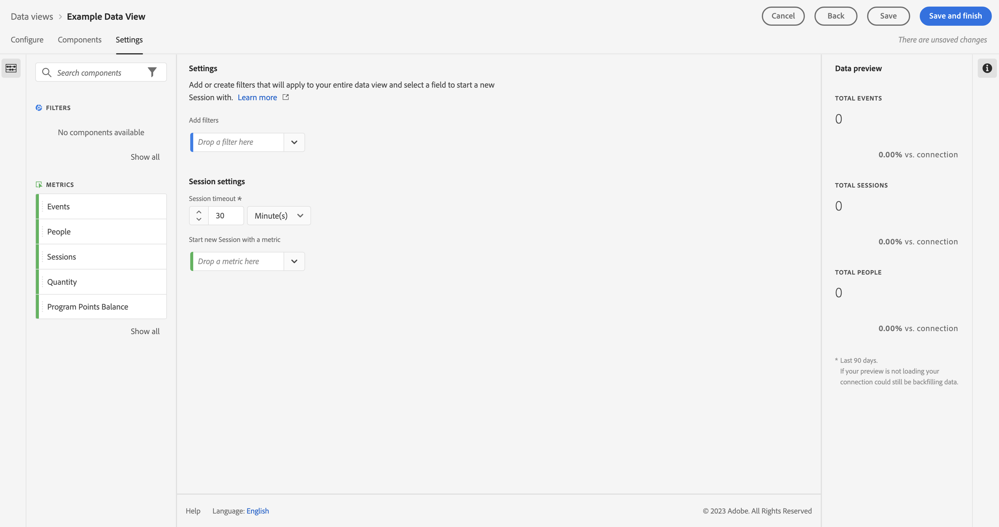

# 소스 커넥터를 사용하여 데이터 수집 및 사용

이 빠른 시작 안내서에서는 데이터 공급자의 소스 커넥터를 사용하여 데이터를 Adobe Experience Platform으로 수집한 다음 Customer Journey Analytics에서 해당 데이터를 사용하는 방법을 설명합니다.

이를 구현하려면 다음 작업을 수행해야 합니다.

- **Adobe Experience Platform의 스키마 및 데이터 세트**&#x200B;를 설정하여 수집하려는 데이터의 모델(스키마)과 실제로 데이터(데이터 세트)를 수집하는 위치를 정의합니다.

- Adobe Experience Platform의 **소스 커넥터**&#x200B;를 사용하여 구성된 데이터 세트로 데이터를 가져옵니다.

- Customer Journey Analytics에서 **연결 설정**. 이 연결에 (적어도) Adobe Experience Platform 데이터 세트가 포함되어야 합니다.

- Customer Journey Analytics에서 **데이터 보기를 설정**&#x200B;하여 Analysis Workspace에서 사용하려는 지표 및 차원을 정의합니다.

- Customer Journey Analytics에서 **프로젝트를 설정**&#x200B;하여 보고서 및 시각화를 빌드합니다.

>[!NOTE]
>
>이 빠른 시작 안내서는 소스 커넥터를 사용하여 데이터를 Adobe Experience Platform으로 수집하고 Customer Journey Analytics에서 사용하는 방법에 대한 간단한 안내서입니다. 추가 정보를 참고하는 경우 연구하는 것이 좋습니다.

## 스키마 및 데이터 세트 설정

데이터를 Adobe Experience Platform에 수집하려면 먼저 수집할 데이터를 정의해야 합니다. Adobe Experience Platform으로 수집된 모든 데이터는 다운스트림 기능에서 인식 및 활성화될 수 있도록 비정규화된 표준 구조를 준수해야 합니다. XDM(Experience Data Model)은 구조를 스키마 형태로 제공하는 표준 프레임워크입니다.

스키마를 정의한 후에는 하나 이상의 데이터 세트를 사용하여 데이터 컬렉션을 저장하고 관리합니다. 데이터 집합은 스키마(열) 및 필드(행)를 포함하는 데이터 컬렉션(일반적으로 테이블)에 대한 저장소 및 관리 구성입니다.

Adobe Experience Platform으로 수집된 모든 데이터는 데이터 세트로 지속되기 전에 사전 정의된 스키마를 준수해야 합니다.

### 스키마 설정

이 빠른 시작의 경우 일부 로열티 데이터(예: 로열티 ID, 로열티 포인트, 로열티 상태)를 수집하려고 합니다.
먼저 이 데이터를 모델링하는 스키마를 정의해야 합니다.

스키마를 설정하는 경우:

1. 왼쪽 레일의 Adobe Experience Platform UI에서 [!UICONTROL 데이터 관리]에 있는 **[!UICONTROL 스키마]**&#x200B;를 선택합니다.

1. **[!UICONTROL 스키마 만들기]**를 선택합니다.
.
1. 스키마 만들기 마법사의 클래스 선택 단계에서 다음을 수행합니다.

   1. **[!UICONTROL 개별 프로필]**&#x200B;을 선택하세요.

      

      >[!INFO]
      >
      >    경험 이벤트 스키마는 프로필의 _비헤이비어_(예: 장면 이름, 장바구니에 추가 푸시 버튼)를 모델링하는 데 사용됩니다. 개별 프로필 스키마는 프로필 _속성_(예: 이름, 이메일, 성별)을 모델링하는 데 사용됩니다.

   1. **[!UICONTROL 다음]**&#x200B;을 선택합니다.

1. [!UICONTROL 스키마 만들기] 마법사의 [!UICONTROL 이름 및 검토 단계]:

   1. **[!UICONTROL 스키마 디스플레이 이름]**&#x200B;과 **[!UICONTROL 설명]**(선택 사항)을 입력합니다.

      

   1. **[!UICONTROL 마침]**&#x200B;을 선택합니다.

1. 예제 스키마의 구조 탭에서:

   1. [!UICONTROL 필드 그룹]에서 **[!UICONTROL + 추가]**&#x200B;를 선택합니다.

      

      필드 그룹은 손쉽게 스키마를 확장할 수 있는 재사용 가능한 오브젝트 및 속성의 컬렉션입니다.

   1. [!UICONTROL 필드 그룹 추가] 대화 상자의 목록에서 **[!UICONTROL 로열티 세부 사항]** 필드 그룹을 선택합니다.

      

      미리보기 버튼을 선택하여 이 필드 그룹에 포함된 필드의 미리보기를 볼 수 있습니다.

      

      **[!UICONTROL 뒤로]**&#x200B;를 선택하여 미리보기를 닫습니다.

   1. **[!UICONTROL 필드 그룹 추가]**&#x200B;를 선택합니다.

1. [!UICONTROL 구조] 패널의 스키마 이름 옆에 있는 **[!UICONTROL +]**&#x200B;를 선택합니다.

   

1. [!UICONTROL 필드 속성] 패널에서 `Identification`을 이름으로, **[!UICONTROL 식별]**&#x200B;을 [!UICONTROL 디스플레이 이름]으로 입력하고 **[!UICONTROL 오브젝트]**&#x200B;를 [!UICONTROL 유형]으로 **[!UICONTROL 프로필 코어 v2]**&#x200B;를 [!UICONTROL 필드 그룹]으로 선택합니다.

   

   이 식별 오브젝트는 스키마에 식별 기능을 추가합니다. 이 경우 배치 데이터의 이메일 주소를 사용하여 로열티 정보를 식별하려고 합니다.

   **[!UICONTROL 적용]**&#x200B;을 선택하여 이 오브젝트를 스키마에 추가합니다.

1. 방금 추가한 식별 오브젝트에서 **[!UICONTROL 이메일]** 필드를 선택한 다음 [!UICONTROL 필드 속성] 패널에서 [!UICONTROL ID] 네임스페이스의 **[!UICONTROL ID]** 및 **[!UICONTROL 이메일]**&#x200B;을 선택합니다.

   

   이메일 주소를 Adobe Experience Platform ID 서비스가 프로필의 비헤이비어를 결합하는 데 사용할 수 있는 ID로 지정합니다.

   **[!UICONTROL 적용]**&#x200B;을 선택합니다. 이메일 속성에 지문 아이콘이 표시되는 것을 볼 수 있습니다.

1. 스키마(스키마 이름 포함)의 루트 수준을 선택한 다음 **[!UICONTROL 프로필]** 스위치를 선택합니다.

   스키마를 프로필용으로 활성화하라는 메시지가 표시됩니다. 활성화한 후 데이터가 이 스키마를 기반으로 데이터 세트로 수집되면 해당 데이터는 실시간 고객 프로필에 병합됩니다.

   자세한 내용은 [실시간 고객 프로필에 사용할 스키마 활성화](https://experienceleague.adobe.com/docs/experience-platform/xdm/tutorials/create-schema-ui.html#profile)를 참조하십시오.

   >[!IMPORTANT]
   >
   >    프로필용으로 활성화된 스키마를 저장하고 나면 더 이상 프로필용으로 비활성화할 수 없습니다.

   

1. 스키마를 저장하려면 **[!UICONTROL 저장]**&#x200B;을 클릭합니다.

Adobe Experience Platform으로 수집할 수 있는 로열티 데이터를 모델링하는 최소한의 스키마를 만들었습니다. 스키마를 통해 이메일 주소를 사용하여 프로필을 식별할 수 있습니다. 스키마를 프로필용으로 활성화하여 스트리밍 소스의 데이터가 실시간 고객 프로필에 추가되었는지 확인합니다.

스키마에 필드 그룹 및 개별 필드 추가 및 제거에 대한 자세한 내용은 [UI에서 스키마 생성 및 편집](https://experienceleague.adobe.com/docs/experience-platform/xdm/ui/resources/schemas.html)을 참조하십시오.

### 데이터 세트 설정

스키마를 통해 데이터 모델은 정의됩니다. 이제 데이터 세트를 통해 수행되는 해당 데이터를 저장하고 관리할 구성을 정의해야 합니다.

데이터 세트를 설정하는 경우:

1. 왼쪽 레일의 Adobe Experience Platform UI에서 [!UICONTROL 데이터 관리]에 있는 **[!UICONTROL 데이터 세트]**&#x200B;를 선택합니다.

2. **[!UICONTROL 데이터 세트 만들기]**&#x200B;를 선택합니다.

   

3. **[!UICONTROL 스키마에서 데이터 세트 만들기]**&#x200B;를 선택합니다.

   

4. 이전에 만든 스키마를 선택하고 **[!UICONTROL 다음]**&#x200B;을 선택합니다.

5. 데이터 세트의 이름을 지정하고 (선택 사항) 설명을 제공합니다.

   

6. **[!UICONTROL 마침]**&#x200B;을 선택합니다.

7. **[!UICONTROL 프로필]** 전환을 선택합니다.

   데이터 세트를 프로필용으로 활성화하라는 메시지가 표시됩니다. 활성화되면 데이터 세트는 수집된 데이터로 실시간 고객 프로필을 강화합니다.

   >[!IMPORTANT]
   >
   >    데이터 세트가 준수하는 스키마가 프로필용으로 활성화된 경우에만 데이터 세트를 프로필용으로 활성화할 수 있습니다.

   

데이터 세트를 보고, 미리 보고, 만들고, 삭제하는 방법에 대한 자세한 내용은 [데이터 세트 UI 안내서](https://experienceleague.adobe.com/docs/experience-platform/catalog/datasets/user-guide.html)를 참조하십시오. 데이터 세트를 실시간 고객 프로필용으로 활성화하는 방법.

## 소스 커넥터 사용

로열티 데이터를 수신하는 위치에 따라 Adobe Experience Platform에서 사용 가능한 관련 소스 커넥터를 선택합니다.

다양한 소스에서 데이터를 수집할 수 있습니다. 다음은 사용 가능한 여러 소스 중 일부에 불과합니다.

- Adobe 애플리케이션(소스 커넥터에는 [Adobe Analytics](https://experienceleague.adobe.com/ko/docs/experience-platform/sources/connectors/adobe-applications/analytics), [Adobe Audience Manager](https://experienceleague.adobe.com/en/docs/experience-platform/sources/connectors/adobe-applications/audience-manager) 등이 포함)

- 클라우드 저장소(소스 커넥터에는 [Amazon S3](https://experienceleague.adobe.com/en/docs/experience-platform/sources/connectors/cloud-storage/s3), [Azure Blob](https://experienceleague.adobe.com/en/docs/experience-platform/sources/connectors/cloud-storage/blob) 등이 포함)

- 데이터베이스(소스 커넥터에는 [Snowflake](https://experienceleague.adobe.com/en/docs/experience-platform/sources/connectors/databases/snowflake), [Microsoft SQL Server](https://experienceleague.adobe.com/en/docs/experience-platform/sources/connectors/databases/sql-server) 등이 포함)

소스 커넥터를 설정하는 경우:

1. Adobe Experience Platform의 왼쪽 레일에서 **[!UICONTROL 연결]**&#x200B;에서 [!UICONTROL 원본]을(를) 선택하십시오.

1. 사용 가능한 소스 커넥터 목록에서 소스 커넥터를 선택합니다.

   각 커넥터는 유사한 워크플로를 따릅니다.

   1. **[!UICONTROL 인증]**. 데이터 소스에 액세스할 수 있는 인증 세부 사항을 제공합니다.

   1. **[!UICONTROL 데이터 선택]**: 수집할 소스 데이터를 선택합니다.

   1. **[!UICONTROL 데이터 흐름 세부 정보]**: 데이터 흐름에 대한 추가 세부 정보(예: 이름 및 사용할 데이터 세트)를 제공합니다.

   1. **[!UICONTROL 매핑]**: 수신 소스 데이터 필드를 선택한 데이터 세트와 연결된 스키마의 속성에 매핑합니다.

   1. **[!UICONTROL 예약]**: 가능한 경우 데이터 수집을 예약할 수 있습니다.

   1. **[!UICONTROL 검토]**: 소스 커넥터 정의에 대한 검토가 표시됩니다.

1. 각 커넥터는 자세한 문서를 제공합니다. 이 설명서에 액세스하려면 경우:

   1. 커넥터 타일에서 [!UICONTROL 설정] 또는 [!UICONTROL 데이터 추가] 옆 **[!UICONTROL ...]**&#x200B;를 선택합니다.

      

   1. **[!UICONTROL 설명서 보기]**&#x200B;를 선택합니다.

Adobe Analytics 소스 커넥터 사용 방법에 대한 자세한 내용은 [기존 Adobe Analytics에서 데이터 수집 및 사용](./analytics.md)을 참조하십시오.

HTTP API 원본 커넥터를 사용하는 방법에 대한 자세한 내용은 [스트리밍 데이터 수집 및 사용](./streaming.md)을 참조하세요.

각 커넥터에 대한 추가 정보 링크를 포함하여 소스 커넥터의 개요는 [소스 커넥터 개요](https://experienceleague.adobe.com/docs/experience-platform/sources/home.html#terms-and-conditions)를 참조하십시오.

## 연결 설정

Customer Journey Analytics에서 Adobe Experience Platform 데이터를 사용하려면 스키마, 데이터 세트 및 워크플로 설정에서 도출된 데이터를 포함하는 연결을 만듭니다.

연결을 통해 Adobe Experience Platform의 데이터 세트를 작업 영역에 통합할 수 있습니다. 이러한 데이터 세트에 대해 보고하려면 먼저 Adobe Experience Platform과 Workspace의 데이터 세트 간에 연결을 설정해야 합니다.

연결을 만드는 경우:

1. Customer Journey Analytics UI의 상단 메뉴에서 **[!UICONTROL 연결]**(선택 사항: **[!UICONTROL 데이터 관리]**)을 선택합니다.

1. **[!UICONTROL 새 연결 만들기]**&#x200B;를 선택합니다.

1. **[!UICONTROL 제목 없는 연결]** 화면에서:

   1. **[!UICONTROL 연결 설정]**&#x200B;에서 연결의 이름을 지정하고 연결에 대해 설명합니다.

   1. **[!UICONTROL 데이터 설정]**&#x200B;의 **[!UICONTROL 샌드박스 목록에서 올바른 샌드박스]**&#x200B;를 선택하고 **[!UICONTROL 일일 평균 이벤트 수]** 목록에서 일일 이벤트 수를 선택합니다.

      

   1. **[!UICONTROL 데이터 세트 추가]**&#x200B;를 선택합니다.

1. **[!UICONTROL 데이터 세트 추가]**&#x200B;의 **[!UICONTROL 데이터 세트 선택]** 단계에서:

   1. 이전에 만든 데이터 세트(`Example Loyalty Dataset`)와 연결에 포함할 다른 데이터 세트를 선택합니다.

      

   1. **[!UICONTROL 다음]**&#x200B;을 선택합니다.

1. **[!UICONTROL 데이터 세트 추가]**&#x200B;의 **[!UICONTROL 데이터 세트 설정]** 단계에서:

   각 데이터 세트의 경우:

   1. Adobe Experience Platform의 데이터 세트 스키마에 정의된 사용 가능한 ID에서 [!UICONTROL 개인 ID]를 선택합니다.

   1. [!UICONTROL 데이터 소스 유형] 목록에서 올바른 데이터 소스를 선택합니다. **[!UICONTROL 기타]**&#x200B;를 지정한 경우 데이터 소스에 대한 설명을 추가합니다.

   1. 환경 설정에 따라 **[!UICONTROL 새 데이터 모두 가져오기]** 및 **[!UICONTROL 데이터 세트 기존 데이터 채우기]**&#x200B;를 설정합니다.

      

   1. **[!UICONTROL 데이터 세트 추가]**&#x200B;를 선택합니다.

   1. **[!UICONTROL 저장]**&#x200B;을 선택합니다.

[연결](/help/connections/overview.md)을 만든 후 [데이터 세트 선택 및 결합](/help/connections/combined-dataset.md), [연결의 데이터 세트 상태 및 데이터 수집 상태 확인](/help/connections/manage-connections.md) 등 다양한 관리 작업을 수행할 수 있습니다.

## 데이터 보기 설정

데이터 보기는 Customer Journey Analytics와 관련된 컨테이너입니다. 이를 통해 연결에서 데이터를 해석하는 방법을 결정할 수 있습니다. Analysis Workspace에서 사용 가능한 모든 차원과 지표를 지정하고, 해당 차원과 지표가 데이터를 얻을 수 있는 열을 지정합니다. 데이터 보기는 Analysis Workspace의 데이터에 대한 보고 준비에 따라 정의됩니다.

데이터 보기를 만드는 경우:

1. Customer Journey Analytics UI의 상단 메뉴에서 **[!UICONTROL 데이터 보기]**(선택 사항: **[!UICONTROL 데이터 관리]**)를 선택합니다.

2. **[!UICONTROL 새 데이터 보기 만들기]**&#x200B;를 선택합니다.

3. [!UICONTROL 구성] 단계에서:

   [!UICONTROL 연결] 목록에서 연결을 선택합니다.

   연결의 이름을 지정하고 (선택 사항) 연결에 대해 설명합니다.

   

   **[!UICONTROL 저장 후 계속]**&#x200B;을 선택합니다.

4. [!UICONTROL 구성 요소] 단계에서:

   [!UICONTROL 지표] 또는 [!UICONTROL 차원] 구성 요소 상자에 포함할 스키마 필드 및/또는 표준 구성 요소를 추가합니다.

   

   **[!UICONTROL 저장 후 계속]**&#x200B;을 선택합니다.

5. [!UICONTROL 설정] 단계에서:

   

   설정은 그대로 두고 **[!UICONTROL 저장 후 마침]**&#x200B;을 선택합니다.

데이터 보기를 만들고 편집하는 방법, 데이터 보기에서 사용할 수 있는 구성 요소, 세그먼트 및 세션 설정을 사용하는 방법에 대한 자세한 내용은 [데이터 보기 개요](../data-views/data-views.md)를 참조하십시오.

## 프로젝트 설정

Analysis Workspace는 데이터를 기반으로 신속하게 분석을 빌드하고 인사이트를 공유할 수 있는 유연한 브라우저 도구입니다. 작업 영역 프로젝트를 사용하여 데이터 구성 요소, 테이블 및 시각화를 결합하여 분석을 작성하고 조직의 모든 사람과 공유할 수 있습니다.

프로젝트를 만드는 경우:

1. Customer Journey Analytics UI의 상단 메뉴에서 **[!UICONTROL 프로젝트]**&#x200B;를 선택합니다.

2. 왼쪽 탐색 영역에서 **[!UICONTROL 프로젝트]**&#x200B;를 선택합니다.

3. **[!UICONTROL 프로젝트 만들기]**&#x200B;를 선택합니다.

   

   **[!UICONTROL 빈 프로젝트]**&#x200B;를 선택합니다.

   

4. 목록에서 데이터 보기를 선택합니다.

   .

5. 첫 번째 보고서를 만들려면 [!UICONTROL 패널]의 [!UICONTROL 자유 형식 테이블]에서 차원 및 지표를 끌어서 놓습니다. 예를 들어 `Program Points Balance` 및 `Page View`를 지표로 `email`을 차원으로 드래그하여 웹 사이트를 방문한 적이 있고, 로열티 포인트를 수집하는 로열티 프로그램의 일부인 프로필에 대한 간단한 개요를 살펴봅니다.

   

구성 요소, 시각화 및 패널을 사용하여 프로젝트를 만들고 분석을 빌드하는 방법에 대한 자세한 내용은 [Analysis Workspace 개요](../analysis-workspace/home.md)를 참조하십시오.

>[!SUCCESS]
>
>모든 단계가 완료되었습니다. Adobe Experience Platform에서 수집할 로열티 데이터(스키마)와 이를 저장할 위치(데이터 세트) 정의를 시작으로 로열티 데이터를 제공하는 적절한 소스 커넥터를 구성했습니다. Customer Journey Analytics에서 연결을 정의하여 수집된 로열티 데이터 및 기타 데이터를 사용했습니다. 데이터 보기 정의를 통해 사용할 차원 및 지표를 지정했고 최종적으로 데이터를 시각화 및 분석하는 첫 번째 프로젝트를 제작했습니다.
