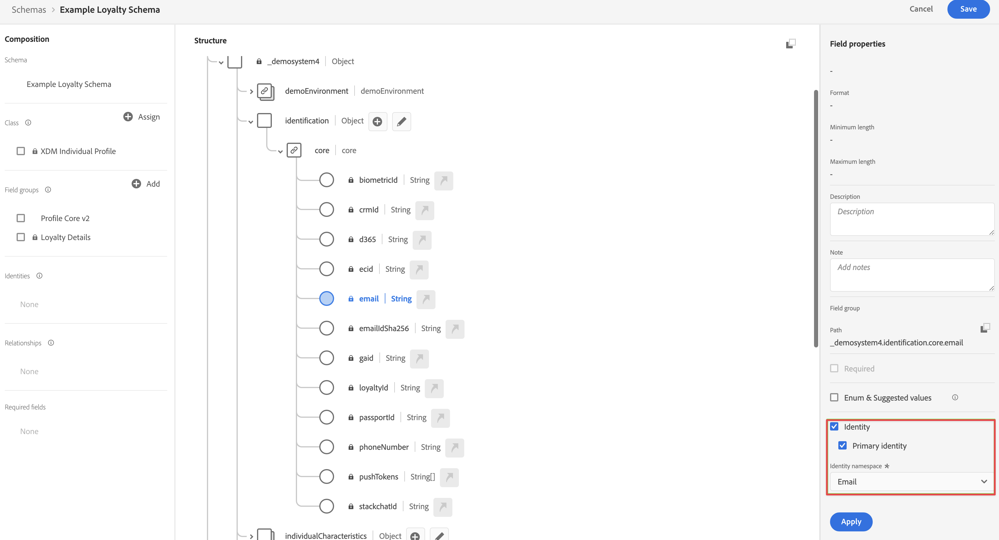
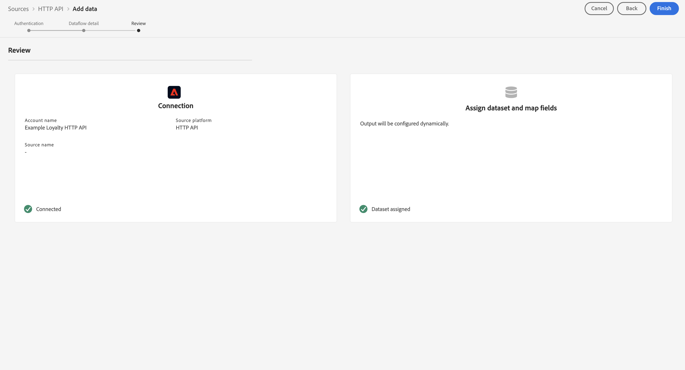

# 스트리밍 데이터 수집 및 사용

이 빠른 시작 안내서에서는 스트리밍 데이터를 Adobe Experience Platform으로 수집한 다음 Customer Journey Analytics에서 해당 데이터를 사용하는 방법을 설명합니다.

이를 구현하려면 다음 작업을 수행해야 합니다.

- **Adobe Experience Platform의 스키마 및 데이터 세트**&#x200B;를 설정하여 수집하려는 데이터의 모델(스키마)과 실제로 데이터(데이터 세트)를 수집하는 위치를 정의합니다.

- **HTTP API 소스 커넥터를 사용**&#x200B;하여 데이터를 Adobe Experience Platform에서 구성된 데이터 세트로 쉽게 스트리밍할 수 있습니다.

- Customer Journey Analytics에서 **연결 설정**. 이 연결에 (적어도) Adobe Experience Platform 데이터 세트가 포함되어야 합니다.

- Customer Journey Analytics에서 **데이터 보기를 설정**&#x200B;하여 Analysis Workspace에서 사용하려는 지표 및 차원을 정의합니다.

- Customer Journey Analytics에서 **프로젝트를 설정**&#x200B;하여 보고서 및 시각화를 빌드합니다.


>[!NOTE]
>
>이 빠른 시작 안내서는 스트리밍 데이터를 Adobe Experience Platform으로 수집하고 Customer Journey Analytics에서 사용하는 방법에 대한 간단한 안내서입니다. 추가 정보를 참고하는 경우 연구하는 것이 좋습니다.

## 스키마 및 데이터 세트 설정

데이터를 Adobe Experience Platform에 수집하려면 먼저 수집할 데이터를 정의해야 합니다. Adobe Experience Platform으로 수집된 모든 데이터는 다운스트림 기능에서 인식 및 활성화될 수 있도록 비정규화된 표준 구조를 준수해야 합니다. 경험 데이터 모델(XDM)은 스키마 형태로 이러한 구조를 제공하는 표준 프레임워크입니다.

스키마를 정의한 후에는 하나 이상의 데이터 세트를 사용하여 데이터 컬렉션을 저장하고 관리합니다. 데이터 집합은 스키마(열) 및 필드(행)를 포함하는 데이터 컬렉션(일반적으로 테이블)에 대한 저장소 및 관리 구성입니다.

Adobe Experience Platform으로 수집된 모든 데이터는 데이터 세트로 지속되기 전에 사전 정의된 스키마를 준수해야 합니다.

### 스키마 설정

이 빠른 시작의 경우 일부 로열티 데이터(예: 로열티 ID, 로열티 포인트, 로열티 상태)를 수집하려고 합니다.
먼저 이 데이터를 모델링하는 스키마를 정의해야 합니다.

스키마를 설정하는 경우:

1. 왼쪽 레일의 Adobe Experience Platform UI에서 [!UICONTROL 데이터 관리]에 있는 **[!UICONTROL 스키마]**&#x200B;를 선택합니다.

1. **[!UICONTROL 스키마 만들기]**&#x200B;를 선택합니다.
.
1. 스키마 만들기 마법사의 클래스 선택 단계에서 다음을 수행합니다.

   1. **[!UICONTROL 개별 프로필]**&#x200B;을 선택하세요.

      

      >[!INFO]
      >
      >    경험 이벤트 스키마는 프로필의 _비헤이비어_(예: 장면 이름, 장바구니에 추가 푸시 버튼)를 모델링하는 데 사용됩니다. 개별 프로필 스키마는 프로필 _속성_(예: 이름, 이메일, 성별)을 모델링하는 데 사용됩니다.

   1. **[!UICONTROL 다음]**&#x200B;을 선택합니다.


1. [!UICONTROL 스키마 만들기] 마법사의 [!UICONTROL 이름 및 검토 단계]:

   1. **[!UICONTROL 스키마 디스플레이 이름]**&#x200B;과 **[!UICONTROL 설명]**(선택 사항)을 입력합니다.

      

   1. **[!UICONTROL 마침]**&#x200B;을 선택합니다.

1. 예제 스키마의 구조 탭에서:

   1. [!UICONTROL 필드 그룹]에서 **[!UICONTROL + 추가]**&#x200B;를 선택합니다.

      

      필드 그룹은 손쉽게 스키마를 확장할 수 있는 재사용 가능한 오브젝트 및 속성의 컬렉션입니다.

   1. [!UICONTROL 필드 그룹 추가] 대화 상자의 목록에서 **[!UICONTROL 로열티 세부 사항]** 필드 그룹을 선택합니다.

      

      미리보기 버튼을 선택하여 이 필드 그룹에 포함된 필드의 미리보기를 볼 수 있습니다.

      

      **[!UICONTROL 뒤로]**&#x200B;를 선택하여 미리보기를 닫습니다.

   1. **[!UICONTROL 필드 그룹 추가]**&#x200B;를 선택합니다.

1. [!UICONTROL 구조] 패널의 스키마 이름 옆에 있는 **[!UICONTROL +]**&#x200B;를 선택합니다.

   

1. [!UICONTROL 필드 속성] 패널에서 `Identification`을 이름으로, **[!UICONTROL 식별]**&#x200B;을 [!UICONTROL 디스플레이 이름]으로 입력하고 **[!UICONTROL 오브젝트]**&#x200B;를 [!UICONTROL 유형]으로 **[!UICONTROL 프로필 코어 v2]**&#x200B;를 [!UICONTROL 필드 그룹]으로 선택합니다.

   

   이 식별 오브젝트는 스키마에 식별 기능을 추가합니다. 이 경우 배치 데이터의 이메일 주소를 사용하여 로열티 정보를 식별하려고 합니다.

   **[!UICONTROL 적용]**&#x200B;을 선택하여 이 오브젝트를 스키마에 추가합니다.

1. 방금 추가한 식별 오브젝트에서 **[!UICONTROL 이메일]** 필드를 선택한 다음 [!UICONTROL 필드 속성] 패널에서 [!UICONTROL ID] 네임스페이스의 **[!UICONTROL ID]** 및 **[!UICONTROL 이메일]**&#x200B;을 선택합니다.

   

   이메일 주소를 Adobe Experience Platform ID 서비스가 프로필의 비헤이비어를 결합하는 데 사용할 수 있는 ID로 지정합니다.

   **[!UICONTROL 적용]**&#x200B;을 선택합니다. 이메일 속성에 지문 아이콘이 표시되는 것을 볼 수 있습니다.

1. 스키마(스키마 이름 포함)의 루트 수준을 선택한 다음 **[!UICONTROL 프로필]** 스위치를 선택합니다.

   스키마를 프로필용으로 활성화하라는 메시지가 표시됩니다. 활성화한 후 데이터가 이 스키마를 기반으로 데이터 세트로 수집되면 해당 데이터는 실시간 고객 프로필에 병합됩니다.

   자세한 내용은 [실시간 고객 프로필에 사용할 스키마 활성화](https://experienceleague.adobe.com/docs/experience-platform/xdm/tutorials/create-schema-ui.html?lang=ko#profile)를 참조하십시오.

   >[!IMPORTANT]
   >
   >    프로필용으로 활성화된 스키마를 저장하고 나면 더 이상 프로필용으로 비활성화할 수 없습니다.

   

1. 스키마를 저장하려면 **[!UICONTROL 저장]**&#x200B;을 클릭합니다.

Adobe Experience Platform으로 수집할 수 있는 로열티 데이터를 모델링하는 최소한의 스키마를 만들었습니다. 스키마를 통해 이메일 주소를 사용하여 프로필을 식별할 수 있습니다. 스키마를 프로필용으로 활성화하여 스트리밍 소스의 데이터가 실시간 고객 프로필에 추가되었는지 확인합니다.

스키마에 필드 그룹 및 개별 필드 추가 및 제거에 대한 자세한 내용은 [UI에서 스키마 생성 및 편집](https://experienceleague.adobe.com/docs/experience-platform/xdm/ui/resources/schemas.html?lang=ko)을 참조하십시오.

### 데이터 세트 설정

스키마를 통해 데이터 모델은 정의됩니다. 이제 데이터 세트를 통해 수행되는 해당 데이터를 저장하고 관리할 구성을 정의해야 합니다.

데이터 세트를 설정하는 경우:

1. 왼쪽 레일의 Adobe Experience Platform UI에서 [!UICONTROL 데이터 관리]에 있는 **[!UICONTROL 데이터 세트]**&#x200B;를 선택합니다.

2. **[!UICONTROL 데이터 세트 만들기]**&#x200B;를 선택합니다.

   

3. **[!UICONTROL 스키마에서 데이터 세트 만들기]**&#x200B;를 선택합니다.

   

4. 이전에 만든 스키마를 선택하고 **[!UICONTROL 다음]**&#x200B;을 선택합니다.

5. 데이터 세트의 이름을 지정하고 (선택 사항) 설명을 제공합니다.

   

6. **[!UICONTROL 마침]**&#x200B;을 선택합니다.

7. **[!UICONTROL 프로필]** 전환을 선택합니다.

   데이터 세트를 프로필용으로 활성화하라는 메시지가 표시됩니다. 활성화되면 데이터 세트는 수집된 데이터로 실시간 고객 프로필을 강화합니다.

   >[!IMPORTANT]
   >
   >    데이터 세트가 준수하는 스키마가 프로필용으로 활성화된 경우에만 데이터 세트를 프로필용으로 활성화할 수 있습니다.

   

데이터 세트를 보고, 미리 보고, 만들고, 삭제하는 방법에 대한 자세한 내용은 [데이터 세트 UI 안내서](https://experienceleague.adobe.com/docs/experience-platform/catalog/datasets/user-guide.html?lang=ko)를 참조하십시오. 데이터 세트를 실시간 고객 프로필용으로 활성화하는 방법.


## HTTP API 스트리밍 연결 설정

소스 애플리케이션은 만든 스키마를 준수하고 형태가 유사한 데이터를 스트리밍합니다.

```json
{
    ...
    "_demosystem4": {
        "identification": {
            "core": {
                "email": "abrocking0@blog.com",
                "loyaltyId": "793406",
            }
        }
    },
    "loyalty": {
        "loyaltyID": [
            "793406"
        ],
        "points": 82.16,
        "status": "Silver"
    }
    ...
}
```

이 데이터를 만든 데이터 세트로 스트리밍하려면 전송할 해당 데이터에 대한 스트리밍 끝점을 정의해야 합니다. 스트리밍 끝점은 HTTP API 소스 커넥터를 사용하여 만들어집니다.

HTTP API 소스 커넥터를 만드는 경우:

1. Experience Platform UI에서 왼쪽 레일의 [!UICONTROL 연결] 아래에 있는 **[!UICONTROL 소스]**&#x200B;를 선택합니다.

2. [!UICONTROL 범주] 목록에서 **[!UICONTROL 스트리밍]**&#x200B;을 선택합니다.

3. [!UICONTROL HTTP API] 타일에서 **설정**&#x200B;을 선택합니다.

   

4. [!UICONTROL 데이터 추가] 화면의 [!UICONTROL 인증] 단계에서:

   HTTP API 연결 이름과 이에 대한 설명을 입력합니다.

   **[!UICONTROL 호환 가능한 XDM]**&#x200B;을 선택하여 스트리밍하는 데이터가 기존 XDM 스키마와 호환되었음을 보여줍니다.

   **[!UICONTROL 소스에 연결]**&#x200B;을 선택합니다. 연결이 완료되면 [!UICONTROL 연결됨]이 표시됩니다.

   

   계속하려면 **[!UICONTROL 다음]**&#x200B;을 선택합니다.

5. [!UICONTROL 데이터 추가] 화면의 [!UICONTROL 데이터 흐름 세부 정보] 단계에서:

   **[!UICONTROL 기존 데이터 세트]**&#x200B;를 선택하고, 데이터 세트 목록에서 데이터 세트를 선택한 다음 [!UICONTROL 데이터 흐름 이름]을 지정합니다.

   

   **[!UICONTROL 다음]**&#x200B;을 선택합니다.

6. [!UICONTROL 데이터 추가] 화면의 [!UICONTROL 검토] 단계에서는 HTTP API 연결에 대한 개요를 제공합니다.

   

   **[!UICONTROL 마침]**&#x200B;을 선택합니다.

7. HTTP API 스트리밍 엔드포인트에 대한 최종 정의를 확인합니다.

   

스트리밍 엔드포인트 URL을 복사하여 사용하면 데이터를 Adobe Experience Platform 로열티 데이터 세트로 스트리밍하는 로열티 애플리케이션을 구성할 수 있습니다.

다음과 같은 포괄적인 자습서를 보려면 [UI를 사용하여 HTTP API 스트리밍 연결 만들기](https://experienceleague.adobe.com/docs/experience-platform/sources/ui-tutorials/create/streaming/http.html?lang=ko)를 참조하십시오.

- 인증 사용 방법,
- 들어오는 데이터가 XDM 스키마와 호환되지 않을 때 데이터를 매핑하는 방법 및
- 스트리밍 커넥터 설정의 일부로 데이터 세트를 만드는 방법.


## 연결 설정

Customer Journey Analytics에서 Adobe Experience Platform 데이터를 사용하려면 스키마, 데이터 세트 및 워크플로 설정에서 도출된 데이터를 포함하는 연결을 만듭니다.

연결을 통해 Adobe Experience Platform의 데이터 세트를 작업 영역에 통합할 수 있습니다. 이러한 데이터 세트에 대해 보고하려면 먼저 Adobe Experience Platform과 Workspace의 데이터 세트 간에 연결을 설정해야 합니다.

연결을 만드는 경우:

1. Customer Journey Analytics UI의 상단 메뉴에서 **[!UICONTROL 연결]**(선택 사항: **[!UICONTROL 데이터 관리]**)을 선택합니다.

2. **[!UICONTROL 새 연결 만들기]**&#x200B;를 선택합니다.

3. [!UICONTROL 제목 없는 연결] 화면에서:

   [!UICONTROL 연결 설정]에서 연결의 이름을 지정하고 연결에 대해 설명합니다.

   [!UICONTROL 데이터 설정]의 [!UICONTROL 샌드박스 목록에서 올바른 샌드박스]를 선택하고 [!UICONTROL 일일 평균 이벤트 수] 목록에서 일일 이벤트 수를 선택합니다.

   

   **[!UICONTROL 데이터 세트 추가]**&#x200B;를 선택합니다.

   [!UICONTROL 데이터 세트 추가]의 [!UICONTROL 데이터 세트 선택] 단계에서:

   - 이전에 만든 데이터 세트(`Example Loyalty Dataset`)와 연결에 포함할 다른 데이터 세트를 선택합니다.

     

   - **[!UICONTROL 다음]**&#x200B;을 선택합니다.

   [!UICONTROL 데이터 세트 추가]의 [!UICONTROL 데이터 세트 설정] 단계에서:

   - 각 데이터 세트의 경우:

      - Adobe Experience Platform의 데이터 세트 스키마에 정의된 사용 가능한 ID에서 [!UICONTROL 개인 ID]를 선택합니다.

      - [!UICONTROL 데이터 소스 유형] 목록에서 올바른 데이터 소스를 선택합니다. **[!UICONTROL 기타]**&#x200B;를 지정한 경우 데이터 소스에 대한 설명을 추가합니다.

      - 환경 설정에 따라 **[!UICONTROL 새 데이터 모두 가져오기]** 및 **[!UICONTROL 데이터 세트 기존 데이터 채우기]**&#x200B;를 설정합니다.

     

   - **[!UICONTROL 데이터 세트 추가]**&#x200B;를 선택합니다.

   **[!UICONTROL 저장]**&#x200B;을 선택합니다.

연결을 만들고 관리하는 방법과 데이터 세트를 선택하고 결합하는 방법에 대한 자세한 내용은 [연결 개요](../connections/overview.md)를 참조하십시오.

## 데이터 보기 설정

데이터 보기는 Customer Journey Analytics와 관련된 컨테이너입니다. 이를 통해 연결에서 데이터를 해석하는 방법을 결정할 수 있습니다. Analysis Workspace에서 사용 가능한 모든 차원과 지표를 지정하고, 해당 차원과 지표가 데이터를 얻을 수 있는 열을 지정합니다. 데이터 보기는 Analysis Workspace의 데이터에 대한 보고 준비에 따라 정의됩니다.

데이터 보기를 만드는 경우:

1. Customer Journey Analytics UI의 상단 메뉴에서 **[!UICONTROL 데이터 보기]**(선택 사항: **[!UICONTROL 데이터 관리]**)를 선택합니다.

2. **[!UICONTROL 새 데이터 보기 만들기]**&#x200B;를 선택합니다.

3. [!UICONTROL 구성] 단계에서:

   [!UICONTROL 연결] 목록에서 연결을 선택합니다.

   연결의 이름을 지정하고 (선택 사항) 연결에 대해 설명합니다.

   

   **[!UICONTROL 저장 후 계속]**&#x200B;을 선택합니다.

4. [!UICONTROL 구성 요소] 단계에서:

   [!UICONTROL 지표] 또는 [!UICONTROL 차원] 구성 요소 상자에 포함할 스키마 필드 및/또는 표준 구성 요소를 추가합니다.

   

   **[!UICONTROL 저장 후 계속]**&#x200B;을 선택합니다.

5. [!UICONTROL 설정] 단계에서:

   

   설정은 그대로 두고 **[!UICONTROL 저장 후 마침]**&#x200B;을 선택합니다.

데이터 보기를 만들고 편집하는 방법, 데이터 보기에서 사용할 수 있는 구성 요소, 세그먼트 및 세션 설정을 사용하는 방법에 대한 자세한 내용은 [데이터 보기 개요](../data-views/data-views.md)를 참조하십시오.


## 프로젝트 설정

Analysis Workspace는 데이터를 기반으로 신속하게 분석을 빌드하고 인사이트를 공유할 수 있는 유연한 브라우저 도구입니다. 작업 영역 프로젝트를 사용하여 데이터 구성 요소, 테이블 및 시각화를 결합하여 분석을 작성하고 조직의 모든 사람과 공유할 수 있습니다.

프로젝트를 만드는 경우:

1. Customer Journey Analytics UI의 상단 메뉴에서 **[!UICONTROL 프로젝트]**&#x200B;를 선택합니다.

2. 왼쪽 탐색 영역에서 **[!UICONTROL 프로젝트]**&#x200B;를 선택합니다.

3. **[!UICONTROL 프로젝트 만들기]**&#x200B;를 선택합니다.

   

   **[!UICONTROL 빈 프로젝트]**&#x200B;를 선택합니다.

   

4. 목록에서 데이터 보기를 선택합니다.

   .

5. 첫 번째 보고서를 만들려면 [!UICONTROL 패널]의 [!UICONTROL 자유 형식 테이블]에서 차원 및 지표를 끌어서 놓습니다. 예를 들어 `Program Points Balance` 및 `Page View`를 지표로 `email`을 차원으로 드래그하여 웹 사이트를 방문한 적이 있고, 로열티 포인트를 수집하는 로열티 프로그램의 일부인 프로필에 대한 간단한 개요를 살펴봅니다.

   

구성 요소, 시각화 및 패널을 사용하여 프로젝트를 만들고 분석을 빌드하는 방법에 대한 자세한 내용은 [Analysis Workspace 개요](../analysis-workspace/home.md)를 참조하십시오.

>[!SUCCESS]
>
>모든 단계가 완료되었습니다. Adobe Experience Platform에서 수집할 로열티 데이터(스키마)와 이를 저장할 위치(데이터 세트) 정의를 시작으로 로열티 데이터를 데이터 세트로 직접 스트리밍하는 HTTP API 소스 커넥터를 구성했습니다. 데이터 보기 정의를 통해 사용할 차원 및 지표를 지정했고 최종적으로 데이터를 시각화 및 분석하는 첫 번째 프로젝트를 제작했습니다.
