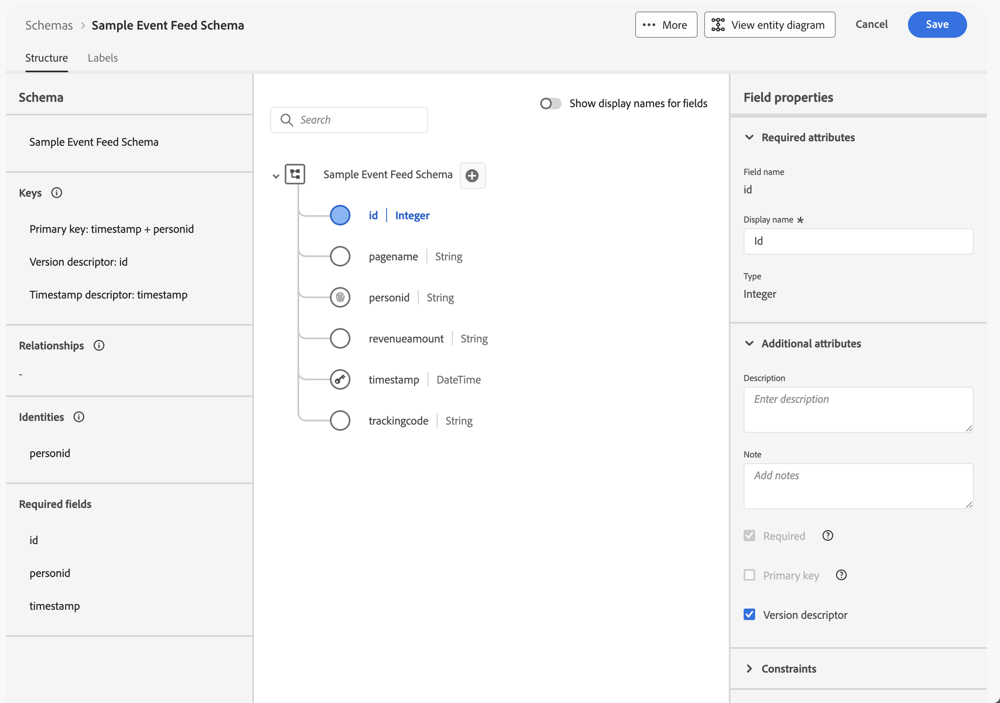

# 관계형 데이터 미러링 및 사용

{{release-limited-testing}}

이 빠른 시작 안내서에서는 [Customer Journey Analytics용 Experience Platform Data Mirror](data-mirror.md)를 사용하여 Adobe Experience Platform의 Data Warehouse 기본 솔루션에서 관계형 데이터를 미러링하는 방법을 설명합니다. 그런 다음 Customer Journey Analytics에서 해당 데이터를 사용합니다.

이 사용 사례를 달성하려면 다음을 수행해야 합니다.

* **Data Warehouse 네이티브 솔루션을 사용**&#x200B;하여 Experience Platform에서 미러링할 데이터를 저장합니다. 그런 다음 Customer Journey Analytics의 해당 데이터를 사용하여 보고하고 분석합니다.

* **Experience Platform에서 스키마를 설정**&#x200B;하여 미러링할 데이터의 모델(스키마)을 정의합니다.

* Experience Platform에서 **소스 커넥터를 사용**&#x200B;하여 미러링된 데이터를 데이터 세트로 가져옵니다.

* Customer Journey Analytics에서 **연결 설정**. 이 연결에는 Experience Platform 관계형 데이터 세트가 포함되어야 합니다.

* Customer Journey Analytics에서 **데이터 보기를 설정**&#x200B;하여 Analysis Workspace에서 사용하려는 지표 및 차원을 정의합니다.

* Customer Journey Analytics에서 **프로젝트를 설정**&#x200B;하여 보고서 및 시각화를 빌드합니다.

Experience Platform Data Mirror for Customer Journey Analytics에는 관계형 스키마가 필요합니다.


>[!NOTE]
>
>이 빠른 시작 안내서는 Adobe Experience Platform의 관계형 데이터를 미러링하고 Customer Journey Analytics에서 해당 데이터를 사용하는 방법에 대해 간략하게 설명합니다. 추가 정보를 참고하는 경우 연구하는 것이 좋습니다.

{{relational-model-based}}

## Data Warehouse 네이티브 솔루션 사용

이 빠른 시작 안내서에서는 [[!DNL Google BigQuery]](datawarehouse.md#google-bigquery)을(를) Data Warehouse 기본 솔루션으로 사용합니다. 다른 [지원되는 솔루션](datawarehouse.md)은(는) [[!DNL Snowflake]](datawarehouse.md#snowflake) 및 [[!DNL Azure Databricks]](datawarehouse.md#azure-databricks)입니다.

[!DNL Google BigQuery] 내에서 다음 예제 데이터는 **[!UICONTROL eventdata]** 테이블에 정기적으로 저장되고 업데이트됩니다.

+++ 샘플 이벤트 데이터 세부 정보

| timestamp | id | pagename | 성격 | trackingcode | 주문 수 | 수익 금액 |
| :---                      |  ---: | :---              | :---            | :---          |   ---: | :---           |
| 2025-03-06T19:15:39+00:00 | 10001 | 홈 페이지 | person-1abc123 | abc123 |        |                |
| 2025-03-06T19:15:39+00:00 | 10002 | 확인 페이지 | person-1abc123 |               | 1 | 174.25 |
| 2025-03-06T19:15:39+00:00 | 10003 | 홈 페이지 | person-2def123 | def123 |        |                |
| 2025-03-06T19:15:39+00:00 | 10004 | 홈 페이지 | person-3ghi123 | ghi123 |        |                |
| 2025-03-06T19:15:39+00:00 | 10005 | 확인 페이지 | person-3ghi123 |               | 1 | 149.25 |
| 2025-03-06T19:15:39+00:00 | 10006 | 홈 페이지 | person-4abc456 | abc456 |        |                |
| 2025-03-06T19:15:39+00:00 | 10007 | 홈 페이지 | person-5def456 | def456 |        |                |
| 2025-03-06T19:15:39+00:00 | 10008 | 홈 페이지 | person-6ghi456 | ghi456 |        |                |
| 2025-03-06T19:15:39+00:00 | 10009 | 확인 페이지 | person-6ghi456 |               | 1 | 159.25 |
| 2025-03-06T19:15:39+00:00 | 10010 | 홈 페이지 | person-7abc789 | abc789 |        |                |
| 2025-03-06T19:15:39+00:00 | 10011 | 홈 페이지 | person-8def789 | def789 |        |                |
| 2025-03-06T19:15:39+00:00 | 10012 | 홈 페이지 | person-9ghi789 | ghi789 |        |                |
| 2025-03-06T19:15:39+00:00 | 10013 | 확인 페이지 | person-9ghi789 |               | 1 | 124.25 |
| 2025-03-06T19:15:39+00:00 | 10014 | 홈 페이지 | person-10abc987 | abc987 |        |                |
| 2025-03-06T19:15:39+00:00 | 10015 | 홈 페이지 | person-11def987 | def987 |        |                |
| 2025-03-06T19:15:39+00:00 | 10016 | 홈 페이지 | person-12ghi987 | ghi987 |        |                |
| 2025-03-06T19:15:39+00:00 | 10017 | 홈 페이지 | person-13abc654 | abc654 |        |                |
| 2025-03-06T19:15:39+00:00 | 10018 | 홈 페이지 | person-14def654 | def654 |        |                |
| 2025-03-06T19:15:39+00:00 | 10019 | 홈 페이지 | person-15ghi654 | ghi654 |        |                |
| 2025-03-06T19:15:39+00:00 | 10020 | 확인 페이지 | person-15ghi654 |               | 1 | 174.25 |

+++

데이터는 연관된 스키마가 있는 데이터베이스 테이블에 저장됩니다. 데이터베이스 테이블을 검사하려면 다음을 수행합니다.

1. Google BigQuery에 로그인.
1. **[!UICONTROL BigQuery]** > **[!UICONTROL Studio]**&#x200B;을(를) 선택합니다.
1. 프로젝트, 데이터 세트 및 테이블을 선택합니다. **[!UICONTROL 스키마]** 탭에 이벤트 데이터에 대한 스키마 개요가 표시됩니다.

   

데이터를 검사하려면:

1. **[!UICONTROL 쿼리]**&#x200B;를 선택합니다.
1. 쿼리 편집기에서 샘플 쿼리를 실행합니다. 여기서 `project`은(는) 프로젝트 이름이고 `datasets`은(는) 데이터 세트 이름입니다.

   ```sql
   SELECT * FROM `project.datasets.eventdata` LIMIT 100
   ```

   

Experience Platform Data Mirror for Customer Journey Analytics의 경우 변경 내역에 대해 데이터 웨어하우스 네이티브 솔루션의 테이블을 활성화해야 합니다. 변경 내역에 대해 테이블이 활성화되어 있는지 확인하려면 다음을 수행합니다.

1. 쿼리 편집기에서 다음 SQL 문을 실행하여 설정을 확인합니다. 여기서 `project`은(는) 프로젝트 이름이고 `datasets`은(는) 데이터 세트 이름입니다.

   ```sql
   SELECT
      table_name,
      MAX(CASE WHEN option_name = 'enable_change_history' THEN option_value END) AS enable_change_history
   FROM `project.datasets.INFORMATION_SCHEMA.TABLE_OPTIONS`
   WHERE table_name = 'eventdata'
   GROUP BY table_name
   ORDER BY table_name;
   ```

1. 결과가 **[!UICONTROL TRUE]**&#x200B;가 아니면 다음 SQL 문을 사용하여 변경 기록을 사용하도록 설정하십시오. 여기서 `project`은(는) 프로젝트 이름이고 `datasets`은(는) 데이터 세트 이름입니다.

   ```sql
   ALTER TABLE `project.datasets.eventdata` 
   SET OPTIONS (enable_change_history = TRUE);
   ```

Data Warehouse 기본 솔루션의 표에 있는 데이터는 Customer Journey Analytics용 Experience Platform Data Mirror을 사용할 준비가 되었습니다.


## 스키마 설정

Experience Platform의 데이터를 미러링하려면 먼저 데이터에 대한 스키마를 정의해야 합니다. Experience Platform에서 미러링하고 Customer Journey Analytics용 Experience Platform Data Mirror을 사용하는 모든 데이터는 관계형 스키마를 준수해야 합니다.

이 데이터를 모델링하는 스키마를 정의합니다. 스키마를 설정하는 경우:

1. Adobe Experience Platform UI의 왼쪽 레일에서 **[!UICONTROL 데이터 관리]** 내의 **[!UICONTROL 스키마]**&#x200B;을(를) 선택합니다.

1. **[!UICONTROL 스키마 만들기]**&#x200B;를 선택합니다.
1. 드롭다운 메뉴에서 **[!UICONTROL 관계]**&#x200B;을(를) 선택합니다.
1. **[!UICONTROL 수동으로 만들기]** 또는 **[!UICONTROL DDL 파일 업로드]** 중에서 선택하는 옵션이 있는 팝업이 표시되는 경우:
   1. **[!UICONTROL 수동으로 만들기 선택]**&#x200B;을 선택합니다.

      

   1. **[!UICONTROL 다음]**&#x200B;을 선택합니다.
1. **[!UICONTROL 스키마]** > **[!UICONTROL 관계형 스키마 만들기]** 인터페이스에서 다음을 수행합니다.
   1. **[!UICONTROL 스키마 표시 이름]**&#x200B;을 입력하십시오. 예: `Sample Event Feed Schema`.
   1. **[!UICONTROL 설명]**&#x200B;을 입력하십시오. 예: `Sample event feed schema for a relational schema`.
   1. **[!UICONTROL 시계열]**&#x200B;을(를) **[!UICONTROL 스키마 동작]**(으)로 선택합니다. 시계열 기반 데이터에는 **[!UICONTROL 시계열]**&#x200B;을(를) 선택하고 레코드 기반 데이터에는 **[!UICONTROL 레코드]**&#x200B;을(를) 선택합니다. 비헤이비어는 스키마 구조 및 포함된 속성을 정의합니다.

      Customer Journey Analytics용 Experience Platform Data Mirror은 대부분 시계열 데이터(예: 이벤트 데이터)에 사용됩니다.

      

   1. **[!UICONTROL 마침]**&#x200B;을 선택합니다.

1. **[!UICONTROL 스키마]** > **[!UICONTROL 샘플 이벤트 피드 스키마]** 인터페이스에서 관계형 스키마가 변경 행으로 수집을 지원한다는 경고가 표시됩니다.

   

   변경 행으로 수집한 것을 변경 데이터 캡처(CDC)라고도 합니다. 변경 데이터 캡처를 지원하려면 스키마에 다음이 필요합니다.

   * 기본 키.
   * 버전 설명자.
   * 시계열 데이터에 대한 타임스탬프 설명자.

1.  옆에 있는 **[!UICONTROL AddCircle]**&#x200B;을(를) 선택하여 스키마에 필드를 추가합니다. 데이터 유형 및 추가 속성을 가진 다음 필드를 스키마에 추가합니다.

   | 필드 이름 | 표시 이름 | 유형 | 추가 속성 |
   |---|---|---|---|
   | `id` | `Id` | **[!UICONTROL 정수]** |  버전 설명자 |
   | `orders` | `Orders` | **[!UICONTROL 정수]** | |
   | `pagename` | `Page Name` | **[!UICONTROL 문자열]** | |
   | `personid` | `Person Id` | **[!UICONTROL 문자열]** |  기본 키<br/> ID<br/>ID 네임스페이스에 대해 CRMID를 선택합니다. |
   | `revenueamount` | `Revenue Amount` | **[!UICONTROL 이중]** | |
   | `timestamp` | `Timestamp` | **[!UICONTROL DateTime]** |  타임스탬프 설명자 |
   | `trackingcode` | `Tracking Code` | **[!UICONTROL 문자열]** | |


   * **[!UICONTROL id]** 필드가 **[!UICONTROL 버전 설명자]**(으)로 구성되었습니다.

     

   * **[!UICONTROL personid]** 필드가 **[!UICONTROL 타임스탬프]**&#x200B;와 함께 **[!UICONTROL 기본 키]**(으)로 구성되었습니다. 복합 키를 만들려면  **[!UICONTROL 복합 기본 키 만들기]**&#x200B;를 선택하십시오.

     

     **[!UICONTROL personid]** 필드도 **[!UICONTROL ID]**(으)로 구성되었으며 **[!UICONTROL CRMID]**&#x200B;은(는) **[!UICONTROL ID 네임스페이스]**(으)로 사용됩니다.

     

   * **[!UICONTROL 타임스탬프]** 필드가 **[!UICONTROL personid]** 필드와 함께 **[!UICONTROL 기본 키]**(으)로 구성되었습니다. **[!UICONTROL timestamp]** 필드도 **[!UICONTROL Timestamp 설명자]**(으)로 구성되어 있습니다. 시계열 관계형 데이터에 대해 필드를 **[!UICONTROL 타임스탬프 설명자]**(으)로 정의하기만 하면 됩니다.

     


   **[!UICONTROL 기본 키]**, **[!UICONTROL 버전 설명자]** 및 **[!UICONTROL 타임스탬프 설명자]**&#x200B;를 올바르게 정의한 경우 스키마 정의 위에 있는 경고가 사라집니다.

1. 스키마를 저장하려면 **[!UICONTROL 저장]**&#x200B;을 클릭합니다.


## 소스 커넥터 사용

소스 커넥터를 사용하여 Data Warehouse 기본 솔루션을 Experience Platform에 연결합니다.

Experience Platform 인터페이스에서 다음을 수행합니다.

1. **[!UICONTROL 소스]**&#x200B;를 선택하십시오.
1. **[!UICONTROL Google BigQuery]**&#x200B;을(를) 선택하거나 검색하세요.
1. **[!UICONTROL 데이터 추가]**&#x200B;를 선택합니다.

데이터 추가 마법사는 [!DNL Google BigQuery]의 테이블에서 Experience Platform으로 데이터를 연결하는 다음 단계를 안내합니다.

### 인증

**[!UICONTROL 인증]** 단계에서 다음을 선택합니다.

* Google BigQuery에 대한 계정을 이미 설정한 경우 **[!UICONTROL 기존 계정]**. [데이터 선택](#select-data) 단계로 진행합니다.
* Google BigQuery에 연결해야 하는 경우 **[!UICONTROL 새 계정]**.
   1. **[!UICONTROL 계정 이름]** 및 (선택 사항) **[!UICONTROL 설명]**&#x200B;을(를) 지정하십시오.
   1. **[!UICONTROL 인증 유형]**&#x200B;을 선택하십시오. **[!UICONTROL 기본 인증]** 또는 **[!UICONTROL 서비스 인증]**. 선택한 항목에 따라 필요한 입력을 제공합니다.
   1. **[!UICONTROL 소스에 연결]** 선택

      

      연결이 확인되었습니다.  **[!UICONTROL 연결됨]**&#x200B;이(가) 연결에 성공했음을 나타냅니다.

   1. **[!UICONTROL 다음]**&#x200B;을 선택합니다.

  [Azure 데이터베이스](https://experienceleague.adobe.com/ko/docs/experience-platform/sources/connectors/databases/databricks) 또는 [Snowflake](https://experienceleague.adobe.com/ko/docs/experience-platform/sources/connectors/databases/snowflake) 커넥터를 사용할 때 연결 및 인증하는 방법에 대한 자세한 내용은 Experience Platform 설명서를 참조하세요.


### 데이터 선택

**[!UICONTROL 데이터 선택]** 단계에서:

1. 테이블 목록에서 테이블을 선택합니다. 예: **[!UICONTROL eventdata]**.

   

   확인을 위해 표시된 데이터 샘플이 표시됩니다.

1. 계속하려면 **[!UICONTROL 다음]**&#x200B;을 선택합니다.


### 데이터 흐름 세부 정보

**[!UICONTROL 데이터 흐름 세부 정보]** 단계:

1. **[!UICONTROL 변경 데이터 캡처 사용]**&#x200B;을 선택합니다. **[!UICONTROL 데이터 캡처 요구 사항 변경]** 정보 상자에 자세한 정보가 표시됩니다.
1. **[!UICONTROL 대상 데이터 세트]**&#x200B;에 대해 **[!UICONTROL 새 데이터 세트]**&#x200B;을(를) 선택하여 미러링된 데이터가 포함된 새 데이터 세트를 만듭니다.
1. **[!UICONTROL 출력 데이터 세트 이름]**&#x200B;을(를) 입력하십시오. 예: `event-data-mirror`.
1. **[!UICONTROL 스키마]** 드롭다운 메뉴에서 이전에 만든 관계형 스키마를 선택합니다. 예: **[!UICONTROL 샘플 이벤트 피드 스키마]**.

   

1. 기타 세부 정보를 지정합니다.
1. **[!UICONTROL 다음]**&#x200B;을 선택합니다.


### 매핑

**[!UICONTROL 매핑]** 단계에서:

1. 필드를 매핑합니다. Google BigQuery의 스키마(**[!UICONTROL Source 데이터]**)에서 Experience Platform에 정의한 스키마의 필드(**[!UICONTROL Target 필드]**)까지.

   

1. 모든 필드가 올바르게 매핑되면 **[!UICONTROL 다음]**&#x200B;을(를) 선택하여 계속합니다.


### 예약

**[!UICONTROL 예약]** 단계:

1. 미러된 데이터의 동기화를 예약하려면 **[!UICONTROL 빈도]** 및 **[!UICONTROL 간격]**&#x200B;을 지정하십시오.
1. 일정에 대해 **[!UICONTROL 시작 시간]**&#x200B;을(를) 지정하십시오.

   

1. 계속하려면 **[!UICONTROL 다음]**&#x200B;을 선택합니다.


### 리뷰

**[!UICONTROL 검토]** 단계에서.

1. 소스 커넥터에 대한 구성을 검토하십시오.

   

1. **[!UICONTROL 완료]**&#x200B;를 선택합니다. 구성된 데이터 흐름으로 이동합니다.

   


## 연결 설정

이 빠른 시작 안내서에서는 Experience Platform에서 미러링된 데이터를 사용하기 위해 새 연결을 만듭니다. 또는 미러링된 데이터를 기존 연결에 추가할 수 있습니다.

Customer Journey Analytics 인터페이스에서 다음을 수행합니다.

1. **[!UICONTROL 데이터 관리]** 메뉴에서 **[!UICONTROL 연결]**&#x200B;을 선택합니다.
1. **[!UICONTROL 새 연결 만들기]**&#x200B;를 선택합니다.
1. 필요한 **[!UICONTROL 연결 이름]**, **[!UICONTROL 샌드박스]**, **[!UICONTROL 일일 평균 이벤트 수]** 및 기타 선택적 매개 변수를 지정하십시오.
1. **[!UICONTROL 데이터 세트 추가]**&#x200B;를 선택합니다.

   1. **[!UICONTROL 데이터 세트 추가]**&#x200B;의 **[!UICONTROL 데이터 세트 선택]** 단계에서:

      1. 미러링된 데이터가 포함된 데이터 세트를 선택합니다. 예: **[!UICONTROL event-data-mirror]**. 데이터 집합에 **[!UICONTROL 데이터 집합 형식]**(으)로 **[!UICONTROL 관계형]**&#x200B;이(가) 있습니다.

         

      1. 연결과 관련된 추가 데이터 세트를 추가합니다.
      1. **[!UICONTROL 다음]**&#x200B;을 선택합니다.

   1. **[!UICONTROL 데이터 세트 추가]**&#x200B;의 **[!UICONTROL 데이터 세트 설정]** 단계에서:

      **[!UICONTROL event-data-mirror]** 관계형 데이터 세트의 경우

      1. **[!UICONTROL Event]**&#x200B;을(를) **[!UICONTROL 데이터 집합 형식]**(으)로 선택합니다.
      1. **[!UICONTROL PersonId]** 필드를 **[!UICONTROL Person ID]**(으)로 선택합니다.
      1. **[!UICONTROL 타임스탬프]**&#x200B;이(가) 자동으로 **[!UICONTROL 타임스탬프]**(으)로 채워집니다.
      1. **[!UICONTROL 기타]**&#x200B;를 **[!UICONTROL 데이터 원본 형식]**(으)로 선택합니다.
      1. `Google BigQuery Event Data`을(를) **[!UICONTROL 데이터 원본 설명]**(으)로 입력하십시오.
      1. **[!UICONTROL 새 데이터를 모두 가져오기]** 및 **[!UICONTROL 기존 데이터를 모두 채우기]**&#x200B;와 같은 다른 세부 정보를 지정하십시오.

         

      필요한 경우 다른 데이터 세트에 대한 세부 사항을 지정합니다.

   1. **[!UICONTROL 데이터 세트 추가]**&#x200B;를 선택합니다.
1. **[!UICONTROL 저장]**&#x200B;을 선택합니다.

[연결](/help/connections/overview.md)을 만든 후 다양한 관리 작업을 수행할 수 있습니다. [데이터 세트 선택 및 결합](/help/connections/combined-dataset.md), [연결의 데이터 세트 상태 및 데이터 수집 상태 확인](/help/connections/manage-connections.md) 등.


## 데이터 보기 설정

데이터 보기를 만드는 경우:

1. Customer Journey Analytics 인터페이스의 상단 메뉴에서 **[!UICONTROL 데이터 보기]**(선택 사항: **[!UICONTROL 데이터 관리]**)를 선택합니다.

2. **[!UICONTROL 새 데이터 보기 만들기]**&#x200B;를 선택합니다.

3. **[!UICONTROL 구성]** 단계에서:

   1. **[!UICONTROL 연결]** 목록에서 연결을 선택합니다.

   1. 연결의 이름을 지정하고 (선택 사항) 연결에 대해 설명합니다.

   1. **[!UICONTROL 저장 후 계속]**&#x200B;을 선택합니다.

4. **[!UICONTROL 구성 요소]** 단계에서:

   1. 포함할 스키마 필드 및/또는 표준 구성 요소를 **[!UICONTROL METRICS]** 또는 **[!UICONTROL DIMENSIONS]** 구성 요소 상자에 추가하십시오. 미러링된 데이터가 포함된 데이터 세트에서 관련 필드를 추가해야 합니다. 이러한 필드에 액세스하려면:

      1. **[!UICONTROL 이벤트 데이터 세트]**&#x200B;를 선택하십시오.
      1. **[!UICONTROL 임시 및 관계 필드]**&#x200B;를 선택합니다.
      1. 관계형 스키마에서 **[!UICONTROL 지표]** 또는 **[!UICONTROL 차원]**(으)로 필드를 끌어다 놓습니다.

         

   1. 올바른 형식이 없거나 올바른 형식이 아니거나 다른 이유로 수정하려는 필드에 대해 파생된 필드를 정의합니다. 예를 들어 **[!UICONTROL 매출액]**&#x200B;의 경우.

      1. **[!UICONTROL 파생 필드 만들기]**&#x200B;를 선택합니다.
      1. 파생 필드 편집기에서:
         1. 아래와 같이 새 `Revenue Amount (Numeric)` 필드를 정의합니다.

            

         1. **[!UICONTROL 저장]**&#x200B;을 선택합니다.
      1. 새 **[!UICONTROL 매출액(숫자)]** 파생 필드를 끌어다 놓고 **[!UICONTROL 지표]**&#x200B;에 필드를 놓습니다.

         

   1. **[!UICONTROL 저장 후 계속]**&#x200B;을 선택합니다.

5. **[!UICONTROL 설정]** 단계에서:

   설정은 그대로 두고 **[!UICONTROL 저장 후 마침]**&#x200B;을 선택합니다.

데이터 보기를 만들고 편집하는 방법에 대한 자세한 내용은 [데이터 보기 개요](../data-views/data-views.md)를 참조하십시오. 데이터 보기에서 사용할 수 있는 구성 요소와 세그먼트 및 세션 설정을 사용하는 방법을 알아봅니다.


## 프로젝트 설정

Analysis Workspace은 데이터를 기반으로 분석을 빠르게 작성하고 통찰력을 공유할 수 있는 유연한 브라우저 도구입니다. 작업 영역 프로젝트를 사용하여 데이터 구성 요소, 테이블 및 시각화를 결합하여 분석을 작성하고 조직의 모든 사람과 공유할 수 있습니다.

프로젝트를 만드는 경우:

1. Customer Journey Analytics 인터페이스의 상단 메뉴에서 **[!UICONTROL Workspace]**&#x200B;을(를) 선택합니다.

2. 왼쪽 탐색 영역에서 **[!UICONTROL 프로젝트]**&#x200B;를 선택합니다.

3. **[!UICONTROL 프로젝트 만들기]**&#x200B;를 선택합니다. 팝업에서


   1. **[!UICONTROL 빈 Workspace 프로젝트]**&#x200B;를 선택하십시오.

   1. **[!UICONTROL 만들기]**&#x200B;를 선택합니다.


4. **[!UICONTROL 새 프로젝트]** 작업 영역에서 [데이터 보기](#set-up-a-data-view)를 선택했는지 확인하십시오. 이 데이터 보기는 미러링된 데이터가 포함된 [연결](#set-up-a-connection)에 연결됩니다.

5. 첫 번째 보고서를 만들려면 **[!UICONTROL 자유 형식]** 패널의 **[!UICONTROL 자유 형식 테이블]**&#x200B;에서 차원 및 지표를 끌어서 놓습니다. 예를 들어 **[!UICONTROL 매출액(숫자)]**&#x200B;을(를) **[!UICONTROL _여기에 지표 끌어오기_]**(으)로 끌어옵니다. **[!UICONTROL PersonId]**&#x200B;을(를) 끌어 첫 번째 열 헤더에 필드를 놓습니다. 알맞은 것처럼 다른 조정을 좀 하세요.

   최종 결과는 Google BigQuery 테이블에서 생성된 미러링된 데이터를 기반으로 한 프로필 및 해당 매출에 대한 개요입니다.

   

구성 요소, 시각화 및 패널을 사용하여 프로젝트를 만들고 분석을 빌드하는 방법에 대한 자세한 내용은 [Analysis Workspace 개요](../analysis-workspace/home.md)를 참조하십시오.

>[!SUCCESS]
>
>모든 단계가 완료되었습니다. 먼저 Data Warehouse 네이티브 솔루션에서 수집하려는 미러링된 데이터(스키마)를 정의했습니다. Experience Platform에서 해당 데이터(데이터 세트)를 저장할 위치입니다. Experience Platform에서 미러링된 데이터를 제공하도록 적절한 소스 커넥터를 구성했습니다. 미러링된 이벤트 데이터 및 (선택적으로) 다른 데이터를 사용하기 위해 Customer Journey Analytics에서 연결을 정의했습니다. 데이터 보기 정의를 사용하면 미러링된 데이터에서 사용할 차원 및 지표를 지정할 수 있습니다. 마지막으로 미러링된 데이터를 시각화하고 분석하는 첫 번째 프로젝트를 제작했습니다.
