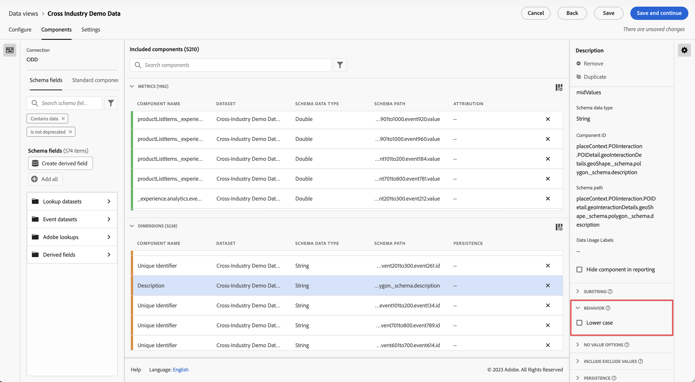

# 비헤이비어 구성 요소 설정 {#behavior-component-settings}

<!-- markdownlint-disable MD034 -->

>[!CONTEXTUALHELP]
>id="dataview_component_dimension_behavior"
>title="비헤이비어"
>abstract="차원 및 지표 구성 요소에 적용할 수 있습니다. 이 지표에 대한 라인 항목을 집계하는 방법을 결정합니다. 이 차원에 대한 문자열 값이 소문자인지 여부를 지정합니다."

<!-- markdownlint-enable MD034 -->

차원과 지표 모두에서 비헤이비어 설정을 시용할 수 있습니다. 사용 가능한 설정은 구성 요소 유형과 스키마 데이터 유형에 따라 다릅니다.

## 차원 비헤이비어 설정

| 설정 | 설명 |
| --- | --- |
| [!UICONTROL 소문자] | 값은 동일하지만 대/소문자가 다른 행을 중복 제거합니다. 활성화된 경우 동일한 값을 가진 차원의 모든 인스턴스가 소문자로 보고됩니다. 예를 들어 데이터에는 문자열 차원의 값 `"liverpool"`, `"Liverpool"` 및 `"LIVERPOOL"`이 포함됩니다. [!UICONTROL 소문자]가 활성화되면 세 가지 값이 모두 `"liverpool"`로 결합됩니다. 비활성화되면 세 가지 값이 모두 고유 값으로 처리됩니다. |

{style="table-layout:auto"}

>[!NOTE]
>
>조회 데이터 세트 차원에서 [!UICONTROL 소문자가 활성]화되면 동일한 식별자에 대해 여러 조회 값이 존재할 수 있습니다. 충돌이 발생하면 Customer Journey Analytics는 첫 번째 ASCII 조회 값을 사용합니다(대문자 값은 소문자 값 앞에 놓임). [!UICONTROL 소문자]가 활성화되면 Adobe에서는 조회 데이터 세트 사용을 권장하지 않습니다.

## 지표 비헤이비어 설정

| 설정 | 설명/사용 사례 |
| --- | --- |
| [!UICONTROL 값 계산] | Integer 및 Double 스키마 데이터 유형에 표시됩니다. 지정된 수량만큼 지표를 늘립니다. 예를 들어 열의 값이 `50`인 경우 지표를 50까지 늘립니다. |
| [!UICONTROL 인스턴스 계산] | Integer 및 Double 스키마 데이터 유형에 표시됩니다. 값에 관계없이 지표를 1까지 늘립니다. 값이 존재하면 지표가 증가합니다. 예를 들어 열의 값이 `50`인 경우 지표를 1까지 늘립니다. |
| [!UICONTROL 계산할 값] | 부울 스키마 데이터 유형에 표시됩니다. `true`, `false` 또는 두 가지 모두를 계산하여 지표의 증가 여부를 결정할 수 있습니다. |

{style="table-layout:auto"}

비헤이비어가 다른 동일한 이벤트 데이터 세트 열을 사용하여 Analysis Workspace에서 “주문” 및 “매출” 지표 모두를 생성할 수 있습니다. ‘매출’ 데이터 세트 열을 데이터 보기로 드래그한 다음 한 개의 열을 “값 계산”으로 설정하고 다른 열을 “인스턴스 계산”으로 설정합니다. ‘주문’ 지표는 인스턴스를 계산하지만 “매출”은 값을 계산합니다.
