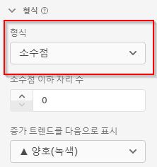

# 포맷 구성 요소 설정

포맷을 통해 특정 지표가 표시되는 방법을 결정할 수 있습니다.

| 설정 | 설명 |
| --- | --- |
| **[!UICONTROL 포맷]** | 지표의 형식을 십진수, 시간, 백분율 또는 통화로 지정할 수 있습니다. |
| **[!UICONTROL 소수점 이하 자리 수]** | Integer 스키마 데이터 유형에 표시되지 않습니다. 지표가 표시하는 소수점 이하 자리 수를 지정할 수 있습니다. |
| **[!UICONTROL 날짜]** | 보고에서 차원으로 사용하는 경우 날짜-시간 필드가 표시되는 방법을 결정할 수 있습니다. [자세히 알아보기](../../use-cases/data-views/data-views-usecases.md#date-and-date-time-use-cases) |
| **[!UICONTROL 날짜-시간]** | 보고에서 차원으로 사용하는 경우 날짜-시간 필드가 표시되는 방법을 결정할 수 있습니다. [자세히 알아보기](../../use-cases/data-views/data-views-usecases.md#date-and-date-time-use-cases) |
| **[!UICONTROL 통화]** | 지표에 표시하려는 통화를 결정할 수 있도록 해 줍니다. 다음을 참조하십시오 [통화](#currency) 추가 세부 정보. |
| **[!UICONTROL 증가 트렌드를 다음으로 표시]** | 이 지표의 증가 트렌드를 양호(녹색) 또는 불량(빨간색)인지 여부를 지정할 수 있습니다. |
| **[!UICONTROL True 값]** 및 **[!UICONTROL False 값]** | 부울 스키마 데이터 유형에만 표시됩니다. `true` 및 `false` 값에 대한 차원 항목 라벨을 사용자 정의할 수 있습니다. |

{style="table-layout:auto"}

## 통화

다음을 선택할 때 **[!UICONTROL 통화]** (으)로 [!UICONTROL 형식] 지표의 경우, 통화를 표시하고 변환하는 방법을 결정할 수 있습니다.

### 통화 표시

지표에 대한 통화를 표시하려면:

1. 다음 수를 입력합니다. **[!UICONTROL 소수점 이하 자리 수]**.

1. 다음에서 통화 선택: **[!UICONTROL 통화 표시 위치]** 목록을 표시합니다.

### 통화 변환 및 표시

{{release-limited-testing-section}}

하나 이상의 지표에 대해 통화 변환을 활성화하려면 다음을 수행합니다.

- 통화 지표를 포함하는 모든 이벤트에 대해 통화 코드 차원을 포함하는 이벤트 데이터 세트를 하나 이상 포함하도록 Customer Journey Analytics 연결을 설정합니다. 해당 통화 코드 차원은 다음을 준수하는 알파벳 통화 코드를 사용합니다. [ISO 4217](https://www.iso.org/iso-4217-currency-codes.html) 통화를 나타내는 표준입니다. 이 값은 $(으)로 USD, €(으)로 EUR, £(으)로 GBP(으)로 전체 대문자 형식이어야 합니다.

   1. 통화 코드를 포함하는 데이터 세트 중 하나에서 차원을 선택합니다. 예를 들어, [!UICONTROL 통화 코드].

   1. 선택 **[!UICONTROL 통화 코드]** 을 클릭합니다.

- 통화 변환에 사용할 통화 코드를 포함하는 차원이 더 있는 경우 이 단계를 반복합니다.

>[!NOTE]
>
>통화 변환을 위해 선택하는 지표는 숫자 유형(더블, 롱, 정수, 쇼트, 바이트)이어야 합니다.

지표에 대한 통화를 변환하고 표시하는 방법을 정의하려면 다음을 수행합니다.

1. 다음 수를 입력합니다. **[!UICONTROL 소수점 이하 자리 수]**.

1. 선택 **[!UICONTROL 동시 실행 전환]**.

1. 통화 코드 필드를 포함하는 차원 목록에서 적절한 차원을 선택합니다.

1. 다음에서 통화 선택: **[!UICONTROL 통화 변환 및 표시 위치]** 목록을 표시합니다.

### 자주 묻는 질문

+++ 통화 전환은 어떻게 실행됩니까?

보고 시 지표 및 원래 통화 코드의 값이 USD로 변환된 다음 표시되도록 구성된 통화로 변환됩니다. 이 전환을 위해 이벤트 시간에 적용할 수 있는 일일 통화 환율이 사용됩니다.

+++

+++ 일별 전환율은 얼마나 오래 전까지 유지됩니까?

지난 4년 동안 일별 전환율이 유지되었습니까?

+++

+++ 현재 데이터 스키마의 일부로 통화 코드 필드가 없는 경우 어떻게 합니까?

데이터 준비, 데이터 Distiller 및 파생 필드를 포함하여 새 통화 코드 필드를 만들기 위한 몇 가지 옵션이 있습니다. 데이터 준비는 향후 기반일 뿐이므로 새로운 구현에 이상적입니다. 조직의 설정에 따라 데이터 Distiller 및 파생 필드를 사용하여 지금까지 통화 코드 값에 액세스할 수 있습니다.

+++

